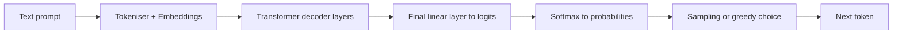

# LLM Inference Principles

LLM inference is the process of turning an input prompt into output tokens. In decoder-only language models, inference is easiest to understand by first looking at what the model computes, then separating the work into two phases: **prefill** and **decode**.

## Modern LLM Architecture

Most modern text-generation LLMs are **decoder-only transformers**. They are called decoder-only because they repeatedly predict the next token from the tokens that already exist, rather than encoding an input sequence and decoding a separate output sequence.

At a high level, one inference request moves through the model like this:



The transformer decoder stack is the main body of the model. Each layer repeats a small set of operations that gradually transform the token representations into something useful for next-token prediction.

### Attention

Attention is the mechanism that lets a token build a context-aware representation of itself. In an LLM, a token does not have a fixed meaning by itself. The word "bank", for example, should be represented differently in "river bank" and "bank account". Attention is one of the main ways the model updates a token's representation using the surrounding sequence.

In a decoder-only model, attention is usually **causal**. This means a token can attend to itself and earlier tokens, but not later tokens. Causality is implemented with an **attention mask**: before softmax is applied, future-token positions in the attention-score matrix are blocked by assigning them a very large negative value. After softmax, those masked positions receive effectively zero attention weight.

The clearest reason for this appears during training. The model is given complete text sequences, but it must learn to predict each next token without seeing the answer tokens that come after it. The causal mask prevents this future-token leakage.

Intuitively, attention asks: for the current token, which earlier tokens are relevant, and how much information should be taken from each of them? In the phrase "the capital of France is", the final token needs to draw strongly on "capital" and "France" to predict a plausible continuation. Attention is the part of the layer that turns this relevance pattern into numbers.


*Figure: An illustrative view of one causal self-attention pattern for the prompt "the capital of France is". The weights are illustrative rather than copied from a specific model run.*

The standard scaled dot-product attention equation is:

$$
\operatorname{Attention}(Q,K,V)=\operatorname{softmax}\left(\frac{QK^\top}{\sqrt{d_k}} + M\right)V
$$

where $Q$ is the query matrix, $K$ is the key matrix, $V$ is the value matrix, $d_k$ is the key/query dimensionality of one attention head, and $M$ is the attention mask.

The matrix multiplication $QK^\top$ compares queries against keys to produce attention scores. Dividing by $\sqrt{d_k}$ keeps those scores from becoming too large as the key dimension grows. The mask blocks invalid positions before softmax. The softmax then turns scores into attention weights, and multiplying by $V$ uses those weights to form a weighted mixture of value vectors.

This gives the intuition for attention, but the equation introduces three objects that still need their own explanation. The next step is to understand what **query**, **key**, and **value** mean.

### QKV Projections

Attention is computed through three learned projections: **query**, **key**, and **value**.

At each layer, the current token vector $X$ is multiplied by trained weight matrices:

$$
Q = XW_Q,\quad K = XW_K,\quad V = XW_V
$$

The matrices $W_Q$, $W_K$, and $W_V$ are learned during training. During inference, they are fixed model weights. The projection step is therefore just matrix multiplication, but the learned matrices make each projection serve a different role.

The **query** is the "what am I looking for?" view. For the final token in "the capital of France is", its query may look for information that helps complete the phrase, such as a location, a subject, or a likely factual continuation.

The **key** is the "what do I contain?" view. The token "France" may produce a key that makes it easy for location-seeking queries to match with it. The token "capital" may produce a key that marks it as important for a capital-city relationship.

The **value** is the "what information should I pass on if attended to?" view. If the final token attends strongly to "France", the value vector from "France" is part of what gets mixed into the final token's updated representation. The key helps decide whether a token is relevant; the value supplies the information that is actually carried forward.

### KV Cache

The **KV cache** stores key and value vectors that have already been computed. The rationale is computational reuse: once the model has computed the keys and values for earlier tokens, it should not have to recompute them every time a new output token is generated.

During attention, a new token needs to compare its query against keys from the existing context, then use the resulting attention weights to read from the corresponding values. KV caching keeps those existing keys and values available for later decode steps.

### MQA and GQA

Large LLM inference is often limited not only by arithmetic, but by how quickly data can be moved through GPU memory. This is especially noticeable during decode. Each new token has to read model weights and attend over the existing KV cache. As the context grows, the model spends more time moving cached keys and values from GPU memory into the attention computation.

Standard multi-head attention gives each query head its own key head and value head. This is expressive, but it also means the KV cache must store separate keys and values for every attention head. More KV heads means more cache memory and more KV data to read during decode.

**Multi-Query Attention (MQA)** reduces this cost by keeping multiple query heads but sharing a single key 
head and value head across them. 
The model can still ask several different questions through different query heads, 
but those queries read from the same shared keys and values. 
This greatly reduces KV-cache size and KV-cache memory bandwidth during decode, 
but because all heads are forced to look at the exact same Key-Value representations, 
the model loses a significant amount of nuance, often resulting in a drop in reasoning accuracy and quality.

**Grouped-Query Attention (GQA)** is a middle ground between standard multi-head attention and MQA. 
Instead of all query heads sharing one key/value pair, query heads are split into groups, 
and each group shares one key head and one value head. 
This keeps more key/value capacity than MQA while still reducing KV-cache memory compared with full multi-head attention.

### Residual Connections and Normalisation

Residual connections carry information around each sub-layer, and normalisation keeps the scale of activations stable. These details are less visible in serving logs, but they are essential for making deep transformer stacks train and run reliably.

The final token vector is projected into a vocabulary-sized vector called **logits**. Each logit is a score for one possible next token. The serving system then chooses the next token using a decoding rule such as greedy decoding, temperature sampling, top-k, or top-p sampling.

## Prefill and Decode

### Why Split Inference Into Two Phases?

Inference is usually described in two phases because the prompt and the output are available in different ways. The prompt is already known before generation begins, so the inference engine can process all prompt tokens together in a large forward pass. The output is different: each generated token depends on the tokens generated before it, so output generation must proceed one token at a time.

This split matters operationally because prefill and decode place different pressure on the GPU. Prefill is a large prompt-processing step that happens before the first output token appears. Decode is a repeated token-generation loop that continues until the model reaches a stop condition.

### Prefill

Prefill is the first forward pass over the prompt. If the prompt has $n$ tokens, the model processes those prompt tokens together, computes Q, K, and V for each layer, runs causal self-attention across the prompt, and creates the initial KV cache.

Creating the K and V vectors is mostly projection work. With model width treated as fixed, this part grows roughly linearly with prompt length. The heavier context-length pressure comes from prompt self-attention: prompt-token queries are compared against prompt-token keys, creating an attention-score pattern whose self-attention component grows roughly as $O(n^2)$ with prompt length.

This is why prefill is usually the part of inference most sensitive to long prompts. The model can compute many prompt positions in parallel, but it still has to perform the prompt-level attention work before the first output token can be returned.

### Decode

Decode is the repeated generation loop after prefill. 
At each step, the model generates one new token. 
It computes Q, K, and V for that new token, uses the new query to attend over the cached keys and values 
from the prompt and previous output tokens, then produces logits for the next-token choice.
After the token is chosen, its own key and value are appended to the KV cache.

With the KV cache, the model does not recompute the full prompt at every step. For a current context length of $n$, one decode step compares the new token against the $n$ cached positions, so the attention part grows roughly as $O(n)$. This is why decode usually grows more gently with context length than prefill, even though long contexts still increase memory use and memory-bandwidth pressure.

### Why This Affects TTFT and TPOT

TTFT is strongly affected by prefill because the model must process the prompt and build the initial KV cache before the first output token can be returned. Longer prompts therefore tend to increase TTFT, especially because prompt self-attention contains the quadratic token-comparison term.

TPOT is mainly affected by decode. Once generation has started, each new output token is produced by one decode step. KV caching avoids recomputing the full prompt, so decode usually grows more gently with context length than prefill. However, each decode step still attends over the existing cache, so longer contexts can still increase TPOT through additional attention reads and memory movement.


## Quantisation

Model weights are usually trained and stored in floating-point formats such as FP32, FP16, or BF16. These formats can represent many values accurately, but they use a lot of memory. **Quantisation** compresses the model by storing weights, activations, or both with fewer bits.

The basic idea is to approximate a floating-point number with a smaller integer plus scale information:

```text
floating-point weight ~= scale * integer weight
```

For example, instead of storing every weight as a 16-bit floating-point value, a quantised checkpoint may store groups of weights as 4-bit integers together with scaling factors. At inference time, specialised kernels use those low-bit weights directly or dequantise them as part of the matrix multiplication.

### Weight-Only Quantisation

Weight-only quantisation stores the model weights in lower precision while activations often remain in FP16 or BF16. This is common for LLM deployment because model weights take up a large amount of static GPU memory. Reducing their size can make a larger model fit, or leave more memory available for the runtime and KV cache.

The trade-off is that matrix multiplication now has to work with compressed weights and scaling factors. Whether this improves speed depends on the quantisation method, kernel support, GPU architecture, and batch shape. The main reliable benefit is reduced weight memory.

### Activation and KV-Cache Quantisation

Some methods also quantise activations or the KV cache. Activation quantisation can reduce memory movement during computation, but it is harder to preserve accuracy because activations change with every input. KV-cache quantisation targets the stored keys and values used during decode, so it can help long-context or high-concurrency serving if the model and serving engine support it.

### Activation-aware Weight Quantisation

**Activation-aware Weight Quantisation (AWQ)** is a post-training, weight-only quantisation method for LLMs. "Post-training" means the model is quantised after training, without retraining the full model from scratch. "Weight-only" means the main compression target is the model weights, not every intermediate activation.

AWQ starts from an observation: not all weights matter equally once the model is used with real activations. Some channels are more important because the activations flowing through them are larger or more influential. If those important channels are quantised poorly, model quality can drop sharply.

The AWQ process is roughly:

1. Run a small calibration dataset through the model to observe activation patterns.
2. Use those activation statistics to identify important weight channels.
3. Search for per-channel scaling factors that protect those important channels before quantisation.
4. Store the model in a low-bit weight format, commonly INT4, using hardware-friendly grouped quantisation.

The subtle part is step 3. AWQ rescales channels before quantisation so the important channels suffer less relative error, while still keeping the final stored weights in a uniform low-bit format.

## Latency and Throughput Concepts

The most common serving metrics separate first-token latency, per-token latency, and aggregate throughput.

| Metric | Meaning |
| :--- | :--- |
| TTFT | Time to first token. It is strongly affected by prefill and queueing. |
| TPOT | Time per output token after generation starts. It reflects per-request decode speed. |
| Output tokens/s | Aggregate number of output tokens produced per second across requests. |
| VRAM usage | GPU memory pressure from weights, runtime overhead, activations, and KV cache. |
| Failure count | Whether the serving shape completed reliably. |

Output tokens/s can improve while TTFT or TPOT gets worse. That happens when batching lets the GPU produce more total tokens across many requests, while each individual request waits longer or receives tokens more slowly.

## References

- [Attention Is All You Need](https://arxiv.org/abs/1706.03762)
- [AWQ: Activation-aware Weight Quantization for LLM Compression and Acceleration](https://arxiv.org/abs/2306.00978)
- [vLLM quantisation documentation](https://docs.vllm.ai/en/latest/features/quantization/)
