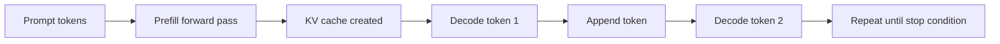

# LLM Inference Principles

LLM inference is the process of turning an input prompt into output tokens. In decoder-only language models, inference is usually easiest to understand as two phases: **prefill** and **decode**.

## Prefill and Decode

| Phase | What happens | Why it matters |
| :--- | :--- | :--- |
| Prefill | The model reads the prompt tokens and builds attention state for them. | Long prompts can make the user wait before the first output token appears. |
| Decode | The model generates one new token at a time while reusing cached attention state. | Output speed depends on how quickly each new token can be generated. |

## Autoregressive Generation

Decoder-only LLMs, such as GPT, Llama, and DeepSeek-style models, generate tokens autoregressively. The model predicts the next token, appends that token to the sequence, then predicts the next one.

Each generated token depends on the prompt and previous output tokens. This is why output generation cannot be fully parallelised across the output sequence in the same way as image classification or embedding generation. A serving system can batch different requests together, but each individual request still grows token by token.

## KV Cache

During attention, each token produces key and value tensors. During decode, the model needs these tensors so a new token can attend to previous tokens without recomputing the entire prompt every time. The stored tensors are called the **KV cache**.

KV cache is useful because it avoids repeated prompt computation. It is also expensive because it grows with:

| Factor | Effect on memory |
| :--- | :--- |
| Prompt length | More input tokens need cached keys and values. |
| Output length | Generated tokens are also appended to the cache. |
| Concurrency | Multiple active requests need cache at the same time. |
| Model size and layer count | More layers and wider hidden states create more cache per token. |
| Precision | Lower-precision cache can reduce memory, if supported and accurate enough. |

:::tip[Key idea]
Quantising model weights helps the model fit in GPU memory, but it does not remove the memory cost of long context or concurrent requests. KV cache can still become the limiting factor.
:::

## Latency and Throughput Concepts

The most common serving metrics separate first-token latency, per-token latency, and aggregate throughput.

| Metric | Meaning |
| :--- | :--- |
| TTFT | Time to first token. It is strongly affected by prefill and queueing. |
| TPOT | Time per output token after generation starts. It reflects per-request decode speed. |
| Output tokens/s | Aggregate number of output tokens produced per second across requests. |
| VRAM usage | GPU memory pressure from weights, runtime overhead, activations, and KV cache. |
| Failure count | Whether the serving shape completed reliably. |

Output tokens/s can improve while TTFT or TPOT gets worse. That happens when batching lets the GPU produce more total tokens across many requests, while each individual request waits longer or receives tokens more slowly.

## Why Prefill and Decode Behave Differently

Prefill processes many prompt tokens before the first generated token appears. A 4096-token prompt requires much more work before the first output token than a 512-token prompt, so TTFT usually rises strongly with input length.

Decode produces one token per active sequence per scheduler iteration. Decode can be efficient when the GPU processes multiple active sequences together, but each generated token must attend to a growing context. TPOT can rise when context becomes longer or when concurrency adds batching and memory-bandwidth pressure.

