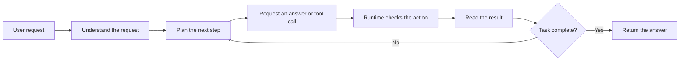
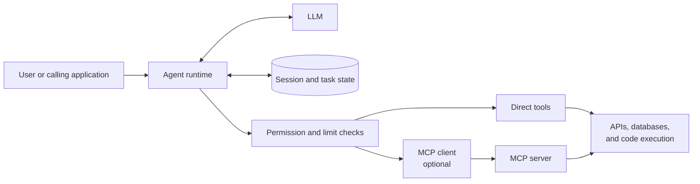
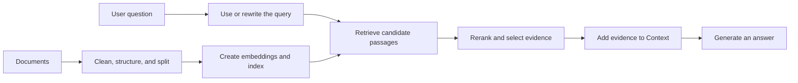

# Agent Systems Overview

An LLM can answer questions from the information in its prompt. It does not know which record a user is looking at in an application, and it cannot change that record by itself. An Agent system is the surrounding application that lets the model use information and external capabilities in a controlled way.

:::info[Scope]
This article uses **Agent system** to mean an LLM together with application code that manages context, state, and optional tools. This is a practical engineering definition, not the only definition of an Agent.
:::

## Start with a Small Request

Imagine a library user saying:

> Renew this book for me.

A chat model alone cannot complete this request. It does not know what “this book” refers to, whether the user owns the loan, or whether the library allows another renewal. It also cannot change the library record.

An Agent system can complete the job by finding the current loan, checking the rules, calling the library service, and reporting the confirmed result. That work follows a loop.

**Understand the request** means identifying the user, the task, and the information already available. In this example, the system uses the conversation and current loan data to resolve “this book.”

**Plan the next step** does not always mean creating a long plan. A simple request may need one tool call; a larger request may need several clear, verifiable steps. The important point is that each step has a purpose and a result that the next step can use.

**Act and observe** means that the model can request an action, the system performs the approved action, and the model receives the result. If the library API says that the renewal limit has been reached, the system does not pretend that the renewal succeeded. It can explain the result or choose another allowed next step.

Some questions need no tool at all. “What is a library card?” can be answered directly. The same loop still applies: the model simply chooses to return an answer instead of requesting an action. ReAct is one common name for a reasoning-and-tool-use pattern, but it is not required by every Agent.

The system also needs a clear stopping rule. It should stop when the task is complete, when further action is not allowed, when a budget is reached, or when a person must review the case. Without a stopping rule, a failed task can turn into repeated tool calls and increasingly speculative answers.

## The Runtime Keeps the Task Together

The **runtime** is the part of the application that runs this loop. It is not another LLM. It prepares model input, stores task information, applies rules, invokes tools, and decides when the task has finished.

The runtime can follow fixed rules, a workflow, or a combination of both. It does not need to “understand” the request in the same way as the model. For example, a fixed rule can fetch the current user's active loans, while the model decides whether the user is asking to renew, cancel, or inspect one of them.

### Context: What the Model Sees Now

**Context** is the selected information sent to the model in one call. For the library request, it may include the user's message, the chosen loan, the renewal policy, recent conversation, and the description of the renewal tool.

The runtime should select what is useful for the current step. Sending every database record, every past message, and every available tool makes the prompt harder for the model to use and consumes the model's context window. A context window is the maximum amount of input and output a model can process in one call; it is not a memory system.

### Session and State: What the Task Needs

A **session** identifies one ongoing conversation or task. It lets the system connect “this book” with a book selected earlier in the same interaction.

**State** is the structured information kept while the task is running. The active loan, the user's permissions, the tools already called, and the returned due date are all State. Storing this data outside the model allows the runtime to check and update it reliably.

Systems often call recent conversation history and temporary task data *short-term* or *working memory*. The names vary, but the job is the same: keep enough information to continue the current task without asking the user to repeat everything.

### Memory: What Can Help Later

**Memory** is information stored for use in a later task or session. It can hold a user's notification-language preference, a summary of a long conversation, or domain knowledge stored in a database.

Memory does not automatically become Context. The runtime retrieves and selects the part that is relevant. For a long conversation, a system may store a summary of the user's goal, constraints, and earlier decisions instead of replaying every message. A summary saves space, but it can omit detail, so important facts and decisions should also be kept in reliable structured State when needed.

## Calling Tools to Perform Actions

A **tool** gives the Agent a specific capability outside the model: a local function, SDK call, HTTP API, database query, search service, or code execution environment. In the library example, `renew_loan` is a tool.

Before the model can request a tool, the runtime exposes a description of it. That description normally includes the tool name, its purpose, and the input it accepts. The model returns a structured request, such as a loan identifier. The runtime then validates that request, applies permission and business checks, calls the tool, and validates the result.

The tool description is the Agent's capability boundary for that task. The model can ask for the tools that the runtime has exposed; it does not gain permission merely because it can describe another action. A banking Agent, for example, cannot place a food order unless its runtime has deliberately integrated and authorized that capability.

### Direct Tools and MCP

A runtime can call a tool directly. This is often the clearest choice when one application owns a small number of APIs or functions.

The [Model Context Protocol (MCP)](https://modelcontextprotocol.io/specification/2026-07-28/architecture) is another option. An application acting as an MCP host creates a client that communicates with an MCP server. The server can expose tools, resources, and prompts. An MCP server can wrap a catalog API, a file system, or another existing service so that several compatible applications can use it.

MCP is a protocol for connecting applications and capabilities. It is not a replacement for business logic, access control, or the runtime. Reading a tool description from an MCP server does not authorize a user to run it.

| Choose | When it is usually a good fit |
| :--- | :--- |
| Direct tool integration | One application calls a small, application-specific set of functions or APIs. |
| MCP integration | Multiple compatible hosts need to share a capability through one standard server interface. |

Both approaches can exist in the same Agent. Choose based on ownership, reuse, and operational cost rather than treating MCP as a mandatory layer.

## Skills Provide Task Guidance

Some tasks need more than a list of tools. A support request may have an approved workflow, reference material, and scripts that are relevant only to that kind of work. Loading all such material for every request wastes Context and makes the model's choices less clear.

A **Skill** packages guidance for a specific task so that the system can load it when needed. An Excel-analysis Skill, for example, can provide the recommended procedure, reference files, and optional scripts only when the user asks to analyse a spreadsheet.

Skill formats depend on the system using them. The [Agent Skills specification](https://agentskills.io/specification) defines a package that can include `SKILL.md`, references, assets, and scripts. A Skill is not itself a tool call: it tells the Agent how to approach work and which resources may help. The runtime still controls what it loads and what it executes.

Skills and MCP solve different problems. A Skill provides task guidance; MCP provides a standard connection to external capabilities. An Agent can use both, either one, or neither.

## RAG Lets an Agent Use Documents

Retrieval-Augmented Generation (RAG) helps an LLM answer from documents that are not part of its training data. A library assistant can retrieve the current renewal policy before answering an eligibility question. RAG supplies evidence to the model; it does not change the model's weights, and it does not perform an external action by itself.

A RAG system has work that happens before a user asks a question and work that happens while answering it.

### Prepare Documents for Retrieval

Documents first need cleaning and useful structure. Titles, headings, dates, source links, access rules, and document versions can all help later retrieval and citation.

Long documents are split into **chunks** so that the system can retrieve the relevant part rather than an entire document. A chunk that is too small can lose the sentence needed to explain a reference. A chunk that is too large can mix unrelated subjects and make retrieval less precise. There is no universal chunk size. Split prose around its semantic sections where possible; preserve the structure of code, tables, and lists; then evaluate the result against real questions.

### Embeddings, Retrieval, and Reranking

An **embedding** model represents a chunk and a query as vectors so that the system can search for semantically related material. This creates a useful index, but vector similarity alone does not prove that a passage answers the question. Keyword search, metadata filters, and hybrid retrieval can improve results when exact terms, dates, or access rules matter.

At query time, the system can search with the user's exact question, or it can first rewrite, expand, or route the query. The right choice depends on the task. Retrieval usually aims to collect a broad set of plausible candidates. A **reranker** then scores those candidates more carefully and selects the smaller set that should enter Context.

The model should answer from the selected evidence and preserve citations when the product needs users to verify the result. If retrieval finds no adequate evidence, the system should say so or take a defined fallback path. RAG reduces unsupported answers only when document quality, retrieval quality, and answer evaluation are all treated as part of the system.

## Keep the System Under Control

A model-generated tool call is a request, not authorization. In the library example, the runtime must reject renewal when the user is not the borrower, has overdue items, or has reached the renewal limit.

The same principle applies to every sensitive action. Keep authentication, authorization, input validation, spending limits, retry limits, and human approval outside the model. Tool results also need care: they can be stale, malformed, or contain text that is unrelated to the task. Treat them as external input before adding them to Context.

Record the request, selected Context, tool calls, results, and final answer. This makes it possible to investigate failures and evaluate whether the system is useful, safe, timely, and affordable under representative workloads.

## What to Remember

- An Agent system combines an LLM with a runtime, state, and optional capabilities.
- The model proposes the next step; the runtime owns execution, stopping rules, and safety checks.
- Context is the information for one model call. Session, State, and Memory help the system build useful Context over time.
- Tools perform actions. Skills provide task guidance. MCP is one way to connect capabilities. RAG retrieves evidence from documents.

## Further Reading

- [Model Context Protocol Architecture](https://modelcontextprotocol.io/specification/2026-07-28/architecture)
- [Agent Skills Specification](https://agentskills.io/specification)
- [Retrieval-Augmented Generation for Knowledge-Intensive NLP Tasks](https://arxiv.org/abs/2005.11401)
