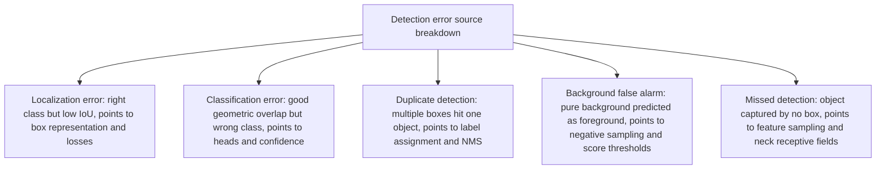

# Object Detection Appendix: Evaluation Metrics

After grasping model architectures, many readers of detection literature still get lost in metric numbers. If two models tie on mAP, do they localize equally well? What weakness does sky-high AP50 with weak AP75 expose? And if training already matches with IoU, why does evaluation run a whole separate confidence-ranked matching procedure?

The confusion comes from mixing architects' design logic with protocols' measurement logic. Evaluation is a measurement chain fully independent of any concrete detector structure. It starts from single-box geometric overlap rules, builds precision–recall curves through confidence ranking, then projects complex spatial detection into scalars with explicit physical meaning through multi-threshold averaging and area splits.

This standalone appendix to the Deconstructing Object Detection series clarifies the measurement system and maps metric values back onto each preceding article's core components. For the series guide, see [Part 0: Architecture and Core Components](./architecture-overview).

## 1. What detection tasks need measured

Image classification only judges whole-image semantic labels, with predictions mapped one-to-one onto fixed ground truth. Object detection instead demands spatial bounding boxes plus class labels under unknown counts, positions, and sizes.

A competent detector evaluation therefore cannot emit one blanket score. It must measure five dimensions at once, each mapping directly onto system-component technical choices:

1. **Localization accuracy**: how tightly predicted boxes hug true object geometric borders. This dimension directly tests detection heads' box parameterization and regression-loss design; see [Part 4: Box Representation and Regression Loss](./bbox-regression-loss).
2. **Classification correctness**: the purity of semantic recognition inside candidate regions and the calibration quality of classification confidence. This dimension maps to classification losses and confidence design in [Part 5: Classification Confidence and Detection Heads](./classification-head).
3. **Duplicate suppression**: whether the model emits multiple redundant boxes for one true object. This performance answers directly to training-time sample matching plus inference-time non-maximum suppression (NMS); see [Part 3: Label Assignment](./label-assignment).
4. **Multi-scale and dense-layout completeness**: whether the model detects everything without omission when huge and tiny objects coexist or small objects pack densely. This dimension mainly tests multi-scale pyramid semantic scheduling; see [Part 6: Multi-Scale Features and Neck Architectures](./neck-architecture).
5. **Deployment and compute cost**: end-to-end latency, parameter count, and computational complexity on target hardware. This decides real-time deployability and answers directly to backbone networks, neck topologies, and whether NMS post-processing is included.

Since no single number reflects all five dimensions, detection protocols evolved a layered dissection mechanism.

## 2. Hit rules, matching protocols, and averaging

Understanding detection metrics starts with evaluation's basic decision unit: under what conditions does a predicted box count as "detected".

### 2.1 IoU and single-box hit decisions

Detection uses Intersection over Union (IoU) as the base geometric-overlap measure between two boxes. With predicted box $B_p$ and ground-truth box $B_{gt}$, IoU is intersection area divided by union area:

$$
\text{IoU}(B_p, B_{gt}) = \frac{\text{Area}(B_p \cap B_{gt})}{\text{Area}(B_p \cup B_{gt})}
$$

During evaluation the system presets a threshold $\theta_{\text{IoU}}$ (e.g. 0.50). A predicted box qualifies as a true positive (TP) if and only if its class matches the true box and their $\text{IoU} \ge \theta_{\text{IoU}}$.

### 2.2 The essential evaluation-versus-training matching difference

Beginners easily conflate evaluation-stage IoU matching with training-stage [Part 3: Label Assignment](./label-assignment). Both compute geometric overlap with IoU, but their stages, purposes, and permitted operations differ completely:

- **Training matching (label assignment)**: runs before network backpropagation, inside single images. Its purpose is assigning supervision signals (positive or negative) to every prediction carrier (grids, anchors, feature points, or queries), telling the network which object to approach. In dense prediction networks (e.g. FCOS or Faster R-CNN RPN), training matching usually adopts a **one-to-many** protocol — one true object may supervise dozens of spatially overlapping prediction units simultaneously.
- **Evaluation matching**: runs after inference emits all predictions, across the whole test set. Its purpose is auditing final detection quality. Evaluation protocols strictly enforce **one-to-one, confidence-ranked greedy matching**: for any true object, only the single highest-confidence image-wide box satisfying $\text{IoU} \ge \theta_{\text{IoU}}$ matches as TP; every other overlapping box, however high its predicted probability, is judged a false positive (FP).

```text
All inference-emitted prediction boxes
  │
  │ (grouped by class, dataset-wide confidence-descending sort)
  ▼
[High-confidence box] ──> find max-IoU ground-truth box
  │                         ├── IoU >= threshold and truth unclaimed ──> TP (truth marked claimed)
  │                         ├── IoU >= threshold but truth claimed ──> FP (duplicate detection)
  │                         └── IoU < threshold ──> FP (localization miss or background error)
  ▼
Truth boxes matched by no prediction ──> FN (missed detection)
```

The contrast explains why one-to-many-trained detectors must rely on NMS at inference: without NMS suppressing redundant high-scoring boxes around each object, evaluation matching judges them all duplicate-detection FPs, directly dragging precision down.

### 2.3 Precision–recall curves

After dataset-wide prediction-to-truth matching, the system sorts all predictions by classification confidence descending; taking different top-$k$ prefixes dynamically computes precision and recall at each confidence cutoff:

$$
\text{Precision} = \frac{\text{TP}}{\text{TP} + \text{FP}}, \quad \text{Recall} = \frac{\text{TP}}{\text{TP} + \text{FN}}
$$

where $\text{TP} + \text{FN}$ is the dataset's total true-object count for the class — a fixed constant.

As the taken prefix grows, recall rises monotonically while precision typically oscillates downward. The trajectory with recall on the horizontal axis and precision on the vertical is the precision–recall (PR) curve.

### 2.4 Average precision and multi-threshold averaging

Average precision (AP) is essentially the PR curve's area under the curve (AUC). To remove oscillation-induced numerical instability, standard practice monotonically interpolates the curve decreasingly: at every recall point $r$, the adopted precision is the maximum over all precisions at and right of $r$:

$$
p_{\text{interp}}(r) = \max_{\tilde{r} \ge r} p(\tilde{r})
$$

Benchmarks differ in AP integration and threshold settings:

#### PASCAL VOC AP (single-threshold evaluation)

- **Definition**: single-class PR-curve area at one fixed overlap threshold (usually $\theta_{\text{IoU}} = 0.50$).
- **Question answered**: under loose geometric localization demands, can the detector catch most objects while keeping false alarms low.
- **Sensitive to**: large semantic false detections and total misses; insensitive to pixel-precision border-fit micro-improvements.
- **Misleading case**: with both models at 85% VOC AP, readers cannot tell whether one's boxes merely graze objects (IoU=0.51) or perfectly hug contours (IoU=0.90). Reading only this metric overvalues coarse-localization models' deployment worth.

#### COCO AP / mAP (multi-threshold averaged precision)

- **Definition**: per-class APs computed at 10 evenly sampled IoU thresholds ($\theta_{\text{IoU}} \in [0.50, 0.55, 0.60, \dots, 0.95]$, step 0.05), averaged over all thresholds and all classes.
- **Question answered**: the detector's combined classification-correctness and geometric-regression-precision capability across coarse-to-strict continuous localization demands.
- **Sensitive to**: high-quality box regression and high-IoU-range optimization (e.g. GIoU/CIoU losses or finer feature alignment).
- **Misleading case**: multi-threshold averaging smooths extreme-range differences. A model with sky-high low-threshold recall but weak high-threshold behavior can tie another emitting few high-quality precise boxes — while the two behave completely differently in production.

#### The AP50/AP75 division of labor

- **AP50 ($\text{AP}_{\text{IoU}=0.50}$)**: coarse-grained semantic detection only. It answers "did the model find roughly the right regions", stays sensitive to classification-feature discrimination, and quickly exposes semantic confusion and background false detections.
- **AP75 ($\text{AP}_{\text{IoU}=0.75}$)**: high-quality output under strict localization. It answers "are regressed coordinate borders flush", staying acutely sensitive to box regression losses, feature-sampling-point alignment quality, and high-confidence-box geometric quality.

## 3. Size splits, recall, long tails, and speed costs

Beyond aggregate AP, benchmarks provide slice metrics for fine-grained diagnosis of capability boundaries under different external constraints.

### 3.1 Object-size split metrics ($AP_S, AP_M, AP_L$)

COCO strictly partitions all objects into three disjoint scale bands by ground-truth box absolute pixel area $Area$ in the original image:

- Small: $Area < 32^2 \text{ pixels}$
- Medium: $32^2 \le Area \le 96^2 \text{ pixels}$
- Large: $Area > 96^2 \text{ pixels}$

Evaluation computes multi-threshold average precision on each size band's subset separately, yielding $AP_S$, $AP_M$, and $AP_L$.

#### Small-object AP ($AP_S$)

- **Definition**: multi-threshold AP on true objects under $32\times 32$ pixels in area plus their corresponding predictions.
- **Question answered**: under severely degraded spatial resolution and extremely weak semantics, can the detector still capture and localize tiny objects.
- **Sensitive to**: shallow high-resolution feature retention, bottom-up pyramid path construction (e.g. PANet/BiFPN), and spatial-information loss from high-stride downsampling.
- **Misleading case**: reading only $AP_S$ hides context-modeling defects on large-scale continuous structures; annotation noise (slight human-box drift crashing IoU) also swings small-object metrics far harder than large ones.

#### Large-object AP ($AP_L$)

- **Definition**: multi-threshold AP on true objects above $96\times 96$ pixels in area plus their corresponding predictions.
- **Question answered**: facing frame-dominating objects with huge receptive-field demands, can the detector cover whole structures without fragmentary truncation.
- **Sensitive to**: deep-network global receptive fields, Transformer global attention, and long-range dependency modeling in multi-scale fusion.
- **Misleading case**: large objects are usually few or semantically salient in datasets, so high $AP_L$ comes easily — easily masking severe misses under dense occlusion and small-object scenes.

### 3.2 Average recall and max-detection caps ($AR_{\text{max}}$)

Average recall (AR) averages maximum achievable recall over all classes and $\text{IoU} \in [0.50, 0.95]$ thresholds under a per-image cap on kept prediction boxes ($\text{maxDets} \in \{1, 10, 100\}$).

#### 100-box max average recall ($AR_{100}$ / $AR_{\text{max}}$)

- **Definition**: average recall across the full IoU threshold range keeping at most 100 highest-confidence boxes per image.
- **Question answered**: the theoretical capture ceiling over all potential scene objects for candidate-generation mechanisms (RPN proposals or Transformer queries).
- **Sensitive to**: prediction-carrier density, foreground-negative sampling balance, and confidence-threshold cutoff points.
- **Misleading case**: $AR$ never penalizes false-positive counts. An indiscriminate model densely scattering thousands of random background boxes scores extremely high $AR$ given enough predictions — while its AP nears zero.

:::caution[AR never penalizes false alarms]
$AR$ counts only true-object coverage, with zero penalty on false-positive volume. Reading $AR$ alone overvalues spray-and-pray models; recall must always be read alongside precision (AP).
:::

### 3.3 Long-tail and open-vocabulary evaluation

In standard COCO, per-class sample counts stay relatively balanced, so plain arithmetic averaging reflects overall performance. But real-world scale (e.g. LVIS) runs extremely long-tailed, with rare-class annotations missing or non-exhaustive.

Protocols adjust for accurate measurement here: LVIS introduces federated AP, computing each class's AP only on image subsets human-verified to contain the class or explicitly labeled negative, split into rare ($AP_r$), common ($AP_c$), and frequent ($AP_f$) classes. Open-vocabulary detection further separates known base-class from unseen novel-class performance.

### 3.4 Deployment cost metrics: latency, parameters, FLOPs

A precision-leading detector without compute costs cannot be objectively valued for engineering.

#### End-to-end inference latency (Latency / FPS)

- **Definition**: on a specific hardware platform (particular GPU or edge chip) at fixed input resolution, complete single-image time from input-tensor loading through forward propagation to NMS post-processing output (milliseconds, or frames per second).
- **Question answered**: whether the model meets an application's time budget (e.g. autonomous driving's 30 FPS real-time demand).
- **Sensitive to**: memory-access bandwidth (Memory Access Cost, MAC), non-contiguous operators (dynamic control flow, expensive reshapes), and CPU/GPU data-moving overhead of NMS post-processing.
- **Misleading case**: latency numbers detached from hardware, batch size, and pre/post-processing inclusion are incomparable; reporting backbone-forward time only while hiding NMS time severely underestimates one-to-many dense detectors' real running bottleneck.

#### Parameters and FLOPs

- **Definition**: parameter count measures all learnable weights' physical memory footprint (usually millions, M); FLOPs measure theoretical multiply-add totals for one forward pass (usually GFLOPs).
- **Question answered**: the model's scale class in theoretical complexity and static storage footprint.
- **Sensitive to**: convolution channel widths, layer depths, attention sequence lengths.
- **Misleading case**: FLOPs count theoretical operations only — never physical latency. Thanks to highly parallel GPU hardware, masses of fragmented small operators (multi-branch feature fusion) run extremely slowly from memory-bandwidth bottlenecks and kernel-launch overhead despite tiny FLOPs.

:::caution[FLOPs are not latency]
FLOPs count theoretical multiply-adds, reflecting neither memory bandwidth, kernel-launch overhead, nor operator fragmentation. Deployment decisions should run on end-to-end physical time; FLOPs serve only as order-of-magnitude reference.
:::

## 4. Error splitting and attribution diagnosis

When model AP disappoints, single scores cannot guide architecture optimization. Error-diagnosis methods like TIDE (A General Toolbox for Identifying Object Detection Errors) decompose detection FPs and FNs precisely into four physically pointed error sources.

The split points directly back at preceding components' design defects:



### 4.1 Localization error ($E_{\text{loc}}$)

- **Physical symptom**: the box recognizes the object's semantic class and overlaps truth at $\text{IoU} \ge 0.10$, but misses the evaluation's main threshold (e.g. $\text{IoU} < 0.50$).
- **Attribution**: classification branches fired successfully, but regression branches drifted geometrically. Check [Part 4: Box Representation and Regression Loss](./bbox-regression-loss) first for coordinate-loss forms (whether Smooth L1 lacks border gradient sensitivity, whether Distribution Focal Loss is needed) and feature-sampling receptive-field versus geometric misalignment (coarse RoIPool quantization to RoIAlign).

### 4.2 Classification-confusion error ($E_{\text{cls}}$)

- **Physical symptom**: the box overlaps truth well geometrically ($\text{IoU} \ge 0.50$) but carries the wrong class label.
- **Attribution**: geometry works, high-level semantic discrimination distorts. Check [Part 5: Classification Confidence and Detection Heads](./classification-head) first for classification-loss design (class imbalance collapsing rare classes into common ones) and missing head decoupling (classification and regression features forcibly sharing one kernel causing task conflict).

### 4.3 Duplicate-detection error ($E_{\text{dup}}$)

- **Physical symptom**: one true object is hit by multiple high-scoring boxes simultaneously; only the top scorer counts as TP, the rest as duplicate FPs.
- **Attribution**: the system fails to suppress redundant responses. Check [Part 3: Label Assignment](./label-assignment) and inference post-processing first: for one-to-many systems, whether NMS IoU suppression thresholds run too loose or Soft-NMS decay parameters need work; to eliminate the error class at the root, consider Hungarian bipartite-matching end-to-end one-to-one architectures (DETR or YOLOv10).

### 4.4 Background false-alarm and miss errors

- **Background false alarms ($E_{\text{bkg}}$)**: boxes land on pure background ($\text{IoU} < 0.10$ with every truth). Points to classification-branch confidence-calibration failure, or training-time hard-negative-mining / Focal Loss suppressing easy backgrounds too weakly.
- **Object misses ($E_{\text{miss}}$)**: image truths covered by no confidence-passing box. Points to carrier spatial-coverage density gaps and small-object features dying out in deep networks — strengthen multi-scale fusion from [Part 1: Prediction Carriers](./prediction-carrier) and [Part 6: Multi-Scale Features and Neck Architectures](./neck-architecture).

## 5. Core metric comparison

The table below consolidates detection's core evaluation metrics with each metric's central model-comparison conclusion:

<div className="wide-table">

| Metric | Core definition | Sensitive dimension | Blind spots and pitfalls | Core diagnostic conclusion |
| :--- | :--- | :--- | :--- | :--- |
| **PASCAL VOC AP50** | Single-class PR-curve area at one loose threshold ($\text{IoU}=0.50$) | Coarse semantic classification and wide-range object detection | Cannot separate coarse localization from sub-pixel precise localization | Proves only basic "roughly right" capability; never a fine-localization-task basis. |
| **COCO mAP (AP50:95)** | Total average precision over 10 IoU thresholds (0.50–0.95) and all classes | Combined detection capability and high-quality box regression | Smooths low-threshold-high-recall versus high-threshold-high-precision distribution gaps | The most general ranking metric; gains usually demand classification-confidence and coordinate-regression quality improving together. |
| **AP75** | Average precision at the strict overlap threshold ($\text{IoU}=0.75$) | Tight border regression and fine feature-space alignment | Says nothing about recall on extremely tiny objects | Tests localization branches' ceiling specifically; plainly low AP75 means severe geometric-regression drift in detection heads. |
| **$AP_S$** | Small-object-subset average precision under $32^2$ pixels in area | Shallow high-resolution spatial features and tiny-object capture | Extremely sensitive to human-annotation geometric jitter, high variance | Directly reflects pyramid (neck) shallow-feature retention quality and downsampling information loss. |
| **$AR_{\text{max}}$ ($AR_{100}$)** | Full-threshold average recall capped at 100 detections per image | Theoretical capture ceiling of foreground candidate units | Never penalizes redundant false alarms; high recall can ride massive FPs | Evaluates candidate-generation parts (RPN or queries) for miss lower bounds; says nothing about classification purity. |
| **End-to-end latency** | Complete single-frame time including preprocessing, network forward pass, and NMS post-processing | Memory-bandwidth bottlenecks, non-contiguous operators, post-processing overhead | Incomparable detached from hardware, batch size, and operator implementations | One-to-many networks must count NMS time; low FLOPs never equal low latency — physical end-to-end time rules. |
| **Error splitting (TIDE)** | Strict FP/miss attribution to Loc, Cls, Dup, Bkg concrete sources | Localization distortion, classification confusion, duplicate detection, pure-background misjudgment | Relies on offline post-hoc analysis with sizable compute cost | The core guide for architecture iteration: localization-dominated errors change losses and sampling; duplicate-dominated errors change assignment and NMS. |

</div>

## 6. Summary and dissection guide

When reading and evaluating detection models, never isolate single-mAP rankings as architecture quality's sole criterion. Evaluation metrics are essentially measurement slices projected under different constraint conditions:

- Evaluation matching runs **confidence-descending sorts with one-to-one greedy claiming** — operationally nothing like training-time label assignment.
- AP50 measures **whether semantic classification found objects**; AP75 measures **whether geometric borders fit flush** — complementary pairs.
- Size metrics ($AP_S, AP_M, AP_L$) map directly onto multi-scale fusion scheduling efficiency, while error splits (Loc, Cls, Dup) directly locate targeted improvements for the five core components.

With the measurement chain's logic mastered, ablation tables in papers reveal each model part's true behavior in geometric regression, feature fusion, and sample assignment. This closes the technical loop over the full Deconstructing Object Detection series.
