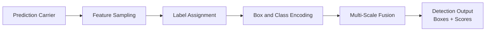

# Deconstructing Object Detection Series Overview

Object detection requires a network to localize (find object boundaries) and classify (recognize object categories) in an image at the same time. In practice, the network must cope with extreme scale variation, complex spatial overlap and occlusion, and massive background noise.

Over more than a decade, object detection has split into seemingly disparate architectural schools: two-stage, single-stage, anchor-based, anchor-free, and Transformer query methods. Yet underneath, every detection system is essentially assembled from **five independently replaceable core components**:

| Component | Question it answers | Article |
| :--- | :--- | :--- |
| **Prediction carrier** | The basic carrier through which the network hands candidate predictions to the outside world; how each hypothesis binds to image geometry | [Part 1](./prediction-carrier) |
| **Feature sampling** | How the detection head extracts feature representations from the backbone's spatial feature maps | [Part 2](./feature-sampling) |
| **Label assignment** | The protocol that assigns ground-truth boxes to specific prediction carriers during training; decides positive/negative membership and whether NMS is needed | [Part 3](./label-assignment) |
| **Box and class encoding** | The physical meaning of the prediction head's output values; the concrete form of coordinate regression and class discrimination | [Part 4](./bbox-regression-loss), [Part 5](./classification-head) |
| **Multi-scale fusion** | The feature-pyramid pipeline between backbone and detection head, scheduling information across resolutions and semantic depths | [Part 6](./neck-architecture) |

:::tip[Reading order]
Read in order: [Part 0](./architecture-overview) builds the map, then prediction carriers, feature sampling, sample matching, box regression, classification heads, and the multi-scale neck. Each article points to the next at its end.
:::

## Articles

| Article | Title | Core conclusion |
| :--- | :--- | :--- |
| Part 0 | [Architecture and core components](./architecture-overview) | The assembly logic of the five components; anchors and NMS belong to different components and are not coupled |
| Part 1 | [Prediction carriers](./prediction-carrier) | Three rounds of paradigm shifts: naive grids, anchor templates, point measurement, and set queries |
| Part 2 | [Feature sampling](./feature-sampling) | From dense grid sampling to sparse instance sampling; two-stage and DETR-style models converge at the mechanism level |
| Part 3 | [Label assignment](./label-assignment) | From static geometric rules to dynamic cost-based matching, then one-to-one and dual assignment |
| Part 4 | [Box representation and regression loss](./bbox-regression-loss) | From independent coordinate losses to IoU geometry losses, then distribution modeling |
| Part 5 | [Classification confidence and detection heads](./classification-head) | Focal loss, decoupled heads, and task alignment fix the classification–localization mismatch |
| Part 6 | [Multi-scale features and neck architectures](./neck-architecture) | Information-flow evolution: FPN, PANet, BiFPN, and the RT-DETR hybrid encoder |

:::note[Figure sources]
Some figures in this series were drawn in TikZ. The vector sources (`.tex`) stay in the Obsidian manuscript library's `assets/` directory and are not published with the knowledge base. Rendered PNGs live in the knowledge base `static/img/cv_img/object-detection/` directory.
:::

## References

- R. Girshick et al., Faster R-CNN: Towards Real-Time Object Detection with Region Proposal Networks, NeurIPS 2015.
- J. Redmon et al., You Only Look Once: Unified, Real-Time Object Detection, CVPR 2016.
- T.-Y. Lin et al., Feature Pyramid Networks for Object Detection, CVPR 2017.
- Z. Tian et al., FCOS: Fully Convolutional One-Stage Object Detection, ICCV 2019.
- N. Carion et al., End-to-End Object Detection with Transformers, ECCV 2020.
- Z. Ge et al., YOLOv10: Real-Time End-to-End Object Detection, NeurIPS 2024.
