# Attention and Edge Deployment (v12, v26)

:::note[Study notes]
No companion PDF notes for v12/v26 yet. Background: [YOLOv8](/files/cv/YOLOv8_Note_v1.pdf) · [YOLOv9](/files/cv/YOLOv9_Note_v1.pdf).
:::

In [Part 4](./anchor-free-nms-optional), single-stage object detectors reached the consolidation of the modern paradigm: with decoupled detection heads, anchor-free point-based prediction, task-aligned learning (TAL), Distribution Focal Loss (DFL), and consistent dual label assignment (NMS-free), convolutional detectors achieved high representation quality and end-to-end non-redundant inference.

In the 2024–2026 phase, real-time single-stage detectors faced two divergent engineering requirements:

1. **Pushing representation capacity (accuracy focus)**: pure convolutional neural networks (CNNs) rely on sliding windows, where the effective receptive field expands sublinearly with depth. This introduces limits in modeling global long-range context, distinguishing complex background textures, and correlating distant small targets. Integrating Vision Transformers into real-time detectors addresses this gap, but standard self-attention incurs quadratic computational complexity and fragmented memory access.
2. **Streamlining edge deployment (hardware focus)**: introducing DFL and decoupled prediction heads increased the complexity of exported computation graphs. On server GPUs, computing multi-channel softmax and expectation integrals adds negligible latency. On edge CPUs, embedded microcontrollers (MCUs), and low-power NPUs with constrained compute and memory bandwidth, these operators create major latency bottlenecks in output decoding.

**YOLOv12** and **YOLO-v26** address these two directions:

- **YOLOv12** (2025) integrated self-attention into the YOLO architecture under strict real-time latency constraints using area attention (A2) and hardware-oriented operator refactoring.
- **YOLO-v26** (2026), developed by Ultralytics, established an edge-first engineering standard by removing the DFL operator, introducing a dual-mode NMS switch, incorporating orthogonal optimization (MuSGD), and standardizing a multi-task framework.

This article examines the mechanisms of both architectures and reviews the ten-year evolution of YOLO from its 2015 inception through 2026.

---

## YOLOv12: Real-Time Self-Attention

### Fundamental Obstacles to Attention in Single-Stage Detectors

Since Vision Transformers became common in computer vision, single-stage detectors struggled to adopt self-attention as a primary backbone component. The bottleneck is not parameter count, but **two specific hardware latency costs**:

1. **Quadratic computational complexity**:
   For a $640 \times 640$ input image, the flattened token sequence in shallow feature maps contains tens of thousands of tokens. Standard multi-head self-attention (MHSA) computational complexity is:

   $$\mathcal{O}(\text{Attn}) = 2 n^2 d + 4 n d^2$$

   where $n = H \times W$ is the token count and $d$ is the channel dimension. Complexity scales quadratically with spatial size ($O(n^2)$), causing full-resolution attention to exceed real-time compute budgets during forward passes.
2. **Memory-bound overhead and non-fusible operators**:
   Standard self-attention explicitly instantiates an $n \times n$ dense attention weight matrix, creating high non-contiguous memory access costs (MAC). In addition, standard Transformers rely on LayerNorm, which calculates mean and variance per token dynamically. LayerNorm cannot be fused with convolution or GEMM kernels at the hardware level, interrupting compute pipelines.

Shifted-window mechanisms (such as Swin Transformer) restrict attention to fixed local windows, but require feature dimensions to be exact multiples of the window size. In contrast, YOLO relies on **rectangular inference (such as $672 \times 608$)** during deployment to minimize padding overhead. Fixed window mechanisms force image distortion or break adaptive sizing.

### Area Attention (A2)

To reduce attention complexity across arbitrary aspect ratios, YOLOv12 introduces **area attention (A2)**.

> Source: YOLOv12, Fig. 2 Area attention, https://ar5iv.org/html/2502.12524

#### Mechanism and Formulation

For a feature map of shape $H \times W \times C$:

1. **1D sequence flattening**: spatial dimensions are flattened into a 1D token sequence of length $n = H \cdot W$.
2. **Area partitioning**: the sequence is divided along its length into $l$ contiguous partitions (default $l = 4$), with each area containing $n / l$ tokens.
3. **Intra-area self-attention**: self-attention computation is confined and executed in parallel within each area partition:

$$\mathcal{O}(\text{Area-Attn}) = l \times \left( 2 \left(\frac{n}{l}\right)^2 d + 4 \left(\frac{n}{l}\right) d^2 \right) = \frac{2 n^2 d}{l} + 4 n d^2$$

Setting $l = 4$ reduces the quadratic term to **$\frac{1}{4}$** of its original cost, while each partition retains a receptive field covering one-quarter of the full feature map.

From an implementation perspective, area attention requires only a 1D flatten and reshape, avoiding 2D grid slicing. As long as the total token count $H \cdot W$ is divisible by $l$, rectangular inputs of arbitrary aspect ratios run forward inference without padding adjustments. Combined with **FlashAttention** tiled softmax memory optimization, this structure prevents memory retention bottlenecks for large attention matrices on GPUs.

### Optimization Stability: Residual Efficient Layer Aggregation Network (R-ELAN)

When integrating attention mechanisms, scaling YOLOv12 to larger configurations (L and X scales) introduced **optimization surface instability and gradient divergence**, preventing stable convergence with AdamW.

Standard ELAN topologies lack sufficient identity mapping paths when scaled deeper, leaving them unable to smooth the non-linear transformations of deep self-attention stacks. YOLOv12 modifies this structure with **R-ELAN (Residual ELAN)**:

1. **Block-level residual shortcuts with LayerScale**:
   A cross-stage residual shortcut is added around the full R-ELAN block, modulated by a learnable scale parameter $\alpha = 0.01$ before residual addition:

   $$Y = X + \alpha \cdot \mathcal{F}_{\text{R-ELAN}}(X)$$

   Early in training, this forces the block toward a near-identity mapping on a smooth loss surface, enabling gradients to pass through deep attention stacks without vanishing or exploding.
2. **Bottleneck feature aggregation**:
   The aggregation sequence uses a $1 \times 1$ transition convolution first to compress channels into a bottleneck before branching into attention sub-blocks. This keeps memory footprint and channel dimensions stable as depth increases.

### Hardware-Oriented Transformer Operator Refactoring

To match convolutional execution latency on physical hardware, YOLOv12 applies four structural operator adjustments:

1. **Replacing absolute positional encoding with depthwise convolutions**:
   Learnable positional encodings require interpolation when input resolutions vary. YOLOv12 removes explicit positional encodings and embeds a $7 \times 7$ depthwise convolution in the value branch. The local inductive bias of the convolution injects spatial geometric cues directly.
2. **Decoupling $Q, K, V$ projections**:
   Standard implementations project inputs into a single concatenated $[Q, K, V]$ tensor with one matrix multiplication. Because the $7 \times 7$ depthwise convolution applies only to $V$, the concatenated tensor requires repeated memory slicing. YOLOv12 uses separate linear layers to project $Q, K$, and $V$ independently, removing intermediate memory copies and tensor slicing.
3. **Replacing LayerNorm with BatchNorm**:
   LayerNorm computes mean and variance per token at runtime, making it a memory-bound, non-fusible operator. YOLOv12 replaces all normalization layers with **BatchNorm**. During export for deployment, BatchNorm folds directly into preceding convolutional or linear weights ($W' = \gamma W / \sqrt{\sigma^2 + \epsilon}$), introducing zero compute and memory overhead during inference.
4. **Compressing feed-forward network (FFN/MLP) expansion ratios**:
   Standard Transformers set the MLP channel expansion ratio to 4.0. Empirical results indicate detection gains originate primarily from attention operations rather than wide feed-forward layers. YOLOv12 lowers the MLP expansion ratio to 1.2–1.5 in large models, shifting FLOP budgets toward self-attention.

> Source: YOLOv12, Fig. 5 Heat map comparison, https://ar5iv.org/html/2502.12524

These refactorings allow YOLOv12 to reduce parameters and FLOPs by over $60\%$ compared to Transformer-based real-time detectors like RT-DETR at equivalent accuracy, while matching or exceeding pure CNN inference speeds on standard GPUs.

---

## YOLO-v26: Edge-First Engineering

While YOLOv12 focuses on representation capacity, **YOLO-v26** (released by Ultralytics in early 2026) targets deployment efficiency. YOLO-v26 adopts an **edge-first** design principle to resolve deployment friction on edge CPUs, embedded microcontrollers, and low-power hardware accelerators.

### The Modern Deployment Gap and DFL Removal

In YOLOv8 and v11, **Distribution Focal Loss (DFL)** models bounding box coordinates as probability distributions over 16 discrete bins to capture boundary ambiguity. In production embedded systems, this approach creates an engineering bottleneck:

- **Memory and operator overhead**: each grid cell requires $4 \times 16 = 64$ output channels for bounding box regression. When exporting computation graphs to ONNX or TensorRT, graph parsers append a `Softmax` node and a fixed convolutional dot-product operator to recover expected coordinates.
- **Edge CPU latency penalty**: on server GPUs, these operations add negligible latency. On low-power edge CPUs (such as ARM Cortex-A cores) lacking dedicated tensor instructions, high-dimensional softmax and discrete dot products create frequent intermediate memory transfers, lowering decoding throughput.

#### Direct Coordinate Regression

YOLO-v26 simplifies regression by setting the distribution parameter to $\text{reg\_max} = 1$:

- The DFL module collapses mathematically into an **identity mapping**.
- The regression head predicts 4 deterministic coordinate scalars directly, reducing per-grid output tensor size from $(nc + 64)$ to $(nc + 4)$.
- All downstream distribution softmax operators are removed from exported computation graphs.

While heavy occlusion cases exhibit a minor drop of 0.3%–0.5% AP, end-to-end ONNX inference on Intel Xeon and embedded CPUs **runs over 40% faster**.

### Dual-Mode NMS Switch and Deterministic Latency

Following the introduction of consistent dual label assignment (NMS-free) in YOLOv10, production deployments demonstrated that **NMS-free end-to-end inference and traditional NMS serve distinct deployment requirements rather than replacing one another entirely**.

YOLO-v26 maintains the dual training framework (one-to-many auxiliary head plus one-to-one main head) and adds an explicit **dual-mode deployment switch**:

1. **`nms=False` (deterministic end-to-end NMS-free mode)**:
   - Only the one-to-one main head is active, generating a fixed tensor of shape $(N, 300, 6)$ (retaining up to 300 detected objects per image).
   - Post-processing NMS operators are omitted. Inference latency remains constant during continuous video stream decoding, preventing $O(N^2)$ latency spikes when scenes contain sudden dense object clusters.
   - Bypasses deployment failures on embedded runtimes (such as OpenVINO, CoreML, and LiteRT) that lack custom NMS operator support.
2. **`nms=True` (high-recall one-to-many mode)**:
   - In offline batch analysis on high-performance GPUs where recall and benchmark accuracy are critical, users can switch to the one-to-many branch paired with GPU-accelerated NMS.

### Training Optimization and Multi-Task Integration

YOLO-v26 integrates several training updates and multi-task modules into a single framework:

- **MuSGD optimizer**: integrates **Muon orthogonal updates** from large-scale foundation model training. Applying orthogonal constraints to second-order momentum updates on parameter matrices improves convergence stability across deep non-convex backbone layers.
- **Scale-aware task alignment (STAL) and progressive loss (ProgLoss)**: dynamically adjusts scale-sensitive factors during sample assignment. Early training epochs allocate broader positive sample exploration budgets to small targets, gradually tightening to strict alignment in late epochs to offset minor small-object recall drops from DFL removal.
- **Unified industrial platform**: natively integrates object detection, instance segmentation, residual log-likelihood estimation (RLE) pose estimation, oriented bounding box (OBB) detection, and open-vocabulary detection with text and visual prompts (YOLOE-26) in a single codebase, supporting export to over 20 runtime backends.

---

## Ten-Year Retrospective: Convergence of Detection Principles and the Core Identity of YOLO

From Joseph Redmon's spatial grid formulation in *You Only Look Once: Unified, Real-Time Object Detection* (2015) to its multi-generational evolution in 2026, single-stage object detection progressed through a continuous trajectory of algorithmic and hardware optimization.

### Historical Convergence of Detection Principles

Examining this evolutionary progression reveals that technical mechanisms once considered distinct alternatives have converged toward shared mathematical and physical formulations:

```mermaid
flowchart TB
  subgraph Carrier["Prediction carriers"]
    direction LR
    C1["YOLOv1: coarse spatial grids"] --> C2["YOLOv2–v5: dense anchor priors"] --> C3["YOLOX–v12: anchor-free feature points"] --> C4["DETR / RT-DETR: learnable object queries"]
  end
  subgraph Assign["Label assignment"]
    direction LR
    A1["YOLOv1: hard spatial centers"] --> A2["YOLOv2–v5: static IoU thresholds"] --> A3["YOLOX–v8: dynamic quality matching (TAL / OTA)"] --> A4["YOLOv10–v26: consistent dual assignment (o2m + o2o)"]
  end
  subgraph Fusion["Feature fusion and sampling"]
    direction LR
    F1["v1: single-scale features"] --> F2["v3: top-down FPN"] --> F3["v4/v5: bidirectional PANet"] --> F4["v6/v7: reparameterization and E-ELAN"] --> F5["v12: local area self-attention"]
  end
```

Modern components — anchor-free point representations, decoupled detection heads, task-aligned assignment, and dual assignment without NMS — are shared across YOLO, FCOS, ATSS, VarifocalNet, and RT-DETR. Under real-time production constraints, previously separate designs (two-stage vs. single-stage, convolution vs. Transformer) converged on shared architectural solutions.

### What Defines the Core Identity of YOLO?

Given that fundamental detection principles have largely unified across architectures, what accounts for the continued adoption of the YOLO family in production systems over a decade?

The engineering foundation of YOLO centers on three primary **design principles**:

1. **Prioritizing real hardware latency**:
   The development of YOLO focuses directly on hardware instruction sets and memory bandwidth rather than theoretical formula depth alone. From CSP gradient separation and RepVGG operator folding, to replacing Focus with large-kernel convolutions, reducing attention memory access with area attention, and removing DFL and NMS for edge runtimes — **execution speed on physical devices remains the core design criterion**.
2. **Standardized compound model scaling**:
   From Nano and Small to Large and XLarge, YOLO enforces structured depth and width scaling formulas. A single codebase covers compute budgets from milliwatt embedded microcontrollers (sub-millisecond inference) to multi-GPU clusters (high-throughput batch analysis).
3. **Production-ready full-stack deployment ecosystem**:
   Simple annotation formats, automated training pipelines with native data augmentations, adaptive anchor and loss scheduling, and direct export pipelines for runtimes including TensorRT, ONNX, OpenVINO, and CoreML. This tooling bridges the transition from research models to industrial deployment.

---

## Series Navigation

- Previous: [Part 4: Anchor Removal and Optional NMS](./anchor-free-nms-optional)
- Series overview: [YOLO Series Overview](./)
- Component deconstruction series:
  - [Prediction carriers](../deconstruction/prediction-carrier)
  - [Feature sampling](../deconstruction/feature-sampling)
  - [Label assignment](../deconstruction/label-assignment)
  - [Bounding box regression and losses](../deconstruction/bbox-regression-loss)
  - [Classification heads](../deconstruction/classification-head)
  - [Neck architectures](../deconstruction/neck-architecture)
