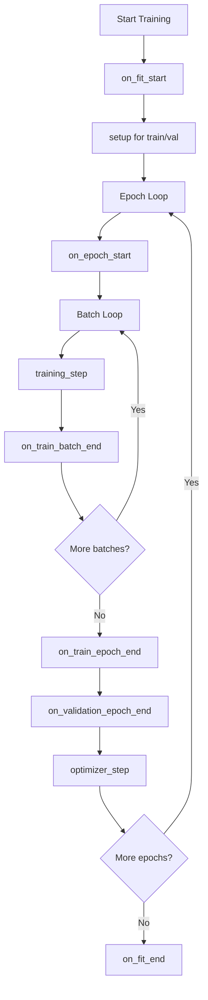
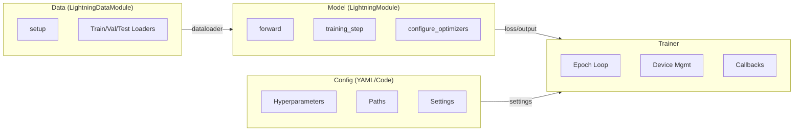

# Mental Model

## How Lightning Organizes Your Code

Lightning separates a PyTorch project into four clear responsibilities:

| Component | Responsibility |
| :--- | :--- |
| **Model** | Forward pass, loss computation, architecture |
| **Data** | Dataset, transforms, data loading |
| **Trainer** | Loop execution, device management, callbacks |
| **Config** | Hyperparameters, paths, settings |

This separation means each component is testable, reusable, and independent.

## The Hook System

Lightning replaces the explicit training loop with a **hook system**. You implement specific methods (`hooks`) that Lightning calls at defined points in training.

### Core Hooks



### Key Hooks Reference

| Hook | Called | Purpose |
| :--- | :--- | :--- |
| `on_train_start` | Once before first training epoch | Initialize logging, build model |
| `training_step` | Every training batch | Compute loss from one batch |
| `validation_step` | Every validation batch | Compute validation metrics |
| `on_train_epoch_end` | End of each training epoch | Aggregate epoch-level metrics |
| `configure_optimizers` | Once before training | Configure optimizers and schedulers |
| `on_train_end` | Once after training finishes | Cleanup, finalLogging |

### Mapping: Raw PyTorch vs Lightning

Here is how Lightning hooks map to a raw PyTorch training loop:

```python
# Raw PyTorch
for epoch in range(num_epochs):
    model.train()
    for batch in train_loader:
        optimizer.zero_grad()
        output = model(batch.x)
        loss = criterion(output, batch.y)
        loss.backward()
        optimizer.step()

# Lightning equivalent hooks
class MyModel(LightningModule):
    def configure_optimizers(self):
        return optimizer

    def training_step(self, batch, batch_idx):
        output = self(batch.x)
        loss = criterion(output, batch.y)
        return loss
```

| Raw PyTorch | Lightning Hook |
| :--- | :--- |
| `for epoch` loop | Managed by Trainer |
| `for batch` loop | Managed by Trainer |
| `optimizer.zero_grad()` | Automatic (set `optimizer.zero_grad()` if using manual optimization) |
| `output = model(batch)` | `training_step(self, batch, batch_idx)` |
| `loss = criterion(output, target)` | Inside `training_step` |
| `loss.backward()` | Automatic |
| `optimizer.step()` | Automatic via `configure_optimizers` |

## Separation of Concerns

### Model vs Data vs Trainer vs Config



### LightningModule

Contains:

- Model architecture (`nn.Module` layers in `__init__`)
- Forward pass (`forward()`)
- Training logic (`training_step()`)
- Validation logic (`validation_step()`)
- Optimizer configuration (`configure_optimizers()`)
- Logging (`self.log()`)

Does NOT contain:

- Data loading (handled by DataModule)
- Epoch loops (handled by Trainer)
- Device placement (handled by Trainer)

### LightningDataModule

Contains:

- Dataset construction (`setup()`)
- Data loaders (`train_dataloader()`, `val_dataloader()`, `test_dataloader()`)
- Transforms and preprocessing
- Data splits

Does NOT contain:

- Model architecture
- Training logic
- Optimizer configuration

### Trainer

Manages:

- Epoch and batch iteration
- Device placement (CPU/GPU/TPU)
- Gradient zeroing, backpropagation, optimizer stepping
- AMP (automatic mixed precision)
- Checkpointing and early stopping
- Logging integration

:::tip[Clear Boundaries]
Keep model code in the model, data code in the data module, and training configuration in config files. This makes each component independently testable.
:::

## Execution Flow

When you call `trainer.fit(model, datamodule=datamodule)`:

1. **Initialization**: Trainer sets up devices, mixed precision, distributed training
2. **`on_fit_start`**: Model and DataModule are initialized
3. **`setup()`**: DataModule prepares datasets
4. **`configure_optimizers`**: Optimizers and schedulers are created
5. **Epoch Loop**:
   - `on_epoch_start`
   - For each batch: `training_step`
   - `on_train_epoch_end`
   - `on_validation_epoch_end` (runs validation)
6. **Cleanup**: `on_fit_end` runs, cleanup callbacks fire

This structured flow is why Lightning is predictable — every training run follows the same sequence.