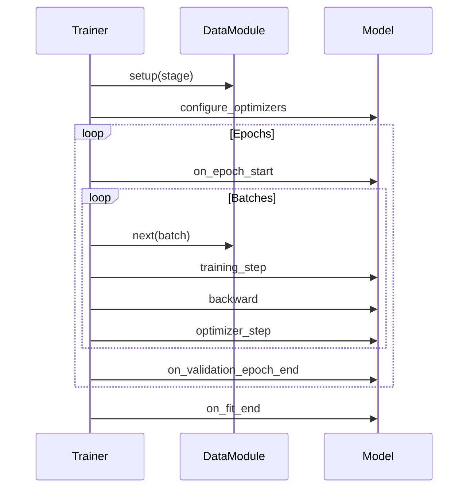

# Trainer

The `Trainer` is the orchestrator that runs training. It manages the training loop, device placement, mixed precision, checkpointing, and more. When you call `trainer.fit(model)`, Lightning handles everything from data iteration to model saving.

## Basic Usage

```python
import lightning as L

trainer = L.Trainer(
    max_epochs=10,
    accelerator="gpu",
    devices=1
)

trainer.fit(model, datamodule=datamodule)
```

## What the Trainer Manages

| Responsibility | Lightning Handles |
| :--- | :--- |
| Epoch Loop | Iterates over all epochs |
| Batch Iteration | Loads batches from DataLoader |
| Device Placement | Moves tensors to correct device |
| Gradients | Zeroes grads, backprops, steps optimizer |
| Mixed Precision (AMP) | Automatic FP16/BF16 |
| Checkpointing | Saves model weights |
| Early Stopping | Monitors metrics |
| Logging | Integrates with loggers |
| Debug Flags | Fast dev runs, profiling |

## Key Flags

### Training Control

```python
trainer = L.Trainer(
    max_epochs=10,           # Maximum epochs to train
    min_epochs=1,            # Minimum epochs (default: 0)
    max_steps=-1,            # Max steps (-1 = until dataset exhausted)
    min_steps=1,             # Minimum steps
    accumulate_grad_batches=1, # Gradient accumulation
)
```

### Device Management

```python
trainer = L.Trainer(
    accelerator="auto",  # "cpu", "gpu", "tpu", "mps", "auto"
    devices="auto",       # Number of devices or "auto"
    num_nodes=1,         # Number of machines for distributed
)
```

| `accelerator` Value | Description |
| :--- | :--- |
| `"cpu"` | CPU only |
| `"gpu"` | NVIDIA GPU (CUDA) |
| `"mps"` | Apple Silicon (M1/M2) |
| `"tpu"` | Google TPU |
| `"auto"` | Auto-select (GPU if available, else CPU) |

### Mixed Precision

```python
trainer = L.Trainer(
    precision="32-true",    # Full precision (default)
    "16-mixed",            # FP16 mixed precision
    "bf16-mixed",         # BF16 mixed precision
    "bf16-facebook",      # Facebook's bfloat16
)
```

:::tip[Performance]
Use `precision="16-mixed"` on modern GPUs for 2-3x speedup with minimal accuracy loss. Use `"bf16-mixed"` for better numerical stability.
:::

### Gradient Management

```python
trainer = L.Trainer(
    gradient_clip_val=1.0,     # Clip gradient norm
    gradient_clip_algorithm="norm",  # "norm" or "value"
    accumulate_grad_batches=4,  # Accumulate gradients
)
```

### Checkpointing

```python
trainer = L.Trainer(
    enable_checkpointing=True,
    checkpoint_dir="checkpoints/",
    save_top_k=3,                     # Keep best k models
    monitor="val_loss",
    mode="min",
    save_on_train_epoch_end=False,      # End of validation (default)
)
```

### Debug Flags

```python
trainer = L.Trainer(
    fast_dev_run=1,          # Run 1 train/val batch (quick test)
    limit_train_batches=0.1, # Use 10% of train data
    limit_val_batches=0.1,   # Use 10% of val data
    limit_test_batches=0.1,   # Use 10% of test data
    overfit_batches=0.05,    # Overfit on 5% (check capacity)
)
```

| Flag | Use Case |
| :--- | :--- |
| `fast_dev_run=4` | Quick sanity check (4 batches total) |
| `limit_train_batches=100` | Debug data pipeline |
| `overfit_batches=10` | Test model capacity |
| `detect_anomaly=True` | Debug NaN/Inf issues |

## Training Methods

| Method | Purpose |
| :--- | :--- |
| `trainer.fit(model, datamodule)` | Train model |
| `trainer.validate(model, datamodule)` | Run validation only |
| `trainer.test(model, datamodule)` | Run test only |
| `trainer.predict(model, datamodule)` | Run inference |

## Distributed Training Strategies

Lightning supports multiple distributed strategies with single-line configuration:

```python
# Data Parallel (single machine, multiple GPUs)
trainer = L.Trainer(
    accelerator="gpu",
    devices=4,
    strategy="dp"  # or "ddp"
)

# Distributed Data Parallel (multi-machine)
trainer = L.Trainer(
    accelerator="gpu",
    devices=4,
    num_nodes=2,
    strategy="ddp"  # or "ddp_spawn"
)

# DeepSpeed (memory-efficient)
trainer = L.Trainer(
    accelerator="gpu",
    strategy="deepspeed",
    deepspeed_config="deepspeed_config.json"
)

# Fully Sharded Data Parallel
trainer = L.Trainer(
    accelerator="gpu",
    strategy="fsdp",
    fsdp_config={...}
)
```

| Strategy | Best For |
| :--- | :--- |
| `"dp"` | Single machine, 2-4 GPUs |
| `"ddp"` | Multi-GPU, multi-node |
| `"deepspeed"` | Large models, limited GPU memory |
| `"fsdp"` | Large models (PyTorch native) |

### Strategy Selection

```python
# Let Lightning choose automatically
trainer = L.Trainer(accelerator="auto", devices="auto")

# Explicit strategy
trainer = L.Trainer(
    accelerator="gpu",
    devices="auto",
    strategy="auto"  # auto-selects based on setup
)
```

## Callbacks

```python
from lightning import callbacks

trainer = L.Trainer(
    callbacks=[
        callbacks.ModelCheckpoint(monitor="val_loss", save_top_k=3),
        callbacks.EarlyStopping(monitor="val_loss", patience=5),
    ]
)
```

## Loggers

```python
from lightning import loggers

trainer = L.Trainer(
    logger=loggers.TensorBoardLogger("logs/"),
    # Or multiple loggers
    logger=[
        loggers.TensorBoardLogger("logs/"),
        loggers.CSVLogger("logs/csv/"),
    ]
)
```

## Training Flow



## Example: Full Training

```python
import lightning as L

# Model
model = MyLightningModule()

# Data
datamodule = MyDataModule()

# Trainer
trainer = L.Trainer(
    max_epochs=10,
    accelerator="gpu",
    devices=1,
    precision="16-mixed",
    callbacks=[
        L.callbacks.ModelCheckpoint(
            monitor="val_loss",
            save_top_k=3,
            save_last=True
        ),
        L.callbacks.EarlyStopping(
            monitor="val_loss",
            patience=5,
            mode="min"
        ),
        L.callbacks.LearningRateMonitor()
    ],
    logger=L.loggers.TensorBoardLogger("logs/"),
    check_val_every_n_epoch=1,
    enable_progress_bar=True,
)

# Train
trainer.fit(model, datamodule=datamodule)

# Test
trainer.test(model, datamodule=datamodule)
```

:::tip[Iterative Workflow]
Start with basic flags (`max_epochs`, `accelerator`). Add complexity only when needed: mixed precision first, then distributed training.
:::