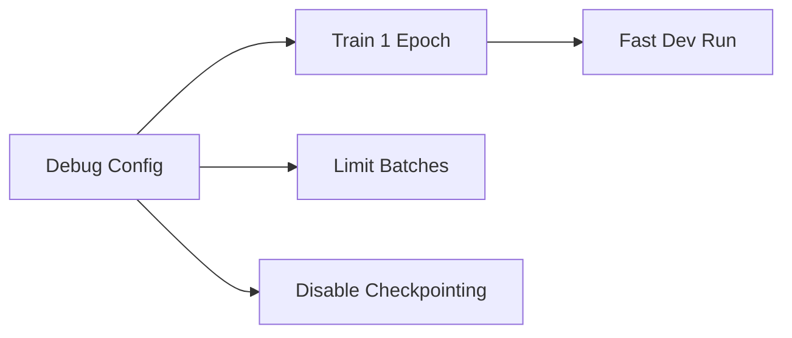

# Config Composition

This document covers advanced Hydra composition patterns: experiment configs, hyperparameter search, sweeps, and debug configurations. These patterns enable systematic ML experimentation.

## Experiment Configs

Experiment configs combine multiple configuration groups into a complete experiment definition:

```yaml
# configs/experiment/my_experiment.yaml
defaults:
  - model: resnet50
  - datamodule: imagenet
  - optimizer: sgd
  - scheduler: cosine_annealing
  - trainer: gpu_8x
  - logger: wandb

# Override specific parameters
model:
  lr: 0.1
  weight_decay: 1e-4

trainer:
  max_epochs: 100
```

### Using Experiments

```bash
# Load experiment config
python src/train.py +experiment=my_experiment

# Override experiment values if needed
python src/train.py +experiment=my_experiment model.lr=0.05
```

The `+` prefix adds the experiment to the defaults list dynamically.

## Debug Configurations

Debug configs provide quick overrides for fast development:

```yaml
# configs/debug/default.yaml
defaults:
  - model: default
  - datamodule: default
  - _self_

# Fast settings for quick iteration
trainer:
  max_epochs: 1
  limit_train_batches: 10
  limit_val_batches: 5
  limit_test_batches: 5
  fast_dev_run: true

model:
  lr: 1e-3
```



### Using Debug Mode

```bash
# Quick sanity check
python src/train.py +debug=default

# Even faster: single batch
python src/train.py +debug=default trainer.fast_dev_run=true
```

## Hyperparameter Search

Hyperparameter search automates exploring the parameter space. Hydra provides two modes:

### Multirun Sweeps (`-m`)

The `-m` flag runs multiple configurations:

```bash
# Grid search over learning rates
python src/train.py -m model.lr=1e-3,1e-4,1e-5

# Grid search over multiple parameters
python src/train.py -m model.lr=1e-3,1e-4 model.dropout=0.1,0.2,0.5
```

This runs all combinations (2 x 3 = 6 runs).

### Random Sweeps

Use OmegaConf for random (uniform) sampling:

```yaml
# configs/sweep.yaml
defaults:
  - override hydra/launcher: basic_sweeper

hydra:
  launcher:
    _target_: hydra._internal.launcher.BasicLauncher
  
  sweeper:
    _target_: hydra._internal.sweeper.RandomSampler
    params:
      model.lr: uniform(1e-5, 1e-1)
      model.dropout: uniform(0.0, 0.5)
```

```bash
# Random search (5 runs)
python src/train.py -m --config-name=sweep model.lr=0.001 model.dropout=0.1
```

## Multirun with Search

### Command Line Interface

```bash
# Simple sweep
python src/train.py -m model.lr=1e-3,1e-4,1e-5

# With output directory
python src/train.py -m model.lr=1e-3,1e-4,1e-5 hydra.sweeper.dir=logs/sweep_${now:%Y-%m-%d_%H-%M-%S}
```

### Sweeper Configuration

More complex sweeps require a sweeper config:

```yaml
# configs/sweeper/basic.yaml
defaults:
  - override hydra/launcher: basic_sweeper

hydra:
  mode: MULTIRUN
  sweeper:
    _target_: hydra._internal.grid_sweeper.GridSweeper
    params:
      model.lr: range(1e-5, 1e-2, 5)
      model.dropout: [0.0, 0.1, 0.2, 0.3, 0.4, 0.5]
    max_batch_count: 10
```

```bash
# Run with sweeper config
python src/train.py --config-name=sweeper
```

## Composer for Configs

The Hydra composer enables composing multiple configs:

```yaml
# configs/experiment/advanced.yaml
defaults:
  - model: resnet
  - /datamodule@datamodule: imagenet
  - /optimizer@optimizer: sgd
  - /scheduler@scheduler: cosine
  - /trainer@trainer: gpu
  - /logger@logger: tensorboard
  - _self_
```

This uses groups with explicit assignment using `@` notation.

## Config Groups Best Practices

### Organization Strategy

```text
configs/
├── base/              # Base configs (gpu, cpu, etc.)
├── model/             # Model architectures
├── datamodule/        # Data configurations
├── optimizer/         # Optimizer settings
├── scheduler/         # LR scheduler settings
├── experiment/        # Complete experiments
└── debug/            # Debug overrides
```

### Base Configs

Create sensible defaults that can be overridden:

```yaml
# configs/trainer/base.yaml
# Minimal trainer settings for any accelerator
accelerator: auto
devices: 1
max_epochs: 10
```

```yaml
# configs/trainer/gpu.yaml
defaults:
  - base
extends: configs/trainer/base.yaml
accelerator: gpu
precision: 32
```

## Composing Experiments with Overrides

### Full Example: Search Experiment

```yaml
# configs/experiment/search.yaml
defaults:
  - model: resnet50
  - datamodule: imagenet
  - optimizer: sgd
  - scheduler: cosine_annealing
  - trainer: gpu
  - logger: wandb
  - _self_

# Override model parameters for search
model:
  lr: 0.1
  weight_decay: 1e-4
  label_smoothing: 0.1

trainer:
  max_epochs: 90

# Sweep specific values
scheduler:
  T_max: ${trainer.max_epochs}
  eta_min: 1e-6
```

## Search Visualization

Track sweep results with logger configs:

```yaml
# configs/logger/wandb.yaml
_target_: lightning.pytorch.loggers.WandbLogger
project: my-project
entity: my-team
tags: ["experiment", "sweep"]
log_model: true
```

```bash
# Run sweep and log to W&B
python src/train.py -m model.lr=1e-3,1e-4,1e-5 +experiment=search logger=wandb
```

## Environment Variables in Configs

Reference environment variables:

```yaml
# configs/datamodule/imagenet.yaml
_target_: src.data.ImageNetDataModule
data_dir: ${env:DATA_DIR:-./data}
num_workers: ${env:NUM_WORKERS:-4}
```

```bash
export DATA_DIR=/mnt/data
export NUM_WORKERS=8
python src/train.py datamodule=imagenet
```

## Advanced: Structured Configs

Use OmegaConf structured configs for type validation:

```python
# src/utils/configs.py
from dataclasses import dataclass
from omegaconf import MISSING

@dataclass
class TrainerConfig:
    accelerator: str = "auto"
    devices: int = 1
    max_epochs: int = 10
    precision: int = 32

@dataclass  
class ModelConfig:
    lr: float = MISSING
    hidden_dims: list = MISSING
    dropout: float = 0.0
```

```yaml
# configs/default.yaml
defaults:
  - trainer: default

trainer:
  $target_: src.utils.configs.TrainerConfig
  
model:
  $target_: src.utils.configs.ModelConfig
```

## Sweep Results

### Directory Structure

Sweeps create structured output:

```text
logs/
├── sweep_2024-01-15_10-30-00/
│   ├── multirun.yaml
│   ├── 1/
│   │   └── train.log
│   ├── 2/
│   │   └── train.log
│   └── ...
```

### Loading Results

```python
# After sweep completes, analyze results
import pandas as pd
import yaml

with open("logs/sweep/multirun.yaml") as f:
    results = yaml.safe_load(f)
```

## Quick Reference

| Command | Description |
| :--- | :--- |
| `+experiment=name` | Load experiment config |
| `+debug=name` | Load debug config |
| `-m param=value1,value2` | Run multirun sweep |
| `--config-name=sweep` | Use sweep config |
| `param=value` | Override single value |

```bash
# Full example
python src/train.py \
    +experiment=resnet50_search \
    model.lr=0.1 \
    trainer.max_epochs=90 \
    logger=wandb
```

## Next Steps

- [Instantiation](./04-instantiation.mdx): Instantiating components from config
- [Custom Module](../04-custom-implementation/01-custom-module.mdx): Building custom Lightning modules