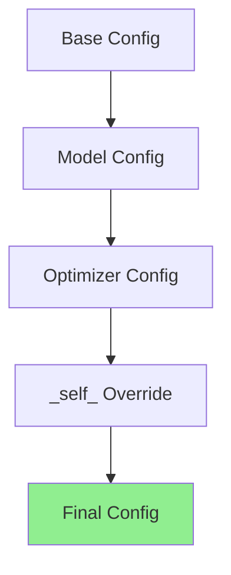

# Instantiation

This document covers how to instantiate Lightning components from Hydra configuration. The `hydra.utils.instantiate()` pattern is the standard way to create DataModules, models, callbacks, loggers, optimizers, and schedulers from config files.

## The Instantiate Pattern

Hydra's `instantiate()` function creates objects from configuration dictionaries:

```python
from hydra.utils import instantiate

# From config dict
model = instantiate(cfg.model)
```

The config must include a `_target_` key specifying the class to instantiate:

```yaml
# configs/model/my_model.yaml
_target_: src.models.MyModel
lr: 1e-3
hidden_dim: 256
```

## DataModule Instantiation

### Config

```yaml
# configs/datamodule/mnist.yaml
_target_: src.data.MNISTDataModule
data_dir: ./data
batch_size: 64
num_workers: 4
```

### Code

```python
datamodule = instantiate(cfg.datamodule)
```

The instantiate call passes all config keys (except `_target_`) as keyword arguments to the class constructor.

### Multi-Dataset Scenario

```yaml
# configs/datamodule/paired.yaml
_target_: src.data.PairedDataModule
source:
  _target_: src.data.MNISTDataModule
  data_dir: ./data
target:
  _target_: src.data.CIFAR10DataModule
  data_dir: ./data
```

```python
datamodule = instantiate(cfg.datamodule)
# Returns PairedDataModule with instantiated source and target
```

## Model/LightningModule Instantiation

### Config

```yaml
# configs/module/my_module.yaml
_target_: src.models.MyLightningModule
lr: 1e-3
hidden_dim: 256
dropout: 0.1
```

### Code

```python
model = instantiate(cfg.module)
```

The instantiated model is a fully initialized LightningModule ready for training.

### With Hyperparameters

Use `save_hyperparameters()` to persist config in checkpoint:

```python
class MyLightningModule(L.LightningModule):
    def __init__(self, lr: float, hidden_dim: int, dropout: float = 0.0):
        super().__init__()
        self.save_hyperparameters()
        self.model = nn.Linear(hidden_dim, 10)
    
    def forward(self, x):
        return self.model(x)
```

When loaded from checkpoint, hyperparameters are restored automatically.

## Optimizer and Scheduler Instantiation

### Optimizer Config

```yaml
# configs/optimizer/adam.yaml
_target_: torch.optim.Adam
lr: 1e-3
betas: [0.9, 0.999]
eps: 1e-8
weight_decay: 0.0
```

### Scheduler Config

```yaml
# configs/scheduler/cosine.yaml
_target_: torch.optim.lr_scheduler.CosineAnnealingLR
T_max: 10
eta_min: 1e-6
```

### Combined Config

```yaml
# configs/optimizer/scheduler.yaml
optimizer:
  _target_: torch.optim.Adam
  lr: 1e-3
  
scheduler:
  _target_: torch.optim.lr_scheduler.CosineAnnealingLR
  T_max: 100
  eta_min: 1e-6
```

### Code

```python
# Instantiate optimizer
optimizer = instantiate(cfg.optimizer, model.parameters())

# Instantiate scheduler
scheduler = instantiate(cfg.scheduler, optimizer)
```

### In LightningModule

```python
def configure_optimizers(self):
    optimizer = instantiate(self.cfg.optimizer, self.parameters())
    
    scheduler = instantiate(
        self.cfg.scheduler,
        optimizer,
        T_max=self.cfg.trainer.max_epochs
    )
    
    return {
        "optimizer": optimizer,
        "lr_scheduler": {
            "scheduler": scheduler,
            "monitor": "val_loss",
        }
    }
```

## Callback Instantiation

Callbacks monitor training and can react to events. They need instantiation utilities:

### instantiate_callbacks Utility

```python
# src/utils/callbacks.py
def instantiate_callbacks(cfg):
    """Instantiate callbacks from config."""
    callbacks = []
    
    if cfg is None:
        return callbacks
    
    callbacks_cfg = OmegaConf.to_container(cfg, resolve=True)
    
    for callback_name, callback_conf in callbacks_cfg.items():
        if isinstance(callback_conf, dict) and "_target_" in callback_conf:
            callback = instantiate(callback_conf)
            callback.name = callback_name
            callbacks.append(callback)
    
    return callbacks
```

### Callback Config

```yaml
# configs/callbacks/default.yaml
model_checkpoint:
  _target_: lightning.pytorch.callbacks.ModelCheckpoint
  save_top_k: 1
  monitor: val_loss
  mode: min
  dirpath: ./models
  filename: best

early_stopping:
  _target_: lightning.pytorch.callbacks.EarlyStopping
  monitor: val_loss
  patience: 5
  mode: min

lr_monitor:
  _target_: lightning.pytorch.callbacks.LearningRateMonitor
  log_momentum: true
```

### Usage

```python
callbacks = instantiate_callbacks(cfg.callbacks)
trainer = Trainer(callbacks=callbacks)
```

## Logger Instantiation

Loggers record metrics and artifacts:

### instantiate_loggers Utility

```python
# src/utils/loggers.py
def instantiate_loggers(cfg):
    """Instantiate loggers from config."""
    loggers = []
    
    if cfg is None:
        return loggers
    
    logger_cfg = OmegaConf.to_container(cfg, resolve=True)
    
    for logger_name, logger_conf in logger_cfg.items():
        if isinstance(logger_conf, dict) and "_target_" in logger_conf:
            logger = instantiate(logger_conf)
            logger.name = logger_name
            loggers.append(logger)
    
    return loggers
```

### Logger Config

```yaml
# configs/logger/default.yaml
tensorboard:
  _target_: lightning.pytorch.loggers.TensorBoardLogger
  save_dir: ./logs
  name: lightning

wandb:
  _target_: lightning.pytorch.loggers.WandbLogger
  project: my-project
  entity: my-team
  tags: ["experiment"]
```

### Usage

```python
loggers = instantiate_loggers(cfg.logger)
trainer = Trainer(logger=loggers)
```

## The `_self_` Keyword

The `_self_` keyword allows local config to override composed values:

```yaml
# configs/experiment/my_exp.yaml
defaults:
  - model: resnet50
  - optimizer: adam
  - _self_

# Override optimizer lr
optimizer:
  lr: 0.05  # Overrides the default from optimizer/adam.yaml
```

When `_self_` appears in defaults, the current config is applied last, allowing it to override values from defaults.

## Config Merge Rules

Hydra merges configs in order. Later configs override earlier ones:

```yaml
# defaults order matters
defaults:
  - model: base
  - datamodule: default
  - optimizer: adam  # Loaded last, can override previous
  - _self_  # Local values override everything
```



## Complete Training Script

```python
# scripts/train.py
import hydra
from omegaconf import DictConfig, OmegaConf
import lightning as L
from hydra.utils import instantiate

from src.utils.callbacks import instantiate_callbacks
from src.utils.loggers import instantiate_loggers

@hydra.main(version_base=None, config_path="../configs", config_name="default")
def main(cfg: DictConfig):
    # Instantiate components
    datamodule = instantiate(cfg.datamodule)
    model = instantiate(cfg.module)
    
    # Setup callbacks and loggers
    callbacks = instantiate_callbacks(cfg.get("callbacks"))
    loggers = instantiate_loggers(cfg.get("logger", {}))
    
    # Create trainer
    trainer = L.Trainer(
        **cfg.trainer,
        callbacks=callbacks,
        logger=loggers,
    )
    
    # Train
    trainer.fit(model, datamodule=datamodule)
    
    # Test (optional)
    if cfg.get("test"):
        trainer.test(model, datamodule=datamodule)

if __name__ == "__main__":
    main()
```

## Default Config Complete

```yaml
# configs/default.yaml
defaults:
  - trainer: default
  - module: default
  - datamodule: default
  - optimizer: adam
  - scheduler: cosine
  - callbacks: default
  - logger: tensorboard
  - _self_

# Trainer settings
trainer:
  accelerator: gpu
  devices: 1
  max_epochs: 10
  precision: 32

# Model settings
module:
  lr: 1e-3
  hidden_dim: 256
```

## Running with Instantiated Components

```bash
# Default run
python src/train.py

# Custom configuration
python src/train.py model.lr=1e-4 +experiment=resnet50

# With custom callbacks
python src/train.py callbacks+=my_callback

# Override
python src/train.py callbacks.model_checkpoint.save_top_k=3
```

:::tip[Debug Instantiation]
Add logging to see what is being instantiated:
```python
print(OmegaConf.to_yaml(cfg))
model = instantiate(cfg.model)
print(f"Created: {type(model)}")
```
:::

## Next Steps

- [Custom Module](../04-custom-implementation/01-custom-module.mdx): Building custom Lightning modules
- [Custom DataModule](../04-custom-implementation/02-custom-datamodule.mdx): Building custom data modules
- [Custom Callbacks](../04-custom-implementation/03-custom-callbacks.mdx): Writing custom callbacks