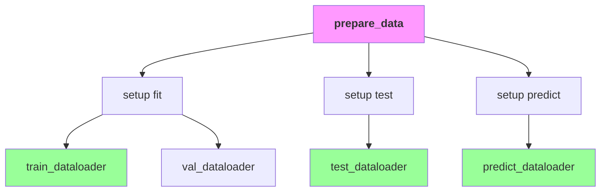

# Custom DataModule

This document covers building a custom `LightningDataModule` — the standard way to manage data loading in Lightning. It includes the full class template, lifecycle methods, dataset patterns, and multi-dataset scenarios.

## Full Class Template

```python
import lightning as L
import torch
from torch.utils.data import DataLoader, random_split
from torchvision import datasets, transforms


class MyDataModule(L.LightningDataModule):
    """Custom DataModule for your dataset.
    
    Args:
        data_dir: Root directory for dataset.
        batch_size: Batch size for DataLoader.
        num_workers: Number of workers for data loading.
        val_split: Fraction of data for validation.
    """
    
    def __init__(
        self,
        data_dir: str = "./data",
        batch_size: int = 32,
        num_workers: int = 4,
        val_split: float = 0.1,
    ):
        super().__init__()
        self.save_hyperparameters()
        
        self.data_dir = data_dir
        self.batch_size = batch_size
        self.num_workers = num_workers
        self.val_split = val_split
    
    def prepare_data(self):
        """Download dataset. Called once on a single process.
        
        Use this method to download data (e.g., from remote storage).
        Do not assign state here.
        """
        # Download dataset (only on rank 0 in distributed)
        datasets.MNIST(self.data_dir, train=True, download=True)
        datasets.MNIST(self.data_dir, train=False, download=True)
    
    def setup(self, stage: str):
        """Load dataset. Called on every process in distributed training.
        
        Args:
            stage: One of 'fit', 'validate', 'test', or 'predict'.
        """
        if stage == "fit" or stage == "validate":
            full_data = datasets.MNIST(
                self.data_dir,
                train=True,
                transform=transforms.ToTensor(),
            )
            
            # Split into train/val
            val_size = int(len(full_data) * self.val_split)
            train_size = len(full_data) - val_size
            
            self.train_data, self.val_data = random_split(
                full_data, [train_size, val_size]
            )
        
        if stage == "test" or stage == "predict":
            self.test_data = datasets.MNIST(
                self.data_dir,
                train=False,
                transform=transforms.ToTensor(),
            )
    
    def train_dataloader(self):
        """Create training DataLoader."""
        return DataLoader(
            self.train_data,
            batch_size=self.batch_size,
            shuffle=True,
            num_workers=self.num_workers,
            persistent_workers=True,
            pin_memory=True,
        )
    
    def val_dataloader(self):
        """Create validation DataLoader."""
        return DataLoader(
            self.val_data,
            batch_size=self.batch_size,
            shuffle=False,
            num_workers=self.num_workers,
            persistent_workers=True,
            pin_memory=True,
        )
    
    def test_dataloader(self):
        """Create test DataLoader."""
        return DataLoader(
            self.test_data,
            batch_size=self.batch_size,
            shuffle=False,
            num_workers=self.num_workers,
            persistent_workers=True,
            pin_memory=True,
        )
    
    def predict_dataloader(self):
        """Create prediction DataLoader."""
        return DataLoader(
            self.test_data,
            batch_size=self.batch_size,
            shuffle=False,
            num_workers=self.num_workers,
            persistent_workers=True,
            pin_memory=True,
        )
```

## Lifecycle Methods

LightningDataModule has three key lifecycle methods:



### prepare_data vs setup

| Method | Called | Use Case |
| :--- | :--- | :--- |
| `prepare_data` | Once, single process | Downloads, extracts, saves to disk |
| `setup` | Every process | Loads data into memory, creates datasets |

```python
def prepare_data(self):
    """Download data once on a single process."""
    # Download from remote
    download_dataset("s3://bucket/data", self.data_dir)
    
    # Extract files
    extract_archive(f"{self.data_dir}.zip")

def setup(self, stage):
    """Load data on every process."""
    self.dataset = load_dataset(self.data_dir)
```

:::caution[prepare_data Race Conditions]
`prepare_data` runs on a single process. Use it only for operations that should happen once (downloading, extracting). Do not use it for data loading that requires multiple processes.
:::

## Dataset Patterns

### PyTorch Dataset

```python
from torch.utils.data import Dataset


class MyDataset(Dataset):
    def __init__(self, data, targets):
        self.data = data
        self.targets = targets
    
    def __len__(self):
        return len(self.data)
    
    def __getitem__(self, idx):
        return self.data[idx], self.targets[idx]
```

### Lazy Loading

```python
class LazyDataset(Dataset):
    def __init__(self, data_dir, transform=None):
        self.data_dir = data_dir
        self.transform = transform
        self.samples = os.listdir(data_dir)
    
    def __len__(self):
        return len(self.samples)
    
    def __getitem__(self, idx):
        img_path = os.path.join(self.data_dir, self.samples[idx])
        image = Image.open(img_path).convert("RGB")
        
        if self.transform:
            image = self.transform(image)
        
        return image, idx
```

### Memory-Mapped Dataset

```python
class MmapDataset(Dataset):
    def __init__(self, data_path):
        self.data = np.load(data_path, mmap_mode="r")
    
    def __len__(self):
        return len(self.data)
    
    def __getitem__(self, idx):
        return torch.from_numpy(self.data[idx].copy())
```

## DataLoader Patterns

### Standard DataLoader

```python
def train_dataloader(self):
    return DataLoader(
        self.train_data,
        batch_size=self.batch_size,
        shuffle=True,
        num_workers=self.num_workers,
        pin_memory=True,
        persistent_workers=True if self.num_workers > 0 else False,
        drop_last=True,
    )
```

### With Sampler

```python
def train_dataloader(self):
    sampler = torch.utils.data.distributed.DistributedSampler(
        self.train_data,
        num_replicas=trainer.world_size,
        rank=trainer.global_rank,
        shuffle=True,
    )
    
    return DataLoader(
        self.train_data,
        batch_size=self.batch_size,
        sampler=sampler,
        num_workers=self.num_workers,
        pin_memory=True,
    )
```

### Distributed DataLoader

In Lightning, use `replace_sampler_ddp` for distributed training:

```python
def train_dataloader(self):
    return DataLoader(
        self.train_data,
        batch_size=self.batch_size,
        shuffle=True,
        num_workers=self.num_workers,
    )

# Lightning automatically replaces sampler in distributed training
```

## Multi-Dataset Scenarios

### Multiple Sources

```python
class MultiDomainDataModule(L.LightningDataModule):
    def __init__(self, sources: list, batch_size: int = 32):
        super().__init__()
        self.sources = sources
        self.batch_size = batch_size
    
    def setup(self, stage: str):
        self.datasets = {}
        
        for source in self.sources:
            self.datasets[source] = load_dataset(source, stage)
    
    def train_dataloader(self):
        loaders = [
            DataLoader(dataset, batch_size=self.batch_size, shuffle=True)
            for dataset in self.datasets.values()
        ]
        
        # Interleave batches from each dataset
        return torch.utils.data.Interleave(loaders, "equal")
```

### Domain Concatenation

```python
class ConcatDataModule(L.LightningDataModule):
    def setup(self, stage):
        # Concatenate multiple datasets
        datasets = []
        
        for source in self.sources:
            datasets.append(load_dataset(source))
        
        self.train_data = ConcatDataset(datasets)
```

### Conditional Loading

```python
class ConditionalDataModule(L.LightningDataModule):
    def __init__(self, mode: str = "train"):
        super().__init__()
        self.mode = mode
    
    def setup(self, stage):
        if self.mode == "train":
            self.data = load_train_data()
        else:
            self.data = load_test_data()
```

## Integration with Hydra

### Config Definition

```yaml
# configs/datamodule/mnist.yaml
_target_: src.data.MNISTDataModule
data_dir: ./data
batch_size: 64
num_workers: 4
val_split: 0.1
```

### Instantiation

```python
from hydra.utils import instantiate

@dataclass
class DataModuleConfig:
    _target_: str = "src.data.MNISTDataModule"
    data_dir: str = "./data"
    batch_size: int = 64
    num_workers: int = 4

# instantiate creates DataModule
datamodule = instantiate(cfg.datamodule)
```

### Complete Config Example

```yaml
# configs/datamodule/imagenet.yaml
_target_: src.data.ImageNetDataModule
data_dir: ${env:DATA_DIR}
batch_size: 256
num_workers: 8
image_size: 224
normalize:
  mean: [0.485, 0.456, 0.406]
  std: [0.229, 0.224, 0.225]
augmentation: random_resized_crop
```

## Example: MNIST DataModule

```python
import lightning as L
import torch
from torch.utils.data import DataLoader, random_split
from torchvision import datasets, transforms


class MNISTDataModule(L.LightningDataModule):
    def __init__(
        self,
        data_dir: str = "./data",
        batch_size: int = 32,
        num_workers: int = 4,
    ):
        super().__init__()
        self.save_hyperparameters()
        
        self.data_dir = data_dir
        self.batch_size = batch_size
        self.num_workers = num_workers
    
    def transform(self):
        return transforms.Compose([
            transforms.ToTensor(),
            transforms.Normalize((0.1307,), (0.3081,)),
        ])
    
    def prepare_data(self):
        datasets.MNIST(self.data_dir, train=True, download=True)
        datasets.MNIST(self.data_dir, train=False, download=True)
    
    def setup(self, stage: str):
        if stage == "fit":
            train_data = datasets.MNIST(
                self.data_dir,
                train=True,
                transform=self.transform(),
            )
            
            self.train_data, self.val_data = random_split(
                train_data, [55000, 5000]
            )
        
        if stage == "test":
            self.test_data = datasets.MNIST(
                self.data_dir,
                train=False,
                transform=self.transform(),
            )
    
    def train_dataloader(self):
        return DataLoader(
            self.train_data,
            batch_size=self.batch_size,
            shuffle=True,
            num_workers=self.num_workers,
            persistent_workers=True,
        )
    
    def val_dataloader(self):
        return DataLoader(
            self.val_data,
            batch_size=self.batch_size,
            shuffle=False,
            num_workers=self.num_workers,
            persistent_workers=True,
        )
    
    def test_dataloader(self):
        return DataLoader(
            self.test_data,
            batch_size=self.batch_size,
            shuffle=False,
            num_workers=self.num_workers,
            persistent_workers=True,
        )
```

## Best Practices

### Number of Workers

```python
def __init__(self, num_workers: int = 4):
    # Set num_workers to CPU cores for optimal loading
    # Use 0 for debugging (disables multiprocessing)
    self.num_workers = num_workers
```

:::tip[Worker Count]
Start with `num_workers = 0` for debugging. Once code works, increase to CPU count (usually 4-8). More workers does not always mean faster — benchmark to find optimal.
:::

### Pin Memory

```python
return DataLoader(
    dataset,
    batch_size=self.batch_size,
    pin_memory=True,  # Faster GPU transfer
    # ...
)
```

### Persistent Workers

```python
return DataLoader(
    dataset,
    batch_size=self.batch_size,
    persistent_workers=True,  # Avoid worker restart between epochs
    # ...
)
```

## Common Patterns

### Lazy Dataset Loading

```python
def setup(self, stage):
    # Load only what is needed
    if stage in ("fit", "validate"):
        self.data = load_train_data()
```

### Data Augmentation

```python
def train_dataloader(self):
    return DataLoader(
        self.train_data,
        batch_size=self.batch_size,
        shuffle=True,
        # ...
    )

def val_dataloader(self):
    # No augmentation for validation
    return DataLoader(
        self.val_data,
        batch_size=self.batch_size,
        shuffle=False,
        # ...
    )
```

### Class Balancing

```python
def train_dataloader(self):
    weights = self.get_class_weights()
    sampler = WeightedRandomSampler(
        weights,
        num_samples=len(self.train_data),
        replacement=True,
    )
    
    return DataLoader(
        self.train_data,
        batch_size=self.batch_size,
        sampler=sampler,
    )
```

## Next Steps

- [Custom Callbacks](./03-custom-callbacks.mdx): Writing custom callbacks
- [Optimizer & Scheduler](./04-optimizer-scheduler.mdx): Configuring optimizers and schedulers
- [Project Structure](../03-hydra-integration/01-project-structure.mdx): Overall project organization