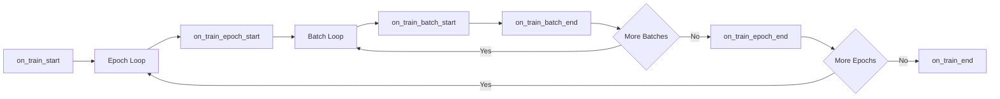

# Custom Callbacks

Callbacks are hooks that execute custom logic at specific points during training. They are the standard way to extend Lightning's behavior without modifying core training code.

## Callback Overview

Callbacks monitor training events and can react to them:



## Available Hooks

### Training Lifecycle

| Hook | When Called |
| :--- | :--- |
| `on_fit_start` | Before any training starts |
| `on_train_start` | At the start of training |
| `on_train_epoch_start` | At the start of each epoch |
| `on_train_batch_start` | Before processing each batch |
| `on_train_batch_end` | After processing each batch |
| `on_train_epoch_end` | At the end of each epoch |
| `on_train_end` | At the end of training |

### Validation Lifecycle

| Hook | When Called |
| :--- | :--- |
| `on_validation_start` | Before validation |
| `on_validation_epoch_start` | At start of validation epoch |
| `on_validation_batch_start` | Before each validation batch |
| `on_validation_batch_end` | After each validation batch |
| `on_validation_epoch_end` | At end of validation |
| `on_validation_end` | After validation |

### Test and Prediction

| Hook | When Called |
| :--- | :--- |
| `on_test_start` | Before test starts |
| `on_test_epoch_start` | At start of test epoch |
| `on_test_batch_start` | Before each test batch |
| `on_test_batch_end` | After each test batch |
| `on_test_epoch_end` | At end of test |
| `on_test_end` | After test |

### Exception Handling

| Hook | When Called |
| :--- | :--- |
| `on_exception` | When an exception occurs |
| `on_save_checkpoint` | When saving checkpoint |
| `on_load_checkpoint` | When loading checkpoint |

## Full Callback Template

```python
import lightning as L
from lightning import Callback


class MyCallback(Callback):
    """Custom callback for training.
    
    Args:
        save_dir: Directory to save artifacts.
        upload_freq: Frequency (in epochs) to upload artifacts.
    """
    
    def __init__(self, save_dir: str = "./logs", upload_freq: int = 1):
        self.save_dir = save_dir
        self.upload_freq = upload_freq
    
    def on_fit_start(self, trainer: L.Trainer, pl_module: L.LightningModule):
        """Called before training starts.
        
        Args:
            trainer: The Trainer instance.
            pl_module: The LightningModule being trained.
        """
        print(f"Training starting with {trainer.num_devices} devices")
    
    def on_train_epoch_start(
        self,
        trainer: L.Trainer,
        pl_module: L.LightningModule,
    ):
        """Called at the start of each training epoch.
        
        Args:
            trainer: The Trainer instance.
            pl_module: The LightningModule being trained.
        """
        self.current_epoch = trainer.current_epoch
    
    def on_train_batch_end(
        self,
        trainer: L.Trainer,
        pl_module: L.LightningModule,
        outputs,
        batch,
        batch_idx,
    ):
        """Called after each training batch.
        
        Args:
            trainer: The Trainer instance.
            pl_module: The LightningModule being trained.
            outputs: The output of training_step.
            batch: The batch processed.
            batch_idx: The batch index.
        """
        pass
    
    def on_train_epoch_end(
        self,
        trainer: L.Trainer,
        pl_module: L.LightningModule,
    ):
        """Called at the end of each training epoch.
        
        Args:
            trainer: The Trainer instance.
            pl_module: The LightningModule being trained.
        """
        # Get metrics from trainer
        metrics = trainer.callback_metrics
        
        # Log to custom logger
        val_loss = metrics.get("val_loss")
        if val_loss is not None:
            print(f"Epoch {trainer.current_epoch}: val_loss={val_loss:.4f}")
    
    def on_exception(
        self,
        trainer: L.Trainer,
        pl_module: L.LightningModule,
        exception: BaseException,
    ):
        """Called when an exception occurs.
        
        Args:
            trainer: The Trainer instance.
            pl_module: The LightningModule being trained.
            exception: The exception that was raised.
        """
        print(f"Exception occurred: {exception}")
        
        # Save emergency checkpoint
        trainer.save_checkpoint("emergency_ckpt.ckpt")
    
    def on_train_end(self, trainer: L.Trainer, pl_module: L.LightningModule):
        """Called at the end of training.
        
        Args:
            trainer: The Trainer instance.
            pl_module: The LightningModule being trained.
        """
        print("Training complete!")
```

## Accessing Trainer State

Callbacks have access to the trainer and module:

### Trainer Properties

```python
def on_train_epoch_end(self, trainer, pl_module):
    # Current state
    current_epoch = trainer.current_epoch
    global_step = trainer.global_step
    max_epochs = trainer.max_epochs
    
    # Metrics
    callback_metrics = trainer.callback_metrics
    logged_metrics = trainer.logged_metrics
    
    # Model
    model = pl_module
    
    # Device
    device = pl_module.device
    
    # Checkpoints
    ckpt_path = trainer.checkpoint_callback.best_model_path
    
    # Learning rate
    lr = trainer.optimizers[0].param_groups[0]["lr"]
```

### LightningModule Properties

```python
def on_train_epoch_end(self, trainer, pl_module):
    # Hyperparameters
    lr = pl_module.hparams.lr
    
    # State
    state = pl_module.state
    
    # Device
    device = next(pl_module.parameters()).device
```

## Practical Example: Upload Artifacts

This callback uploads model checkpoints to cloud storage on epoch end:

```python
import os
import shutil
import lightning as L
from lightning import Callback


class UploadArtifactsCallback(Callback):
    """Upload artifacts to cloud storage at epoch end.
    
    Args:
        save_dir: Local directory for checkpoints.
        remote_path: Remote storage path (e.g., S3 bucket).
        upload_freq: Frequency (in epochs) to upload.
    """
    
    def __init__(
        self,
        save_dir: str = "./models",
        remote_path: str = "s3://bucket/checkpoints",
        upload_freq: int = 1,
    ):
        self.save_dir = save_dir
        self.remote_path = remote_path
        self.upload_freq = upload_freq
    
    def on_train_epoch_end(
        self,
        trainer: L.Trainer,
        pl_module: L.LightningModule,
    ):
        """Upload checkpoint after each epoch."""
        # Only upload every upload_freq epochs
        if trainer.current_epoch % self.upload_freq != 0:
            return
        
        # Get the best checkpoint
        ckpt_path = trainer.checkpoint_callback.best_model_path
        
        if ckpt_path and os.path.exists(ckpt_path):
            self.upload_to_remote(ckpt_path)
    
    def upload_to_remote(self, local_path: str):
        """Upload file to remote storage.
        
        Args:
            local_path: Path to local file.
        """
        filename = os.path.basename(local_path)
        remote_url = f"{self.remote_path}/{filename}"
        
        print(f"Uploading {filename} to {self.remote_path}...")
        
        # Example: upload to S3 (replace with your upload logic)
        # import boto3
        # s3 = boto3.client("s3")
        # s3.upload_file(local_path, "bucket", filename)
        
        print(f"Uploaded: {remote_url}")
```

## Practical Example: Learning Rate Tuner

A callback that dynamically adjusts learning rate:

```python
import lightning as L
from lightning import Callback


class LearningRateFinderCallback(Callback):
    """Tune learning rate by running a learning rate range test.
    
    Run this at the start of training to find optimal lr.
    """
    
    def __init__(self, min_lr: float = 1e-6, max_lr: float = 1.0, num_steps: int = 100):
        self.min_lr = min_lr
        self.max_lr = max_lr
        self.num_steps = num_steps
        self.found_lr = None
    
    def on_fit_start(self, trainer: L.Trainer, pl_module: L.LightningModule):
        """Run learning rate range test."""
        # Use Lightning's built-in lr finder
        tuner = trainer.tuner.lr_find(
            pl_module,
            min_lr=self.min_lr,
            max_lr=self.max_lr,
            num_training=self.num_steps,
        )
        
        # Get suggested lr
        self.found_lr = tuner.suggested_lr
        
        print(f"Suggested learning rate: {self.found_lr}")
        
        # Update optimizer
        for optimizer in trainer.optimizers:
            for param_group in optimizer.param_groups:
                param_group["lr"] = self.found_lr
```

## Practical Example: Gradient Clipper

A callback that clips gradients manually:

```python
import torch
import lightning as L
from lightning import Callback


class GradientClipperCallback(Callback):
    """Clip gradients at end of each batch.
    
    Args:
        max_norm: Maximum norm for gradients.
    """
    
    def __init__(self, max_norm: float = 1.0):
        self.max_norm = max_norm
    
    def on_train_batch_end(
        self,
        trainer: L.Trainer,
        pl_module: L.LightningModule,
        outputs,
        batch,
        batch_idx,
    ):
        """Clip gradients after each batch."""
        torch.nn.utils.clip_grad_norm_(
            pl_module.parameters(),
            max_norm=self.max_norm,
        )
```

## Practical Example: Metric Tracker

Track metrics across training:

```python
import json
import os
import lightning as L
from lightning import Callback


class MetricsTrackerCallback(Callback):
    """Track and save metrics to file.
    
    Args:
        save_path: Path to save metrics JSON.
    """
    
    def __init__(self, save_path: str = "./logs/metrics.json"):
        self.save_path = save_path
        self.history = {
            "train_loss": [],
            "val_loss": [],
            "val_acc": [],
        }
    
    def on_train_epoch_end(
        self,
        trainer: L.Trainer,
        pl_module: L.LightningModule,
    ):
        """Record metrics."""
        metrics = trainer.callback_metrics
        
        for key in self.history.keys():
            if key in metrics:
                value = metrics[key]
                if hasattr(value, "item"):
                    value = value.item()
                self.history[key].append(value)
        
        # Save to file
        os.makedirs(os.path.dirname(self.save_path), exist_ok=True)
        
        with open(self.save_path, "w") as f:
            json.dump(self.history, f, indent=2)
```

## Using with Hydra

### Config Definition

```yaml
# configs/callbacks/model_checkpoint.yaml
_target_: lightning.pytorch.callbacks.ModelCheckpoint
save_top_k: 1
monitor: val_loss
mode: min
dirpath: ./models
filename: best
save_last: true

# configs/callbacks/early_stopping.yaml
_target_: lightning.pytorch.callbacks.EarlyStopping
monitor: val_loss
patience: 5
mode: min
```

### Custom Callback Config

```yaml
# configs/callbacks/upload_artifacts.yaml
_target_: src.callbacks.UploadArtifactsCallback
save_dir: ./models
remote_path: s3://bucket/checkpoints
upload_freq: 1
```

### Instantiation

```python
def instantiate_callbacks(cfg):
    callbacks = []
    
    for name, conf in cfg.items():
        if isinstance(conf, dict) and "_target_" in conf:
            callbacks.append(instantiate(conf))
    
    return callbacks
```

## Best Practices

### Initialization in __init__

```python
def __init__(self, param: str = "default"):
    # Initialize in __init__ - called once
    self.param = param
    super().__init__()
```

### Access State in Hooks

```python
def on_train_epoch_start(self, trainer, pl_module):
    # Access trainer state here - called per epoch
    self.current_epoch = trainer.current_epoch
```

### Handle Exceptions

```python
def on_exception(self, trainer, pl_module, exception):
    # Always save state on exception
    trainer.save_checkpoint("emergency.ckpt")
```

:::caution[Avoid Expensive Operations]
Avoid expensive operations in callbacks that run frequently (e.g., `on_train_batch_end`). If needed, only run every N batches using `batch_idx % N == 0`.
:::

## Creating Multi-Callback

```python
class CompositeCallback(Callback):
    """Combine multiple callbacks."""
    
    def __init__(self, callbacks: list):
        self.callbacks = callbacks
    
    def on_train_start(self, trainer, pl_module):
        for cb in self.callbacks:
            cb.on_train_start(trainer, pl_module)
```

## Next Steps

- [Optimizer & Scheduler](./04-optimizer-scheduler.mdx): Configuring optimizers and schedulers
- [Logging Metrics](../02-core-components/05-logging-metrics.mdx): Logging and metrics
- [Project Structure](../03-hydra-integration/01-project-structure.mdx): Overall project organization