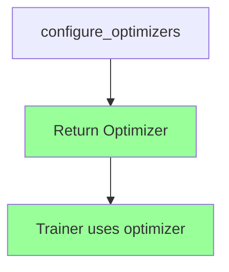
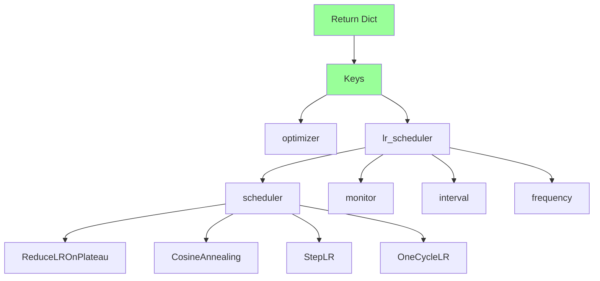

# Optimizer & Scheduler

Configuring optimizers and learning rate schedulers is a core part of Lightning training. This document covers the `configure_optimizers` pattern, scheduler configuration, and manual optimization for advanced use cases.

## configure_optimizers Pattern

The `configure_optimizers` method returns optimizer and scheduler configuration:

```python
import lightning as L
import torch


class MyModule(L.LightningModule):
    def __init__(self, lr: float = 1e-3):
        super().__init__()
        self.save_hyperparameters()
        # ...
    
    def configure_optimizers(self):
        # Configure and return optimizer/scheduler
        ...
```

## Single Optimizer

The simplest case — return a single optimizer:

```python
def configure_optimizers(self):
    optimizer = torch.optim.Adam(self.parameters(), lr=self.hparams.lr)
    return optimizer
```



### With Weight Decay

```python
def configure_optimizers(self):
    optimizer = torch.optim.AdamW(
        self.parameters(),
        lr=self.hparams.lr,
        weight_decay=1e-4,
    )
    return optimizer
```

## Optimizer with Scheduler

Return a dictionary with optimizer and scheduler:

```python
def configure_optimizers(self):
    optimizer = torch.optim.Adam(self.parameters(), lr=self.hparams.lr)
    
    scheduler = torch.optim.lr_scheduler.CosineAnnealingLR(
        optimizer,
        T_max=10,
        eta_min=1e-6,
    )
    
    return {
        "optimizer": optimizer,
        "lr_scheduler": {
            "scheduler": scheduler,
            "monitor": "val_loss",
            "interval": "epoch",
            "frequency": 1,
        },
    }
```

### Scheduler Dict Keys

| Key | Description |
| :--- | :--- |
| `scheduler` | Scheduler instance |
| `monitor` | Metric to monitor (for ReduceLROnPlateau) |
| `interval` | `"epoch"` or `"step"` |
| `frequency` | Run every N epochs/steps |

```python
def configure_optimizers(self):
    optimizer = torch.optim.Adam(self.parameters(), lr=self.hparams.lr)
    
    # ReduceLROnPlateau monitors a metric
    scheduler = torch.optim.lr_scheduler.ReduceLROnPlateau(
        optimizer,
        mode="min",
        factor=0.5,
        patience=3,
    )
    
    return {
        "optimizer": optimizer,
        "lr_scheduler": {
            "scheduler": scheduler,
            "monitor": "val_loss",  # Metric to monitor
            "interval": "epoch",
            "frequency": 1,
        },
    }
```

### Interval and Frequency

```python
# Step-based scheduling (every 100 steps)
return {
    "optimizer": optimizer,
    "lr_scheduler": {
        "scheduler": scheduler,
        "interval": "step",  # "step" or "epoch"
        "frequency": 100,    # Every N steps
    },
}
```

## Multiple Optimizers

Return a list for multiple optimizers (e.g., GANs):

```python
def configure_optimizers(self):
    # Generator optimizer
    opt_G = torch.optim.Adam(
        self.generator.parameters(),
        lr=1e-3,
    )
    
    # Discriminator optimizer
    opt_D = torch.optim.Adam(
        self.discriminator.parameters(),
        lr=1e-4,
    )
    
    return [opt_G, opt_D]
```

### With Separate Schedulers

Return a list of dictionaries for each optimizer:

```python
def configure_optimizers(self):
    opt_G = torch.optim.Adam(self.generator.parameters(), lr=1e-3)
    opt_D = torch.optim.Adam(self.discriminator.parameters(), lr=1e-4)
    
    scheduler_G = torch.optim.lr_scheduler.CosineAnnealingLR(opt_G, T_max=10)
    scheduler_D = torch.optim.lr_scheduler.CosineAnnealingLR(opt_D, T_max=10)
    
    return [
        {
            "optimizer": opt_G,
            "lr_scheduler": {
                "scheduler": scheduler_G,
                "interval": "epoch",
                "frequency": 1,
            },
        },
        {
            "optimizer": opt_D,
            "lr_scheduler": {
                "scheduler": scheduler_D,
                "interval": "epoch",
                "frequency": 1,
            },
        },
    ]
```

## Alternative: Configure in __init__ and Save

For simple cases, configure in `__init__`:

```python
def __init__(self, lr: float = 1e-3):
    super().__init__()
    self.save_hyperparameters()
    self.lr = lr
    # ...

def configure_optimizers(self):
    return torch.optim.Adam(self.parameters(), lr=self.lr)
```

Or use a factory pattern:

```python
def configure_optimizers(self):
    from hydra.utils import instantiate
    
    optimizer_conf = self.hparams.get("optimizer", {})
    optimizer = instantiate(optimizer_conf, self.parameters())
    
    scheduler_conf = self.hparams.get("scheduler", {})
    if scheduler_conf:
        scheduler = instantiate(scheduler_conf, optimizer)
        return {"optimizer": optimizer, "lr_scheduler": scheduler}
    
    return optimizer
```

## Instantiating via Hydra Config

### Optimizer Config

```yaml
# configs/optimizer/adam.yaml
_target_: torch.optim.Adam
lr: 1e-3
betas: [0.9, 0.999]
eps: 1e-8
weight_decay: 0.0
```

### Scheduler Config

```yaml
# configs/scheduler/cosine.yaml
_target_: torch.optim.lr_scheduler.CosineAnnealingLR
T_max: 100
eta_min: 1e-6
```

### Module Using Config

```python
def configure_optimizers(self):
    # Instantiate optimizer
    optimizer = instantiate(
        self.cfg.optimizer,
        self.parameters(),
    )
    
    # Instantiate scheduler
    scheduler = instantiate(
        self.cfg.scheduler,
        optimizer,
        T_max=self.cfg.trainer.max_epochs,
    )
    
    return {
        "optimizer": optimizer,
        "lr_scheduler": {
            "scheduler": scheduler,
            "monitor": "val_loss",
            "interval": "epoch",
            "frequency": 1,
        },
    }
```

### Full Config Example

```yaml
# configs/optimizer.yaml
optimizer:
  _target_: torch.optim.Adam
  lr: 1e-3
  betas: [0.9, 0.999]
  weight_decay: 0.0

scheduler:
  _target_: torch.optim.lr_scheduler.CosineAnnealingLR
  T_max: 100
  eta_min: 1e-6
```

## Common Scheduler Patterns

### ReduceLROnPlateau

```python
def configure_optimizers(self):
    optimizer = torch.optim.Adam(self.parameters(), lr=self.hparams.lr)
    
    scheduler = torch.optim.lr_scheduler.ReduceLROnPlateau(
        optimizer,
        mode="min",
        factor=0.5,
        patience=3,
        verbose=True,
    )
    
    return {
        "optimizer": optimizer,
        "lr_scheduler": {
            "scheduler": scheduler,
            "monitor": "val_loss",
            "interval": "epoch",
            "frequency": 1,
        },
    }
```

### Cosine Annealing

```python
def configure_optimizers(self):
    optimizer = torch.optim.Adam(self.parameters(), lr=self.hparams.lr)
    
    scheduler = torch.optim.lr_scheduler.CosineAnnealingLR(
        optimizer,
        T_max=10,
        eta_min=1e-6,
    )
    
    return {
        "optimizer": optimizer,
        "lr_scheduler": {
            "scheduler": scheduler,
            "interval": "epoch",
            "frequency": 1,
        },
    }
```

### OneCycleLR

```python
def configure_optimizers(self):
    optimizer = torch.optim.Adam(self.parameters(), lr=self.hparams.lr)
    
    # OneCycleLR uses scheduler internally
    scheduler = torch.optim.lr_scheduler.OneCycleLR(
        optimizer,
        max_lr=self.hparams.lr,
        epochs=10,
        steps_per_epoch=100,
    )
    
    return {
        "optimizer": optimizer,
        "lr_scheduler": {
            "scheduler": scheduler,
            "interval": "step",
            "frequency": 1,
        },
    }
```

### StepLR

```python
def configure_optimizers(self):
    optimizer = torch.optim.Adam(self.parameters(), lr=self.hparams.lr)
    
    scheduler = torch.optim.lr_scheduler.StepLR(
        optimizer,
        step_size=10,
        gamma=0.1,
    )
    
    return {
        "optimizer": optimizer,
        "lr_scheduler": {
            "scheduler": scheduler,
            "interval": "epoch",
            "frequency": 1,
        },
    }
```

### Warmup + Cosine

```python
def configure_optimizers(self):
    optimizer = torch.optim.Adam(self.parameters(), lr=self.hparams.lr)
    
    # Warmup first, then cosine
    scheduler = torch.optim.lr_scheduler.SequentialLR(
        optimizer,
        schedulers=[
            torch.optim.lr_scheduler.LinearLR(
                optimizer,
                start_factor=0.1,
                end_factor=1.0,
                total_iters=5,
            ),
            torch.optim.lr_scheduler.CosineAnnealingLR(
                optimizer,
                T_max=95,
                eta_min=1e-6,
            ),
        ],
        milestones=[5],
    )
    
    return {
        "optimizer": optimizer,
        "lr_scheduler": {
            "scheduler": scheduler,
            "interval": "epoch",
            "frequency": 1,
        },
    }
```

## Manual Optimization

Manual optimization gives full control over the training loop. Use it for:

- Gradient accumulation
- Multiple optimizer steps
- Custom gradient clipping
- GAN training

### Enable Manual Optimization

```python
def training_step(self, batch, batch_idx):
    # Return loss without stepping optimizer
    return loss

# Lightning will not call optimizer.step() automatically
```

### Accessing Optimizer

```python
def training_step_end(self, outputs):
    optimizer = self.optimizers()
    optimizer.step()
    optimizer.zero_grad()
    return outputs
```

### With Gradient Accumulation

```python
def __init__(self):
    super().__init__()
    self.automatic_optimization = False

def training_step(self, batch, batch_idx):
    # Backward pass
    loss = self.compute_loss(batch)
    self.manual_backward(loss)
    
    # Accumulate gradients
    if (batch_idx + 1) % self.accumulate_grad_batches == 0:
        # Clip gradients
        torch.nn.utils.clip_grad_norm_(self.parameters(), max_norm=1.0)
        
        # Step
        opt = self.optimizers()
        opt.step()
        opt.zero_grad()
    
    return loss
```

### Custom Scheduling

```python
def __init__(self):
    super().__init__()
    self.automatic_optimization = False

def training_step(self, batch, batch_idx):
    opt = self.optimizers()
    
    # Custom optimizer logic
    loss = self.compute_loss(batch)
    self.manual_backward(loss)
    
    # Custom gradient clipping
    torch.nn.utils.clip_grad_norm_(self.parameters(), max_norm=1.0)
    
    # Custom scheduler: update lr every N batches
    if self.global_step % 100 == 0:
        for param_group in opt.param_groups:
            param_group["lr"] *= 0.99
    
    opt.step()
    opt.zero_grad()
    
    return loss
```

### Advanced Use Case: GAN

```python
def __init__(self, lr_g: float = 1e-3, lr_d: float = 1e-4):
    super().__init__()
    self.save_hyperparameters()
    self.automatic_optimization = False
    self.generator = Generator()
    self.discriminator = Discriminator()

def training_step(self, batch, batch_idx):
    real, _ = batch
    
    # Train discriminator
    opt_d = self.optimizers()[0]
    opt_d.zero_grad()
    
    fake = self.generator(self.get_noise(real.size(0)))
    fake_detached = fake.detach()
    
    loss_d_real = self.adversarial_loss(self.discriminator(real), True)
    loss_d_fake = self.adversarial_loss(self.discriminator(fake_detached), False)
    loss_d = (loss_d_real + loss_d_fake) / 2
    
    self.manual_backward(loss_d)
    opt_d.step()
    
    # Train generator
    opt_g = self.optimizers()[1]
    opt_g.zero_grad()
    
    fake = self.generator(self.get_noise(real.size(0)))
    loss_g = self.adversarial_loss(self.discriminator(fake), True)
    
    self.manual_backward(loss_g)
    opt_g.step()
    
    return {"loss_d": loss_d, "loss_g": loss_g}

def configure_optimizers(self):
    opt_g = torch.optim.Adam(self.generator.parameters(), lr=self.hparams.lr_g)
    opt_d = torch.optim.Adam(self.discriminator.parameters(), lr=self.hparams.lr_d)
    return [opt_g, opt_d]
```

## Scheduler Dict Reference



### Required vs Optional Keys

| Key | Required | Description |
| :--- | :--- | :--- |
| `optimizer` | Yes | Optimizer instance |
| `lr_scheduler` | No | Scheduler dict |

### Scheduler Dict (when provided)

| Key | Required | Description |
| :--- | :--- | :--- |
| `scheduler` | Yes | Scheduler instance |
| `monitor` | For ReduceLROnPlateau | Metric to monitor |
| `interval` | No | `"epoch"` or `"step"` |
| `frequency` | No | Run frequency |

## Full Example

```python
import lightning as L
import torch
import torch.nn as nn
import torch.nn.functional as F


class ClassificationModule(L.LightningModule):
    def __init__(self, lr: float = 1e-3):
        super().__init__()
        self.save_hyperparameters()
        
        self.layer = nn.Linear(784, 10)
        self.lr = lr
    
    def forward(self, x):
        x = x.view(x.size(0), -1)
        return self.layer(x)
    
    def training_step(self, batch, batch_idx):
        x, y = batch
        logits = self(x)
        
        loss = F.cross_entropy(logits, y)
        self.log("train_loss", loss, on_step=True, on_epoch=True, prog_bar=True)
        
        return loss
    
    def validation_step(self, batch, batch_idx):
        x, y = batch
        logits = self(x)
        
        loss = F.cross_entropy(logits, y)
        preds = torch.argmax(logits, dim=1)
        acc = (preds == y).float().mean()
        
        self.log("val_loss", loss, on_step=False, on_epoch=True, prog_bar=True)
        self.log("val_acc", acc, on_step=False, on_epoch=True, prog_bar=True)
    
    def configure_optimizers(self):
        optimizer = torch.optim.AdamW(
            self.parameters(),
            lr=self.lr,
            weight_decay=1e-4,
        )
        
        scheduler = torch.optim.lr_scheduler.CosineAnnealingLR(
            optimizer,
            T_max=10,
            eta_min=1e-6,
        )
        
        return {
            "optimizer": optimizer,
            "lr_scheduler": {
                "scheduler": scheduler,
                "monitor": "val_loss",
                "interval": "epoch",
                "frequency": 1,
            },
        }
```

## Best Practices

### Start Simple

```python
# Default: single optimizer
def configure_optimizers(self):
    return torch.optim.Adam(self.parameters(), lr=1e-3)
```

### Add Scheduler When Needed

```python
# Add scheduler after verifying basic training works
def configure_optimizers(self):
    optimizer = torch.optim.Adam(self.parameters(), lr=1e-3)
    
    scheduler = torch.optim.lr_scheduler.CosineAnnealingLR(
        optimizer,
        T_max=10,
    )
    
    return {
        "optimizer": optimizer,
        "lr_scheduler": {
            "scheduler": scheduler,
            "interval": "epoch",
        },
    }
```

### Use Manual Optimization Sparingly

:::caution[Manual Optimization]
Only use manual optimization when necessary (GANs, complex gradient manipulation). It bypasses Lightning's automatic handling and can cause issues with distributed training.
:::

## Next Steps

- [Logging Metrics](../02-core-components/05-logging-metrics.mdx): Logging and metrics
- [Custom Callbacks](./03-custom-callbacks.mdx): Writing custom callbacks
- [Instantiation](../03-hydra-integration/04-instantiation.mdx): Instantiating components from config