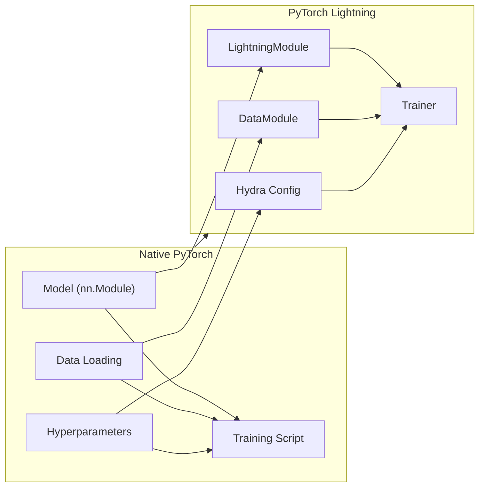

# Migrating from Native PyTorch to Lightning

This guide walks through the systematic process of migrating native PyTorch code to PyTorch Lightning. The migration follows a clear pattern: extract model logic into `LightningModule`, data handling into `DataModule`, training loop into Trainer hooks, and configuration into Hydra.

:::info[Prerequisites]
This guide assumes familiarity with native PyTorch: `nn.Module`, `DataLoader`, `optimizer.step()`, and `loss.backward()`. For a refresher on native PyTorch fundamentals, see the [PyTorch basics](/docs/deep-learning/pytorch-tutorial/01-fundamentals/01-tensor-operations.mdx) section.
:::

## Why Migrate to Lightning?

Native PyTorch requires writing repetitive training boilerplate for every project:

```python
# Native PyTorch: Same boilerplate repeated in every script
for epoch in range(num_epochs):
    model.train()
    for batch in dataloader:
        optimizer.zero_grad()
        outputs = model(batch)
        loss = criterion(outputs, targets)
        loss.backward()
        optimizer.step()
    # Validation, checkpointing, logging... more boilerplate
```

Lightning handles this boilerplate automatically, enabling focus on model architecture and research logic.

## Running Example: MNIST Classifier

This guide uses a simple MNIST classifier as the running example. The migration process follows four steps:

1. Extract model logic → `LightningModule`
2. Extract data → `DataModule`
3. Move loop logic → hooks
4. Move config → Hydra

---

## Step 1: Extract Model to LightningModule

### Native PyTorch Code

```python
import torch.nn as nn
import torch.optim as optim

class MNISTClassifier(nn.Module):
    def __init__(self):
        super().__init__()
        self.conv1 = nn.Conv2d(1, 32, kernel_size=3)
        self.conv2 = nn.Conv2d(32, 64, kernel_size=3)
        self.pool = nn.MaxPool2d(2)
        self.fc1 = nn.Linear(64 * 12 * 12, 128)
        self.fc2 = nn.Linear(128, 10)
        self.relu = nn.ReLU()

    def forward(self, x):
        x = self.relu(self.conv1(x))
        x = self.relu(self.conv2(x))
        x = self.pool(x)
        x = x.view(x.size(0), -1)
        x = self.relu(self.fc1(x))
        x = self.fc2(x)
        return x
```

### Migrated Lightning Code

```python
import lightning as L
import torch.nn as nn


class MNISTClassifier(L.LightningModule):
    def __init__(self, learning_rate: float = 1e-3):
        super().__init__()
        self.save_hyperparameters()
        self.model = nn.Sequential(
            nn.Conv2d(1, 32, kernel_size=3),
            nn.ReLU(),
            nn.Conv2d(32, 64, kernel_size=3),
            nn.ReLU(),
            nn.MaxPool2d(2),
            nn.Flatten(),
            nn.Linear(64 * 12 * 12, 128),
            nn.ReLU(),
            nn.Linear(128, 10),
        )

    def forward(self, x):
        return self.model(x)

    def configure_optimizers(self):
        return torch.optim.Adam(self.parameters(), lr=self.hparams.learning_rate)
```

:::tip[Key Changes]
- Subclass `L.LightningModule` instead of `nn.Module`
- Call `self.save_hyperparameters()` to log hyperparameters automatically
- Define `configure_optimizers()` instead of creating optimizer in the training script
- Use `nn.Sequential` for cleaner architecture definition
:::

---

## Step 2: Extract Data to DataModule

### Native PyTorch Code

```python
from torch.utils.data import DataLoader, random_split
from torchvision.datasets import MNIST
from torchvision.transforms import ToTensor

# Training data
train_dataset = MNIST(root="./data", train=True, transform=ToTensor())
train_size = int(0.8 * len(train_dataset))
val_size = len(train_dataset) - train_size
train_subset, val_subset = random_split(train_dataset, [train_size, val_size])

train_loader = DataLoader(train_subset, batch_size=32, shuffle=True)
val_loader = DataLoader(val_subset, batch_size=32)

# Test data
test_dataset = MNIST(root="./data", train=False, transform=ToTensor())
test_loader = DataLoader(test_dataset, batch_size=32)
```

### Migrated Lightning Code

```python
import lightning as L
from torch.utils.data import DataLoader, random_split
from torchvision.datasets import MNIST
from torchvision.transforms import ToTensor


class MNISTDataModule(L.LightningDataModule):
    def __init__(self, data_dir: str = "./data", batch_size: int = 32):
        super().__init__()
        self.save_hyperparameters()

    def setup(self, stage: str):
        full_dataset = MNIST(
            root=self.hparams.data_dir,
            train=True,
            transform=ToTensor(),
            download=True,
        )
        train_size = int(0.8 * len(full_dataset))
        val_size = len(full_dataset) - train_size
        self.train_subset, self.val_subset = random_split(
            full_dataset, [train_size, val_size]
        )

    def train_dataloader(self):
        return DataLoader(self.train_subset, batch_size=self.hparams.batch_size, shuffle=True)

    def val_dataloader(self):
        return DataLoader(self.val_subset, batch_size=self.hparams.batch_size)

    def test_dataloader(self):
        return DataLoader(
            MNIST(root=self.hparams.data_dir, train=False, transform=ToTensor()),
            batch_size=self.hparams.batch_size,
        )
```

:::tip[Key Changes]
- Subclass `L.LightningDataModule` for reusable data handling
- Implement `setup(stage)` for dataset initialization
- Implement `train_dataloader()`, `val_dataloader()`, `test_dataloader()`
- DataModule is reusable across different models
:::

---

## Step 3: Move Loop Logic into Hooks

### Native PyTorch Full Training Script

```python
import torch
import torch.nn as nn
import torch.optim as optim
from torch.utils.data import DataLoader, random_split
from torchvision.datasets import MNIST
from torchvision.transforms import ToTensor


def train_mnist():
    # Model
    model = MNISTClassifier()
    criterion = nn.CrossEntropyLoss()
    optimizer = optim.Adam(model.parameters(), lr=1e-3)

    # Data
    train_dataset = MNIST(root="./data", train=True, transform=ToTensor())
    train_size = int(0.8 * len(train_dataset))
    val_size = len(train_dataset) - train_size
    train_subset, val_subset = random_split(train_dataset, [train_size, val_size])
    train_loader = DataLoader(train_subset, batch_size=32, shuffle=True)
    val_loader = DataLoader(val_subset, batch_size=32)

    # Training loop
    for epoch in range(10):
        model.train()
        train_loss = 0
        for batch_idx, (images, labels) in enumerate(train_loader):
            optimizer.zero_grad()
            outputs = model(images)
            loss = criterion(outputs, labels)
            loss.backward()
            optimizer.step()
            train_loss += loss.item()

        # Validation
        model.eval()
        val_loss = 0
        correct = 0
        total = 0
        with torch.no_grad():
            for images, labels in val_loader:
                outputs = model(images)
                loss = criterion(outputs, labels)
                val_loss += loss.item()
                _, predicted = torch.max(outputs.data, 1)
                total += labels.size(0)
                correct += (predicted == labels).sum()

        print(f"Epoch {epoch+1}: Train Loss={train_loss/len(train_loader):.4f}, "
              f"Val Loss={val_loss/len(val_loader):.4f}, "
              f"Accuracy={100*correct/total:.2f}%")

if __name__ == "__main__":
    train_mnist()
```

### Migrated Lightning Complete Implementation

```python
import lightning as L
import torch
import torch.nn as nn
import torchmetrics


class MNISTClassifier(L.LightningModule):
    def __init__(self, learning_rate: float = 1e-3):
        super().__init__()
        self.save_hyperparameters()
        self.model = nn.Sequential(
            nn.Conv2d(1, 32, kernel_size=3),
            nn.ReLU(),
            nn.Conv2d(32, 64, kernel_size=3),
            nn.ReLU(),
            nn.MaxPool2d(2),
            nn.Flatten(),
            nn.Linear(64 * 12 * 12, 128),
            nn.ReLU(),
            nn.Linear(128, 10),
        )
        self.criterion = nn.CrossEntropyLoss()
        self.accuracy = torchmetrics.Accuracy(task="multiclass", num_classes=10)

    def forward(self, x):
        return self.model(x)

    def training_step(self, batch, batch_idx):
        images, labels = batch
        outputs = self(images)
        loss = self.criterion(outputs, labels)
        self.log("train_loss", loss, prog_bar=True)
        return loss

    def validation_step(self, batch, batch_idx):
        images, labels = batch
        outputs = self(images)
        loss = self.criterion(outputs, labels)
        self.log("val_loss", loss, prog_bar=True)
        acc = self.accuracy(torch.argmax(outputs, dim=1), labels)
        self.log("val_acc", acc, prog_bar=True)

    def configure_optimizers(self):
        return torch.optim.Adam(self.parameters(), lr=self.hparams.learning_rate)
```

```python
# trainer.py
import lightning as L
from mnist_module import MNISTClassifier
from mnist_data import MNISTDataModule

dm = MNISTDataModule()
model = MNISTClassifier()

trainer = L.Trainer(max_epochs=10)
trainer.fit(model, dm)
```

:::tip[Key Changes]
- Define `training_step()` for the core training logic
- Define `validation_step()` for validation loop
- Use `self.log()` to automatically log metrics
- Remove explicit data loading, optimizer management, and loops — Trainer handles them
:::

---

## Step 4: Move Config to Hydra

### Native PyTorch with Hardcoded Config

```python
# native_train.py
import torch
# ... imports

# Hardcoded configuration
LEARNING_RATE = 1e-3
BATCH_SIZE = 32
EPOCHS = 10
DATA_DIR = "./data"

def main():
    model = MNISTClassifier(lr=LEARNING_RATE)
    # ... rest of training
```

### Hydra Config Structure

```yaml
# config/train.yaml
defaults:
  - _self_
  - model: simple_cnn

model:
  learning_rate: 1e-3

data:
  data_dir: ./data
  batch_size: 32

trainer:
  max_epochs: 10
  accelerator: auto

# config/model/simple_cnn.yaml
learning_rate: 1e-3
```

### Hydrated Training Script

```python
# train.py
import lightning as L
import hydra
from omegaconf import DictConfig
import torch


@hydra.main(version_base=None, config_path="config", config_name="train")
def main(cfg: DictConfig):
    dm = L.LightningDataModule(**cfg.data)
    model = MNISTClassifier(**cfg.model)

    trainer = L.Trainer(**cfg.trainer)
    trainer.fit(model, dm)


if __name__ == "__main__":
    main()
```

### DataModule with Hydra

```python
# mnist_data.py
import hydra
import lightning as L
from torch.utils.data import DataLoader, random_split
from torchvision.datasets import MNIST
from torchvision.transforms import ToTensor


@hydra.main(version_base=None, config_path="../config", config_name="data")
class MNISTDataModule(L.LightningDataModule):
    def __init__(self, data_dir: str = "./data", batch_size: int = 32):
        super().__init__()
        self.save_hyperparameters()

    def setup(self, stage: str):
        # Implementation as before
        pass
```

:::info[Hydra Benefits]
- No more searching for hardcoded hyperparameters in code
- All config in one place, version-controlled
- Command-line overrides: `train.py model.learning_rate=3e-4`
- Reproducible experiments with config versioning
:::

---

## Visual Migration Overview



---

## Common Migration Pitfalls

### Forgetting `super().__init__()`

```python
# ❌ Wrong: Missing super().__init__()
class MyModel(L.LightningModule):
    def __init__(self):
        self.layer = nn.Linear(10, 10)

# ✅ Correct: Call super().__init__()
class MyModel(L.LightningModule):
    def __init__(self):
        super().__init__()
        self.layer = nn.Linear(10, 10)
```

### Not Defining `configure_optimizers()`

```python
# ❌ Wrong: No optimizer configuration
class MyModel(L.LightningModule):
    def forward(self, x):
        return self.layer(x)

# ✅ Correct: Define optimizer
class MyModel(L.LightningModule):
    def forward(self, x):
        return self.layer(x)

    def configure_optimizers(self):
        return torch.optim.Adam(self.parameters(), lr=1e-3)
```

### Incorrect DataLoader Return in DataModule

```python
# ❌ Wrong: Returning DataLoader in __init__
class MyDataModule(L.LightningDataModule):
    def __init__(self):
        self.train_loader = DataLoader(train_dataset)

# ✅ Correct: Implement dataloader methods
class MyDataModule(L.LightningDataModule):
    def train_dataloader(self):
        return DataLoader(train_dataset)
```

### Mixing Tensors and NumPy in Metrics

```python
# ❌ Wrong: Convert to numpy before comparison
class MyModel(L.LightningModule):
    def validation_step(self, batch, batch_idx):
        preds = self(batch)
        # Comparison with NumPy arrays causes errors
        return {"preds": preds.numpy(), "targets": batch[1].numpy()}

# ✅ Correct: Keep as tensors
class MyModel(L.LightningModule):
    def validation_step(self, batch, batch_idx):
        preds = self(batch)
        # Use tensors directly for metric computation
        acc = (preds.argmax(dim=1) == batch[1]).float().mean()
        self.log("val_acc", acc)
```

---

## Supported but Discouraged Patterns

### Manual Optimization

Lightning supports `manual_optimization` for cases requiring custom gradient behavior:

```python
class ManualOptModel(L.LightningModule):
    def __init__(self):
        super().__init__()
        self.layer = nn.Linear(10, 10)

    def training_step(self, batch, batch_idx, optimizer_idx):
        x, y = batch
        pred = self(x)
        loss = nn.functional.cross_entropy(pred, y)
        self.manual_backward(loss)
        return loss

    def optimizer_step(self, epoch, batch_idx, optimizer, optimizer_idx):
        optimizer.step()
        optimizer.zero_grad()
```

:::caution[When to Use Manual Optimization]
Only use manual optimization when:
- Custom gradient manipulation (e.g., gradient accumulation, gradient clipping per layer)
- Multiple optimizers with complex scheduling
- Research-specific gradient modifications

For standard training, let Lightning handle optimization automatically.
:::

---

## Quick Reference: Migration Checklist

| Native PyTorch | Lightning Equivalent |
|--------------|---------------------|
| `nn.Module` | `L.LightningModule` |
| `optimizer.step()` | `configure_optimizers()` + Trainer |
| `loss.backward()` | `training_step()` returns loss |
| `DataLoader` in script | `L.LightningDataModule` |
| Hardcoded `lr=1e-3` | `self.save_hyperparameters()` |
| Manual epoch loop | `Trainer` handles automatically |
| `print()` logging | `self.log()` for automatic logging |

---

## Next Steps

- [Recommended Patterns](../06-best-practices/01-recommended-patterns.mdx) — Best practices for Lightning development
- [Anti-Patterns](../06-best-practices/02-anti-patterns.mdx) — Patterns to avoid
- Reference the [template repository](https://github.com/SAILTECHTEAM/pytorch-lightning-hydra-template) for complete working examples