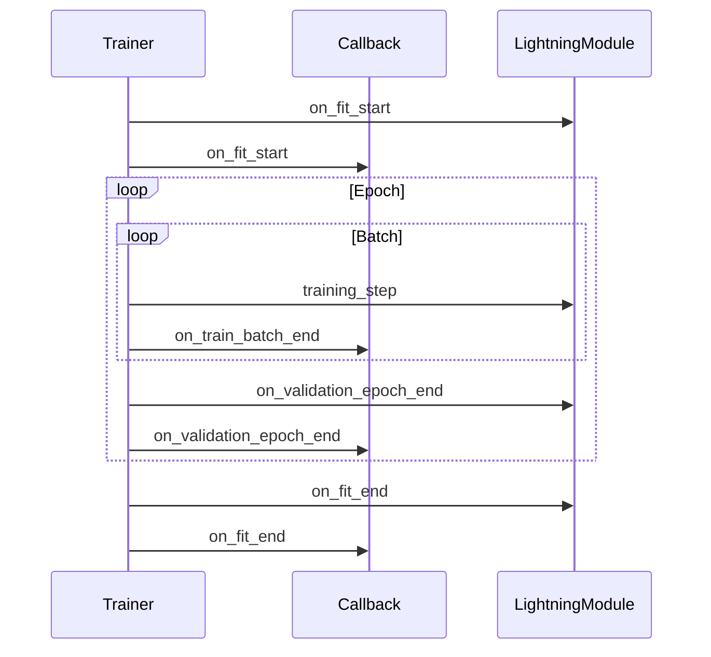

# Recommended Patterns

This guide covers the recommended patterns for developing with PyTorch Lightning. Following these patterns ensures maintainable, reproducible, and research-focused code.

## Keep LightningModule Focused on Research

The `LightningModule` should contain only research-specific logic. Delegate all engineering concerns to the Trainer, callbacks, or external tools.

### What Belongs in LightningModule

```python
class MyModel(L.LightningModule):
    def __init__(self, learning_rate: float):
        super().__init__()
        self.save_hyperparameters()
        self.encoder = Encoder()
        self.decoder = Decoder()

    def forward(self, x):
        return self.encoder(x)

    def training_step(self, batch, batch_idx):
        # Research-specific loss computation
        x, y = batch
        pred = self(x)
        loss = self.compute_research_loss(pred, y)
        self.log("train_loss", loss)
        return loss

    def configure_optimizers(self):
        return torch.optim.Adam(self.parameters(), lr=self.hparams.learning_rate)
```

### What Belongs Outside LightningModule

| Concern | Location |
|---------|----------|
| Checkpointing | `ModelCheckpoint` callback |
| Early stopping | `EarlyStopping` callback |
| Learning rate scheduling | `LearningRateMonitor` + Trainer |
| Gradient clipping | Trainer flags |
| Data preprocessing | `DataModule` |
| Experiment tracking | `MLflowLogger` / `TensorBoardLogger` |

:::tip[Single Responsibility]
If your LightningModule exceeds 200 lines, it likely contains non-research logic. Extract data handling, logging, or callbacks.
:::

---

## Use Callbacks for Cross-Cutting Concerns

Callbacks handle functionality that applies across multiple training runs. Never hardcode this logic in LightningModule.

### Common Built-in Callbacks

```python
from lightning.pytorch.callbacks import (
    ModelCheckpoint,
    EarlyStopping,
    LearningRateMonitor,
    DeviceStatsMonitor,
)

callbacks = [
    # Save best model based on validation loss
    ModelCheckpoint(
        dirpath="./checkpoints",
        filename="best-{epoch:02d}-{val_loss:.2f}",
        monitor="val_loss",
        mode="min",
        save_top_k=3,
    ),
    # Stop if no improvement for 3 epochs
    EarlyStopping(
        monitor="val_loss",
        patience=3,
        mode="min",
    ),
    # Log learning rate schedule
    LearningRateMonitor(log_interval="step"),
    # Log GPU memory usage
    DeviceStatsMonitor(),
]

trainer = L.Trainer(
    callbacks=callbacks,
    # ...
)
```

### Custom Callbacks

```python
class CustomMetricLogger(L.Callback):
    def __init__(self, log_every_n_steps: int = 100):
        self.log_every_n_steps = log_every_n_steps

    def on_train_batch_end(self, trainer, pl_module, outputs, batch, batch_idx):
        if batch_idx % self.log_every_n_steps == 0:
            # Custom logging logic
            pass
```

### Callback Execution Order



:::info[Callback Return Values]
Callbacks cannot alter training behavior directly. Use hooks to trigger side effects (logging, checkpoints). Return values from `training_step` control the training loop.
:::

---

## Use Hydra for Experiment Management

Hydra manages configuration and experiment runs. Combine with Lightning for reproducible research.

### Recommended Config Structure

```
config/
├── train.yaml              # Main config
├── model/
│   ├── transformer.yaml
│   └── resnet.yaml
├── data/
│   ├── cifar10.yaml
│   └── imagenet.yaml
└── trainer/
    ├── default.yaml
    └── debug.yaml
```

### Main Config with Defaults

```yaml
# config/train.yaml
defaults:
  - _self_
  - model: transformer
  - data: cifar10
  - trainer: default

model:
  learning_rate: 1e-3
  dropout: 0.1

data:
  batch_size: 32
  num_workers: 4

trainer:
  max_epochs: 100
  accelerator: auto
```

### Training Entry Point

```python
# train.py
import hydra
from omegaconf import DictConfig
import lightning as L


@hydra.main(version_base=None, config_path="config", config_name="train")
def main(cfg: DictConfig):
    dm = create_datamodule(cfg.data)
    model = create_model(cfg.model)

    trainer = L.Trainer(**cfg.trainer)
    trainer.fit(model, dm)


if __name__ == "__main__":
    main()
```

### Command Line Overrides

```bash
# Override learning rate
python train.py model.learning_rate=3e-4

# Override model architecture
python train.py model=resnet data=imagenet

# Override multiple parameters
python train.py model.learning_rate=1e-4 trainer.max_epochs=50
```

:::tip[Hydra + Lightning]
Use `@hydra.main()` decorator on the training function. Pass `cfg` parameters directly to Lightning components via `**cfg.group`.
:::

---

## Use TorchMetrics

TorchMetrics provides standardized metric computation with proper synchronization for distributed training.

### Recommended Metrics Usage

```python
import torchmetrics
import lightning as L


class MyModel(L.LightningModule):
    def __init__(self):
        super().__init__()
        self.accuracy = torchmetrics.Accuracy(task="multiclass", num_classes=10)
        self.f1 = torchmetrics.F1Score(task="multiclass", num_classes=10)
        self.confusion = torchmetrics.ConfusionMatrix(num_classes=10)

    def validation_step(self, batch, batch_idx):
        x, y = batch
        pred = self(x)

        # Update metric states
        self.accuracy(pred, y)
        self.f1(pred, y)
        self.confusion(pred, y)

        # Log computed values
        self.log("val_acc", self.accuracy, prog_bar=True)
        self.log("val_f1", self.f1, prog_bar=True)

    def on_validation_epoch_end(self):
        # Log confusion matrix at epoch end
        self.log("confusion_matrix", self.confusion.compute())
```

### Metric Synchronization

In distributed training (DDP), metrics must be synchronized:

```python
# ❌ Wrong: Not synchronized across devices
def validation_step(self, batch, batch_idx):
    pred = self(batch)
    acc = (pred.argmax() == batch[1]).mean()  # Only on single device

# ✅ Correct: Use sync_dist for distributed synchronization
def validation_step(self, batch, batch_idx):
    pred = self(batch)
    acc = (pred.argmax() == batch[1]).float()
    self.log("val_acc", acc, sync_dist=True, reduce_epoch=True)
```

### Common Metrics

| Metric | Use Case | Distributed Support |
|--------|----------|---------------------|
| `Accuracy` | Classification accuracy | ✓ |
| `F1Score` | F1 score | ✓ |
| `AUROC` | ROC AUC | ✓ |
| `MeanAbsoluteError` | Regression MAE | ✓ |
| `ConfusionMatrix` | Confusion matrix | ✓ |

:::caution[Metric State Reset]
Always reset metric states in `on_validation_epoch_end()` or at the start of validation:
```python
def on_validation_epoch_end(self):
    self.accuracy.reset()
```
:::

---

## Debugging Strategies

Lightning provides built-in debugging flags for rapid iteration.

### Fast Dev Run

Test the full pipeline with a single batch:

```python
trainer = L.Trainer(fast_dev_run=True)
# Runs: 1 training step + 1 validation step
```

### Overfit Batches

Verify the model can overfit a small dataset:

```python
trainer = L.Trainer(
    overfit_batches=5,  # Use 5 batches for overfitting
)
# If loss doesn't go to near-zero, model capacity is insufficient
```

### Limit Batches

Limit batches for quick iteration:

```python
trainer = L.Trainer(
    limit_train_batches=100,  # Use first 100 batches
    limit_val_batches=50,     # Use first 50 validation batches
)
```

### Detect Anomalies

Enable gradient anomaly detection:

```python
trainer = L.Trainer(
    gradient_clip_val=1.0,
    detect_anomaly=True,  # Raises RuntimeError on NaN/Inf gradients
)
```

### Debugging Summary

| Flag | Purpose | Speed |
|------|---------|-------|
| `fast_dev_run` | Test full pipeline | Fastest |
| `overfit_batches` | Verify model capacity | Fast |
| `limit_train_batches` | Limit training iterations | Fast |
| `detect_anomaly` | Find gradient issues | Normal |

:::tip[Recommended Workflow]
1. Start with `fast_dev_run=True` to verify no errors
2. Use `overfit_batches=5` to confirm model can learn
3. Remove flags for full training
:::

---

## Testing DataModules

DataModules should be tested independently of the model.

### Test Data Loading

```python
def test_mnist_data_module():
    dm = MNISTDataModule(data_dir="./test_data", batch_size=32)
    dm.setup("fit")

    train_loader = dm.train_dataloader()
    batch = next(iter(train_loader))

    # Verify batch structure
    assert len(batch) == 2
    images, labels = batch
    assert images.shape[0] == 32  # batch size
    assert images.shape[1:] == (1, 28, 28)  # MNIST shape
    assert labels.shape[0] == 32
```

### Test Data Augmentation

```python
def test_data_augmentation():
    import torchvision.transforms as T

    transform = T.Compose([
        T.RandomHorizontalFlip(),
        T.ToTensor(),
    ])

    dataset = MNIST(root="./test_data", transform=transform, download=True)
    sample = dataset[0]

    # Verify transform is applied
    assert isinstance(sample[0], torch.Tensor)
```

### Test Reproducibility

```python
def test_deterministic_split():
    import torch

    # Set seeds for reproducibility
    torch.manual_seed(42)
    dm = MNISTDataModule()
    dm.setup("fit")

    # Save first validation sample
    val_loader = dm.val_dataloader()
    first_sample = next(iter(val_loader))

    # Reset with same seed
    torch.manual_seed(42)
    dm2 = MNISTDataModule()
    dm2.setup("fit")

    val_loader2 = dm2.val_dataloader()
    first_sample2 = next(iter(val_loader2))

    # Verify same split
    assert torch.equal(first_sample[1], first_sample2[1])
```

---

## Logging Best Practices

### Consistent Naming

```python
def training_step(self, batch, batch_idx):
    # ✅ Consistent: prefix all metrics with stage
    self.log("train/loss", loss)
    self.log("train/accuracy", acc)

def validation_step(self, batch, batch_idx):
    # ✅ Consistent: separate train/val namespaces
    self.log("val/loss", loss)
    self.log("val/accuracy", acc)
```

### Log at Appropriate Frequencies

```python
def training_step(self, batch, batch_idx):
    loss = self.compute_loss(batch)

    # Log every step for training loss
    self.log("train/loss", loss, on_step=True, on_epoch=False, prog_bar=True)

    return loss


def validation_step(self, batch, batch_idx):
    # Log at epoch end for validation
    self.log("val/loss", loss, on_step=False, on_epoch=True)
```

### Logging Summary

| Scenario | `on_step` | `on_epoch` | `prog_bar` |
|----------|-----------|------------|------------|
| Training loss | ✓ | | |
| Validation loss | | ✓ | ✓ |
| Learning rate | ✓ | | ✓ |
| Metrics (epoch) | | ✓ | ✓ |

---

## Quick Reference: Pattern Summary

| Pattern | Recommended | Location |
|---------|--------------|----------|
| Model logic | Research only | LightningModule |
| Checkpointing | Callback | `ModelCheckpoint` |
| Early stopping | Callback | `EarlyStopping` |
| LR scheduling | Built-in | Trainer |
| Configuration | Hydra | Config files |
| Metrics | TorchMetrics | LightningModule |
| Debugging | Flags | Trainer |
| Data handling | DataModule | DataModule |

---

## Next Steps

- [Anti-Patterns](./02-anti-patterns.mdx) — Patterns to avoid
- [Template Repository](https://github.com/SAILTECHTEAM/pytorch-lightning-hydra-template) — Complete working examples