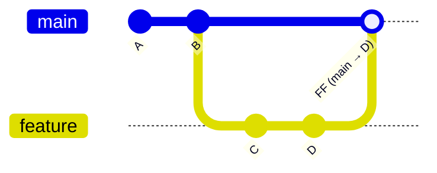
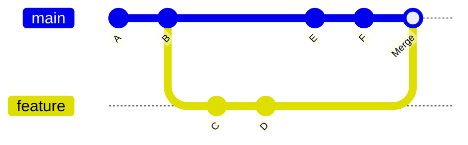
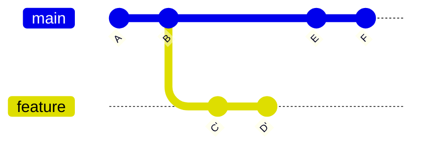
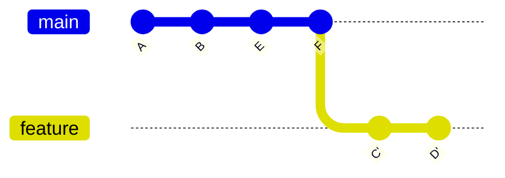
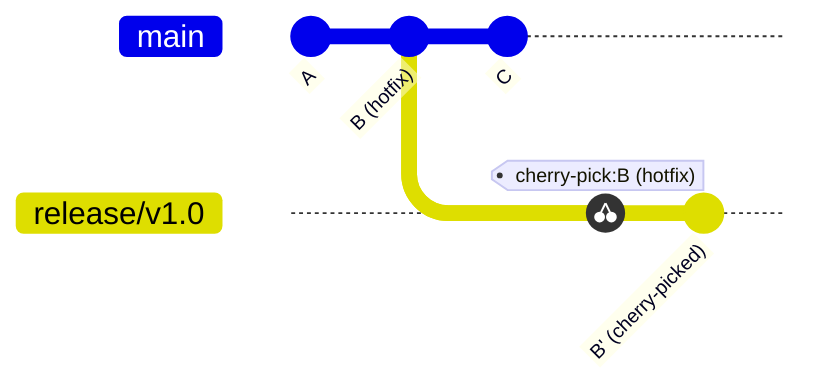
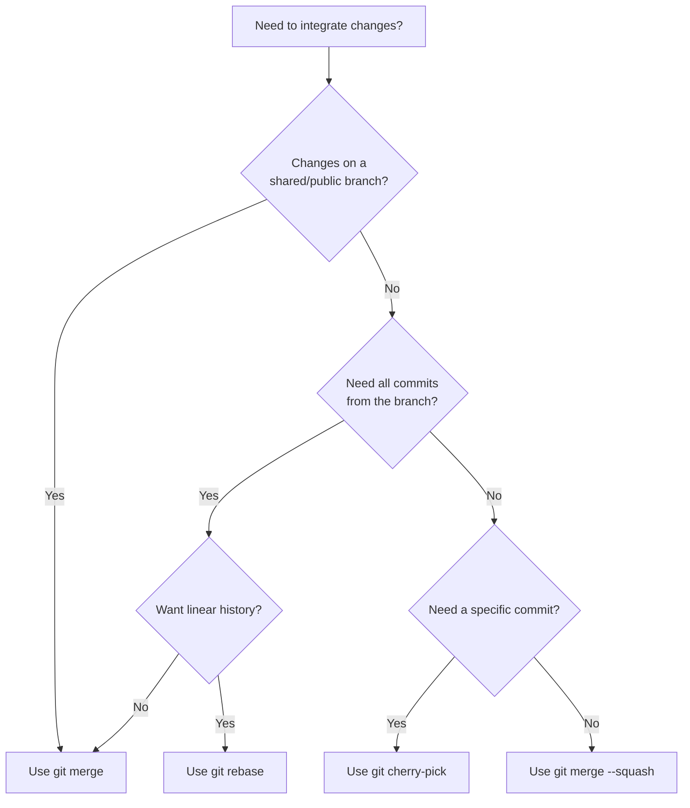

# Merge, Rebase & Cherry-Pick

**Integrating Changes and Rewriting History the Right Way**

`merge`, `rebase`, and `cherry-pick` are the three primary mechanisms for moving commits between branches in Git. Understanding when and how to use each is essential for maintaining a clean, readable commit history in collaborative projects.

---

## Quick Comparison

| Aspect | `merge` | `rebase` | `cherry-pick` |
| :--- | :--- | :--- | :--- |
| **What it does** | Combines branches with a merge commit | Replays commits onto a new base | Applies specific commits to another branch |
| **History** | Preserves branch topology | Creates a linear history | Copies individual commits |
| **Rewrites history** | No | Yes | No (creates new commits) |
| **Safe on shared branches** | Yes | **No** | Yes |
| **Best for** | Integrating feature branches | Cleaning up local commits | Hotfix porting, selective backports |

---

## Git Merge

Merge joins two development histories together. It is the most common way to integrate changes from one branch into another.

### Fast-Forward Merge

When the target branch has no new commits since the source branch diverged, Git performs a **fast-forward** merge — it simply moves the branch pointer forward.



```bash
git checkout main
git merge feature
# Result: main now points to D, no merge commit created
```

### Three-Way Merge (No Fast-Forward)

When both branches have diverged, Git creates a **merge commit** that ties the two histories together. A merge commit has two parent commits.



```bash
git checkout main
git merge feature
# Creates a merge commit with parents B (main) and D (feature)
```

### Force a Merge Commit with `--no-ff`

Even when a fast-forward is possible, you can force a merge commit to preserve the branch topology.

```bash
git merge --no-ff feature
```

:::tip[Why `--no-ff`?]
A merge commit acts as a **bookmark** that groups all commits from a feature branch. This makes `git revert` easier — you can revert an entire feature by reverting a single merge commit:

```bash
git revert -m 1 <merge-commit-hash>
```
:::

### Resolving Merge Conflicts

When both branches modify the same lines, Git cannot automatically merge and will pause for manual resolution.

```bash
git merge feature
# CONFLICT (content): Merge conflict in src/app.py
# Automatic merge failed; fix conflicts and then commit.
```

**Resolution steps:**

1. Open the conflicted file and look for conflict markers:

```python
<<<<<<< HEAD (main)
def greet(name):
    return f"Hello, {name}!"
=======
def greet(name, title):
    return f"Hello, {title} {name}!"
>>>>>>> feature
```

2. Edit the file to the desired final state, removing the markers.
3. Stage and complete the merge:

```bash
git add src/app.py
git merge --continue
# Or: git commit (older Git versions)
```

**Abort a merge** if things go wrong:

```bash
git merge --abort
```

---

## Git Rebase

Rebase re-applies your commits on top of another branch, producing a **linear history**. Instead of creating a merge commit, it moves the entire branch to begin at a new base.

### Basic Rebase



```bash
# Before rebase: feature diverges from B
git checkout feature
git rebase main

# After rebase: feature commits C', D' are replayed on top of F
# The branch is now linear with main
```



:::danger[Golden Rule of Rebase]
**Never rebase commits that have been pushed to a shared branch.**

Rebasing rewrites commit hashes. If others have based work on the original commits, their history will diverge, causing confusion and duplicate commits. Only rebase your **local, unpublished** branches.
:::

### Interactive Rebase (`-i`)

Interactive rebase is a powerful tool for cleaning up commits before merging. It lets you reorder, squash, edit, or drop commits.

```bash
git rebase -i HEAD~4
```

This opens an editor with the last 4 commits:

```
pick a1b2c3d feat: add login form
pick e4f5g6h fix: typo in login form
pick i7j8k9l feat: add form validation
pick m0n1o2p fix: validation edge case
```

#### Available Operations

| Command | Effect |
| :--- | :--- |
| `pick` | Keep the commit as-is |
| `reword` | Keep the commit but edit the message |
| `edit` | Pause at this commit for amending |
| `squash` | Merge into the previous commit (combine messages) |
| `fixup` | Merge into the previous commit (discard this message) |
| `drop` | Remove the commit entirely |
| `exec` | Run a shell command after applying the commit |

#### Common Patterns

**Squash related fix commits:**

```
pick a1b2c3d feat: add login form
fixup e4f5g6h fix: typo in login form
pick i7j8k9l feat: add form validation
fixup m0n1o2p fix: validation edge case
```

Result: Two clean commits — `feat: add login form` and `feat: add form validation`.

**Reorder commits:**

```
pick i7j8k9l feat: add form validation
pick a1b2c3d feat: add login form
```

Just reorder the lines in the editor.

:::caution[Conflict During Rebase]
Interactive rebase can produce conflicts when commits are reordered or squashed. Resolve each conflict, then:

```bash
git add <file>
git rebase --continue
```

To abort at any point:

```bash
git rebase --abort
```
:::

### Rebase vs Merge: When to Use Which

| Scenario | Recommendation |
| :--- | :--- |
| Feature branch → `main` (team uses merge) | `merge --no-ff` |
| Feature branch → `main` (team uses rebase/squash) | `rebase -i` then merge |
| Updating feature branch with latest `main` | `rebase main` (local only) |
| Shared/public branch integration | `merge` (never rebase) |
| Preserving exact history for audit | `merge` |
| Clean, linear history desired | `rebase` |

---

## Git Cherry-Pick

Cherry-pick applies the changes from a specific commit onto your current branch. It creates a **new commit** with a new hash, even though the changes are identical.

### Basic Usage

```bash
# Apply a single commit to the current branch
git cherry-pick <commit-hash>

# Apply multiple commits
git cherry-pick <hash1> <hash2> <hash3>

# Apply a range of commits
git cherry-pick <start-hash>..<end-hash>
```

### Use Cases

**1. Hotfix backport**

A bug fix was committed to `main` but also needed in the `release/v1.0` branch:

```bash
git checkout release/v1.0
git cherry-pick <hotfix-commit-hash>
```



**2. Pull a single feature to another branch**

A commit from one feature branch is needed in another, without merging the entire branch:

```bash
git checkout feature/payment
git cherry-pick <useful-commit-from-feature-auth>
```

**3. Recover a lost commit**

If you accidentally deleted a branch or dropped a commit during rebase:

```bash
git reflog
# Find the lost commit hash
git cherry-pick <lost-hash>
```

### Cherry-Pick Options

| Flag | Purpose |
| :--- | :--- |
| `-n` / `--no-commit` | Apply changes to the working tree without creating a commit |
| `-x` | Add `(cherry picked from commit ...)` to the commit message |
| `--edit` / `-e` | Open editor to modify the commit message before committing |
| `-m <parent>` | Specify the parent number when cherry-picking a merge commit |

:::tip[Use `-x` for Traceability]
When cherry-picking between shared branches, always use `-x` to record where the commit originated. This helps future debugging:

```bash
git cherry-pick -x <hash>
# Commit message will include:
# (cherry picked from commit abc1234)
```
:::

### Resolving Cherry-Pick Conflicts

Cherry-pick can produce conflicts just like merge:

```bash
git cherry-pick <hash>
# error: could not apply abc1234...
```

**Resolution steps:**

1. Resolve conflicts in the affected files.
2. Stage and continue:

```bash
git add <file>
git cherry-pick --continue
```

Or abort entirely:

```bash
git cherry-pick --abort
```

---

## Decision Flowchart

Not sure which command to use? Follow this guide:



---

## Practical Recipes

### Update Feature Branch with Latest `main`

```bash
# Option A: Rebase (clean history, local branch only)
git checkout feature/my-feature
git fetch origin
git rebase origin/main

# Option B: Merge (preserves history, safe for shared branches)
git checkout feature/my-feature
git fetch origin
git merge origin/main
```

### Squash a Feature Branch Before Merging

```bash
git checkout main
git merge --squash feature/my-feature
git commit -m "feat: add user authentication system"
```

This takes all commits from `feature/my-feature` and stages them as a single changeset.

### Cherry-Pick a Merge Commit

Merge commits have two parents. You must specify which parent to use with `-m`:

```bash
# -m 1 means "the changes relative to the first parent (main)"
git cherry-pick -m 1 <merge-commit-hash>
```

---

## Summary

| Command | Core Purpose | Key Rule |
| :--- | :--- | :--- |
| `merge` | Integrate branches, preserving topology | Default choice for shared branches |
| `rebase` | Reapply commits for linear history | Only rebase local/unpublished commits |
| `cherry-pick` | Apply specific commits to another branch | Use `-x` for traceability |

Choose based on your workflow: **merge** for safety and traceability, **rebase** for cleanliness and readability, **cherry-pick** for surgical precision.
