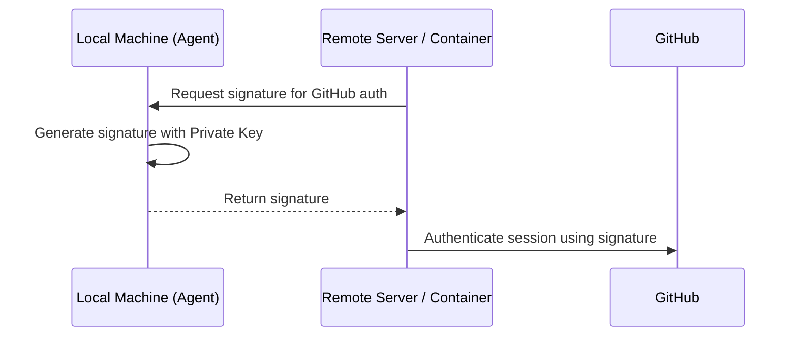

# SSH Access Security

Secure access to remote servers and Git repositories is fundamentally built on the **SSH (Secure Shell)** protocol. We utilize asymmetric cryptography to ensure that authentication credentials are never transmitted over the network and remain stored exclusively on your local machine.

## SSH Cryptography Fundamentals

SSH authentication relies on a **public-key pair** consisting of two mathematically linked files.

| Component | Default Path | Purpose |
| :--- | :--- | :--- |
| **Private Key** | `~/.ssh/id_ed25519` | **Restricted Access.** Stored on your local machine only. |
| **Public Key** | `~/.ssh/id_ed25519.pub` | **Public Distribution.** Distributed to servers and GitHub. |

:::tip[Algorithm Recommendation]
We standardize on the **Ed25519** algorithm for all new key pairs. It provides superior performance and higher security compared to older RSA standards.
:::

---

## Infrastructure Setup Guide

### Generating a Key Pair
Execute the following command to generate a new key pair:
```bash
ssh-keygen -t ed25519 -C "your_email@example.com"
```
:::note[Passphrase Handling]
Accept the default storage path and provide a strong passphrase for local encryption.
:::

### Managing with SSH Agent
Use the SSH agent to manage decrypted keys in memory, eliminating the need to re-enter passphrases for every connection.
```bash
# Initialize the SSH agent
eval "$(ssh-agent -s)"

# Register the private key with the agent
ssh-add ~/.ssh/id_ed25519
```

### Integration with GitHub
Retrieve your public key and add it to your profile under **GitHub Settings → SSH and GPG keys**.
```bash
# Copy to clipboard or display public key
cat ~/.ssh/id_ed25519.pub
```

### Connectivity Verification
```bash
ssh -T git@github.com
# Expected output: "Hi <username>! You've successfully authenticated..."
```

---

## Advanced Workflow: Agent Forwarding

**Agent Forwarding** enables the use of local SSH keys within remote sessions (e.g., inside a server or a Docker container) without copying private keys to those environments.

### Authentication Workflow



### Docker Implementation
Mount the host's SSH agent socket to enable forwarding inside a container:
```bash
docker run -it \
  -v $SSH_AUTH_SOCK:/run/host-services/ssh-auth.sock \
  -e SSH_AUTH_SOCK=/run/host-services/ssh-auth.sock \
  my-engineering-image bash
```

:::caution[Security Protocol]
Only utilize agent forwarding when connecting to **trusted** infrastructure. A compromised remote root user could potentially use your forwarded agent socket to authenticate as you.
:::

---

## SSH Configuration Strategy

Optimize connection workflows by defining host aliases in `~/.ssh/config`:

```text title="~/.ssh/config"
Host production-server
    HostName 10.0.0.50
    User deploy-user
    ForwardAgent yes
    IdentityFile ~/.ssh/id_ed25519
```
*Workflow efficiency:* Execute `ssh production-server` to connect without manually specifying parameters.

---

## GitHub Deploy Keys

A **Deploy Key** is an SSH public key bound to a **single repository** on GitHub. Each key grants access only to the repository it is attached to, and the permission is either **read-only** or **read & write**. It is not the same model as a **Fine-grained Personal Access Token (PAT)**, which authorizes individual resource types such as `Issues` or `Contents`.

Use a Deploy Key when a server, CI runner, or local machine needs a dedicated SSH key for exactly one repository:

- **Clone / fetch / pull** — use a read-only Deploy Key.
- **Push build artifacts or deployment configuration** — use a Deploy Key with write permission.
- Do **not** reuse the same Deploy Key across multiple GitHub repositories; GitHub requires one key per repository.

The example below targets the repository:

```text
github.com/acme/demo.git
```

and generates a dedicated key:

```text
~/.ssh/id_ed25519_acme_demo
```

### Generate the Deploy Key

Run this on the machine, server, or CI runner that needs access to the repository:

```bash
mkdir -p ~/.ssh
chmod 700 ~/.ssh

ssh-keygen -t ed25519 \
  -C "deploy-key-acme-demo" \
  -f ~/.ssh/id_ed25519_acme_demo
```

`ssh-keygen` prompts for a passphrase:

```text
Enter passphrase (empty for no passphrase):
```

- **Personal workstation** — set a strong passphrase.
- **Unattended CI / deployment host** — typically leave the passphrase empty, store the private key as an encrypted secret on the platform, and strictly limit who can read that secret.

The command produces two files:

```text
~/.ssh/id_ed25519_acme_demo       # Private key — never upload or commit
~/.ssh/id_ed25519_acme_demo.pub   # Public key — to be added on GitHub
```

Display and copy the public key:

```bash
cat ~/.ssh/id_ed25519_acme_demo.pub
```

The private key must be readable only by the current user:

```bash
chmod 600 ~/.ssh/id_ed25519_acme_demo
```

### Attach the Key to the Repository

In the GitHub web UI, open the target repository **`acme/demo`**:

1. Click **Settings**.
2. In the left sidebar, click **Deploy keys**.
3. Click **Add deploy key**.
4. Enter a title, for example `prod-server-demo-readonly`.
5. Paste the full contents of `id_ed25519_acme_demo.pub` into the **Key** field.
6. Select the permission:
   - **Leave `Allow write access` unchecked** — read-only, allows clone, fetch, and pull.
   - **Check `Allow write access`** — read & write, allows push.
7. Click **Add key** to save.

:::caution[Permission Scope]
A Deploy Key is a repository-scoped SSH key: it grants access to one repository only. With write permission enabled, the key can push to that repository, so enable write permission only when automated writes are required.
:::

:::note[Missing Settings Menu]
If you cannot see **Settings** or **Deploy keys** for the repository, you do not have sufficient administrative access. Ask a repository administrator to attach the public key.
:::

### Configure an SSH Alias

Edit the SSH client configuration:

```bash
nano ~/.ssh/config
```

Add the following block:

```text title="~/.ssh/config"
Host github-acme-demo
  HostName github.com
  User git
  IdentityFile ~/.ssh/id_ed25519_acme_demo
  IdentitiesOnly yes
```

Set the file permissions:

```bash
chmod 600 ~/.ssh/config
```

| Field | Purpose |
| :--- | :--- |
| `Host github-acme-demo` | Local alias; not a real GitHub domain. |
| `HostName github.com` | Actual SSH host for GitHub. |
| `User git` | GitHub SSH always uses the `git` user. |
| `IdentityFile ...` | Private key dedicated to this repository. |
| `IdentitiesOnly yes` | Force SSH to use only this key, preventing fallback to other agent keys. |

### Clone with the Dedicated Key

The clone URL **must** use the alias `github-acme-demo`, not `github.com`:

```bash
git clone git@github-acme-demo:acme/demo.git
```

After cloning, verify the remote:

```bash
cd demo
git remote -v
```

Expected output:

```text
origin  git@github-acme-demo:acme/demo.git (fetch)
origin  git@github-acme-demo:acme/demo.git (push)
```

Subsequent `git pull`, `git fetch`, and `git push` inside `demo` match `Host github-acme-demo` and therefore use `~/.ssh/id_ed25519_acme_demo`. Other repositories that still use `git@github.com:OWNER/REPO.git` are unaffected.

#### Existing Repository

If the repository was already cloned, change `origin` inside that repository:

```bash
cd /path/to/demo

git remote set-url origin git@github-acme-demo:acme/demo.git
git remote -v
```

This updates only the current repository's `.git/config` and leaves other local repositories untouched.

### Verify the Connection

Test that SSH actually uses the dedicated key:

```bash
ssh -T git@github-acme-demo
```

For detailed debug output:

```bash
ssh -vT git@github-acme-demo
```

The output should contain a line such as:

```text
Offering public key: /home/your-user/.ssh/id_ed25519_acme_demo
```

Then verify Git read access:

```bash
git ls-remote origin
```

For a read-only key:

```bash
git pull
```

succeeds, while

```bash
git push
```

is rejected by GitHub. If the key was attached with **Allow write access** enabled, `git push` succeeds.

### Troubleshooting

#### `Permission denied (publickey)`

Confirm the private key exists, has mode `600`, and that SSH picks up the correct config:

```bash
ssh -vT git@github-acme-demo
```

Verify the debug log mentions the dedicated key path:

```text
id_ed25519_acme_demo
```

If it does not, double-check that the `Host` name in `~/.ssh/config` exactly matches the hostname used in the Git remote URL.

#### Clone Still Uses the Default Key

This usually means the remote URL still reads:

```text
git@github.com:acme/demo.git
```

Rewrite it:

```bash
git remote set-url origin git@github-acme-demo:acme/demo.git
```

#### Push Fails

First check the repository's **Settings → Deploy keys** on GitHub and confirm the key has **Allow write access** enabled. Without it, a Deploy Key is read-only by design.

#### SSO with Organizations

Deploy Keys are managed independently of account-level SSH keys. If you instead use an account SSH key for an SSO-enabled organization, authorize it under **GitHub → SSH and GPG keys → Configure SSO → Authorize** for that organization.

---

:::tip[Best Practice]
Regularly audit your `~/.ssh/authorized_keys` file on remote servers to ensure only current, authorized keys are active.
:::
