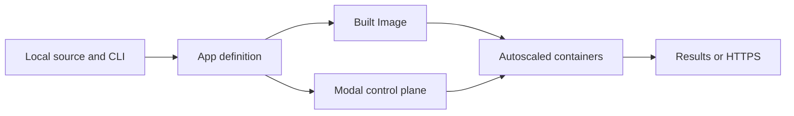

# Modal

Modal runs Python functions in managed, autoscaling containers. Use it for parallel batch work, machine-learning training or inference, scheduled jobs, and HTTP services when operating a cluster would add more work than value. It is less suitable for small local jobs, workloads that need host-level control, or systems already served well by existing infrastructure.

## Execution Model

A Modal program declares its application and container requirements in Python. The CLI sends that definition to Modal, which builds the Image and starts containers when a Function receives work. Functions scale independently and normally scale to zero when idle.



The four objects needed for most applications are:

- **App** groups Functions and container classes for an ephemeral run or atomic deployment.
- **Function** is a remotely executed unit with its own resources and scaling behaviour.
- **Image** defines the Python version, packages, system dependencies, and files available in a container.
- **Container class** groups remote methods that share container initialisation and state.

Volumes provide persistent files, while Secrets inject sensitive configuration into containers without placing it in source code.

:::caution[Local and Remote Imports]
Modal may import the same module locally and inside remote containers. Do not read local-only files unconditionally at module scope; pass data as arguments, add files to the Image, or use [`modal.is_local()`](https://modal.com/docs/guide/global-variables).
:::

## Run Parallel CPU Work

Create `modal_primes.py`. This complete example makes one blocking remote call, then distributes independent inputs with `.map()`:

```python title="modal_primes.py"
from math import isqrt

import modal

app = modal.App("modal-primes")
image = modal.Image.debian_slim(python_version="3.12")


@app.function(image=image, cpu=1)
def count_primes(limit: int) -> int:
    def is_prime(number: int) -> bool:
        if number < 2:
            return False
        return all(number % divisor for divisor in range(2, isqrt(number) + 1))

    return sum(is_prime(number) for number in range(limit))


@app.local_entrypoint()
def main():
    print(count_primes.remote(100_000))

    limits = [100_000, 110_000, 120_000]
    print(list(count_primes.map(limits)))
```

Install the client, authenticate, and run the application:

```bash
pip install modal
modal setup
modal run modal_primes.py
```

The local entrypoint runs on the local machine. `.remote()` waits for one remote result, while `.map()` processes inputs in parallel and yields results in input order.

## Core Features

### GPUs

Request a supported GPU for a Function or container class. Add GPU-compatible libraries, such as CUDA-enabled PyTorch, to its Image; requesting a GPU provides the hardware but does not install the software that uses it.

```python
@app.function(image=image, gpu="L4")
def train():
    run_training()
```

`gpu="L4"` gives each active container serving this Function an L4 GPU. Modal may reuse a warm container across calls; if the Function scales out, every additional container receives its own GPU. Choose the GPU for measured memory and throughput requirements, not its headline specification.

### Container Class Lifecycle

Use a container class when each container should initialise expensive state once and reuse it across calls.

```python
@app.cls(gpu="L4")
class Model:
    @modal.enter()
    def load(self):
        self.model = load_model()

    @modal.method()
    def predict(self, prompt):
        return self.model.generate(prompt)
```

Calling `Model().predict.remote(prompt)` starts or reuses an L4-backed container.
`load()` runs once when each new container starts, and later calls handled by that container reuse the loaded model.

### Web Functions

Expose a Function over HTTPS with a web decorator. `modal serve` creates a development URL; `modal deploy` creates a persistent deployment.

```python
web_image = image.uv_pip_install("fastapi[standard]")


@app.function(image=web_image)
@modal.fastapi_endpoint(requires_proxy_auth=True)
def health():
    return {"status": "ok"}
```

`requires_proxy_auth=True` protects the endpoint with Modal proxy tokens. Without proxy or application authentication, Web Functions are publicly reachable.

### Schedules

Attach a schedule to a Function and deploy the App to activate it.

```python
@app.function(schedule=modal.Cron("0 8 * * 1", timezone="Asia/Shanghai"))
def weekly_refresh():
    print("Refresh the index")
```

Use `modal.Cron` for wall-clock schedules and `modal.Period` for intervals measured from deployment.

## Operational Considerations

- Remote arguments, results, and exceptions cross a serialised boundary. Pass storage references instead of large payloads.
- Cold-start time depends on Image size, initialisation, and hardware availability. Keep Images and startup work small.
- Container-local files are ephemeral, and mutable process state may survive between calls. Persist required state externally.
- Set timeouts and retries for failure-prone work, and protect every Web Function that is not intentionally public.
- Compute and storage are metered. Check [Modal pricing](https://modal.com/pricing) before choosing resources or warm containers.

## Further Reading

- [Apps, Functions, and entrypoints](https://modal.com/docs/guide/apps)
- [Images](https://modal.com/docs/guide/images)
- [GPU acceleration](https://modal.com/docs/guide/gpu)
- [Web Functions](https://modal.com/docs/guide/webhooks)
- [Volumes](https://modal.com/docs/guide/volumes)
