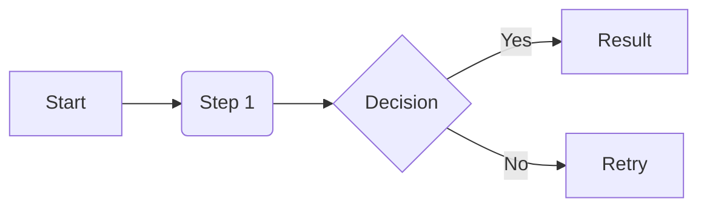

# Documentation Template

This document serves as a standard for all other documentation in this repository. Follow this structure to ensure consistency across the knowledge base.

## Frontmatter
Every `.mdx` file must start with a Frontmatter block:
```markdown
---
sidebar_position: 1
title: Page Title
description: A brief summary of the page (good for SEO and search).
---
```

## Using Admonitions
Use admonitions to highlight important information. Don't just use **bold** or *italic*.

:::info[General Information]
Use `info` for general informative notes.
:::

:::tip[Pro Tip]
Use `tip` for helpful advice or "best practice" shortcuts.
:::

:::note[Secondary Detail]
Use `note` for secondary details or context.
:::

:::caution[Attention Required]
Use `caution` for things that require the user's attention.
:::

:::danger[Critical]
Use `danger` for risks, destructive actions, or high-risk warnings.
:::

## Comparison Tables
When comparing tools or strategies, use a clear table:

| Dimension | Option A | Option B |
| :--- | :--- | :--- |
| **Speed** | Fast | Slow |
| **Complexity** | Low | High |

## Code Blocks

Use code blocks with language identifiers for syntax highlighting. Supported languages include `python`, `bash`, `toml`, `yaml`, `json`, `cpp`, `go`, `rust`, `java`, `mermaid`, `gitignore`, `text`, etc.

```bash
# Example command
pnpm add docusaurus
```

### Code Block Titles

Add a title to a code block using the `title` attribute. Use titles to label file names, tool names, or context — especially when the code block stands alone under a heading with no other body text.

````markdown
```toml title="pyproject.toml"
[tool.ruff]
line-length = 88
```
````

Renders as:

```toml title="pyproject.toml"
[tool.ruff]
line-length = 88
```

### When to Use Titles

- **File identity**: When the code block represents a specific file (e.g., `title="compose.yaml"`, `title="devcontainer.json"`).
- **Heading + code block only**: When a heading is immediately followed by a single code block with no other body text, replace the heading with a `title` attribute to reduce visual noise:

  Before (redundant heading):
  ````markdown
  ### Pyproject Configuration

  ```toml
  [tool.pytest.ini_options]
  testpaths = ["tests"]
  ```
  ````

  After (cleaner with title):
  ````markdown
  ```toml title="pyproject.toml — Pytest"
  [tool.pytest.ini_options]
  testpaths = ["tests"]
  ```
  ````

## Diagrams (Mermaid)
Prefer Mermaid diagrams over complex text descriptions for workflows.



## Tone and Voice
- **Objective**: Avoid "I think" or "In my opinion". Use "It is recommended" or "Best practice dictates".
- **Action-Oriented**: Use imperative verbs for steps (e.g., "Install the package" instead of "You should install the package").
- **Professional**: Keep the language technical and precise. Avoid slang or overly casual expressions.
