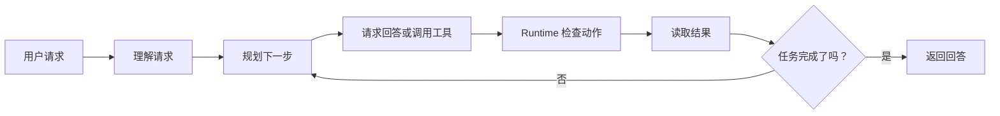
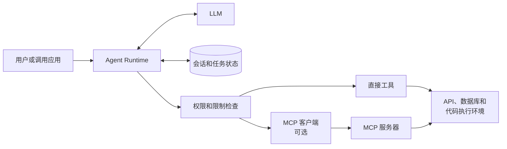
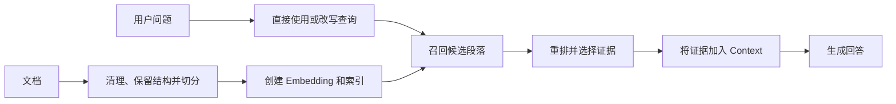

# Agent 系统概览

LLM 可以根据 Prompt 中的信息回答问题，但它不知道用户正在查看应用里的哪条记录，也不能独自修改那条记录。Agent 系统是围绕模型的应用程序，它以受控的方式让模型使用信息和外部能力。

:::info[本文范围]
本文把 **Agent 系统** 定义为“LLM 加上管理 Context、State 和可选工具的应用程序”。这是实用的工程定义，不是 Agent 的唯一理论定义。
:::

## 从一个简单请求开始

假设图书馆用户说：

> 帮我续借这本书。

单独的聊天模型无法完成这个请求。它不知道“这本书”指什么，不知道用户是否拥有这条借阅记录，也不知道图书馆是否允许再次续借。它同样无法修改图书馆记录。

Agent 系统可以找到当前借阅记录、检查规则、调用图书馆服务，并告知用户已经确认的结果。这项工作遵循一个循环。

**理解请求** 是识别用户、任务和已经掌握的信息。在这个例子中，系统利用会话和当前借阅数据，确定“这本书”的实际含义。

**规划下一步** 不一定是制定很长的计划。简单请求可能只需要一次工具调用；复杂请求可能需要多个清晰且可验证的步骤。关键在于每个步骤都有明确目的，并产生可供下一步使用的结果。

**行动和观察** 是指模型可以请求一项动作，系统执行获批准的动作，模型再收到结果。如果图书馆 API 返回续借次数已达上限，系统不会假称续借成功；它可以说明结果，或选择另一个允许的下一步。

有些问题不需要工具。例如“什么是借书证？”可以直接回答。相同的循环仍然适用：模型只是选择返回回答，而非请求动作。ReAct 是推理与工具使用模式的常见名称，但不是每个 Agent 都必须采用的方式。

系统还需要明确的停止规则。任务完成、后续动作不被允许、达到预算，或需要人工审查时，系统应停止。没有停止规则，失败的任务可能变成不断重复的工具调用和越来越没有根据的回答。

## Runtime 把任务组织起来

**Runtime** 是运行这个循环的应用程序部分，它不是另一个 LLM。它准备模型输入、保存任务信息、执行规则、调用工具，并决定任务何时结束。

Runtime 可以遵循固定规则、工作流，或两者结合。它不需要像模型一样“理解”请求。例如，固定规则可以读取当前用户的活跃借阅记录，再由模型判断用户是想续借、取消，还是查看其中某一条记录。

### Context：模型当前看到的信息

**Context** 是一次模型调用中发送给模型的选定信息。对于续借请求，它可以包含用户消息、选定借阅记录、续借政策、最近的对话，以及续借工具的说明。

Runtime 应选择对当前步骤有用的信息。把所有数据库记录、所有历史消息和所有可用工具都发送给模型，会让 Prompt 更难使用，也会消耗模型的 Context Window。Context Window 是模型单次调用可处理的输入和输出上限，不是 Memory 系统。

### Session 和 State：任务需要保存的信息

**Session** 标识一条正在进行的会话或任务。它让系统可以把“这本书”与同一交互中用户先前选择的图书关联起来。

**State** 是任务运行期间保存的结构化信息。当前借阅记录、用户权限、已经调用的工具和返回的到期日都属于 State。将这类数据保存在模型外部，Runtime 才能可靠地检查和更新它。

系统常把最近对话历史和临时任务数据称为“短期 Memory”或“工作 Memory”。名称各不相同，但目的相同：保存继续当前任务所需的信息，避免用户反复说明相同内容。

### Memory：以后可能有用的信息

**Memory** 是为了后续任务或会话而保存的信息。它可以保存用户的通知语言偏好、长对话的摘要，或数据库中的领域知识。

Memory 不会自动变成 Context。Runtime 会检索并选择相关部分。对于很长的对话，系统可以保存用户目标、限制条件和先前决定的摘要，而不是重复发送每一句话。摘要可以节省空间，但会遗漏细节；必要的重要事实和决定还应保存在可靠的结构化 State 中。

## 通过 Tool 执行动作

**Tool** 为 Agent 提供模型之外的具体能力：本地函数、SDK 调用、HTTP API、数据库查询、搜索服务或代码执行环境。在图书馆例子中，`renew_loan` 就是一个 Tool。

模型请求 Tool 前，Runtime 会向模型提供它的说明。说明通常包括 Tool 名称、用途和可接受的输入。模型返回结构化请求，例如借阅记录标识。随后 Runtime 验证请求、执行权限和业务检查、调用 Tool，并验证结果。

Tool 说明定义了当前任务中 Agent 的能力边界。模型只能请求 Runtime 已暴露的 Tool；它不会因为能够描述另一个动作就自动获得权限。例如，银行 Agent 不会因为知道如何点餐就能下食品订单，除非 Runtime 有意接入并授权了这项能力。

### 直接 Tool 与 MCP

Runtime 可以直接调用 Tool。当一个应用程序拥有少量自身的 API 或函数时，这通常是最清晰的选择。

[模型上下文协议（MCP）](https://modelcontextprotocol.io/specification/2026-07-28/architecture) 是另一种选择。作为 MCP Host 的应用程序创建客户端，并与 MCP Server 通信。Server 可以暴露 Tool、资源和提示。MCP Server 可以封装目录 API、文件系统或其他现有服务，让多个兼容应用程序使用它。

MCP 是应用程序与能力之间的连接协议，不替代业务逻辑、访问控制或 Runtime。从 MCP Server 读取到 Tool 说明，不代表用户已经获得调用它的授权。

| 选择 | 通常适合的场景 |
| :--- | :--- |
| 直接接入 Tool | 一个应用调用少量应用专属的函数或 API。 |
| 接入 MCP | 多个兼容 Host 需要通过一个标准 Server 接口共享能力。 |

两种方式可以同时存在于同一个 Agent 中。应根据所有权、复用需求和运行成本选择，而不是把 MCP 当成必经层。

## Skill 提供任务指导

有些任务不只需要 Tool 列表。处理支持请求可能有批准的流程、参考资料和仅适用于此类任务的脚本。每次请求都加载全部材料会浪费 Context，也会让模型更难选择。

**Skill** 将特定任务的指导打包，让系统在需要时加载。例如，分析 Excel 的 Skill 可以只在用户要求分析电子表格时，提供推荐流程、参考文件和可选脚本。

Skill 的格式取决于使用它的系统。[Agent Skills 规范](https://agentskills.io/specification) 定义的包可以包含 `SKILL.md`、参考资料、资源和脚本。Skill 本身不是 Tool 调用：它告诉 Agent 应如何处理工作，以及哪些资源可能有帮助。Runtime 仍然控制加载什么、执行什么。

Skill 与 MCP 解决的问题不同。Skill 提供任务指导；MCP 提供连接外部能力的标准方式。一个 Agent 可以同时使用两者，也可以只用其中一个，或两者都不用。

## RAG 让 Agent 使用文档

检索增强生成（RAG）帮助 LLM 根据训练数据之外的文档回答问题。例如，图书馆助手回答能否续借前，可以检索当前的续借政策。RAG 为模型提供证据；它不会改变模型权重，也不会自行执行外部动作。

RAG 系统既有用户提问前的准备工作，也有回答问题时的查询工作。

### 为检索准备文档

文档首先需要清理，并保留有用结构。标题、章节、日期、来源链接、访问规则和文档版本都可能帮助后续检索和引用。

长文档会被切分为 **Chunk**，让系统可以检索相关部分，而不是整篇文档。Chunk 太小可能丢失解释某个指代所需的句子；Chunk 太大可能混合无关主题，降低检索准确性。没有通用的最佳 Chunk 大小。应尽量按语义章节切分普通文本，保留代码、表格和列表的结构，再用真实问题评测结果。

### Embedding、召回与重排

**Embedding** 模型将 Chunk 和查询表示为向量，使系统能够搜索语义相关材料。它提供了有用的索引，但向量相似度本身不能证明某段内容回答了问题。需要精确术语、日期或访问规则时，关键词搜索、元数据过滤和混合检索可能改善结果。

查询时，系统可以直接用用户的问题搜索，也可以先改写、扩展或路由查询。选择取决于任务。召回通常尝试收集较广的一批候选内容；**Reranker** 再更仔细地评分这些候选，并选出应进入 Context 的较小集合。

模型应根据选定证据回答；当产品需要用户验证结果时，应保留引用。如果没有找到足够证据，系统应说明这一点，或执行预先定义的兜底路径。只有同时重视文档质量、检索质量和答案评测时，RAG 才能减少无依据的回答。

## 让系统保持受控

模型生成的 Tool 调用只是请求，不是授权。图书馆例子中，如果用户不是借阅人、有逾期项目或已达到续借上限，Runtime 必须拒绝续借。

相同原则适用于每一项敏感动作。认证、授权、输入校验、费用上限、重试上限和人工审批必须放在模型之外。Tool 结果也需要谨慎处理：它可能过期、格式错误，或含有与当前任务无关的文本。在将它们加入 Context 前，应把它们视为外部输入。

记录请求、选定 Context、Tool 调用、结果和最终回答。这样才能调查失败，并在具有代表性的工作负载下评估系统是否有用、安全、及时且成本可接受。

## 记住这几点

- Agent 系统由 LLM、Runtime、State 和可选能力组成。
- 模型提出下一步；Runtime 负责执行、停止规则和安全检查。
- Context 是一次模型调用的信息；Session、State 和 Memory 帮助系统持续构建有用的 Context。
- Tool 负责执行动作；Skill 提供任务指导；MCP 是一种能力接入方式；RAG 从文档中检索证据。

## 延伸阅读

- [Model Context Protocol Architecture](https://modelcontextprotocol.io/specification/2026-07-28/architecture)
- [Agent Skills Specification](https://agentskills.io/specification)
- [Retrieval-Augmented Generation for Knowledge-Intensive NLP Tasks](https://arxiv.org/abs/2005.11401)
