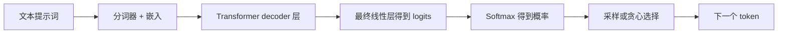

# LLM 推理原理

LLM 推理是将输入提示词转化为输出 token 的过程。在 decoder-only 语言模型中，要理解推理，最简单的方式是先看模型计算了什么，再将工作划分为两个阶段：**prefill** 和 **decode**。

## 现代 LLM 架构

大多数现代文本生成 LLM 都是 **decoder-only transformer**。之所以称为 decoder-only，是因为它们不断根据已存在的 token 预测下一个 token，而不是先编码一个输入序列、再解码出一个独立的输出序列。

宏观来看，一次推理请求在模型中是这样流动的：



Transformer decoder 堆栈是模型的主体。每一层重复着一小组运算，逐步将 token 表示变换为有利于预测下一个 token 的形式。

### 注意力

注意力是让 token 为自身构建上下文感知表示的机制。在 LLM 中，一个 token 本身并没有固定含义。例如“bank”一词，在“river bank（河岸）”和“bank account（银行账户）”中应当有不同的表示。注意力是模型利用周围序列来更新 token 表示的主要方式之一。

在 decoder-only 模型中，注意力通常是**因果的（causal）**。这意味着一个 token 可以关注自身及更早的 token，但不能关注后面的 token。因果性通过**注意力掩码（attention mask）**实现：在 softmax 之前，注意力分数矩阵中未来 token 的位置被赋予一个极大的负值。softmax 之后，这些被掩码的位置获得的注意力权重实际上为零。

这样做最清晰的原因出现在训练阶段。模型拿到的是完整文本序列，但它必须学会在不看到后续答案 token 的情况下预测每一个下一个 token。因果掩码正是为了防止这种未来 token 泄漏。

直观上，注意力在问：对于当前 token，哪些更早的 token 是相关的，应当从每个中取走多少信息？在短语“the capital of France is”中，最后一个 token 需要强烈依赖“capital”和“France”才能预测出合理的后续。注意力就是层中把这种相关性模式转化为数值的部分。


*图：针对提示词“the capital of France is”的一种因果自注意力模式的示意视图。权重为示意性，并非取自某次具体模型运行。*

标准的缩放点积注意力公式为：

$$
\operatorname{Attention}(Q,K,V)=\operatorname{softmax}\left(\frac{QK^\top}{\sqrt{d_k}} + M\right)V
$$

其中 $Q$ 是查询矩阵，$K$ 是键矩阵，$V$ 是值矩阵，$d_k$ 是单个注意力头的键/查询维度，$M$ 是注意力掩码。

矩阵乘法 $QK^\top$ 将查询与键做比较以产生注意力分数。除以 $\sqrt{d_k}$ 是为了在键维度增大时防止分数过大。掩码在 softmax 之前屏蔽非法位置。softmax 随后将分数转化为注意力权重，乘以 $V$ 则用这些权重对值向量做加权混合。

以上给出了注意力的直觉，但该公式引入了三个仍需单独解释的对象。下一步是理解 **query**、**key** 和 **value** 的含义。

### QKV 投影

注意力通过三个学习到的投影来计算：**query**、**key** 和 **value**。

在每一层，当前 token 向量 $X$ 会与训练好的权重矩阵相乘：

$$
Q = XW_Q,\quad K = XW_K,\quad V = XW_V
$$

矩阵 $W_Q$、$W_K$ 和 $W_V$ 在训练中学习。推理时它们是固定的模型权重。因此投影步骤仅仅是矩阵乘法，但学习到的矩阵让每个投影承担不同角色。

**query** 是“我在找什么？”这一视角。对于“the capital of France is”中的最后一个 token，其查询可能会寻找有助于补全该短语的信息，例如某个地点、某个主语，或一个合理的事实续接。

**key** 是“我包含什么？”这一视角。token“France”可能产生一个让寻找地点的查询容易与之匹配的键。token“capital”可能产生一个标记自身对“首都”关系很重要的键。

**value** 是“如果被关注，我应当传递什么信息？”这一视角。如果最后一个 token 强烈关注“France”，那么来自“France”的值向量就是被混入最后一个 token 更新后表示的一部分。键帮助判断一个 token 是否相关；值则提供实际被向前携带的信息。

### KV Cache

**KV cache** 存储已经计算过的键和值向量。其依据是计算复用：一旦模型为更早的 token 计算出了键和值，就不必在每次生成新输出 token 时重新计算。

在注意力计算中，新 token 需要将其查询与现有上下文的键做比较，再用得到的注意力权重从对应的值中读取。KV 缓存让这些已有的键和值在后续 decode 步骤中保持可用。

### MQA 与 GQA

大型 LLM 推理的瓶颈常常不仅是算术运算，还包括数据在 GPU 显存中搬运的速度。这在 decode 阶段尤为明显。每个新 token 都要读取模型权重，并在现有 KV cache 上做注意力。随着上下文增长，模型把更多时间花在把缓存的键和值从 GPU 显存搬运到注意力计算上。

标准的多头注意力为每个查询头分配各自的键头和值头。这表达力强，但也意味着 KV cache 必须为每个注意力头存储独立的键和值。KV 头越多，cache 内存越大，decode 时要读取的 KV 数据也越多。

**多查询注意力（MQA）**通过保留多个查询头、但在它们之间共享单一的键头和值头来降低这一开销。模型仍可通过不同的查询头提出多个不同问题，但这些查询读取的是同一组共享的键和值。这大幅降低了 KV-cache 的体积和 decode 时的 KV-cache 显存带宽，但由于所有头被迫关注完全相同的 Key-Value 表示，模型会损失相当多的细微差异，往往导致推理准确度和质量下降。

**分组查询注意力（GQA）**是标准多头注意力与 MQA 之间的折中。不是所有查询头共享一对 key/value，而是将查询头分成若干组，每组共享一个键头和一个值头。相比 MQA 它保留了更多 key/value 容量，同时相比完整多头注意力仍减少了 KV-cache 内存。

### 残差连接与归一化

残差连接在每个子层周围携带信息，归一化则保持激活的尺度稳定。这些细节在服务日志中不太显眼，但对于让深层 transformer 堆栈可靠地训练和运行至关重要。

最终的 token 向量被投影为一个词表大小的向量，称为 **logits**。每个 logit 是一个可能的下一个 token 的分数。随后服务系统使用某种解码规则选择下一个 token，例如贪心解码、温度采样、top-k 或 top-p 采样。

## Prefill 与 Decode

### 为什么将推理分成两个阶段？

推理通常被描述为两个阶段，因为提示词和输出可用性的方式不同。提示词在生成开始前就已知，所以推理引擎可以在一次大规模前向传播中一并处理所有提示 token。输出则不同：每个生成的 token 都依赖于在它之前生成的 token，所以输出生成必须一次一个 token 地进行。

这种划分在工程上很重要，因为 prefill 和 decode 对 GPU 施加的压力不同。Prefill 是在第一个输出 token 出现之前发生的大规模提示词处理步骤。Decode 是持续到模型达到停止条件的、反复进行的 token 生成循环。

### Prefill

Prefill 是对提示词的第一次前向传播。如果提示词有 $n$ 个 token，模型会一并处理这些提示 token，为每一层计算 Q、K、V，在提示词上运行因果自注意力，并创建初始的 KV cache。

生成 K 和 V 向量主要是投影工作。在模型宽度视为固定的前提下，这部分随提示词长度大致线性增长。更重的上下文长度压力来自提示词自注意力：提示 token 的查询与提示 token 的键做比较，产生的注意力分数模式中，其自注意力分量随提示词长度大致按 $O(n^2)$ 增长。

这就是为什么 prefill 通常是推理中对长提示词最敏感的部分。模型可以并行计算许多提示位置，但在返回第一个输出 token 之前仍必须完成提示词层面的注意力工作。

### Decode

Decode 是 prefill 之后的反复生成循环。
在每一步，模型生成一个新 token。
它为该新 token 计算 Q、K、V，用新的查询在来自提示词和先前输出 token 的缓存键值上做注意力，然后为下一个 token 的选择产生 logits。
token 被选定后，其自身的键和值会被追加到 KV cache。

有了 KV cache，模型不必在每一步重新计算完整提示词。对于当前上下文长度 $n$，一次 decode 步骤将新 token 与 $n$ 个缓存位置做比较，因此注意力部分大致按 $O(n)$ 增长。这就是为什么 decode 随上下文长度的增长通常比 prefill 温和得多，尽管长上下文仍会增加内存使用和内存带宽压力。

### 这为何影响 TTFT 与 TPOT

TTFT 受 prefill 强烈影响，因为模型必须处理提示词并构建初始 KV cache 后才能返回第一个输出 token。因此更长的提示词往往会增加 TTFT，尤其因为提示词自注意力包含二次项的 token 比较。

TPOT 主要受 decode 影响。一旦生成开始，每个新输出 token 由一次 decode 步骤产生。KV 缓存避免了重新计算完整提示词，所以 decode 随上下文长度的增长通常比 prefill 温和。然而，每次 decode 步骤仍要在现有缓存上做注意力，因此更长的上下文仍会通过额外的注意力读取和内存搬运来抬高 TPOT。


## 量化

模型权重通常以浮点格式训练和存储，如 FP32、FP16 或 BF16。这些格式能准确表示很多值，但占用大量内存。**量化（Quantisation）**通过用更少的位来存储权重、激活或两者，从而压缩模型。

基本思路是用一个小整数加上尺度信息来近似一个浮点数：

```text
浮点权重 ~= 尺度 * 整数权重
```

例如，不再把每个权重存为 16 位浮点值，量化后的检查点可能把一组权重存为 4 位整数并附上缩放因子。推理时，专用 kernel 直接使用这些低位权重，或在矩阵乘法中将其作为反量化的一部分。

### 仅权重量化

仅权重量化以更低精度存储模型权重，而激活通常仍保持 FP16 或 BF16。这在 LLM 部署中很常见，因为模型权重占用大量静态 GPU 内存。减小其体积可以让更大的模型塞进去，或为运行时和 KV cache 留出更多可用内存。

代价是矩阵乘法现在必须处理压缩权重和缩放因子。这是否提升速度取决于量化方法、kernel 支持、GPU 架构和 batch 形状。其可靠的主要收益是降低权重内存。

### 激活与 KV-Cache 量化

某些方法还会量化激活或 KV cache。激活量化可以减少计算中的内存搬运，但更难保持准确度，因为激活随每次输入而变化。KV-cache 量化针对 decode 时使用的已存储键和值，因此若模型和服务引擎支持，它有助于长上下文或高并发服务。

### 激活感知权重量化

**激活感知权重量化（AWQ）**是一种面向 LLM 的训练后、仅权重量化方法。“训练后”指模型在训练之后被量化，无需从头重训整个模型。“仅权重”指主要压缩目标是模型权重，而非每一个中间激活。

AWQ 出发于一个观察：一旦模型配合真实激活使用，并非所有权重同等重要。某些通道更重要，因为流经它们的激活更大或更具影响力。如果这些重要通道被量化得很差，模型质量会急剧下降。

AWQ 的流程大致如下：

1. 用一个小型校准数据集跑过模型，观察激活模式。
2. 利用这些激活统计量识别重要的权重通道。
3. 搜索逐通道的缩放因子，在量化前保护这些重要通道。
4. 以低位权重格式存储模型，常用 INT4，采用硬件友好的分组量化。

微妙之处在第 3 步。AWQ 在量化前重缩放通道，使重要通道承受更小的相对误差，同时仍将最终存储的权重保持在均匀的低位格式中。

## 延迟与吞吐量概念

最常见的服务指标把首 token 延迟、每 token 延迟和聚合吞吐量分开来看。

| 指标 | 含义 |
| :--- | :--- |
| TTFT | 首 token 时间。受 prefill 和排队强烈影响。 |
| TPOT | 生成开始后每个输出 token 的时间。反映单请求的 decode 速度。 |
| 输出 tokens/s | 跨所有请求每秒产出的输出 token 总数。 |
| VRAM 用量 | 来自权重、运行时开销、激活和 KV cache 的 GPU 内存压力。 |
| 失败计数 | 该服务形态是否可靠完成。 |

输出 tokens/s 可能在 TTFT 或 TPOT 变差的同时提升。这发生在 batch 让 GPU 跨多个请求产出更多总 token，而每个单独请求却等得更久或收 token 更慢的时候。

## 参考文献

- [Attention Is All You Need](https://arxiv.org/abs/1706.03762)
- [AWQ: Activation-aware Weight Quantization for LLM Compression and Acceleration](https://arxiv.org/abs/2306.00978)
- [vLLM quantisation documentation](https://docs.vllm.ai/en/latest/features/quantization/)
