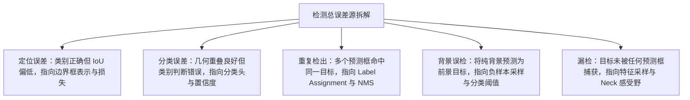

# 评价指标

在阅读目标检测文献时，许多读者在理解了模型架构之后，依然会在各种指标数字面前产生困惑。例如，两个模型的 mAP 相同，是否意味着两者的定位能力相当？AP50 极高而 AP75 偏低，暴露了模型的哪项短板？模型在训练时既然已经用到了 IoU 匹配，为什么评价时还要再运行一套基于置信度排序的匹配流程？

产生这些困惑的根源，在于混淆了模型架构的设计逻辑与评价协议的度量逻辑。评价协议是一条完全独立于具体检测器结构的度量链条。它从单框的几何重叠规则出发，通过置信度排序构建精确率—召回率曲线，再通过多重重叠阈值平均与面积拆分，将复杂的空间检测问题投射为一系列具有明确物理指向的标量。

本文作为《目标检测解构》系列的独立附录，专门厘清这一套评价度量体系，建立指标数值与前面各篇核心部件之间的对应关系。系列导引请参考[第 0 篇：架构拆解与核心部件](./deconstruction/architecture-overview)。

## 1. 目标检测任务需要度量什么

图像分类任务只需要判断整张图像的语义标签，其预测结果与真实标签是一对一的固定映射；而目标检测任务要求网络在未知数量、未知位置、未知尺寸的条件下，同时输出物体的空间包围盒与类别标签。

因此，一个合格的检测器评价体系不能只给出一个笼统的分数，它必须同时度量以下五个维度的表现，这五个维度直接对应了检测系统各部件的技术选择：

1. **位置准确性（Localization Accuracy）**：预测框与真实目标几何边界的贴合程度。该维度直接检验检测头对边界框的参数化表示与回归损失函数的设计效果，对应[第 4 篇：边界框表示与回归损失](./deconstruction/bbox-regression-loss)。
2. **类别正确性（Classification Correctness）**：模型在候选区域内识别语义类别的纯度与分类置信度的校准质量。该维度对应[第 5 篇：分类置信度与 Detection Head](./deconstruction/classification-head)中的分类损失与置信度设计。
3. **重复检出压制（Duplicate Suppression）**：模型对同一个真实目标是否输出了多个冗余预测框。这一表现直接受制于训练阶段的样本匹配策略以及推理阶段的非极大值抑制（NMS），对应[第 3 篇：Label Assignment](./deconstruction/label-assignment)。
4. **多尺度与密集分布下的完整性（Multi-scale Completeness）**：在极大、极小尺寸目标并存，或者小目标密集排列的场景下，模型能否无遗漏地检出目标。该维度主要考验多尺度特征金字塔的语义调度能力，对应[第 6 篇：多尺度特征与 Neck 架构](./deconstruction/neck-architecture)。
5. **部署与计算代价（Deployment Cost）**：模型在目标硬件上运行时的端到端延迟、参数量与计算复杂度。这决定了模型能否在实时场景中落地，直接受到骨干网络、Neck 拓扑以及是否包含 NMS 后处理的影响。

由于单一数值无法同时反映这五个维度的全部信息，检测评价协议发展出了一套分层的拆解机制。

## 2. 命中规则、匹配协议与平均方式

要理解检测指标，必须先厘清评价阶段的基本判别单元：一个预测框究竟在什么条件下才被算作“检测成功”。

### 2.1 交并比（IoU）与单框命中判定

目标检测使用交并比（Intersection over Union, IoU）作为衡量两个几何边界框重叠程度的基础度量。设预测框为 $B_p$，真实标注框（Ground Truth）为 $B_{gt}$，两者的 IoU 定义为交集面积除以并集面积：

$$
\text{IoU}(B_p, B_{gt}) = \frac{\text{Area}(B_p \cap B_{gt})}{\text{Area}(B_p \cup B_{gt})}
$$

在评价过程中，评测系统预先设定一个阈值 $\theta_{\text{IoU}}$（例如 0.50）。当且仅当一个预测框与真实框的类别一致，且两者的 $\text{IoU} \ge \theta_{\text{IoU}}$ 时，该预测框才具备被判定为真正例（True Positive, TP）的资格。

### 2.2 评价匹配与训练匹配的本质区别

许多初学者容易将评价阶段的 IoU 匹配与训练阶段的[第 3 篇：Label Assignment](./deconstruction/label-assignment)混为一谈。这两者虽然都使用 IoU 计算几何重叠，但所处的运行阶段、执行目的以及允许的操作完全不同：

- **训练匹配（Label Assignment）**：发生在网络反向传播前，运行在单张图像内。它的目的是为每一个预测载体（网格、锚框、特征点或 Query）指派监督信号（属于正样本还是负样本），告诉网络向哪个目标靠近。在密集预测网络（如 FCOS 或 Faster R-CNN RPN）中，训练匹配通常采用**一对多（One-to-Many）**分配协议，即一个真实目标可以同时指派给数十个空间位置重叠的预测单元进行学习。
- **评价匹配（Evaluation Matching）**：发生在网络推理生成全部预测结果之后，运行在整个测试集上。它的目的是审计模型的最终检出质量。评价协议严格执行**一对一（One-to-One）且按置信度贪心匹配**的规则：对于某一个真实目标，只允许全图置信度最高且满足 $\text{IoU} \ge \theta_{\text{IoU}}$ 的那一个预测框匹配为真正例（TP）；其余所有与该目标重叠的预测框，无论其预测概率多高，一律被判定为假正例（False Positive, FP）。

```text
推理输出的所有预测框
  │
  │（按类别分组，全数据集按置信度降序排序）
  ▼
[高置信度预测框] ──> 找到最大 IoU 的真实框
  │                    ├── IoU >= 阈值 且 真实框未被占用 ──> 判定为 TP（真实框标记为已占用）
  │                    ├── IoU >= 阈值 但 真实框已被占用 ──> 判定为 FP（重复检出）
  │                    └── IoU < 阈值                 ──> 判定为 FP（定位偏差或背景误检）
  ▼
未被任何预测框匹配的真实框 ──> 判定为 FN（漏检）
```

这一对比解释了为什么采用一对多训练匹配的检测器在推理时必须依赖 NMS：如果推理端不通过 NMS 压制掉同一目标周围的多余高分框，这些框在进入评价匹配流程时都会被判定为重复检出的 FP，从而直接拉低精确率数值。

### 2.3 精确率—召回率曲线（PR Curve）

在完成全数据集的预测框与真实框匹配后，评价系统将所有预测结果按分类置信度从高到低排列，截取不同的前 $k$ 个预测框，即可动态计算出不同置信度截断下的精确率（Precision）与召回率（Recall）：

$$
\text{Precision} = \frac{\text{TP}}{\text{TP} + \text{FP}}, \quad \text{Recall} = \frac{\text{TP}}{\text{TP} + \text{FN}}
$$

其中 $\text{TP} + \text{FN}$ 是数据集中该类别真实目标的总数，为一个固定常数。

当截取的预测框数量由少变多时，召回率单调递增，而精确率通常呈震荡下降趋势。以 Recall 为横轴、Precision 为纵轴绘制出的轨迹，即为精确率—召回率曲线（PR 曲线）。

### 2.4 平均精度（AP）与多阈值平均

平均精度（Average Precision, AP）本质上是 PR 曲线下的面积（Area Under Curve, AUC）。为了消除曲线震荡带来的数值不稳定性，标准做法会对 PR 曲线进行单调递减插值：在每一个召回率点 $r$，其实际采用的精确率取该点右侧所有精确率的最大值：

$$
p_{\text{interp}}(r) = \max_{\tilde{r} \ge r} p(\tilde{r})
$$

不同评测基准在计算 AP 时采用了不同的积分与阈值设定：

#### PASCAL VOC AP（单阈值评价）

- **定义**：在固定的单一重叠阈值（通常为 $\theta_{\text{IoU}} = 0.50$）下计算得到的单类别 PR 曲线面积。
- **回答的问题**：在较宽松的几何定位要求下，检测器能否在检出大部分目标的同时保持较低的误报率。
- **敏感的变化**：对大幅度的语义误检和完全漏检极为敏感，对边界框贴合像素精度的微小改进不敏感。
- **容易误导的情形**：当两个模型的 VOC AP 均为 85% 时，读者无法判断其中一个模型输出的框是仅仅轻微擦过目标（IoU=0.51），还是完美贴合物体轮廓（IoU=0.90）。只看该指标会高估粗糙定位模型的实际落地价值。

#### COCO AP / mAP（多阈值平均精度）

- **定义**：在 10 个均匀采样的 IoU 阈值（$\theta_{\text{IoU}} \in [0.50, 0.55, 0.60, \dots, 0.95]$，步长 0.05）下分别计算全类别 AP，并取全部阈值和全部类别的总平均值。
- **回答的问题**：在从粗糙到苛刻的连续定位精度要求下，检测器综合兼顾分类正确性与几何回归精度的整体能力。
- **敏感的变化**：对高质量边界框回归、高 IoU 区间的优化（例如引入 GIoU/CIoU 损失或更细致的特征对齐）高度敏感。
- **容易误导的情形**：多阈值平均抹平了极端区间的表现差异。一个在低阈值下召回率极高但在高阈值下表现疲软的模型，可能与另一个只输出少数高质量精准框的模型获得相同的综合 AP，但在实际业务中两者的行为模式完全不同。

#### AP50 与 AP75 的分工

- **AP50（$\text{AP}_{\text{IoU}=0.50}$）**：只考察粗粒度的语义检出能力。它主要回答“模型是否找对了大致区域”的问题，对分类特征判别力敏感，能够快速暴露语义混淆与背景误检。
- **AP75（$\text{AP}_{\text{IoU}=0.75}$）**：专门考察严苛定位条件下的高质量输出能力。它主要回答“模型回归的坐标边界是否严丝合缝”的问题，对边界框回归损失、特征采样点对齐质量以及高置信度框的几何质量极为敏感。

## 3. 尺寸拆分、召回率、长尾与速度代价

在综合 AP 之外，评测基准提供了一系列切片指标，用于精细化诊断模型在不同外部约束下的能力边界。

### 3.1 目标尺寸拆分指标（$AP_S, AP_M, AP_L$）

COCO 数据集根据真实标注框在原始图像中的绝对像素面积 $Area$，将所有目标严格划分为三个互不重叠的尺度区间：

- 小目标（Small）：$Area < 32^2 \text{ 像素}$
- 中目标（Medium）：$32^2 \le Area \le 96^2 \text{ 像素}$
- 大目标（Large）：$Area > 96^2 \text{ 像素}$

在评价时，评测系统仅在对应尺寸区间的子集上分别计算多阈值平均精度，得到 $AP_S$、$AP_M$ 与 $AP_L$。

#### 小目标平均精度（$AP_S$）

- **定义**：在像素面积小于 $32\times 32$ 的真实目标及其对应预测结果上计算的多阈值平均精度。
- **回答的问题**：检测器在空间分辨率严重退化、语义信息极度微弱的极限条件下，能否有效捕捉并定位微小物体。
- **敏感的变化**：对浅层高分辨率特征保留程度、特征金字塔自底向上路径的构建（如 PANet/BiFPN）、以及高步长下采样带来的空间信息损失极为敏感。
- **容易误导的情形**：只看 $AP_S$ 会掩盖模型在大尺度连续结构上的上下文建模缺陷；此外，对于标注噪声（人工标注重叠轻微漂移导致 IoU 剧烈下滑），小目标指标的波动幅度远大于大目标。

#### 大目标平均精度（$AP_L$）

- **定义**：在像素面积大于 $96\times 96$ 的真实目标及其对应预测结果上计算的多阈值平均精度。
- **回答的问题**：检测器在面对占据画面主体、感受野需求极大的目标时，能否完整覆盖整体结构而不产生碎片化截断。
- **敏感的变化**：对深层网络的全局感受野、Transformer 全局注意力机制、以及多尺度融合中的长距离依赖建模敏感。
- **容易误导的情形**：大目标通常在数据集中占比有限或语义过于显著，较高的 $AP_L$ 往往容易达成，容易掩盖模型在密集遮挡与小物体场景下的严重漏检。

### 3.2 平均召回率与最大检出上限（$AR_{\text{max}}$）

平均召回率（Average Recall, AR）是在给定的每张图像最大允许预测框数量上限（$\text{maxDets} \in \{1, 10, 100\}$）下，对所有类别和 $\text{IoU} \in [0.50, 0.95]$ 阈值求取的最大可能召回率平均值。

#### 最大检出 100 框平均召回率（$AR_{100}$ / $AR_{\text{max}}$）

- **定义**：每张图像最多保留 100 个最高置信度预测框时，在全 IoU 阈值区间内取得的平均召回率。
- **回答的问题**：检测系统的候选生成机制（如 RPN 提案或 Transformer Query）对场景中所有潜在目标的理论捕获上限是多少。
- **敏感的变化**：对预测载体的密集程度、前景负样本采样平衡策略、以及置信度阈值过滤的截断点敏感。
- **容易误导的情形**：$AR$ 完全不惩罚假正例（FP）的数量。一个毫无辨别能力、在背景区域密集散布成千上万个随机预测框的模型，只要预测数量足够多，就能获得极高的 $AR$，但其 AP 会接近归零。

:::caution[AR 不惩罚误报]
$AR$ 只统计真实目标被覆盖的比例，对假正例数量没有任何惩罚。只看 $AR$ 会高估“广撒网”式模型的价值，召回率必须和精确率（AP）一起读。
:::

### 3.3 长尾类别与开放词汇评价

在常规 COCO 数据集中，各个类别的样本分布相对均衡，直接求取算术平均即可反映整体表现。但在大规模现实世界中（如 LVIS 数据集），类别分布呈现极端的长尾分布，稀有类别的标注甚至存在缺失或非穷举性。

为了在这种场景下准确度量性能，评价协议做出了调整：LVIS 引入了联邦评价（Federated AP）机制，仅在经过人工验证包含该类别或明确标注负样本的图像子集上计算对应类的 AP，并拆分为稀有类（$AP_r$）、常见类（$AP_c$）与高频类（$AP_f$）。在开放词汇检测中，协议则进一步区分已知基类（Base Class）与未见新类（Novel Class）的检测表现。

### 3.4 部署代价指标：延迟、参数量与 FLOPs

一个在精度指标上领先的检测器，若脱离计算代价，其工程价值便无法客观衡量。

#### 端到端推理延迟（Latency / FPS）

- **定义**：模型在特定硬件平台（如特定 GPU 或边缘计算芯片）和固定输入分辨率下，完成单张图像从输入张量加载、前向传播到 NMS 后处理输出的完整耗时（以毫秒 ms 为单位，或每秒帧数 Frames Per Second）。
- **回答的问题**：该模型是否满足具体应用场景（如自动驾驶 30 FPS 实时要求）的时间预算。
- **敏感的变化**：对内存访问带宽（Memory Access Cost, MAC）、非连续算子（如动态控制流、高开销重塑操作）、以及 NMS 后处理在 CPU/GPU 之间的数据搬运开销敏感。
- **容易误导的情形**：脱离硬件平台、批大小（Batch Size）以及是否包含后处理（Pre/Post-processing）的延迟数字毫无可比性；仅报告网络骨干前向耗时而隐瞒 NMS 耗时，会严重低估一对多密集检测器的实际运行瓶颈。

#### 参数量（Params）与浮点运算量（FLOPs）

- **定义**：参数量衡量模型所有可学习权重占用的物理内存规模（通常以 Million, M 为单位）；FLOPs 衡量模型单次前向传播理论执行的乘加运算总次数（通常以 GFLOPs 为单位）。
- **回答的问题**：模型在理论计算复杂度和静态存储占用上的规模等级。
- **敏感的变化**：对卷积核通道宽度、层数深度、注意力机制序列长度敏感。
- **容易误导的情形**：FLOPs 仅代表理论计算次数，并不等价于物理延迟。由于 GPU 具备高度并行的硬件特性，大量碎片化的小算子（如多分支特征融合）即便 FLOPs 很低，也会因内存带宽瓶颈和内核启动开销导致极高的实际耗时。

:::caution[FLOPs 不等于延迟]
FLOPs 只计数理论乘加次数，不反映内存带宽、内核启动开销和算子碎片化。对部署选型真正有效的是端到端物理耗时，FLOPs 只能做量级参考。
:::

## 4. 误差拆分与归因诊断

当模型的 AP 数值不达预期时，单纯观察单一分数无法指导架构优化。基于 TIDE（A General Toolbox for Identifying Object Detection Errors）等误差诊断方法，可以将检测系统的假正例（FP）与假负例（FN）精确分解为四类具有明确物理指向的误差源。

这种拆分能够直接指回前述核心部件的设计缺陷：



### 4.1 定位误差（Localization Error, $E_{\text{loc}}$）

- **物理现象**：预测框正确识别了目标的语义类别，且与真实目标的 $\text{IoU} \ge 0.10$，但未能达到评测规定的主阈值（例如 $\text{IoU} < 0.50$）。
- **归因诊断**：表明分类分支已经成功激活，但回归分支给出的几何坐标发生偏离。应优先检查[第 4 篇：边界框表示与回归损失](./deconstruction/bbox-regression-loss)中的坐标回归损失形式（如 Smooth L1 是否在边界处缺乏梯度敏感性，或是否需要引入 Distribution Focal Loss）、特征采样阶段的感受野与几何不对齐问题（如 RoI Pooling 粗糙量化改为 RoIAlign）。

### 4.2 分类混淆误差（Classification Error, $E_{\text{cls}}$）

- **物理现象**：预测框在几何空间上与真实目标的重叠度良好（$\text{IoU} \ge 0.50$），但预测的类别标签错误。
- **归因诊断**：表明几何定位有效，但高层语义判别失真。应优先检查[第 5 篇：分类置信度与 Detection Head](./deconstruction/classification-head)中的分类损失设计（如类别不平衡导致的稀有类向常见类坍缩）、检测头是否缺乏解耦（分类特征与回归特征强行共享同一卷积核导致任务冲突）。

### 4.3 重复检出误差（Duplicate Error, $E_{\text{dup}}$）

- **物理现象**：同一个真实目标被多个高分预测框同时命中，其中仅有得分最高的一个被计入真正例，其余全部被计入重复假正例。
- **归因诊断**：表明检测系统未能有效压制冗余响应。应优先检查[第 3 篇：Label Assignment](./deconstruction/label-assignment)与推理后处理机制：对于一对多分配体系，应核查 NMS 的 IoU 抑制阈值是否过宽，或者软化 NMS（Soft-NMS）的衰减参数；若要从根本上消除该项误差，可考虑转向基于二分图匹配的端到端一对一分配架构（如 DETR 或 YOLOv10）。

### 4.4 背景误报与漏检误差（Background & Miss Error）

- **背景误报（$E_{\text{bkg}}$）**：预测框落在了纯背景区域（与任何真实目标的 $\text{IoU} < 0.10$）。指向分类分支的置信度校准失效，或训练中负样本挖掘（Hard Negative Mining）/ Focal Loss 对简单背景的抑制力度不足。
- **目标漏检（$E_{\text{miss}}$）**：画面中的真实目标未被任何置信度达标的预测框覆盖。指向预测载体的空间覆盖密度不足、小目标特征在深层网络中彻底消亡，需要从[第 1 篇：预测载体](./deconstruction/prediction-carrier)与[第 6 篇：多尺度特征与 Neck 架构](./deconstruction/neck-architecture)层面强化多尺度特征融合机制。

## 5. 核心评价指标综合对照

下表汇总了目标检测体系中最核心的评价指标，并提炼了各指标在模型对比时的核心结论：

<div className="wide-table">

| 指标名称 | 核心定义 | 敏感维度 | 潜在盲区与误区 | 核心诊断结论 |
| :--- | :--- | :--- | :--- | :--- |
| **PASCAL VOC AP50** | 单一松散阈值（$\text{IoU}=0.50$）下的单类 PR 曲线积分面积 | 粗粒度语义分类与大范围目标检出 | 无法区分粗糙定位与亚像素级精确定位 | 仅能证明检测器具备基础的“粗略找对”能力，不能作为精细定位任务的评价依据。 |
| **COCO mAP（AP50:95）** | 10 个 IoU 阈值（0.50 到 0.95）及全类别的总平均精度 | 综合检测能力与高质量边界框回归 | 抹平了低阈值高召回与高阈值高精度的分布差异 | 最通用的综合排名指标；数值提升通常要求分类置信度与坐标回归质量同步改善。 |
| **AP75** | 严苛重叠阈值（$\text{IoU}=0.75$）下的平均精度 | 紧凑边界回归与特征空间精细对齐 | 无法反映模型在极端微小目标上的召回水平 | 专门检验定位分支的上限能力；AP75 明显偏低说明检测头存在严重的几何回归漂移。 |
| **$AP_S$** | 像素面积小于 $32^2$ 的小目标子集平均精度 | 浅层空间高分辨率特征与微小物体捕获 | 对人工标注几何抖动极度敏感，方差较大 | 直观反映特征金字塔（Neck）对浅层特征的保留质量与降采样过程中的信息丢失程度。 |
| **$AR_{\text{max}}$（$AR_{100}$）** | 限制每图最多 100 个检出框时的全阈值平均召回率 | 前景候选单元的理论捕获上限 | 完全不惩罚冗余误报，高召回可能伴随海量假正例 | 用于评估候选区域生成部件（如 RPN 或 Query）的漏检下限，不能反映分类纯度。 |
| **端到端 Latency** | 包含前处理、网络前向传播与 NMS 后处理的完整单帧耗时 | 内存带宽瓶颈、非连续算子与后处理开销 | 脱离特定硬件、Batch Size 与算子实现时不可比 | 一对多网络必须计入 NMS 耗时；低 FLOPs 不等于低延迟，必须以实际端到端物理耗时为准。 |
| **误差拆分（TIDE）** | 将假正例与漏检严格归因于 Loc、Cls、Dup、Bkg 等具体来源 | 定位失真、分类混淆、重复检出与纯背景误判 | 依赖离线后处理分析，计算开销较大 | 架构迭代的核心指南；定位误差主导应改损失与采样，重复检出主导应改分配与 NMS。 |

</div>

## 6. 总结与解构指引

在阅读与评估目标检测模型时，不能孤立地将单一 mAP 数字的高低视作架构优劣的唯一判据。评价指标本质上是一组面向不同约束条件投影出来的度量切片：

- 评价匹配采用**置信度降序排序与一对一贪心占用**，与训练阶段的 Label Assignment 在运行逻辑上截然不同。
- AP50 衡量**语义分类是否找准**，AP75 衡量**几何边界是否贴紧**，两者互为补充。
- 尺寸指标（$AP_S, AP_M, AP_L$）直接映射到多尺度特征融合的调度效率，误差拆分（Loc, Cls, Dup）则直接为五个核心部件的针对性改进提供定位依据。

掌握了评价链条的度量逻辑，便能透过论文中的消融实验表格，准确推断出各个模型部件在几何回归、特征融合与样本分配上的真实行为。这构成了完整理解整个《目标检测解构》系列的技术闭环。
