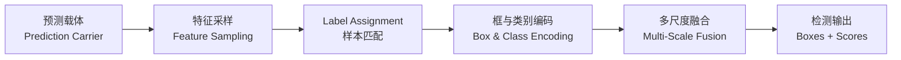

# 目标检测解构系列总览

目标检测要求网络在图像中同时完成定位（找出物体的边界）与分类（识别物体的属性）。网络必须面对极端悬殊的尺度跨度、复杂的空间重叠遮挡，以及海量背景噪声的干扰。

经过十数年的演进，目标检测分化出两阶段、单阶段、Anchor-based、Anchor-free 以及 Transformer Query 等多种看似迥异的架构流派。但退到底层机制，所有检测体系本质上都是由五个可以独立替换的核心部件装配而成的系统：

| 部件 | 回答的问题 | 对应篇目 |
| :--- | :--- | :--- |
| **预测载体** | 网络向外界交出候选预测的基本载体，每个猜测与图像几何空间如何绑定 | [第 1 篇](./prediction-carrier) |
| **特征采样** | 检测头从主干特征图中提取特征表示的操作方式 | [第 2 篇](./feature-sampling) |
| **Label Assignment** | 训练阶段将真实标注指派给特定预测载体的协议，决定正负样本归属与是否需要 NMS | [第 3 篇](./label-assignment) |
| **框与类别编码** | 预测头输出数值的物理意义，坐标回归与分类判别的具体形式 | [第 4 篇](./bbox-regression-loss)、[第 5 篇](./classification-head) |
| **多尺度融合** | 骨干与检测头之间的特征金字塔管道，在不同分辨率与语义深度之间调度信息 | [第 6 篇](./neck-architecture) |

:::tip[阅读顺序]
建议按顺序阅读：[第 0 篇](./architecture-overview)建立坐标图，随后依次读预测载体、特征采样、样本匹配、边界框回归、分类检测头、多尺度 Neck。每篇末尾指明下一篇的入口。
:::

## 篇目

| 篇目 | 标题 | 核心结论 |
| :--- | :--- | :--- |
| 第 0 篇 | [架构拆解与核心部件](./architecture-overview) | 五个部件的装配逻辑；锚框与 NMS 分属不同部件，不存在绑定关系 |
| 第 1 篇 | [预测载体](./prediction-carrier) | 从朴素网格到 Anchor 模板，再到逐点测量与集合查询的三次博弈 |
| 第 2 篇 | [特征采样](./feature-sampling) | 从密集网格采样到稀疏实例采样的演进；两阶段与 DETR 在底层机制上统一 |
| 第 3 篇 | [Label Assignment](./label-assignment) | 从静态几何规则到动态代价指派，再到一对一与双分配 |
| 第 4 篇 | [边界框表示与回归损失](./bbox-regression-loss) | 从独立坐标损失到 IoU 几何损失，再到分布建模 |
| 第 5 篇 | [分类置信度与 Detection Head](./classification-head) | Focal Loss、解耦头、任务对齐解决分类与定位的错位 |
| 第 6 篇 | [多尺度特征与 Neck 架构](./neck-architecture) | 从 FPN 到 PANet、BiFPN 再到 RT-DETR 混合编码器的信息流演进 |

:::note[图片来源]
本系列部分插图由 TikZ 绘制，矢量源文件（`.tex`）保留在 Obsidian 原稿库的 `assets/` 目录中，未随知识库发布。知识库 `static/img/cv_img/object-detection/` 目录中存放渲染后的 PNG。
:::

## 参考文献

- R. Girshick et al., Faster R-CNN: Towards Real-Time Object Detection with Region Proposal Networks, NeurIPS 2015.
- J. Redmon et al., You Only Look Once: Unified, Real-Time Object Detection, CVPR 2016.
- T.-Y. Lin et al., Feature Pyramid Networks for Object Detection, CVPR 2017.
- Z. Tian et al., FCOS: Fully Convolutional One-Stage Object Detection, ICCV 2019.
- N. Carion et al., End-to-End Object Detection with Transformers, ECCV 2020.
- Z. Ge et al., YOLOv10: Real-Time End-to-End Object Detection, NeurIPS 2024.
