# 注意力引入与部署简化

:::note[学习笔记]
v12 / v26 暂无配套 PDF 笔记。背景可参考 [YOLOv8](/files/cv/YOLOv8_Note_v1.pdf) · [YOLOv9](/files/cv/YOLOv9_Note_v1.pdf)。
:::

在 [第四篇](./anchor-free-nms-optional) 中，单阶段目标检测器完成了现代范式的终极定型：通过解耦检测头、无锚框点式预测（Anchor-free）、动态任务对齐（TAL）、连续边界分布（DFL）以及一致性双重分配（NMS-free），卷积检测器在特征表征与端到端无冗余推理上达到了前所未有的高度。

然而，在 2024 年至 2026 年的技术演进收官阶段，单阶段实时检测器在应用落地上面临着两条截然相反、却又相互呼应的终局诉求：
1. **表征能力的上限突破（追求极致精度）**：纯卷积神经网络（CNN）依赖局部滑动窗口，其有效感受野随深度呈亚线性扩展，在全局长程上下文建模、复杂大尺度背景判别以及微弱小目标关联上逐渐显露出理论天花板。学术界渴望将具备全局注意力的 Vision Transformer 引入实时检测器，但自注意力机制的二次方计算复杂度与碎片化访存构成了巨大的延迟鸿沟；
2. **边缘部署的极简落地（追求极致硬件友好）**：随着 DFL 分布焦点损失与解耦双头的引入，模型导出的算子图（Computation Graph）变得日益复杂。在高性能服务器 GPU 上，多通道 Softmax 与期望积分运算的开销微乎其微；但在算力与内存带宽极度匮乏的边缘 CPU、嵌入式微控制器（MCU）与低功耗 NPU 上，这些算子成为了拖慢全流程吞吐的新瓶颈。

**YOLOv12** 与 **YOLO-v26** 分别代表了单阶段检测器在这两个方向上的终极探索。
- **YOLOv12**（2025 年）首次在严格的实时延迟约束下，通过区域注意力（Area Attention）与面向硬件的算子重构，成功将自注意力机制深度融入 YOLO 体系；
- **YOLO-v26**（2026 年）则由 Ultralytics 主导，确立了 " 边缘优先（Edge-First）" 的工程准则，通过主动剥离 DFL 算子、固化 NMS 双模开关并整合正交优化器与多任务底座，完成了向全场景轻量化落地的收官闭环。

本文深入剖析这两款最新代际检测器的底层物理机制，并在文末对 YOLO 从 2015 年初代至 2026 年的十年演进史进行终局复盘。

---

## YOLOv12：自注意力机制的实时化重构

### 注意力机制引入单阶段检测器的本质障碍

自 Transformer 在计算机视觉领域普及以来，单阶段检测器始终未能将自注意力作为基础主干构件，其根本瓶颈不在于网络参数量，而在于**两项严苛的硬件延迟代价**：

1. **计算量的二次方爆炸（Quadratic Complexity）**：
   对于分辨率为 $640 \times 640$ 的输入图像，浅层特征图的展平 Token 数量可达数万。标准的全局多头自注意力（Multi-Head Self-Attention, MHSA）计算复杂度为：

   $$\mathcal{O}(\text{Attn}) = 2 n^2 d + 4 n d^2$$

   其中 $n = H \times W$ 为 Token 数量，$d$ 为特征维度。复杂度随空间尺寸呈现二次方激增（$O(n^2)$），导致高分辨率特征图的全局注意力在前向传播时瞬间击穿实时算力预算。
2. **显存读写与非规整算子瓶颈（Memory-bound Bottleneck）**：
   标准注意力必须显式实例化尺寸为 $n \times n$ 的稠密注意力权重矩阵（Attention Map），引发海量的非连续显存读写（MAC）；此外，原生 Transformer 依赖按 Token 独立计算均值与方差的 LayerNorm 归一化层，在底层硬件执行时无法与卷积或 GEMM 算子执行张量融合（Operator Fusion），频繁中断计算流水线。

虽然 Swin Transformer 等模型提出了基于固定窗口（Shifted Windows）的局部注意力，但其要求输入特征图尺寸必须为窗口大小的整数倍。而 YOLO 在实际推理中广泛采用**自适应动态矩形推理（Rectangular Inference，如 $672 \times 608$）**以减少图像填充黑边，固定窗口机制会强制引入图像变形或破坏尺寸适配性。

### 区域自注意力（Area Attention, A2）

为了在任意长宽比输入下化解注意力复杂度，YOLOv12 提出了**区域自注意力机制（Area Attention, A2）**。

> 图来源：YOLOv12，Fig.2 Area attention，https://ar5iv.org/html/2502.12524

#### 机制与数学形式

对于尺寸为 $H \times W \times C$ 的特征图：
1. **一维序列切分**：首先将空间维度展平为长度为 $n = H \cdot W$ 的一维 Token 序列；
2. **均匀分段（Area Partitioning）**：将一维序列沿长度方向均分为 $l$ 个连续区域（默认 $l=4$），每个区域包含 $n/l$ 个 Token；
3. **段内自注意力运算**：自注意力计算被严格限制在各个独立的区域段内部并行执行：

$$\mathcal{O}(\text{Area-Attn}) = l \times \left( 2 \left(\frac{n}{l}\right)^2 d + 4 \left(\frac{n}{l}\right) d^2 \right) = \frac{2 n^2 d}{l} + 4 n d^2$$

当分段数取 $l=4$ 时，原本昂贵的二次项计算量被精确压缩为原先的 **$\frac{1}{4}$**，同时每个区域依然保留了覆盖四分之一全图的超大感受野。

更关键的是工程层面的极简性：区域注意力仅涉及一次一维展平（Flatten）与重排（Reshape），完全不需要复杂的网格几何切分。只要总 Token 数量 $H \cdot W$ 能被 $l$ 整除，任意尺寸的矩形输入均能无缝执行前向推理。结合 **FlashAttention** 的分块 Softmax 显存优化，该模块在 GPU 上彻底消除了大注意力矩阵的显存驻留开销。

### 训练稳定性保障：R-ELAN 残差高效层聚合

在引入注意力机制后，YOLOv12 团队在训练大模型（L/X 规格）时遇到了严重的**优化曲面震荡与梯度发散**问题，使用 AdamW 优化器也难以稳定收敛。

深入分析表明，传统的 ELAN 拓扑在加深时缺乏足够的恒等映射（Identity Mapping）来平滑深层自注意力的非线性畸变。YOLOv12 设计了 **R-ELAN（Residual ELAN）** 架构进行双重改良：

1. **块级残差直连与层级缩放（LayerScale）**：
   在整个 R-ELAN 聚合块的外围引入跨阶段残差直流通路，并在残差相加前引入一个极小的可学习缩放标量 $\alpha = 0.01$：

   $$Y = X + \alpha \cdot \mathcal{F}_{\text{R-ELAN}}(X)$$

   该机制在训练初期强迫模块退化为接近恒等映射的平坦曲面，保证深层梯度能够稳定无损地穿透注意力栈，化解了大模型的训练崩溃。
2. **瓶颈式通道聚合（Bottleneck Aggregation）**：
   调整特征聚合顺序，先通过 $1 \times 1$ 过渡卷积调整通道并形成特征瓶颈，再分流进入各注意力计算块，使显存占用与特征维度随深度上升保持平稳。

### 面向硬件流水线的 Transformer 原生算子改造

为了抹平 Transformer 与卷积在底层硬件执行上的延迟差距，YOLOv12 对原生自注意力算子进行了四项深度工程改造：

1. **移除绝对位置编码，引入深度可分离卷积位置感知器**：
   传统的可学习绝对位置编码（Positional Encoding）在多尺度输入变化时需要进行复杂的插值计算。YOLOv12 彻底移除了显式位置编码，而在 Value 分支中嵌入了一个 $7 \times 7$ 的深度可分离卷积（Depthwise Conv），利用卷积固有的局部平滑性天然注入空间几何位置线索。
2. **$Q, K, V$ 投影解耦**：
   传统实现倾向于通过一个大矩阵将输入同时投影为拼接的 $[Q, K, V]$ 张量。但在引入 $7 \times 7$ 卷积后，拼接张量必须在显存中反复执行切片（Slice）以提取 $V$。YOLOv12 改用物理独立的线性层分别投影 $Q, K$ 与 $V$，消除了中间显存搬运与张量重排开销。
3. **BatchNorm 替代 LayerNorm**：
   LayerNorm 要求在推理阶段按 Token 动态计算均值与方差，属于不可折叠的显存受限算子。YOLOv12 将所有归一化层统一替换为 **BatchNorm**。在推理部署前，BatchNorm 能够根据线性性质完全折叠进前置卷积或线性层的权重之中（$W' = \gamma W / \sqrt{\sigma^2 + \epsilon}$），推理阶段实现零计算量与零显存开销。
4. **前馈网络（FFN/MLP）膨胀率压缩**：
   原生 Transformer 将 MLP 的通道膨胀比固定为 4.0。实验表明检测精度的主要增益来自于注意力机制而非前馈升维。YOLOv12 将大模型的 MLP 膨胀率大幅缩减至 1.2~1.5，将宝贵的 FLOPs 预算最大限度倾斜给自注意力计算。

> 图来源：YOLOv12，Fig.5 Heat map comparison，https://ar5iv.org/html/2502.12524

通过上述重构，YOLOv12 在同精度下相比基于 Transformer 的前沿实时检测器（如 RT-DETR），不仅参数量与 FLOPs 缩减了超过 $60\%$，更在通用 GPU 上实现了超越纯卷积架构的 FPS 表现，正式宣告自注意力机制全面攻克单阶段实时检测领域。

---

## YOLO-v26：边缘优先导向的极简主义重构

如果说 YOLOv12 展现了算法在表征上限维度的极致扩张，那么由 Ultralytics 于 2026 年初发布的 **YOLO-v26** 则代表了工程在落地部署维度的极致收敛。YOLO-v26 确立了**" 边缘优先（Edge-First）"**的设计哲学，致力于解决现代化检测算法在端侧 CPU、嵌入式芯片与边缘加速器上的部署痛点。

### 现代特性的部署间隙与 DFL 的主动剥离

在 YOLOv8 与 v11 中，**DFL（分布焦点损失）** 将每个边界框坐标建模为 16 个离散 bin 上的概率分布，以表达边缘不确定性。然而在工业级嵌入式落地中，这一设计暴露出了明显的**部署间隙（Deployment Gap）**：
- **显存与算子开销**：每个检测网格的边界框输出通道数高达 $4 \times 16 = 64$ 维。在模型导出为 ONNX / TensorRT 计算图时，图解析器必须在末端插入一个 `Softmax` 节点与一个固定的卷积点积算子以还原坐标期望；
- **边缘 CPU 的吞吐拖累**：在算力充沛的高性能 GPU 上，这些算子耗时极低；但在指令集精简、无专用张量加速核心的低功耗边缘 CPU（如 ARM Cortex-A 系列）上，高维 Softmax 与离散点积构成了频繁的中间显存读写，严重拖慢了解码吞吐。

#### 极简坐标回归的回归

YOLO-v26 采取了激进的工程化修剪：将分布参数设为 $\text{reg\_max} = 1$。
- 此时 DFL 模块在数学上退化为**恒等映射（Identity）**；
- 检测头的回归分支直接输出 4 维确定性坐标标量，单网格输出张量由 $(nc + 64)$ 骤降为 $(nc + 4)$；
- 导出的计算图中彻底移除了所有后置分布 Softmax 算子。

尽管在复杂遮挡极端场景下模型微弱损失了约 0.3%~0.5% 的 AP 精度，但在 Intel Xeon 及各类嵌入式 CPU 上，ONNX 导出的全流程端到端推理速度**提升了 40% 以上**。这是算法精度向硬件极简部署的一次经典妥协。

### NMS 的双模开关化与确定性延迟

在 YOLOv10 首次实现一致性双分配（NMS-free）后，工业界在实际使用中发现：**端到端无 NMS 与传统有 NMS 并非绝对的非此即彼，而是对应不同的业务场景需求**。

YOLO-v26 延续了 " 一对多（o2m）辅助头 + 一对一（o2o）主头 " 的双重训练架构，并在导出部署阶段构建了显式的**双模配置体系（NMS Switch）**：

1. **`nms=False`（端到端确定性无 NMS 模式）**：
   - 模型仅激活一对一主头，输出形状固定为 $(N, 300, 6)$ 的张量（单图最多保留 300 个目标）；
   - 完全脱离 NMS 后处理算子。在视频流连续分析中，推理延迟保持绝对恒定，彻底规避了当图像中突发密集目标时 NMS 耗时呈 $O(N^2)$ 剧烈波动的风险；
   - 彻底解决了各类嵌入式端侧框架（如 OpenVINO、CoreML、LiteRT）由于缺少自定义 NMS 算子而无法一键导出的工程死锁。
2. **`nms=True`（高召回一对多传统模式）**：
   - 在对检测精度极其严苛、且运行于高算力服务器 GPU 的离线批处理场景下，用户可自由切换回一对多分支并配合 GPU 版 NMS 运行，以压榨出极限的基准精度。

### 训练优化与多任务全栈统一

在底层优化与多任务生态方面，YOLO-v26 完成了现代工业标准的收官整合：
- **MuSGD 优化器**：引入了源自大规模模型训练的 **Muon 正交更新** 思想，在 SGD 动量更新时对参数矩阵的二阶梯度执行正交化约束，显著改善了视觉骨干深层非凸曲面的收敛稳定性；
- **小目标感知分配（STAL）与渐进损失（ProgLoss）**：动态调整样本分配中的尺度敏感因子，在训练初期向小目标分配更宽裕的正样本探索容量，在训练末期逐步收紧为严格对齐，有效补齐了剥离 DFL 后小目标召回率的微小下滑；
- **统一工业基座**：单代码库原生整合目标检测、掩码实例分割、基于残差似然估计（RLE）的人体姿态估计、旋转目标检测（OBB）以及结合文本与视觉提示的开放词汇检测（YOLOE-26），支持一键跨平台编译至 20 余种主流硬件运行库。

---

## 十年演进总结：检测原理的终局汇流与 YOLO 的存续本质

从 2015 年约瑟夫·雷德蒙（Joseph Redmon）在《You Only Look Once: Unified, Real-Time Object Detection》中划下第一笔网格回归，到 2026 年跨越十余个代际的演变，单阶段目标检测走过了一条波澜壮阔的工程与科学演进之路。

### 单阶段检测技术原理的历史大汇流

站在当下的技术终局审视，我们会发现一个深刻的事实：**现代目标检测中曾经对立的技术流派，其底层原理已经在数学与物理层面上彻底完成了大汇流**。

```mermaid
flowchart TB
  subgraph Carrier["预测载体演进"]
    direction LR
    C1["YOLOv1：空间粗网格"] --> C2["YOLOv2～v5：密集 Anchor 先验"] --> C3["YOLOX～v12：Anchor-free 特征点"] --> C4["DETR / RT-DETR：可学习 Object Query"]
  end
  subgraph Assign["标签分配演进"]
    direction LR
    A1["YOLOv1：硬空间中心"] --> A2["YOLOv2～v5：静态 IoU 阈值"] --> A3["YOLOX～v8：动态预测质量匹配（TAL / OTA）"] --> A4["YOLOv10～v26：一致性双分配（o2m + o2o）"]
  end
  subgraph Fusion["特征融合与采样演进"]
    direction LR
    F1["v1：单尺度特征"] --> F2["v3：自顶向下 FPN"] --> F3["v4/v5：双向 PANet"] --> F4["v6/v7：结构重参数化与 E-ELAN"] --> F5["v12：局部区域自注意力"]
  end
```

无论是 Anchor-free、解耦检测头、任务对齐分配器，还是无 NMS 的双重分配架构，这些现代组件不仅属于 YOLO，也同样存在于 FCOS、ATSS、VarifocalNet 与 RT-DETR 等各类学术成果之中。曾经界限分明的 " 双阶段 vs 单阶段 "、" 卷积 vs Transformer" 在实时落地的严苛约束下，最终收敛于相同的最优数学结构。

### 历经十年演进，YOLO 留下的真正内核是什么？

既然各流派的底层检测原理已经大体汇流，那么，为什么以 "YOLO" 命名的系列模型依然能够历经十年而始终占据工业界最核心的应用生态？

YOLO 留给计算机视觉领域的最宝贵遗产，可以凝聚为三项不可动摇的**工程师内核**：

1. **对真实硬件端到端延迟（Latency）的绝对执着**：
   YOLO 的演化史绝非纯粹堆砌复杂公式的学术游戏，而是一部面向硬件底层指令集与内存带宽的博弈史。从 CSP 消除梯度共线、RepVGG 算子等价折叠，到 Focus 向大核卷积让步、区域注意力压缩矩阵访存，再到最终剔除 DFL 与 NMS——**" 在真实设备上跑得快 " 永远是压倒一切的第一设计准则**。
2. **严密且自洽的复合模型分级缩放法则**：
   从 Nano/Small 到 Large/XLarge，YOLO 建立了高度规整的深度与宽度缩放模板。同一套代码基座能够无缝覆盖从微瓦级嵌入式芯片（几毫秒超轻量检测）到多卡服务器集群（高吞吐高精度分析）的全算力谱系，赋予了工业研发极大的迁移灵活性。
3. **闭环且成熟的全栈部署生态**：
   极简的标注格式、原生包含数据增强的自动训练流水线、自适应 Anchor/损失动态调度，以及无缝导出至 TensorRT、ONNX、OpenVINO、CoreML 等数十种运行时后端的全链路支持。这种开箱即用、坚固鲁棒的工程基础设施，使得目标检测技术真正跨越了学术论文与产业落地之间的鸿沟，成为了现代数字智能世界不可或缺的基础构件。

---

### 全系列导航

- 上一篇：[第四篇：anchor 去除与 NMS 可选化](./anchor-free-nms-optional)
- 系列总览：[YOLO 演进总览](./)
- 部件解构专栏：
  - [预测载体](../deconstruction/prediction-carrier)
  - [特征采样](../deconstruction/feature-sampling)
  - [Label Assignment](../deconstruction/label-assignment)
  - [边界框表示与回归损失](../deconstruction/bbox-regression-loss)
  - [分类置信度与 Detection Head](../deconstruction/classification-head)
  - [多尺度特征与 Neck 架构](../deconstruction/neck-architecture)
