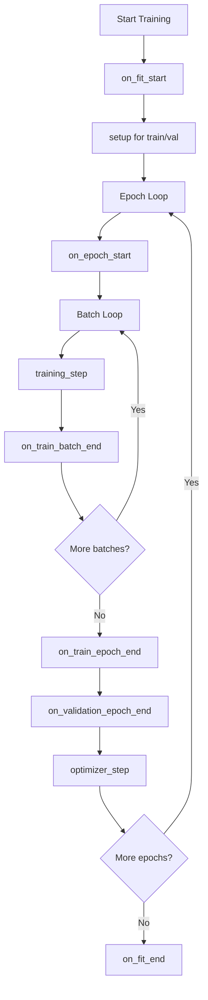
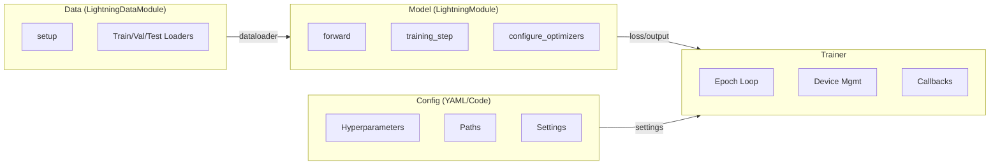

# 心智模型

## Lightning 如何组织代码

Lightning 将 PyTorch 项目划分为四个明确的职责：

| 组件 | 职责 |
| :--- | :--- |
| **Model (模型)** | 前向传播、损失计算、架构 |
| **Data (数据)** | 数据集、数据转换、数据加载 |
| **Trainer (训练器)** | 循环执行、设备管理、回调函数 |
| **Config (配置)** | 超参数、路径、设置 |

这种分离意味着每个组件都是可测试、可复用且独立的。

## 钩子系统 (The Hook System)

Lightning 用**钩子系统**取代了显式的训练循环。您只需实现特定的方法（`hooks`），Lightning 会在训练的特定阶段调用它们。

### 核心钩子



### 关键钩子参考

| 钩子 | 调用时机 | 用途 |
| :--- | :--- | :--- |
| `on_train_start` | 在第一个训练 epoch 之前调用一次 | 初始化日志，构建模型 |
| `training_step` | 每个训练 batch | 计算一个 batch 的损失 |
| `validation_step` | 每个验证 batch | 计算验证指标 |
| `on_train_epoch_end` | 每个训练 epoch 结束时 | 汇总 epoch 级别的指标 |
| `configure_optimizers` | 训练前调用一次 | 配置优化器和调度器 |
| `on_train_end` | 训练结束后调用一次 | 清理工作，最终日志记录 |

### 映射关系：原生 PyTorch 与 Lightning

下面是原生 PyTorch 训练循环与 Lightning 钩子的对应关系：

```python
# 原生 PyTorch
for epoch in range(num_epochs):
    model.train()
    for batch in train_loader:
        optimizer.zero_grad()
        output = model(batch.x)
        loss = criterion(output, batch.y)
        loss.backward()
        optimizer.step()

# Lightning 等效钩子
class MyModel(LightningModule):
    def configure_optimizers(self):
        return optimizer

    def training_step(self, batch, batch_idx):
        output = self(batch.x)
        loss = criterion(output, batch.y)
        return loss
```

| 原生 PyTorch | Lightning 钩子 |
| :--- | :--- |
| `for epoch` 循环 | 由 Trainer 管理 |
| `for batch` 循环 | 由 Trainer 管理 |
| `optimizer.zero_grad()` | 自动完成 (如果使用手动优化，需手动设置 `optimizer.zero_grad()`) |
| `output = model(batch)` | `training_step(self, batch, batch_idx)` |
| `loss = criterion(output, target)` | 在 `training_step` 内 |
| `loss.backward()` | 自动完成 |
| `optimizer.step()` | 通过 `configure_optimizers` 自动完成 |

## 关注点分离 (Separation of Concerns)

### Model vs Data vs Trainer vs Config



### LightningModule

包含内容：

- 模型架构（在 `__init__` 中定义的 `nn.Module` 层）
- 前向传播 (`forward()`)
- 训练逻辑 (`training_step()`)
- 验证逻辑 (`validation_step()`)
- 优化器配置 (`configure_optimizers()`)
- 日志记录 (`self.log()`)

不包含内容：

- 数据加载（由 DataModule 处理）
- Epoch 循环（由 Trainer 处理）
- 设备分配（由 Trainer 处理）

### LightningDataModule

包含内容：

- 数据集构建 (`setup()`)
- 数据加载器 (`train_dataloader()`, `val_dataloader()`, `test_dataloader()`)
- 数据转换和预处理
- 数据拆分

不包含内容：

- 模型架构
- 训练逻辑
- 优化器配置

### Trainer

负责管理：

- Epoch 和 batch 迭代
- 设备分配（CPU/GPU/TPU）
- 梯度清零、反向传播、优化器步进
- AMP (自动混合精度)
- 检查点和早停
- 日志集成

:::tip[明确边界]
将模型代码放在模型中，将数据代码放在数据模块中，将训练配置放在配置文件中。这使每个组件都能进行独立测试。
:::

## 执行流程

当调用 `trainer.fit(model, datamodule=datamodule)` 时：

1. **初始化**：Trainer 设置设备、混合精度、分布式训练
2. **`on_fit_start`**：Model 和 DataModule 初始化
3. **`setup()`**：DataModule 准备数据集
4. **`configure_optimizers`**：创建优化器和调度器
5. **Epoch 循环**：
   - `on_epoch_start`
   - 对每个 batch：`training_step`
   - `on_train_epoch_end`
   - `on_validation_epoch_end` (运行验证)
6. **清理**：运行 `on_fit_end`，触发清理回调函数

这种结构化的流程是 Lightning 具有可预测性的原因——每次训练运行都遵循相同的顺序。
