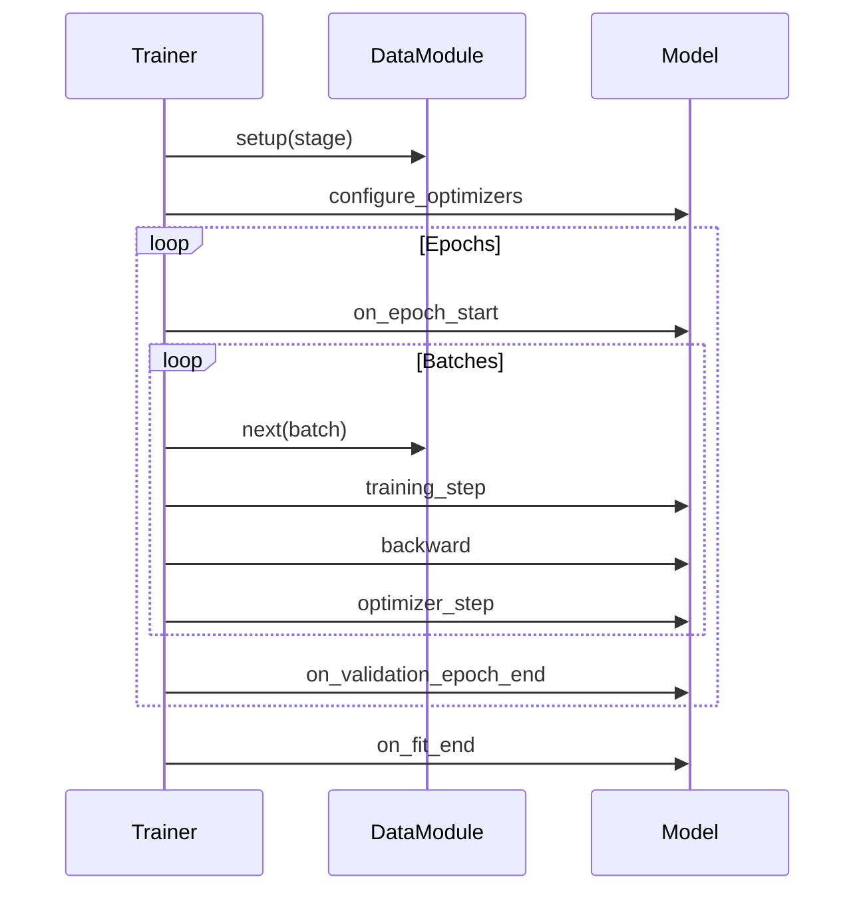

# Trainer

`Trainer` 是运行训练的编排器。它管理训练循环、设备放置、混合精度、检查点（checkpointing）等等。当你调用 `trainer.fit(model)` 时，Lightning 会处理从数据迭代到模型保存的一切事务。

## 基本用法

```python
import lightning as L

trainer = L.Trainer(
    max_epochs=10,
    accelerator="gpu",
    devices=1
)

trainer.fit(model, datamodule=datamodule)
```

## Trainer 管理什么

| 职责 | Lightning 处理的内容 |
| :--- | :--- |
| Epoch 循环 | 迭代所有的 epoch |
| 批次 (Batch) 迭代 | 从 DataLoader 加载批次 |
| 设备放置 | 将张量移动到正确的设备 |
| 梯度 | 清零梯度、反向传播、优化器步进 |
| 混合精度 (AMP) | 自动 FP16/BF16 |
| 检查点 | 保存模型权重 |
| 早停 (Early Stopping) | 监控指标 |
| 日志记录 (Logging) | 与日志记录器集成 |
| 调试标志 | 快速开发运行 (fast dev runs)、分析 (profiling) |

## 关键标志 (Flags)

### 训练控制

```python
trainer = L.Trainer(
    max_epochs=10,           # 最大训练 epoch 数
    min_epochs=1,            # 最小 epoch 数 (默认: 0)
    max_steps=-1,            # 最大步数 (-1 = 直到数据集耗尽)
    min_steps=1,             # 最小步数
    accumulate_grad_batches=1, # 梯度累加
)
```

### 设备管理

```python
trainer = L.Trainer(
    accelerator="auto",  # "cpu", "gpu", "tpu", "mps", "auto"
    devices="auto",       # 设备数量或 "auto"
    num_nodes=1,         # 分布式训练的机器数量
)
```

| `accelerator` 值 | 描述 |
| :--- | :--- |
| `"cpu"` | 仅 CPU |
| `"gpu"` | NVIDIA GPU (CUDA) |
| `"mps"` | Apple Silicon (M1/M2) |
| `"tpu"` | Google TPU |
| `"auto"` | 自动选择 (如果有 GPU 则使用，否则使用 CPU) |

### 混合精度

```python
trainer = L.Trainer(
    precision="32-true",    # 全精度 (默认)
    "16-mixed",            # FP16 混合精度
    "bf16-mixed",         # BF16 混合精度
    "bf16-facebook",      # Facebook 的 bfloat16
)
```

:::tip[性能提示]
在现代 GPU 上使用 `precision="16-mixed"` 可以获得 2-3 倍的加速，且精度损失极小。使用 `"bf16-mixed"` 可获得更好的数值稳定性。
:::

### 梯度管理

```python
trainer = L.Trainer(
    gradient_clip_val=1.0,     # 裁剪梯度范数
    gradient_clip_algorithm="norm",  # "norm" 或 "value"
    accumulate_grad_batches=4,  # 累加梯度
)
```

### 检查点 (Checkpointing)

```python
trainer = L.Trainer(
    enable_checkpointing=True,
    checkpoint_dir="checkpoints/",
    save_top_k=3,                     # 保留最好的 k 个模型
    monitor="val_loss",
    mode="min",
    save_on_train_epoch_end=False,      # 在验证结束时保存 (默认)
)
```

### 调试标志

```python
trainer = L.Trainer(
    fast_dev_run=1,          # 运行 1 个 train/val 批次 (快速测试)
    limit_train_batches=0.1, # 使用 10% 的训练数据
    limit_val_batches=0.1,   # 使用 10% 的验证数据
    limit_test_batches=0.1,   # 使用 10% 的测试数据
    overfit_batches=0.05,    # 在 5% 的数据上过拟合 (检查容量)
)
```

| 标志 | 用例 |
| :--- | :--- |
| `fast_dev_run=4` | 快速完整性检查 (总共 4 个批次) |
| `limit_train_batches=100` | 调试数据管道 |
| `overfit_batches=10` | 测试模型容量 |
| `detect_anomaly=True` | 调试 NaN/Inf 问题 |

## 训练方法

| 方法 | 目的 |
| :--- | :--- |
| `trainer.fit(model, datamodule)` | 训练模型 |
| `trainer.validate(model, datamodule)` | 仅运行验证 |
| `trainer.test(model, datamodule)` | 仅运行测试 |
| `trainer.predict(model, datamodule)` | 运行推理 |

## 分布式训练策略

Lightning 支持多种分布式策略，只需一行配置：

```python
# 数据并行 (单机多卡)
trainer = L.Trainer(
    accelerator="gpu",
    devices=4,
    strategy="dp"  # 或 "ddp"
)

# 分布式数据并行 (多机多卡)
trainer = L.Trainer(
    accelerator="gpu",
    devices=4,
    num_nodes=2,
    strategy="ddp"  # 或 "ddp_spawn"
)

# DeepSpeed (内存高效)
trainer = L.Trainer(
    accelerator="gpu",
    strategy="deepspeed",
    deepspeed_config="deepspeed_config.json"
)

# 完全分片数据并行 (Fully Sharded Data Parallel)
trainer = L.Trainer(
    accelerator="gpu",
    strategy="fsdp",
    fsdp_config={...}
)
```

| 策略 | 最适合 |
| :--- | :--- |
| `"dp"` | 单机，2-4 个 GPU |
| `"ddp"` | 多 GPU，多节点 |
| `"deepspeed"` | 大型模型，GPU 显存有限 |
| `"fsdp"` | 大型模型 (PyTorch 原生) |

### 策略选择

```python
# 让 Lightning 自动选择
trainer = L.Trainer(accelerator="auto", devices="auto")

# 显式策略
trainer = L.Trainer(
    accelerator="gpu",
    devices="auto",
    strategy="auto"  # 根据设置自动选择
)
```

## 回调函数 (Callbacks)

```python
from lightning import callbacks

trainer = L.Trainer(
    callbacks=[
        callbacks.ModelCheckpoint(monitor="val_loss", save_top_k=3),
        callbacks.EarlyStopping(monitor="val_loss", patience=5),
    ]
)
```

## 日志记录器 (Loggers)

```python
from lightning import loggers

trainer = L.Trainer(
    logger=loggers.TensorBoardLogger("logs/"),
    # 或多个日志记录器
    logger=[
        loggers.TensorBoardLogger("logs/"),
        loggers.CSVLogger("logs/csv/"),
    ]
)
```

## 训练流程



## 示例：完整训练

```python
import lightning as L

# 模型
model = MyLightningModule()

# 数据
datamodule = MyDataModule()

# Trainer
trainer = L.Trainer(
    max_epochs=10,
    accelerator="gpu",
    devices=1,
    precision="16-mixed",
    callbacks=[
        L.callbacks.ModelCheckpoint(
            monitor="val_loss",
            save_top_k=3,
            save_last=True
        ),
        L.callbacks.EarlyStopping(
            monitor="val_loss",
            patience=5,
            mode="min"
        ),
        L.callbacks.LearningRateMonitor()
    ],
    logger=L.loggers.TensorBoardLogger("logs/"),
    check_val_every_n_epoch=1,
    enable_progress_bar=True,
)

# 训练
trainer.fit(model, datamodule=datamodule)

# 测试
trainer.test(model, datamodule=datamodule)
```

:::tip[迭代工作流]
从基本标志开始 (`max_epochs`, `accelerator`)。仅在需要时添加复杂性：首先是混合精度，然后是分布式训练。
:::