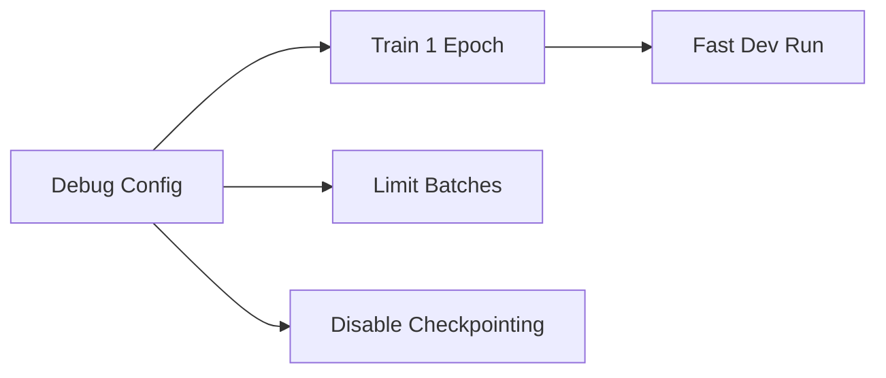

# 配置组合 (Config Composition)

本文档涵盖了高级的 Hydra 组合模式：实验配置、超参数搜索、扫描 (sweeps) 以及调试配置。这些模式使得系统化的机器学习实验成为可能。

## 实验配置

实验配置将多个配置组组合成一个完整的实验定义：

```yaml
# configs/experiment/my_experiment.yaml
defaults:
  - model: resnet50
  - datamodule: imagenet
  - optimizer: sgd
  - scheduler: cosine_annealing
  - trainer: gpu_8x
  - logger: wandb

# 覆盖特定参数
model:
  lr: 0.1
  weight_decay: 1e-4

trainer:
  max_epochs: 100
```

### 使用实验配置

```bash
# 加载实验配置
python scripts/train.py +experiment=my_experiment

# 如果需要，覆盖实验中的值
python scripts/train.py +experiment=my_experiment model.lr=0.05
```

`+` 前缀会将实验动态地添加到 `defaults` 列表中。

## 调试配置

调试配置为快速开发提供了便捷的覆盖：

```yaml
# configs/debug/default.yaml
defaults:
  - model: default
  - datamodule: default
  - _self_

# 用于快速迭代的快速设置
trainer:
  max_epochs: 1
  limit_train_batches: 10
  limit_val_batches: 5
  limit_test_batches: 5
  fast_dev_run: true

model:
  lr: 1e-3
```



### 使用调试模式

```bash
# 快速的完整性检查 (sanity check)
python scripts/train.py +debug=default

# 更快的方式：只跑单个批次
python scripts/train.py +debug=default trainer.fast_dev_run=true
```

## 超参数搜索

超参数搜索自动化了参数空间的探索。Hydra 提供了两种模式：

### 多次运行扫描 / Multirun Sweeps (`-m`)

`-m` 标志用于运行多个配置：

```bash
# 对学习率进行网格搜索
python scripts/train.py -m model.lr=1e-3,1e-4,1e-5

# 对多个参数进行网格搜索
python scripts/train.py -m model.lr=1e-3,1e-4 model.dropout=0.1,0.2,0.5
```

这将运行所有的组合（2 x 3 = 6 次运行）。

### 随机扫描 (Random Sweeps)

使用 OmegaConf 进行随机（均匀）采样：

```yaml
# configs/sweep.yaml
defaults:
  - override hydra/launcher: basic_sweeper

hydra:
  launcher:
    _target_: hydra._internal.launcher.BasicLauncher
  
  sweeper:
    _target_: hydra._internal.sweeper.RandomSampler
    params:
      model.lr: uniform(1e-5, 1e-1)
      model.dropout: uniform(0.0, 0.5)
```

```bash
# 随机搜索（5 次运行）
python scripts/train.py -m --config-name=sweep model.lr=0.001 model.dropout=0.1
```

## 带有搜索的多次运行

### 命令行接口

```bash
# 简单的扫描
python scripts/train.py -m model.lr=1e-3,1e-4,1e-5

# 指定输出目录
python scripts/train.py -m model.lr=1e-3,1e-4,1e-5 hydra.sweeper.dir=logs/sweep_${now:%Y-%m-%d_%H-%M-%S}
```

### 扫描器配置 (Sweeper Configuration)

更复杂的扫描需要扫描器配置：

```yaml
# configs/sweeper/basic.yaml
defaults:
  - override hydra/launcher: basic_sweeper

hydra:
  mode: MULTIRUN
  sweeper:
    _target_: hydra._internal.grid_sweeper.GridSweeper
    params:
      model.lr: range(1e-5, 1e-2, 5)
      model.dropout: [0.0, 0.1, 0.2, 0.3, 0.4, 0.5]
    max_batch_count: 10
```

```bash
# 使用扫描器配置运行
python scripts/train.py --config-name=sweeper
```

## 组合器配置 (Composer for Configs)

Hydra 组合器允许组合多个配置：

```yaml
# configs/experiment/advanced.yaml
defaults:
  - model: resnet
  - /datamodule@datamodule: imagenet
  - /optimizer@optimizer: sgd
  - /scheduler@scheduler: cosine
  - /trainer@trainer: gpu
  - /logger@logger: tensorboard
  - _self_
```

这使用了 `@` 符号进行显式赋值的组。

## 配置组最佳实践

### 组织策略

```text
configs/
├── base/              # 基础配置 (gpu, cpu 等)
├── model/             # 模型架构
├── datamodule/        # 数据配置
├── optimizer/         # 优化器设置
├── scheduler/         # 学习率调度器设置
├── experiment/        # 完整的实验
└── debug/            # 调试覆盖
```

### 基础配置

创建可以被覆盖的合理默认值：

```yaml
# configs/trainer/base.yaml
# 适用于任何加速器的最简训练器设置
accelerator: auto
devices: 1
max_epochs: 10
```

```yaml
# configs/trainer/gpu.yaml
defaults:
  - base
extends: configs/trainer/base.yaml
accelerator: gpu
precision: 32
```

## 带有覆盖的实验组合

### 完整示例：搜索实验

```yaml
# configs/experiment/search.yaml
defaults:
  - model: resnet50
  - datamodule: imagenet
  - optimizer: sgd
  - scheduler: cosine_annealing
  - trainer: gpu
  - logger: wandb
  - _self_

# 覆盖用于搜索的模型参数
model:
  lr: 0.1
  weight_decay: 1e-4
  label_smoothing: 0.1

trainer:
  max_epochs: 90

# 扫描特定的值
scheduler:
  T_max: ${trainer.max_epochs}
  eta_min: 1e-6
```

## 搜索可视化

通过日志配置追踪扫描结果：

```yaml
# configs/logger/wandb.yaml
_target_: lightning.pytorch.loggers.WandbLogger
project: my-project
entity: my-team
tags: ["experiment", "sweep"]
log_model: true
```

```bash
# 运行扫描并记录到 W&B
python scripts/train.py -m model.lr=1e-3,1e-4,1e-5 +experiment=search logger=wandb
```

## 配置中的环境变量

引用环境变量：

```yaml
# configs/datamodule/imagenet.yaml
_target_: src.data.ImageNetDataModule
data_dir: ${env:DATA_DIR:-./data}
num_workers: ${env:NUM_WORKERS:-4}
```

```bash
export DATA_DIR=/mnt/data
export NUM_WORKERS=8
python scripts/train.py datamodule=imagenet
```

## 进阶：结构化配置

使用 OmegaConf 结构化配置进行类型验证：

```python
# src/utils/configs.py
from dataclasses import dataclass
from omegaconf import MISSING

@dataclass
class TrainerConfig:
    accelerator: str = "auto"
    devices: int = 1
    max_epochs: int = 10
    precision: int = 32

@dataclass  
class ModelConfig:
    lr: float = MISSING
    hidden_dims: list = MISSING
    dropout: float = 0.0
```

```yaml
# configs/default.yaml
defaults:
  - trainer: default

trainer:
  $target_: src.utils.configs.TrainerConfig
  
model:
  $target_: src.utils.configs.ModelConfig
```

## 扫描结果

### 目录结构

扫描会创建结构化的输出：

```text
logs/
├── sweep_2024-01-15_10-30-00/
│   ├── multirun.yaml
│   ├── 1/
│   │   └── train.log
│   ├── 2/
│   │   └── train.log
│   └── ...
```

### 加载结果

```python
# 在扫描完成后，分析结果
import pandas as pd
import yaml

with open("logs/sweep/multirun.yaml") as f:
    results = yaml.safe_load(f)
```

## 快速参考

| 命令 | 描述 |
| :--- | :--- |
| `+experiment=name` | 加载实验配置 |
| `+debug=name` | 加载调试配置 |
| `-m param=value1,value2` | 运行多次扫描 (multirun sweep) |
| `--config-name=sweep` | 使用扫描配置 |
| `param=value` | 覆盖单个值 |

```bash
# 完整示例
python scripts/train.py \
    +experiment=resnet50_search \
    model.lr=0.1 \
    trainer.max_epochs=90 \
    logger=wandb
```

## 下一步

- [实例化 (Instantiation)](./instantiation): 从配置中实例化组件
- [自定义模块 (Custom Module)](../custom-implementation/custom-module): 构建自定义的 Lightning 模块
