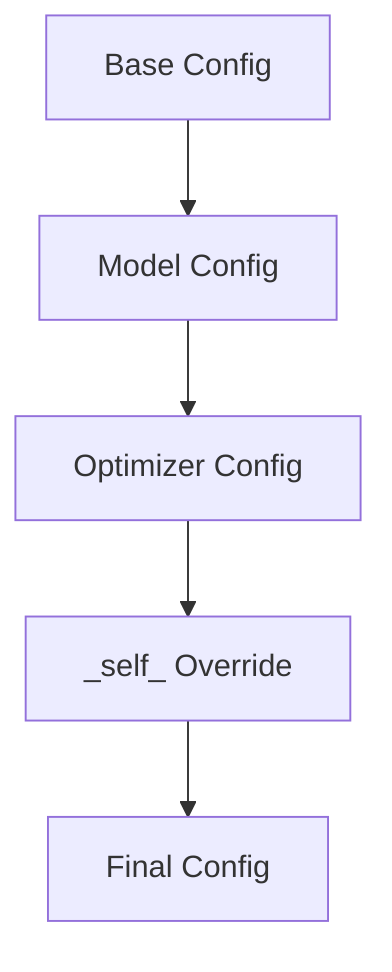

# 实例化 (Instantiation)

本文档介绍了如何从 Hydra 配置中实例化 Lightning 组件。`hydra.utils.instantiate()` 模式是从配置文件创建 DataModule、模型、回调函数、日志记录器、优化器和调度器的标准方法。

## Instantiate 模式

Hydra 的 `instantiate()` 函数可以从配置字典中创建对象：

```python
from hydra.utils import instantiate

# 从配置字典实例化
model = instantiate(cfg.model)
```

配置中必须包含一个 `_target_` 键，用于指定要实例化的类：

```yaml
# configs/model/my_model.yaml
_target_: src.models.MyModel
lr: 1e-3
hidden_dim: 256
```

## DataModule 实例化

### 配置

```yaml
# configs/datamodule/mnist.yaml
_target_: src.data.MNISTDataModule
data_dir: ./data
batch_size: 64
num_workers: 4
```

### 代码

```python
datamodule = instantiate(cfg.datamodule)
```

`instantiate` 调用会将所有配置键（除 `_target_` 外）作为关键字参数传递给类的构造函数。

### 多数据集场景

```yaml
# configs/datamodule/paired.yaml
_target_: src.data.PairedDataModule
source:
  _target_: src.data.MNISTDataModule
  data_dir: ./data
target:
  _target_: src.data.CIFAR10DataModule
  data_dir: ./data
```

```python
datamodule = instantiate(cfg.datamodule)
# 返回带有已实例化的 source 和 target 的 PairedDataModule
```

## 模型/LightningModule 实例化

### 配置

```yaml
# configs/module/my_module.yaml
_target_: src.models.MyLightningModule
lr: 1e-3
hidden_dim: 256
dropout: 0.1
```

### 代码

```python
model = instantiate(cfg.module)
```

实例化后的模型是一个完全初始化的 LightningModule，已准备好进行训练。

### 带有超参数

使用 `save_hyperparameters()` 将配置持久化到检查点 (checkpoint) 中：

```python
class MyLightningModule(L.LightningModule):
    def __init__(self, lr: float, hidden_dim: int, dropout: float = 0.0):
        super().__init__()
        self.save_hyperparameters()
        self.model = nn.Linear(hidden_dim, 10)
    
    def forward(self, x):
        return self.model(x)
```

从检查点加载时，超参数会自动恢复。

## 优化器和调度器实例化

### 优化器配置

```yaml
# configs/optimizer/adam.yaml
_target_: torch.optim.Adam
lr: 1e-3
betas: [0.9, 0.999]
eps: 1e-8
weight_decay: 0.0
```

### 调度器配置

```yaml
# configs/scheduler/cosine.yaml
_target_: torch.optim.lr_scheduler.CosineAnnealingLR
T_max: 10
eta_min: 1e-6
```

### 组合配置

```yaml
# configs/optimizer/scheduler.yaml
optimizer:
  _target_: torch.optim.Adam
  lr: 1e-3
  
scheduler:
  _target_: torch.optim.lr_scheduler.CosineAnnealingLR
  T_max: 100
  eta_min: 1e-6
```

### 代码

```python
# 实例化优化器
optimizer = instantiate(cfg.optimizer, model.parameters())

# 实例化调度器
scheduler = instantiate(cfg.scheduler, optimizer)
```

### 在 LightningModule 中

```python
def configure_optimizers(self):
    optimizer = instantiate(self.cfg.optimizer, self.parameters())
    
    scheduler = instantiate(
        self.cfg.scheduler,
        optimizer,
        T_max=self.cfg.trainer.max_epochs
    )
    
    return {
        "optimizer": optimizer,
        "lr_scheduler": {
            "scheduler": scheduler,
            "monitor": "val_loss",
        }
    }
```

## 回调函数 (Callback) 实例化

回调函数用于监控训练并能对事件做出反应。它们需要实例化工具：

### instantiate_callbacks 工具

```python
# src/utils/callbacks.py
def instantiate_callbacks(cfg):
    """从配置实例化回调函数。"""
    callbacks = []
    
    if cfg is None:
        return callbacks
    
    callbacks_cfg = OmegaConf.to_container(cfg, resolve=True)
    
    for callback_name, callback_conf in callbacks_cfg.items():
        if isinstance(callback_conf, dict) and "_target_" in callback_conf:
            callback = instantiate(callback_conf)
            callback.name = callback_name
            callbacks.append(callback)
    
    return callbacks
```

### 回调函数配置

```yaml
# configs/callbacks/default.yaml
model_checkpoint:
  _target_: lightning.pytorch.callbacks.ModelCheckpoint
  save_top_k: 1
  monitor: val_loss
  mode: min
  dirpath: ./models
  filename: best

early_stopping:
  _target_: lightning.pytorch.callbacks.EarlyStopping
  monitor: val_loss
  patience: 5
  mode: min

lr_monitor:
  _target_: lightning.pytorch.callbacks.LearningRateMonitor
  log_momentum: true
```

### 用法

```python
callbacks = instantiate_callbacks(cfg.callbacks)
trainer = Trainer(callbacks=callbacks)
```

## 日志记录器 (Logger) 实例化

日志记录器用于记录指标和制品 (artifacts)：

### instantiate_loggers 工具

```python
# src/utils/loggers.py
def instantiate_loggers(cfg):
    """从配置实例化日志记录器。"""
    loggers = []
    
    if cfg is None:
        return loggers
    
    logger_cfg = OmegaConf.to_container(cfg, resolve=True)
    
    for logger_name, logger_conf in logger_cfg.items():
        if isinstance(logger_conf, dict) and "_target_" in logger_conf:
            logger = instantiate(logger_conf)
            logger.name = logger_name
            loggers.append(logger)
    
    return loggers
```

### 日志记录器配置

```yaml
# configs/logger/default.yaml
tensorboard:
  _target_: lightning.pytorch.loggers.TensorBoardLogger
  save_dir: ./logs
  name: lightning

wandb:
  _target_: lightning.pytorch.loggers.WandbLogger
  project: my-project
  entity: my-team
  tags: ["experiment"]
```

### 用法

```python
loggers = instantiate_loggers(cfg.logger)
trainer = Trainer(logger=loggers)
```

## `_self_` 关键字

`_self_` 关键字允许本地配置覆盖组合后的值：

```yaml
# configs/experiment/my_exp.yaml
defaults:
  - model: resnet50
  - optimizer: adam
  - _self_

# 覆盖优化器的学习率
optimizer:
  lr: 0.05  # 覆盖来自 optimizer/adam.yaml 的默认值
```

当 `_self_` 出现在 `defaults` 中时，当前配置将最后被应用，从而允许它覆盖来自 `defaults` 的值。

## 配置合并规则

Hydra 按顺序合并配置。后面的配置会覆盖前面的配置：

```yaml
# defaults 顺序很重要
defaults:
  - model: base
  - datamodule: default
  - optimizer: adam  # 最后加载，可以覆盖先前的
  - _self_  # 本地值覆盖一切
```



## 完整的训练脚本

```python
# scripts/train.py
import hydra
from omegaconf import DictConfig, OmegaConf
import lightning as L
from hydra.utils import instantiate

from src.utils.callbacks import instantiate_callbacks
from src.utils.loggers import instantiate_loggers

@hydra.main(version_base=None, config_path="../configs", config_name="default")
def main(cfg: DictConfig):
    # 实例化组件
    datamodule = instantiate(cfg.datamodule)
    model = instantiate(cfg.module)
    
    # 设置回调函数和日志记录器
    callbacks = instantiate_callbacks(cfg.get("callbacks"))
    loggers = instantiate_loggers(cfg.get("logger", {}))
    
    # 创建训练器
    trainer = L.Trainer(
        **cfg.trainer,
        callbacks=callbacks,
        logger=loggers,
    )
    
    # 训练
    trainer.fit(model, datamodule=datamodule)
    
    # 测试 (可选)
    if cfg.get("test"):
        trainer.test(model, datamodule=datamodule)

if __name__ == "__main__":
    main()
```

## 默认配置汇总

```yaml
# configs/default.yaml
defaults:
  - trainer: default
  - module: default
  - datamodule: default
  - optimizer: adam
  - scheduler: cosine
  - callbacks: default
  - logger: tensorboard
  - _self_

# 训练器设置
trainer:
  accelerator: gpu
  devices: 1
  max_epochs: 10
  precision: 32

# 模型设置
module:
  lr: 1e-3
  hidden_dim: 256
```

## 使用实例化组件运行

```bash
# 默认运行
python scripts/train.py

# 自定义配置
python scripts/train.py model.lr=1e-4 +experiment=resnet50

# 使用自定义回调函数
python scripts/train.py callbacks+=my_callback

# 覆盖参数
python scripts/train.py callbacks.model_checkpoint.save_top_k=3
```

:::tip[调试实例化]
添加日志以查看正在实例化的内容：
```python
print(OmegaConf.to_yaml(cfg))
model = instantiate(cfg.model)
print(f"Created: {type(model)}")
```
:::

## 下一步

- [自定义模块 (Custom Module)](../custom-implementation/custom-module): 构建自定义的 Lightning 模块
- [自定义数据模块 (Custom DataModule)](../custom-implementation/custom-datamodule): 构建自定义数据模块
- [自定义回调函数 (Custom Callbacks)](../custom-implementation/custom-callbacks): 编写自定义回调函数
