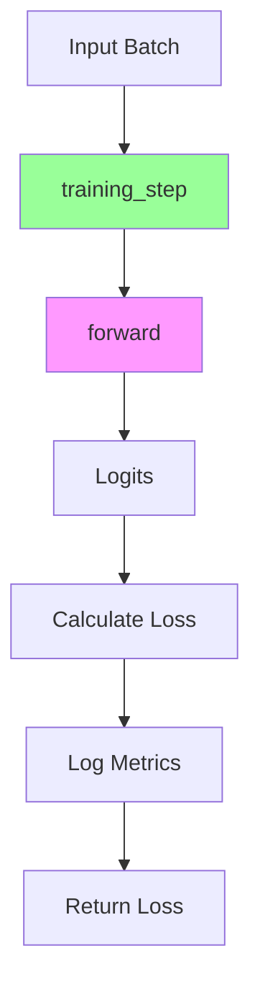

# 自定义 Module (Custom Module)

本文档介绍了构建自定义 `LightningModule` 的方法——这是在 Lightning 中封装神经网络的标准方式。内容包括完整的类模板、`forward` 与 `step` 方法的区别、损失计算模式以及日志记录的最佳实践。

## 完整类模板

一个标准的 `LightningModule` 应该包含模型架构、前向传播（forward pass）以及训练/验证逻辑：

```python
import lightning as L
import torch
import torch.nn as nn
import torch.nn.functional as F


class MyLightningModule(L.LightningModule):
    """自定义 LightningModule 模板。
    
    Args:
        hidden_dim: 隐藏层维度大小。
        lr: 优化器的学习率。
    """
    
    def __init__(self, hidden_dim: int = 256, lr: float = 1e-3):
        super().__init__()
        # 将参数保存到检查点 (checkpoint)
        self.save_hyperparameters()
        
        # 定义模型架构
        self.layer_1 = nn.Linear(28 * 28, hidden_dim)
        self.layer_2 = nn.Linear(hidden_dim, 10)
        
        self.lr = lr
    
    def forward(self, x):
        """前向传播，主要用于推理 (inference)。"""
        batch_size = x.size(0)
        x = x.view(batch_size, -1)
        
        x = self.layer_1(x)
        x = F.relu(x)
        x = self.layer_2(x)
        
        return x
    
    def training_step(self, batch, batch_idx):
        """单个训练步。"""
        x, y = batch
        logits = self(x)
        
        loss = F.cross_entropy(logits, y)
        
        # 记录训练指标
        self.log("train_loss", loss, on_step=True, on_epoch=True, prog_bar=True)
        
        return loss
    
    def validation_step(self, batch, batch_idx):
        """单个验证步。"""
        x, y = batch
        logits = self(x)
        
        loss = F.cross_entropy(logits, y)
        preds = torch.argmax(logits, dim=1)
        acc = (preds == y).float().mean()
        
        # 记录验证指标
        self.log("val_loss", loss, on_step=False, on_epoch=True, prog_bar=True)
        self.log("val_acc", acc, on_step=False, on_epoch=True, prog_bar=True)
        
    def test_step(self, batch, batch_idx):
        """单个测试步。"""
        x, y = batch
        logits = self(x)
        
        loss = F.cross_entropy(logits, y)
        preds = torch.argmax(logits, dim=1)
        acc = (preds == y).float().mean()
        
        # 记录测试指标
        self.log("test_loss", loss, on_step=False, on_epoch=True)
        self.log("test_acc", acc, on_step=False, on_epoch=True)
    
    def configure_optimizers(self):
        """配置优化器和学习率调度器。"""
        optimizer = torch.optim.Adam(self.parameters(), lr=self.lr)
        return optimizer
```

## Forward 与 Step 详解

在 Lightning 中，通常将推理逻辑（`forward`）与训练逻辑（`*_step`）分开。



### forward

`forward` 方法定义了模型如何将输入转换为预测输出。应该仅用于推理。

```python
def forward(self, x):
    # 仅包含推理逻辑
    embeddings = self.encoder(x)
    predictions = self.decoder(embeddings)
    return predictions
```

### step 方法

`step` 方法（如 `training_step`, `validation_step`）负责处理单个批次（batch）的数据，通常会调用 `self(x)`（即 `forward`）来获取预测结果，并计算损失。

| 钩子 (Hook) | 阶段 | 描述 |
| :--- | :--- | :--- |
| `training_step` | 训练 | 处理一个训练批次 |
| `on_train_batch_end` | 训练 | 聚合批次级别的结果（可选） |
| `on_train_epoch_end` | 训练 | 聚合 epoch 级别的结果（可选） |
| `validation_step` | 验证 | 处理一个验证批次 |
| `on_validation_batch_end` | 验证 | 聚合批次级别的结果（可选） |
| `on_validation_epoch_end` | 验证 | 聚合 epoch 级别的结果（可选） |
| `test_step` | 测试 | 处理一个测试批次 |
| `predict_step` | 推理 | 处理一个批次用于预测 |

### training_step

```python
def training_step(self, batch, batch_idx):
    x, y = batch
    logits = self(x)
    
    loss = F.cross_entropy(logits, y)
    
    self.log("train_loss", loss, on_step=True, on_epoch=True)
    
    return loss
```

### validation_step

```python
def validation_step(self, batch, batch_idx):
    x, y = batch
    logits = self(x)
    
    loss = F.cross_entropy(logits, y)
    
    self.log("val_loss", loss, on_step=False, on_epoch=True)
    
    return loss
```

### 返回多个值

Step 方法可以返回一个字典，以包含额外的输出内容：

```python
def training_step(self, batch, batch_idx):
    x, y = batch
    logits = self(x)
    
    loss = F.cross_entropy(logits, y)
    preds = torch.argmax(logits, dim=1)
    
    return {
        "loss": loss,
        "preds": preds,
        "targets": y,
    }
```

## 损失计算模式

### 交叉熵损失 (Cross-Entropy Loss)

```python
def training_step(self, batch, batch_idx):
    x, y = batch
    logits = self(x)
    
    loss = F.cross_entropy(logits, y)
    return loss
```

### 自定义损失函数

```python
def __init__(self, ...):
    super().__init__()
    self.save_hyperparameters()
    self.criterion = nn.MSELoss()

def training_step(self, batch, batch_idx):
    x, y = batch
    logits = self(x)
    
    loss = self.criterion(logits, y)
    return loss
```

### 多任务损失 (Multi-Task Loss)

```python
def training_step(self, batch, batch_idx):
    x, y_cls, y_reg = batch
    pred_cls, pred_reg = self(x)
    
    loss_cls = F.cross_entropy(pred_cls, y_cls)
    loss_reg = F.mse_loss(pred_reg, y_reg)
    
    # 组合加权
    loss = loss_cls + 0.1 * loss_reg
    
    self.log("train_loss", loss)
    self.log("train_loss_cls", loss_cls)
    self.log("train_loss_reg", loss_reg)
    
    return loss
```

## 日志记录模式

使用 `self.log()` 方法来记录指标：

```python
self.log(
    "metric_name",  # 指标名称 (用于 logger)
    value,         # 指标值
    on_step=True,  # 在每个 step 记录
    on_epoch=True, # 在 epoch 结束时聚合和记录
    prog_bar=True,  # 在进度条中显示
    logger=True,   # 发送到 logger
)
```

### 日志选项

| 参数 | 记录时机 | 使用场景 |
| :--- | :--- | :--- |
| `on_step=True` | 每个批次 | 损失 (可能会有波动) |
| `on_epoch=True` | Epoch 结束 | 总结的指标 |
| `prog_bar=True` | 进度展示 | 需要实时关注的关键指标 |
| `logger=True` | 外部 logger | W&B, TensorBoard 等 |

### 最佳实践

```python
# Loss - 灵活地以两种方式记录
self.log("train_loss", loss, on_step=True, on_epoch=True, prog_bar=True)

# Accuracy - 仅在 epoch 级别记录
self.log("train_acc", acc, on_step=False, on_epoch=True, prog_bar=True)
```

## 保存和加载超参数

`save_hyperparameters()` 方法可将 `__init__` 中的参数保存到 checkpoint 中：

```python
def __init__(self, lr: float = 1e-3, hidden_dim: int = 256):
    super().__init__()
    self.save_hyperparameters()
    
    self.layer = nn.Linear(hidden_dim, 10)
```

### 加载

```python
# 自动恢复超参数
model = MyLightningModule.load_from_checkpoint("path/to/ckpt.ckpt")

# 访问加载的超参数
print(model.hparams.lr)
print(model.hparams.hidden_dim)
```

### 显式保存

指定仅保存特定的参数：

```python
def __init__(self, lr: float = 1e-3, hidden_dim: int = 256):
    super().__init__()
    self.save_hyperparameters("lr", "hidden_dim")
```

:::caution[参数记录警告]
不要在 `__init__` 方法中进行日志记录 (`self.log`)。请使用 step 的相关钩子记录日志——因为在 `__init__` 阶段 Trainer 还没有就绪。
:::

## 示例：完整的 MNIST 分类器

```python
import lightning as L
import torch
import torch.nn as nn
import torch.nn.functional as F


class MNISTClassifier(L.LightningModule):
    def __init__(self, lr: float = 1e-3):
        super().__init__()
        self.save_hyperparameters()
        
        self.conv1 = nn.Conv2d(1, 32, 3, padding=1)
        self.conv2 = nn.Conv2d(32, 64, 3, padding=1)
        self.fc1 = nn.Linear(64 * 7 * 7, 128)
        self.fc2 = nn.Linear(128, 10)
        
        self.dropout = nn.Dropout(0.25)
        self.lr = lr
    
    def forward(self, x):
        x = F.relu(F.max_pool2d(self.conv1(x), 2))
        x = F.relu(F.max_pool2d(self.conv2(x), 2))
        x = x.view(x.size(0), -1)
        x = self.dropout(x)
        x = F.relu(self.fc1(x))
        x = self.dropout(x)
        x = self.fc2(x)
        return x
    
    def training_step(self, batch, batch_idx):
        x, y = batch
        logits = self(x)
        loss = F.cross_entropy(logits, y)
        
        self.log("train_loss", loss, on_step=True, on_epoch=True, prog_bar=True)
        return loss
    
    def validation_step(self, batch, batch_idx):
        x, y = batch
        logits = self(x)
        loss = F.cross_entropy(logits, y)
        
        preds = torch.argmax(logits, dim=1)
        acc = (preds == y).float().mean()
        
        self.log("val_loss", loss, on_step=False, on_epoch=True, prog_bar=True)
        self.log("val_acc", acc, on_step=False, on_epoch=True, prog_bar=True)
    
    def configure_optimizers(self):
        return torch.optim.Adam(self.parameters(), lr=self.lr)
```

## 配合 Hydra 使用

```yaml
# configs/module/mnist.yaml
_target_: src.models.MNISTClassifier
lr: 1e-3
```

```python
# 实例化
model = instantiate(cfg.module)
```

## 下一步

- [Custom DataModule](./custom-datamodule): 构建自定义数据模块
- [Custom Callbacks](./custom-callbacks): 编写自定义回调
- [Optimizer & Scheduler](./optimizer-scheduler): 配置优化器和调度器
