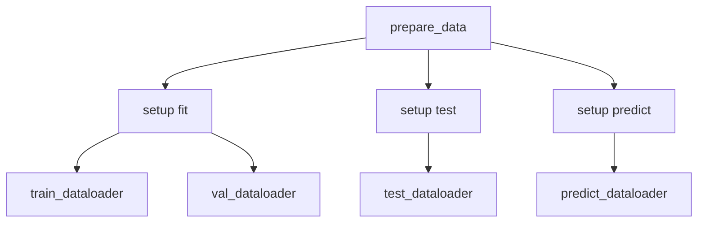

# 自定义 DataModule (Custom DataModule)

本文档介绍了如何构建自定义 `LightningDataModule` —— 这是在 Lightning 中管理数据加载的标准方式。内容包括完整的类模板、生命周期方法、Dataset 模式以及多数据集场景。

## 完整类模板

```python
import lightning as L
import torch
from torch.utils.data import DataLoader, random_split
from torchvision import datasets, transforms


class MyDataModule(L.LightningDataModule):
    """用于你的数据集的自定义 DataModule。
    
    Args:
        data_dir: 数据集的根目录。
        batch_size: DataLoader 的批次大小。
        num_workers: 数据加载的 worker 数量。
        val_split: 验证集的数据比例。
    """
    
    def __init__(
        self,
        data_dir: str = "./data",
        batch_size: int = 32,
        num_workers: int = 4,
        val_split: float = 0.1,
    ):
        super().__init__()
        self.save_hyperparameters()
        
        self.data_dir = data_dir
        self.batch_size = batch_size
        self.num_workers = num_workers
        self.val_split = val_split
    
    def prepare_data(self):
        """下载数据集。此方法在单个进程上仅被调用一次。
        
        使用此方法下载数据 (例如从远程存储)。
        不要在这里分配状态 (state) 给 self。
        """
        # 下载数据集 (在分布式训练中，只在 rank 0 执行)
        datasets.MNIST(self.data_dir, train=True, download=True)
        datasets.MNIST(self.data_dir, train=False, download=True)
    
    def setup(self, stage: str):
        """加载数据集。在分布式训练中，此方法会在每个进程上被调用。
        
        Args:
            stage: 'fit', 'validate', 'test' 或 'predict' 其中之一。
        """
        if stage == "fit" or stage == "validate":
            full_data = datasets.MNIST(
                self.data_dir,
                train=True,
                transform=transforms.ToTensor(),
            )
            
            # 划分训练集和验证集
            val_size = int(len(full_data) * self.val_split)
            train_size = len(full_data) - val_size
            
            self.train_data, self.val_data = random_split(
                full_data, [train_size, val_size]
            )
        
        if stage == "test" or stage == "predict":
            self.test_data = datasets.MNIST(
                self.data_dir,
                train=False,
                transform=transforms.ToTensor(),
            )
    
    def train_dataloader(self):
        """创建训练 DataLoader。"""
        return DataLoader(
            self.train_data,
            batch_size=self.batch_size,
            shuffle=True,
            num_workers=self.num_workers,
            persistent_workers=True,
            pin_memory=True,
        )
    
    def val_dataloader(self):
        """创建验证 DataLoader。"""
        return DataLoader(
            self.val_data,
            batch_size=self.batch_size,
            shuffle=False,
            num_workers=self.num_workers,
            persistent_workers=True,
            pin_memory=True,
        )
    
    def test_dataloader(self):
        """创建测试 DataLoader。"""
        return DataLoader(
            self.test_data,
            batch_size=self.batch_size,
            shuffle=False,
            num_workers=self.num_workers,
            persistent_workers=True,
            pin_memory=True,
        )
    
    def predict_dataloader(self):
        """创建预测 DataLoader。"""
        return DataLoader(
            self.test_data,
            batch_size=self.batch_size,
            shuffle=False,
            num_workers=self.num_workers,
            persistent_workers=True,
            pin_memory=True,
        )
```

## 生命周期方法

LightningDataModule 拥有三个核心生命周期方法：



### prepare_data vs setup

| 方法 | 调用时机 | 使用场景 |
| :--- | :--- | :--- |
| `prepare_data` | 仅一次，单个进程 | 下载、解压、保存到磁盘 |
| `setup` | 每个进程 | 将数据加载到内存中，创建 Dataset 实例 |

```python
def prepare_data(self):
    """在单个进程上仅下载一次数据。"""
    # 从远程下载
    download_dataset("s3://bucket/data", self.data_dir)
    
    # 解压文件
    extract_archive(f"{self.data_dir}.zip")

def setup(self, stage):
    """在每个进程上加载数据。"""
    self.dataset = load_dataset(self.data_dir)
```

:::caution[prepare_data 竞态条件]
`prepare_data` 会在单一进程上运行。只用它执行那些应该发生一次的操作（如下载和解压）。不要用它进行需要多进程支持的数据加载操作。
:::

## Dataset 模式

### PyTorch Dataset

```python
from torch.utils.data import Dataset


class MyDataset(Dataset):
    def __init__(self, data, targets):
        self.data = data
        self.targets = targets
    
    def __len__(self):
        return len(self.data)
    
    def __getitem__(self, idx):
        return self.data[idx], self.targets[idx]
```

### 懒加载 (Lazy Loading)

```python
class LazyDataset(Dataset):
    def __init__(self, data_dir, transform=None):
        self.data_dir = data_dir
        self.transform = transform
        self.samples = os.listdir(data_dir)
    
    def __len__(self):
        return len(self.samples)
    
    def __getitem__(self, idx):
        img_path = os.path.join(self.data_dir, self.samples[idx])
        image = Image.open(img_path).convert("RGB")
        
        if self.transform:
            image = self.transform(image)
        
        return image, idx
```

### 内存映射 (Memory-Mapped) Dataset

```python
class MmapDataset(Dataset):
    def __init__(self, data_path):
        self.data = np.load(data_path, mmap_mode="r")
    
    def __len__(self):
        return len(self.data)
    
    def __getitem__(self, idx):
        return torch.from_numpy(self.data[idx].copy())
```

## DataLoader 模式

### 标准 DataLoader

```python
def train_dataloader(self):
    return DataLoader(
        self.train_data,
        batch_size=self.batch_size,
        shuffle=True,
        num_workers=self.num_workers,
        pin_memory=True,
        persistent_workers=True if self.num_workers > 0 else False,
        drop_last=True,
    )
```

### 带有 Sampler 的 DataLoader

```python
def train_dataloader(self):
    sampler = torch.utils.data.distributed.DistributedSampler(
        self.train_data,
        num_replicas=trainer.world_size,
        rank=trainer.global_rank,
        shuffle=True,
    )
    
    return DataLoader(
        self.train_data,
        batch_size=self.batch_size,
        sampler=sampler,
        num_workers=self.num_workers,
        pin_memory=True,
    )
```

### 分布式 DataLoader

在 Lightning 中进行分布式训练时，Lightning 会使用 `replace_sampler_ddp` 自动替换采样器：

```python
def train_dataloader(self):
    return DataLoader(
        self.train_data,
        batch_size=self.batch_size,
        shuffle=True,
        num_workers=self.num_workers,
    )

# Lightning 会在分布式训练时自动替换 sampler
```

## 多数据集场景

### 多个数据源

```python
class MultiDomainDataModule(L.LightningDataModule):
    def __init__(self, sources: list, batch_size: int = 32):
        super().__init__()
        self.sources = sources
        self.batch_size = batch_size
    
    def setup(self, stage: str):
        self.datasets = {}
        
        for source in self.sources:
            self.datasets[source] = load_dataset(source, stage)
    
    def train_dataloader(self):
        loaders = [
            DataLoader(dataset, batch_size=self.batch_size, shuffle=True)
            for dataset in self.datasets.values()
        ]
        
        # 交替来自各个数据集的 batch
        return torch.utils.data.Interleave(loaders, "equal")
```

### 领域拼接 (Domain Concatenation)

```python
class ConcatDataModule(L.LightningDataModule):
    def setup(self, stage):
        # 拼接多个数据集
        datasets = []
        
        for source in self.sources:
            datasets.append(load_dataset(source))
        
        self.train_data = ConcatDataset(datasets)
```

### 条件加载

```python
class ConditionalDataModule(L.LightningDataModule):
    def __init__(self, mode: str = "train"):
        super().__init__()
        self.mode = mode
    
    def setup(self, stage):
        if self.mode == "train":
            self.data = load_train_data()
        else:
            self.data = load_test_data()
```

## 配合 Hydra 使用

### 配置定义

```yaml
# configs/datamodule/mnist.yaml
_target_: src.data.MNISTDataModule
data_dir: ./data
batch_size: 64
num_workers: 4
val_split: 0.1
```

### 实例化

```python
from hydra.utils import instantiate

@dataclass
class DataModuleConfig:
    _target_: str = "src.data.MNISTDataModule"
    data_dir: str = "./data"
    batch_size: int = 64
    num_workers: int = 4

# instantiate 创建 DataModule
datamodule = instantiate(cfg.datamodule)
```

### 完整配置示例

```yaml
# configs/datamodule/imagenet.yaml
_target_: src.data.ImageNetDataModule
data_dir: ${env:DATA_DIR}
batch_size: 256
num_workers: 8
image_size: 224
normalize:
  mean: [0.485, 0.456, 0.406]
  std: [0.229, 0.224, 0.225]
augmentation: random_resized_crop
```

## 示例：MNIST DataModule

```python
import lightning as L
import torch
from torch.utils.data import DataLoader, random_split
from torchvision import datasets, transforms


class MNISTDataModule(L.LightningDataModule):
    def __init__(
        self,
        data_dir: str = "./data",
        batch_size: int = 32,
        num_workers: int = 4,
    ):
        super().__init__()
        self.save_hyperparameters()
        
        self.data_dir = data_dir
        self.batch_size = batch_size
        self.num_workers = num_workers
    
    def transform(self):
        return transforms.Compose([
            transforms.ToTensor(),
            transforms.Normalize((0.1307,), (0.3081,)),
        ])
    
    def prepare_data(self):
        datasets.MNIST(self.data_dir, train=True, download=True)
        datasets.MNIST(self.data_dir, train=False, download=True)
    
    def setup(self, stage: str):
        if stage == "fit":
            train_data = datasets.MNIST(
                self.data_dir,
                train=True,
                transform=self.transform(),
            )
            
            self.train_data, self.val_data = random_split(
                train_data, [55000, 5000]
            )
        
        if stage == "test":
            self.test_data = datasets.MNIST(
                self.data_dir,
                train=False,
                transform=self.transform(),
            )
    
    def train_dataloader(self):
        return DataLoader(
            self.train_data,
            batch_size=self.batch_size,
            shuffle=True,
            num_workers=self.num_workers,
            persistent_workers=True,
        )
    
    def val_dataloader(self):
        return DataLoader(
            self.val_data,
            batch_size=self.batch_size,
            shuffle=False,
            num_workers=self.num_workers,
            persistent_workers=True,
        )
    
    def test_dataloader(self):
        return DataLoader(
            self.test_data,
            batch_size=self.batch_size,
            shuffle=False,
            num_workers=self.num_workers,
            persistent_workers=True,
        )
```

## 最佳实践

### Worker 数量 (Number of Workers)

```python
def __init__(self, num_workers: int = 4):
    # 将 num_workers 设置为 CPU 核心数以获得最佳加载速度
    # 使用 0 进行调试 (禁用多进程)
    self.num_workers = num_workers
```

:::tip[Worker Count]
开始时，使用 `num_workers = 0` 进行调试。一旦代码能正常运行，可以将其增加到 CPU 核心数（通常是 4-8）。并非 worker 越多就越快，可以通过基准测试找到最优值。
:::

### Pin Memory (锁页内存)

```python
return DataLoader(
    dataset,
    batch_size=self.batch_size,
    pin_memory=True,  # 加速 GPU 数据传输
    # ...
)
```

### Persistent Workers

```python
return DataLoader(
    dataset,
    batch_size=self.batch_size,
    persistent_workers=True,  # 避免在不同 epoch 之间重启 worker
    # ...
)
```

## 常见模式

### 懒加载 Dataset

```python
def setup(self, stage):
    # 只加载需要的部分
    if stage in ("fit", "validate"):
        self.data = load_train_data()
```

### 数据增强 (Data Augmentation)

```python
def train_dataloader(self):
    return DataLoader(
        self.train_data,
        batch_size=self.batch_size,
        shuffle=True,
        # ...
    )

def val_dataloader(self):
    # 验证时不需要数据增强
    return DataLoader(
        self.val_data,
        batch_size=self.batch_size,
        shuffle=False,
        # ...
    )
```

### 类别平衡 (Class Balancing)

```python
def train_dataloader(self):
    weights = self.get_class_weights()
    sampler = WeightedRandomSampler(
        weights,
        num_samples=len(self.train_data),
        replacement=True,
    )
    
    return DataLoader(
        self.train_data,
        batch_size=self.batch_size,
        sampler=sampler,
    )
```

## 下一步

- [Custom Callbacks](./custom-callbacks): 编写自定义回调
- [Optimizer & Scheduler](./optimizer-scheduler): 配置优化器和调度器
- [Project Structure](../hydra-integration/project-structure): 整体项目组织结构