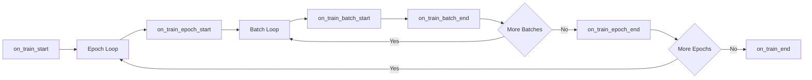

# 自定义 Callbacks (Custom Callbacks)

Callbacks（回调）是在训练过程中的特定时刻执行自定义逻辑的钩子 (hooks)。它们是在不修改核心训练代码的情况下，扩展 Lightning 行为的标准方式。

## Callback 概览

Callbacks 监听训练事件并可以对这些事件做出响应：



## 可用的 Hooks

### 训练生命周期

| Hook | 调用时机 |
| :--- | :--- |
| `on_fit_start` | 在任何训练开始之前 |
| `on_train_start` | 在训练开始时 |
| `on_train_epoch_start` | 在每个 epoch 开始时 |
| `on_train_batch_start` | 在处理每个 batch 之前 |
| `on_train_batch_end` | 在处理每个 batch 之后 |
| `on_train_epoch_end` | 在每个 epoch 结束时 |
| `on_train_end` | 在训练结束时 |

### 验证生命周期

| Hook | 调用时机 |
| :--- | :--- |
| `on_validation_start` | 在验证开始之前 |
| `on_validation_epoch_start` | 在验证 epoch 开始时 |
| `on_validation_batch_start` | 在每个验证 batch 之前 |
| `on_validation_batch_end` | 在每个验证 batch 之后 |
| `on_validation_epoch_end` | 在验证结束时 |
| `on_validation_end` | 在验证之后 |

### 测试和预测

| Hook | 调用时机 |
| :--- | :--- |
| `on_test_start` | 在测试开始之前 |
| `on_test_epoch_start` | 在测试 epoch 开始时 |
| `on_test_batch_start` | 在每个测试 batch 之前 |
| `on_test_batch_end` | 在每个测试 batch 之后 |
| `on_test_epoch_end` | 在测试结束时 |
| `on_test_end` | 在测试之后 |

### 异常处理

| Hook | 调用时机 |
| :--- | :--- |
| `on_exception` | 当发生异常时 |
| `on_save_checkpoint` | 当保存 checkpoint 时 |
| `on_load_checkpoint` | 当加载 checkpoint 时 |

## 完整 Callback 模板

```python
import lightning as L
from lightning import Callback


class MyCallback(Callback):
    """用于训练的自定义 callback。
    
    Args:
        save_dir: 保存制品的目录。
        upload_freq: 上传制品的频率（以 epoch 为单位）。
    """
    
    def __init__(self, save_dir: str = "./logs", upload_freq: int = 1):
        self.save_dir = save_dir
        self.upload_freq = upload_freq
    
    def on_fit_start(self, trainer: L.Trainer, pl_module: L.LightningModule):
        """在训练开始前调用。
        
        Args:
            trainer: Trainer 实例。
            pl_module: 正在训练的 LightningModule。
        """
        print(f"Training starting with {trainer.num_devices} devices")
    
    def on_train_epoch_start(
        self,
        trainer: L.Trainer,
        pl_module: L.LightningModule,
    ):
        """在每个训练 epoch 开始时调用。
        
        Args:
            trainer: Trainer 实例。
            pl_module: 正在训练的 LightningModule。
        """
        self.current_epoch = trainer.current_epoch
    
    def on_train_batch_end(
        self,
        trainer: L.Trainer,
        pl_module: L.LightningModule,
        outputs,
        batch,
        batch_idx,
    ):
        """在每个训练 batch 之后调用。
        
        Args:
            trainer: Trainer 实例。
            pl_module: 正在训练的 LightningModule。
            outputs: training_step 的输出。
            batch: 被处理的 batch。
            batch_idx: batch 的索引。
        """
        pass
    
    def on_train_epoch_end(
        self,
        trainer: L.Trainer,
        pl_module: L.LightningModule,
    ):
        """在每个训练 epoch 结束时调用。
        
        Args:
            trainer: Trainer 实例。
            pl_module: 正在训练的 LightningModule。
        """
        # 从 trainer 获取指标
        metrics = trainer.callback_metrics
        
        # 记录到自定义 logger
        val_loss = metrics.get("val_loss")
        if val_loss is not None:
            print(f"Epoch {trainer.current_epoch}: val_loss={val_loss:.4f}")
    
    def on_exception(
        self,
        trainer: L.Trainer,
        pl_module: L.LightningModule,
        exception: BaseException,
    ):
        """当发生异常时调用。
        
        Args:
            trainer: Trainer 实例。
            pl_module: 正在训练的 LightningModule。
            exception: 抛出的异常。
        """
        print(f"Exception occurred: {exception}")
        
        # 保存紧急 checkpoint
        trainer.save_checkpoint("emergency_ckpt.ckpt")
    
    def on_train_end(self, trainer: L.Trainer, pl_module: L.LightningModule):
        """在训练结束时调用。
        
        Args:
            trainer: Trainer 实例。
            pl_module: 正在训练的 LightningModule。
        """
        print("Training complete!")
```

## 访问 Trainer 状态

Callbacks 能够访问 trainer 和 module 的内部状态：

### Trainer 属性

```python
def on_train_epoch_end(self, trainer, pl_module):
    # 当前状态
    current_epoch = trainer.current_epoch
    global_step = trainer.global_step
    max_epochs = trainer.max_epochs
    
    # 指标
    callback_metrics = trainer.callback_metrics
    logged_metrics = trainer.logged_metrics
    
    # 模型
    model = pl_module
    
    # 设备
    device = pl_module.device
    
    # Checkpoints
    ckpt_path = trainer.checkpoint_callback.best_model_path
    
    # 学习率
    lr = trainer.optimizers[0].param_groups[0]["lr"]
```

### LightningModule 属性

```python
def on_train_epoch_end(self, trainer, pl_module):
    # 超参数
    lr = pl_module.hparams.lr
    
    # 状态
    state = pl_module.state
    
    # 设备
    device = next(pl_module.parameters()).device
```

## 实际用例：上传制品 (Upload Artifacts)

这个 callback 在每个 epoch 结束时将模型 checkpoints 上传到云存储：

```python
import os
import shutil
import lightning as L
from lightning import Callback


class UploadArtifactsCallback(Callback):
    """在 epoch 结束时上传制品到云存储。
    
    Args:
        save_dir: checkpoints 的本地目录。
        remote_path: 远程存储路径 (例如 S3 bucket)。
        upload_freq: 上传的频率 (以 epoch 为单位)。
    """
    
    def __init__(
        self,
        save_dir: str = "./models",
        remote_path: str = "s3://bucket/checkpoints",
        upload_freq: int = 1,
    ):
        self.save_dir = save_dir
        self.remote_path = remote_path
        self.upload_freq = upload_freq
    
    def on_train_epoch_end(
        self,
        trainer: L.Trainer,
        pl_module: L.LightningModule,
    ):
        """每个 epoch 后上传 checkpoint。"""
        # 仅每 upload_freq 个 epoch 上传一次
        if trainer.current_epoch % self.upload_freq != 0:
            return
        
        # 获取最佳 checkpoint
        ckpt_path = trainer.checkpoint_callback.best_model_path
        
        if ckpt_path and os.path.exists(ckpt_path):
            self.upload_to_remote(ckpt_path)
    
    def upload_to_remote(self, local_path: str):
        """上传文件到远程存储。
        
        Args:
            local_path: 本地文件路径。
        """
        filename = os.path.basename(local_path)
        remote_url = f"{self.remote_path}/{filename}"
        
        print(f"Uploading {filename} to {self.remote_path}...")
        
        # 示例: 上传到 S3 (根据你的上传逻辑进行替换)
        # import boto3
        # s3 = boto3.client("s3")
        # s3.upload_file(local_path, "bucket", filename)
        
        print(f"Uploaded: {remote_url}")
```

## 实际用例：学习率自动调节器 (Learning Rate Tuner)

一个可以动态调整学习率的 callback：

```python
import lightning as L
from lightning import Callback


class LearningRateFinderCallback(Callback):
    """通过运行学习率范围测试来微调学习率。
    
    在训练开始时运行此程序以找到最佳的 lr。
    """
    
    def __init__(self, min_lr: float = 1e-6, max_lr: float = 1.0, num_steps: int = 100):
        self.min_lr = min_lr
        self.max_lr = max_lr
        self.num_steps = num_steps
        self.found_lr = None
    
    def on_fit_start(self, trainer: L.Trainer, pl_module: L.LightningModule):
        """运行学习率范围测试。"""
        # 使用 Lightning 内置的学习率查找器
        tuner = trainer.tuner.lr_find(
            pl_module,
            min_lr=self.min_lr,
            max_lr=self.max_lr,
            num_training=self.num_steps,
        )
        
        # 获取建议的学习率
        self.found_lr = tuner.suggested_lr
        
        print(f"Suggested learning rate: {self.found_lr}")
        
        # 更新优化器
        for optimizer in trainer.optimizers:
            for param_group in optimizer.param_groups:
                param_group["lr"] = self.found_lr
```

## 实际用例：梯度裁剪器 (Gradient Clipper)

一个手动进行梯度裁剪的 callback：

```python
import torch
import lightning as L
from lightning import Callback


class GradientClipperCallback(Callback):
    """在每个 batch 结束时裁剪梯度。
    
    Args:
        max_norm: 梯度的最大范数。
    """
    
    def __init__(self, max_norm: float = 1.0):
        self.max_norm = max_norm
    
    def on_train_batch_end(
        self,
        trainer: L.Trainer,
        pl_module: L.LightningModule,
        outputs,
        batch,
        batch_idx,
    ):
        """在每个 batch 后裁剪梯度。"""
        torch.nn.utils.clip_grad_norm_(
            pl_module.parameters(),
            max_norm=self.max_norm,
        )
```

## 实际用例：指标追踪器 (Metric Tracker)

在训练过程中追踪各项指标：

```python
import json
import os
import lightning as L
from lightning import Callback


class MetricsTrackerCallback(Callback):
    """追踪并将指标保存到文件。
    
    Args:
        save_path: 保存指标 JSON 的路径。
    """
    
    def __init__(self, save_path: str = "./logs/metrics.json"):
        self.save_path = save_path
        self.history = {
            "train_loss": [],
            "val_loss": [],
            "val_acc": [],
        }
    
    def on_train_epoch_end(
        self,
        trainer: L.Trainer,
        pl_module: L.LightningModule,
    ):
        """记录指标。"""
        metrics = trainer.callback_metrics
        
        for key in self.history.keys():
            if key in metrics:
                value = metrics[key]
                if hasattr(value, "item"):
                    value = value.item()
                self.history[key].append(value)
        
        # 保存到文件
        os.makedirs(os.path.dirname(self.save_path), exist_ok=True)
        
        with open(self.save_path, "w") as f:
            json.dump(self.history, f, indent=2)
```

## 配合 Hydra 使用

### 配置定义

```yaml
# configs/callbacks/model_checkpoint.yaml
_target_: lightning.pytorch.callbacks.ModelCheckpoint
save_top_k: 1
monitor: val_loss
mode: min
dirpath: ./models
filename: best
save_last: true

# configs/callbacks/early_stopping.yaml
_target_: lightning.pytorch.callbacks.EarlyStopping
monitor: val_loss
patience: 5
mode: min
```

### 自定义 Callback 配置

```yaml
# configs/callbacks/upload_artifacts.yaml
_target_: src.callbacks.UploadArtifactsCallback
save_dir: ./models
remote_path: s3://bucket/checkpoints
upload_freq: 1
```

### 实例化

```python
def instantiate_callbacks(cfg):
    callbacks = []
    
    for name, conf in cfg.items():
        if isinstance(conf, dict) and "_target_" in conf:
            callbacks.append(instantiate(conf))
    
    return callbacks
```

## 最佳实践

### 在 `__init__` 中初始化

```python
def __init__(self, param: str = "default"):
    # 在 __init__ 中初始化 - 只调用一次
    self.param = param
    super().__init__()
```

### 在 Hooks 中访问状态

```python
def on_train_epoch_start(self, trainer, pl_module):
    # 在此处访问 trainer 的状态 - 每个 epoch 调用一次
    self.current_epoch = trainer.current_epoch
```

### 处理异常

```python
def on_exception(self, trainer, pl_module, exception):
    # 发生异常时总是保存状态
    trainer.save_checkpoint("emergency.ckpt")
```

:::caution[避免昂贵操作]
避免在频繁运行的 callback (例如 `on_train_batch_end`) 中执行开销昂贵的操作。如果需要，可以通过 `batch_idx % N == 0` 来使其每 N 个 batch 仅运行一次。
:::

## 创建复合 Callback (Multi-Callback)

```python
class CompositeCallback(Callback):
    """组合多个 callbacks。"""
    
    def __init__(self, callbacks: list):
        self.callbacks = callbacks
    
    def on_train_start(self, trainer, pl_module):
        for cb in self.callbacks:
            cb.on_train_start(trainer, pl_module)
```

## 下一步

- [Optimizer & Scheduler](./optimizer-scheduler): 配置优化器和调度器
- [Logging Metrics](../core-components/logging-metrics): 日志和指标记录
- [Project Structure](../hydra-integration/project-structure): 整体项目组织结构