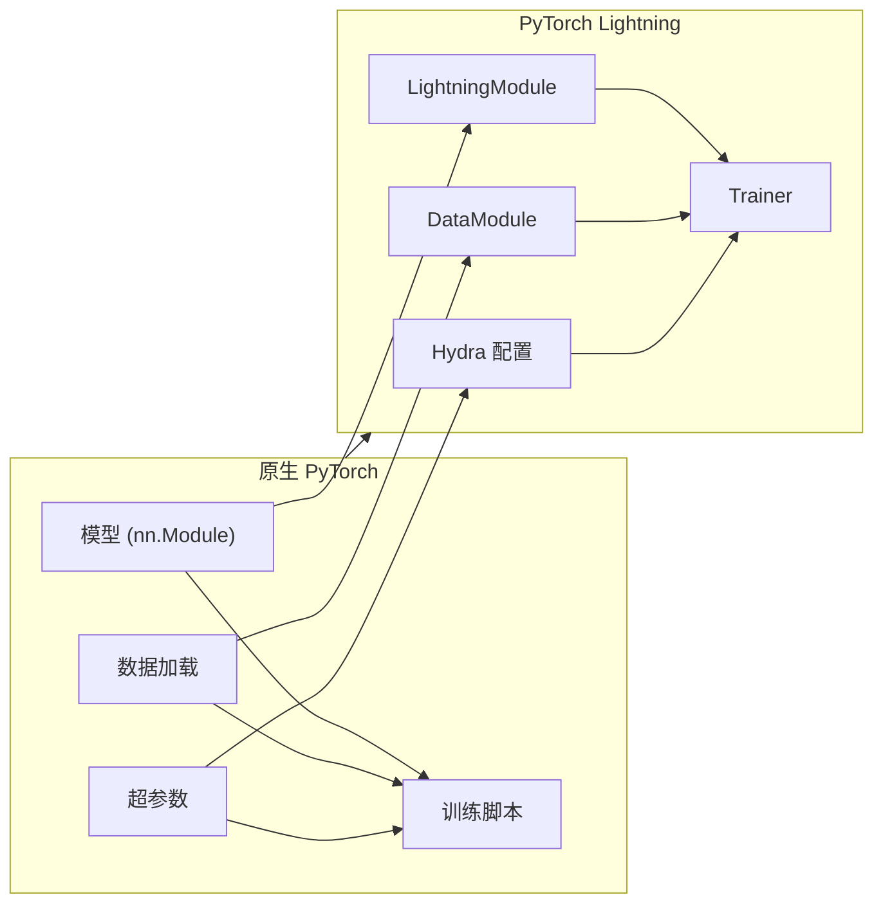

# 从原生 PyTorch 迁移到 Lightning

本指南将带您了解将原生 PyTorch 代码迁移到 PyTorch Lightning 的系统化过程。迁移遵循一个清晰的模式：将模型逻辑提取到 `LightningModule`，将数据处理提取到 `DataModule`，将训练循环提取到 Trainer 钩子（Hooks）中，以及将配置项提取到 Hydra。

:::info[前置知识]
本指南假定您熟悉原生 PyTorch：`nn.Module`、`DataLoader`、`optimizer.step()` 以及 `loss.backward()`。若要复习原生 PyTorch 的基础知识，请参阅 [PyTorch 基础](/docs/deep-learning/pytorch-tutorial/fundamentals/tensor-operations) 章节。
:::

## 为什么要迁移到 Lightning？

使用原生 PyTorch 要求在每个项目中编写重复的训练样板代码：

```python
# 原生 PyTorch：每个脚本中重复相同的样板代码
for epoch in range(num_epochs):
    model.train()
    for batch in dataloader:
        optimizer.zero_grad()
        outputs = model(batch)
        loss = criterion(outputs, targets)
        loss.backward()
        optimizer.step()
    # 验证、检查点、日志记录... 更多的样板代码
```

Lightning 会自动处理这些样板代码，让您可以将精力集中在模型架构和研究逻辑上。

## 贯穿示例：MNIST 分类器

本指南使用一个简单的 MNIST 分类器作为贯穿全文的示例。迁移过程分为四个步骤：

1. 提取模型逻辑 → `LightningModule`
2. 提取数据处理 → `DataModule`
3. 移动循环逻辑 → hooks
4. 移动配置项 → Hydra

---

## 步骤 1：将模型提取到 LightningModule

### 原生 PyTorch 代码

```python
import torch.nn as nn
import torch.optim as optim

class MNISTClassifier(nn.Module):
    def __init__(self):
        super().__init__()
        self.conv1 = nn.Conv2d(1, 32, kernel_size=3)
        self.conv2 = nn.Conv2d(32, 64, kernel_size=3)
        self.pool = nn.MaxPool2d(2)
        self.fc1 = nn.Linear(64 * 12 * 12, 128)
        self.fc2 = nn.Linear(128, 10)
        self.relu = nn.ReLU()

    def forward(self, x):
        x = self.relu(self.conv1(x))
        x = self.relu(self.conv2(x))
        x = self.pool(x)
        x = x.view(x.size(0), -1)
        x = self.relu(self.fc1(x))
        x = self.fc2(x)
        return x
```

### 迁移后的 Lightning 代码

```python
import lightning as L
import torch
import torch.nn as nn


class MNISTClassifier(L.LightningModule):
    def __init__(self, learning_rate: float = 1e-3):
        super().__init__()
        self.save_hyperparameters()
        self.model = nn.Sequential(
            nn.Conv2d(1, 32, kernel_size=3),
            nn.ReLU(),
            nn.Conv2d(32, 64, kernel_size=3),
            nn.ReLU(),
            nn.MaxPool2d(2),
            nn.Flatten(),
            nn.Linear(64 * 12 * 12, 128),
            nn.ReLU(),
            nn.Linear(128, 10),
        )

    def forward(self, x):
        return self.model(x)

    def configure_optimizers(self):
        return torch.optim.Adam(self.parameters(), lr=self.hparams.learning_rate)
```

:::tip[关键变化]
- 继承 `L.LightningModule` 而不是 `nn.Module`
- 调用 `self.save_hyperparameters()` 自动记录超参数
- 定义 `configure_optimizers()`，而不是在训练脚本中创建优化器
- 使用 `nn.Sequential` 更加整洁地定义架构
:::

---

## 步骤 2：将数据提取到 DataModule

### 原生 PyTorch 代码

```python
from torch.utils.data import DataLoader, random_split
from torchvision.datasets import MNIST
from torchvision.transforms import ToTensor

# 训练数据
train_dataset = MNIST(root="./data", train=True, transform=ToTensor())
train_size = int(0.8 * len(train_dataset))
val_size = len(train_dataset) - train_size
train_subset, val_subset = random_split(train_dataset, [train_size, val_size])

train_loader = DataLoader(train_subset, batch_size=32, shuffle=True)
val_loader = DataLoader(val_subset, batch_size=32)

# 测试数据
test_dataset = MNIST(root="./data", train=False, transform=ToTensor())
test_loader = DataLoader(test_dataset, batch_size=32)
```

### 迁移后的 Lightning 代码

```python
import lightning as L
from torch.utils.data import DataLoader, random_split
from torchvision.datasets import MNIST
from torchvision.transforms import ToTensor


class MNISTDataModule(L.LightningDataModule):
    def __init__(self, data_dir: str = "./data", batch_size: int = 32):
        super().__init__()
        self.save_hyperparameters()

    def setup(self, stage: str):
        full_dataset = MNIST(
            root=self.hparams.data_dir,
            train=True,
            transform=ToTensor(),
            download=True,
        )
        train_size = int(0.8 * len(full_dataset))
        val_size = len(full_dataset) - train_size
        self.train_subset, self.val_subset = random_split(
            full_dataset, [train_size, val_size]
        )

    def train_dataloader(self):
        return DataLoader(self.train_subset, batch_size=self.hparams.batch_size, shuffle=True)

    def val_dataloader(self):
        return DataLoader(self.val_subset, batch_size=self.hparams.batch_size)

    def test_dataloader(self):
        return DataLoader(
            MNIST(root=self.hparams.data_dir, train=False, transform=ToTensor()),
            batch_size=self.hparams.batch_size,
        )
```

:::tip[关键变化]
- 继承 `L.LightningDataModule` 以实现可重用的数据处理
- 实现 `setup(stage)` 以进行数据集初始化
- 实现 `train_dataloader()`、`val_dataloader()`、`test_dataloader()`
- DataModule 可以在不同的模型之间重用
:::

---

## 步骤 3：将循环逻辑移动到 Hooks 中

### 原生 PyTorch 完整训练脚本

```python
import torch
import torch.nn as nn
import torch.optim as optim
from torch.utils.data import DataLoader, random_split
from torchvision.datasets import MNIST
from torchvision.transforms import ToTensor


def train_mnist():
    # 模型
    model = MNISTClassifier()
    criterion = nn.CrossEntropyLoss()
    optimizer = optim.Adam(model.parameters(), lr=1e-3)

    # 数据
    train_dataset = MNIST(root="./data", train=True, transform=ToTensor())
    train_size = int(0.8 * len(train_dataset))
    val_size = len(train_dataset) - train_size
    train_subset, val_subset = random_split(train_dataset, [train_size, val_size])
    train_loader = DataLoader(train_subset, batch_size=32, shuffle=True)
    val_loader = DataLoader(val_subset, batch_size=32)

    # 训练循环
    for epoch in range(10):
        model.train()
        train_loss = 0
        for batch_idx, (images, labels) in enumerate(train_loader):
            optimizer.zero_grad()
            outputs = model(images)
            loss = criterion(outputs, labels)
            loss.backward()
            optimizer.step()
            train_loss += loss.item()

        # 验证
        model.eval()
        val_loss = 0
        correct = 0
        total = 0
        with torch.no_grad():
            for images, labels in val_loader:
                outputs = model(images)
                loss = criterion(outputs, labels)
                val_loss += loss.item()
                _, predicted = torch.max(outputs.data, 1)
                total += labels.size(0)
                correct += (predicted == labels).sum()

        print(f"Epoch {epoch+1}: Train Loss={train_loss/len(train_loader):.4f}, "
              f"Val Loss={val_loss/len(val_loader):.4f}, "
              f"Accuracy={100*correct/total:.2f}%")

if __name__ == "__main__":
    train_mnist()
```

### 迁移后的 Lightning 完整实现

```python
import lightning as L
import torch
import torch.nn as nn
import torchmetrics


class MNISTClassifier(L.LightningModule):
    def __init__(self, learning_rate: float = 1e-3):
        super().__init__()
        self.save_hyperparameters()
        self.model = nn.Sequential(
            nn.Conv2d(1, 32, kernel_size=3),
            nn.ReLU(),
            nn.Conv2d(32, 64, kernel_size=3),
            nn.ReLU(),
            nn.MaxPool2d(2),
            nn.Flatten(),
            nn.Linear(64 * 12 * 12, 128),
            nn.ReLU(),
            nn.Linear(128, 10),
        )
        self.criterion = nn.CrossEntropyLoss()
        self.accuracy = torchmetrics.Accuracy(task="multiclass", num_classes=10)

    def forward(self, x):
        return self.model(x)

    def training_step(self, batch, batch_idx):
        images, labels = batch
        outputs = self(images)
        loss = self.criterion(outputs, labels)
        self.log("train_loss", loss, prog_bar=True)
        return loss

    def validation_step(self, batch, batch_idx):
        images, labels = batch
        outputs = self(images)
        loss = self.criterion(outputs, labels)
        self.log("val_loss", loss, prog_bar=True, on_epoch=True)
        acc = self.accuracy(torch.argmax(outputs, dim=1), labels)
        self.log("val_acc", acc, prog_bar=True, on_epoch=True)

    def configure_optimizers(self):
        return torch.optim.Adam(self.parameters(), lr=self.hparams.learning_rate)
```

```python
# trainer.py
import lightning as L
from mnist_module import MNISTClassifier
from mnist_data import MNISTDataModule

dm = MNISTDataModule()
model = MNISTClassifier()

trainer = L.Trainer(max_epochs=10)
trainer.fit(model, dm)
```

:::tip[关键变化]
- 定义 `training_step()` 来编写核心训练逻辑
- 定义 `validation_step()` 用于验证循环
- 使用 `self.log()` 来自动记录指标
- 移除了显式的数据加载、优化器管理和循环结构 —— Trainer 处理了它们
:::

---

## 步骤 4：将配置移动到 Hydra

### 使用硬编码配置的原生 PyTorch

```python
# native_train.py
import torch
# ... 各种导入

# 硬编码配置
LEARNING_RATE = 1e-3
BATCH_SIZE = 32
EPOCHS = 10
DATA_DIR = "./data"

def main():
    model = MNISTClassifier(lr=LEARNING_RATE)
    # ... 其余的训练代码
```

### Hydra 配置结构

```yaml
# config/train.yaml
defaults:
  - _self_
  - model: simple_cnn

model:
  learning_rate: 1e-3

data:
  data_dir: ./data
  batch_size: 32

trainer:
  max_epochs: 10
  accelerator: auto

# config/model/simple_cnn.yaml
learning_rate: 1e-3
```

### 结合 Hydra 后的训练脚本

```python
# train.py
import lightning as L
import hydra
from omegaconf import DictConfig
import torch


@hydra.main(version_base=None, config_path="config", config_name="train")
def main(cfg: DictConfig):
    dm = L.LightningDataModule(**cfg.data)
    model = MNISTClassifier(**cfg.model)

    trainer = L.Trainer(**cfg.trainer)
    trainer.fit(model, dm)


if __name__ == "__main__":
    main()
```

### 结合 Hydra 后的 DataModule

```python
# mnist_data.py
import hydra
import lightning as L
from torch.utils.data import DataLoader, random_split
from torchvision.datasets import MNIST
from torchvision.transforms import ToTensor


@hydra.main(version_base=None, config_path="../config", config_name="data")
class MNISTDataModule(L.LightningDataModule):
    def __init__(self, data_dir: str = "./data", batch_size: int = 32):
        super().__init__()
        self.save_hyperparameters()

    def setup(self, stage: str):
        # 之前的实现逻辑
        pass
```

:::info[Hydra 的优势]
- 无需在代码中搜寻硬编码的超参数
- 所有配置都在一处，且受版本控制
- 命令行覆盖功能：`train.py model.learning_rate=3e-4`
- 通过配置版本化进行可重复的实验
:::

---

## 视觉化迁移概览



---

## 常见迁移错误陷阱

### 忘记调用 `super().__init__()`

```python
# ❌ 错误：缺少 super().__init__()
class MyModel(L.LightningModule):
    def __init__(self):
        self.layer = nn.Linear(10, 10)

# ✅ 正确：调用 super().__init__()
class MyModel(L.LightningModule):
    def __init__(self):
        super().__init__()
        self.layer = nn.Linear(10, 10)
```

### 未定义 `configure_optimizers()`

```python
# ❌ 错误：没有优化器配置
class MyModel(L.LightningModule):
    def forward(self, x):
        return self.layer(x)

# ✅ 正确：定义优化器
class MyModel(L.LightningModule):
    def forward(self, x):
        return self.layer(x)

    def configure_optimizers(self):
        return torch.optim.Adam(self.parameters(), lr=1e-3)
```

### 在 DataModule 中错误返回 DataLoader

```python
# ❌ 错误：在 __init__ 中返回 DataLoader
class MyDataModule(L.LightningDataModule):
    def __init__(self):
        self.train_loader = DataLoader(train_dataset)

# ✅ 正确：实现 dataloader 方法
class MyDataModule(L.LightningDataModule):
    def train_dataloader(self):
        return DataLoader(train_dataset)
```

### 在指标中混合使用 Tensors 和 NumPy

```python
# ❌ 错误：在比较前转换为 numpy
class MyModel(L.LightningModule):
    def validation_step(self, batch, batch_idx):
        preds = self(batch)
        # 与 NumPy 数组比较会导致错误
        return {"preds": preds.numpy(), "targets": batch[1].numpy()}

# ✅ 正确：保持为 tensors
class MyModel(L.LightningModule):
    def validation_step(self, batch, batch_idx):
        preds = self(batch)
        # 直接使用 tensors 进行指标计算
        acc = (preds.argmax(dim=1) == batch[1]).float().mean()
        self.log("val_acc", acc)
```

---

## 支持但不建议的模式

### 手动优化

Lightning 支持 `manual_optimization` 以应对需要自定义梯度行为的情况：

```python
class ManualOptModel(L.LightningModule):
    def __init__(self):
        super().__init__()
        self.layer = nn.Linear(10, 10)

    def training_step(self, batch, batch_idx, optimizer_idx):
        x, y = batch
        pred = self(x)
        loss = nn.functional.cross_entropy(pred, y)
        self.manual_backward(loss)
        return loss

    def optimizer_step(self, epoch, batch_idx, optimizer, optimizer_idx):
        optimizer.step()
        optimizer.zero_grad()
```

:::caution[何时使用手动优化]
仅在以下情况使用手动优化：
- 自定义梯度操作（例如，梯度累积、每层梯度裁剪）
- 带有复杂调度的多个优化器
- 特定于研究的梯度修改

对于标准训练，让 Lightning 自动处理优化即可。
:::

---

## 考虑使用 Lightning Fabric

如果你发现 `LightningModule` 和 `Trainer` 的结构对于一个极其自定义的训练循环来说过于受限，请考虑使用 **Lightning Fabric**（在 v2.0 中引入）。Fabric 提供了完全相同的设备和精度管理，但不会强迫你使用 `training_step` 等钩子。您可以编写自己的训练循环，只需在 `fabric.setup()` 中包装您的优化器和模型。本指南主要关注完整的 `Trainer` 体验，但对于复杂的研究代码，Fabric 是一个很不错的折中选择。

## 快速参考：迁移清单

| 原生 PyTorch | Lightning 等效项 |
|--------------|---------------------|
| `nn.Module` | `L.LightningModule` |
| `optimizer.step()` | `configure_optimizers()` + Trainer |
| `loss.backward()` | `training_step()` 返回 loss |
| 脚本中的 `DataLoader` | `L.LightningDataModule` |
| 硬编码 `lr=1e-3` | `self.save_hyperparameters()` |
| 手动的 epoch 循环 | `Trainer` 自动处理 |
| `print()` 记录日志 | 使用 `self.log()` 自动记录日志 |

---

## 下一步

- [推荐模式](../best-practices/recommended-patterns) — Lightning 开发的最佳实践
- [反模式](../best-practices/anti-patterns) — 应该避免的模式
- 参考 [模板仓库](https://github.com/SAILTECHTEAM/pytorch-lightning-hydra-template) 以获取完整的可用示例
