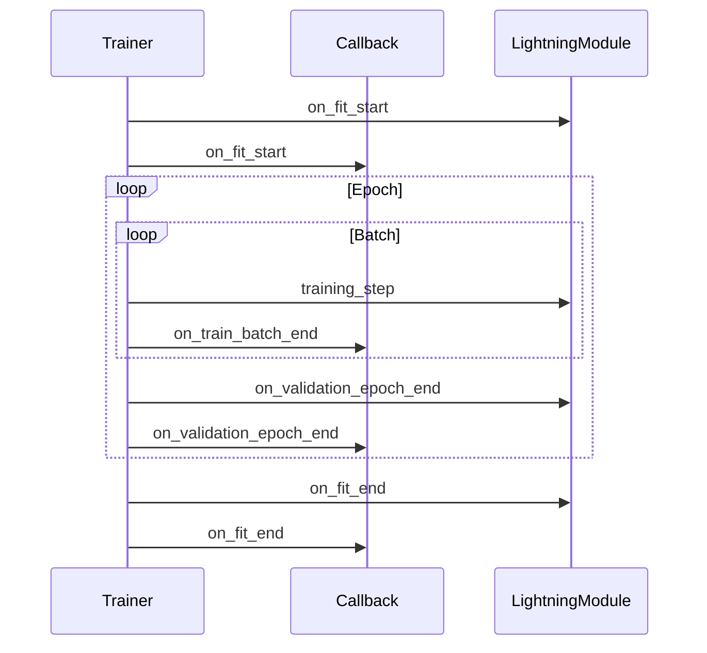

# 推荐模式 (Recommended Patterns)

本指南涵盖了使用 PyTorch Lightning 开发时的推荐模式。遵循这些模式可确保代码易于维护、可复现，并能够专注于研究本身。

## 保持 LightningModule 专注于研究

`LightningModule` 应仅包含特定于研究的逻辑。请将所有工程维度的考虑委托给 Trainer、回调函数或外部工具。

### 属于 LightningModule 的内容

```python
class MyModel(L.LightningModule):
    def __init__(self, learning_rate: float):
        super().__init__()
        self.save_hyperparameters()
        self.encoder = Encoder()
        self.decoder = Decoder()

    def forward(self, x):
        return self.encoder(x)

    def training_step(self, batch, batch_idx):
        # 特定于研究的损失计算
        x, y = batch
        pred = self(x)
        loss = self.compute_research_loss(pred, y)
        self.log("train_loss", loss)
        return loss

    def configure_optimizers(self):
        return torch.optim.Adam(self.parameters(), lr=self.hparams.learning_rate)
```

### 属于 LightningModule 之外的内容

| 关注点 | 位置 |
|---------|----------|
| 检查点保存 (Checkpointing) | `ModelCheckpoint` 回调函数 |
| 早停 (Early stopping) | `EarlyStopping` 回调函数 |
| 学习率调度 | `LearningRateMonitor` + Trainer |
| 梯度裁剪 | Trainer 标志位 |
| 数据预处理 | `DataModule` |
| 实验跟踪 | `MLflowLogger` / `TensorBoardLogger` |

:::tip[单一职责]
如果您的 LightningModule 超过 200 行代码，那么它很可能包含了非研究逻辑。请将数据处理、日志记录或回调函数提取出去。
:::

---

## 使用回调函数处理横切关注点 (Cross-Cutting Concerns)

回调函数用于处理适用于多个训练轮次的功能。永远不要在 LightningModule 中硬编码这类逻辑。

### 常见的内置回调函数

```python
from lightning.pytorch.callbacks import (
    ModelCheckpoint,
    EarlyStopping,
    LearningRateMonitor,
    DeviceStatsMonitor,
)

callbacks = [
    # 根据验证损失保存最佳模型
    ModelCheckpoint(
        dirpath="./checkpoints",
        filename="best-{epoch:02d}-{val_loss:.2f}",
        monitor="val_loss",
        mode="min",
        save_top_k=3,
    ),
    # 如果验证损失连续3个 epoch 没有改善则停止训练
    EarlyStopping(
        monitor="val_loss",
        patience=3,
        mode="min",
    ),
    # 记录学习率调度情况
    LearningRateMonitor(log_interval="step"),
    # 记录 GPU 内存使用情况
    DeviceStatsMonitor(),
]

trainer = L.Trainer(
    callbacks=callbacks,
    # ...
)
```

### 自定义回调函数

```python
class CustomMetricLogger(L.Callback):
    def __init__(self, log_every_n_steps: int = 100):
        self.log_every_n_steps = log_every_n_steps

    def on_train_batch_end(self, trainer, pl_module, outputs, batch, batch_idx):
        if batch_idx % self.log_every_n_steps == 0:
            # 自定义日志记录逻辑
            pass
```

### 回调函数执行顺序



:::info[回调函数的返回值]
回调函数不能直接改变训练行为。应使用钩子 (hooks) 来触发副作用 (如日志记录、检查点保存)。训练循环由 `training_step` 的返回值来控制。
:::

---

## 使用 Hydra 进行实验管理

Hydra 管理配置和实验运行。与 Lightning 结合使用可实现可复现的研究。

### 推荐的配置结构

```text
config/
├── train.yaml              # 主配置文件
├── model/
│   ├── transformer.yaml
│   └── resnet.yaml
├── data/
│   ├── cifar10.yaml
│   └── imagenet.yaml
└── trainer/
    ├── default.yaml
    └── debug.yaml
```

### 带有默认值的主配置文件

```yaml
# config/train.yaml
defaults:
  - _self_
  - model: transformer
  - data: cifar10
  - trainer: default

model:
  learning_rate: 1e-3
  dropout: 0.1

data:
  batch_size: 32
  num_workers: 4

trainer:
  max_epochs: 100
  accelerator: auto
```

### 训练入口点

```python
# train.py
import hydra
from omegaconf import DictConfig
import lightning as L


@hydra.main(version_base=None, config_path="config", config_name="train")
def main(cfg: DictConfig):
    dm = create_datamodule(cfg.data)
    model = create_model(cfg.model)

    trainer = L.Trainer(**cfg.trainer)
    trainer.fit(model, dm)


if __name__ == "__main__":
    main()
```

### 命令行覆盖配置

```bash
# 覆盖学习率
python train.py model.learning_rate=3e-4

# 覆盖模型架构
python train.py model=resnet data=imagenet

# 覆盖多个参数
python train.py model.learning_rate=1e-4 trainer.max_epochs=50
```

:::tip[Hydra + Lightning]
在训练函数上使用 `@hydra.main()` 装饰器。通过 `**cfg.group` 将 `cfg` 参数直接传递给 Lightning 组件。
:::

---

## 使用 TorchMetrics

TorchMetrics 提供了标准化的指标计算方式，并在分布式训练中保证了正确的同步。

### 推荐的指标使用方法

```python
import torchmetrics
import lightning as L


class MyModel(L.LightningModule):
    def __init__(self):
        super().__init__()
        self.accuracy = torchmetrics.Accuracy(task="multiclass", num_classes=10)
        self.f1 = torchmetrics.F1Score(task="multiclass", num_classes=10)
        self.confusion = torchmetrics.ConfusionMatrix(task="multiclass", num_classes=10) # 修正: 添加了 task="multiclass"

    def validation_step(self, batch, batch_idx):
        x, y = batch
        pred = self(x)

        # 更新指标状态
        self.accuracy(pred, y)
        self.f1(pred, y)
        self.confusion(pred, y)

        # 记录计算出的值
        self.log("val_acc", self.accuracy, prog_bar=True)
        self.log("val_f1", self.f1, prog_bar=True)

    def on_validation_epoch_end(self):
        # 在 epoch 结束时记录混淆矩阵
        self.log("confusion_matrix", self.confusion.compute())
        # 注意：通常 TorchMetrics 会在 epoch 结束自动 reset()
```

### 指标同步

在分布式训练 (DDP) 中，必须同步指标：

```python
# ❌ 错误：未跨设备同步
def validation_step(self, batch, batch_idx):
    pred = self(batch)
    acc = (pred.argmax() == batch[1]).mean()  # 仅在单个设备上计算

# ✅ 正确：使用 sync_dist 进行分布式同步
def validation_step(self, batch, batch_idx):
    pred = self(batch)
    acc = (pred.argmax() == batch[1]).float()
    self.log("val_acc", acc, sync_dist=True, reduce_epoch=True) # 注意 reduce_epoch 参数不属于官方self.log，正确做法是依靠 TorchMetrics
```

### 常见指标

| 指标 | 用例 | 分布式支持 |
|--------|----------|---------------------|
| `Accuracy` | 分类准确率 | ✓ |
| `F1Score` | F1 分数 | ✓ |
| `AUROC` | ROC AUC | ✓ |
| `MeanAbsoluteError` | 回归 MAE | ✓ |
| `ConfusionMatrix` | 混淆矩阵 | ✓ |

:::caution[指标状态重置]
请始终在 `on_validation_epoch_end()` 中或验证开始时重置指标状态 (如果手动控制计算)：
```python
def on_validation_epoch_end(self):
    self.accuracy.reset()
```
:::

---

## 调试策略

Lightning 提供了内置的调试标志位，以实现快速迭代。

### Fast Dev Run

使用单个 batch 测试整个 pipeline：

```python
trainer = L.Trainer(fast_dev_run=True)
# 运行：1个训练步 + 1个验证步
```

### Overfit Batches (过拟合批次)

验证模型是否能够在小数据集上过拟合：

```python
trainer = L.Trainer(
    overfit_batches=5,  # 使用5个 batch 进行过拟合
)
# 如果损失没有降到接近于零，说明模型容量不足
```

### Limit Batches (限制批次)

限制批次数量以进行快速迭代：

```python
trainer = L.Trainer(
    limit_train_batches=100,  # 使用前 100 个 batch
    limit_val_batches=50,     # 使用前 50 个验证 batch
)
```

### 异常检测 (Detect Anomalies)

开启梯度异常检测：

```python
trainer = L.Trainer(
    gradient_clip_val=1.0,
    detect_anomaly=True,  # 遇到 NaN/Inf 梯度时引发 RuntimeError
)
```

### 调试标志位总结

| 标志位 | 目的 | 速度 |
|------|---------|-------|
| `fast_dev_run` | 测试完整的 pipeline | 最快 |
| `overfit_batches` | 验证模型容量 | 快 |
| `limit_train_batches` | 限制训练迭代次数 | 快 |
| `detect_anomaly` | 查找梯度问题 | 正常 |

:::tip[推荐工作流]
1. 首先使用 `fast_dev_run=True` 验证无错误
2. 使用 `overfit_batches=5` 确认模型能够学习
3. 移除标志位进行全量训练
:::

---

## 测试 DataModule

DataModule 应独立于模型进行测试。

### 测试数据加载

```python
def test_mnist_data_module():
    dm = MNISTDataModule(data_dir="./test_data", batch_size=32)
    dm.setup("fit")

    train_loader = dm.train_dataloader()
    batch = next(iter(train_loader))

    # 验证 batch 结构
    assert len(batch) == 2
    images, labels = batch
    assert images.shape[0] == 32  # batch size
    assert images.shape[1:] == (1, 28, 28)  # MNIST shape
    assert labels.shape[0] == 32
```

### 测试数据增强

```python
def test_data_augmentation():
    import torchvision.transforms as T

    transform = T.Compose([
        T.RandomHorizontalFlip(),
        T.ToTensor(),
    ])

    dataset = MNIST(root="./test_data", transform=transform, download=True)
    sample = dataset[0]

    # 验证是否应用了增强
    assert isinstance(sample[0], torch.Tensor)
```

### 测试可复现性

```python
def test_deterministic_split():
    import torch

    # 设置随机种子以保证可复现性
    torch.manual_seed(42)
    dm = MNISTDataModule()
    dm.setup("fit")

    # 保存第一个验证样本
    val_loader = dm.val_dataloader()
    first_sample = next(iter(val_loader))

    # 使用相同的种子重置
    torch.manual_seed(42)
    dm2 = MNISTDataModule()
    dm2.setup("fit")

    val_loader2 = dm2.val_dataloader()
    first_sample2 = next(iter(val_loader2))

    # 验证划分是否相同
    assert torch.equal(first_sample[1], first_sample2[1])
```

---

## 日志记录最佳实践

### 一致的命名

```python
def training_step(self, batch, batch_idx):
    # ✅ 一致：所有指标均以 stage 为前缀
    self.log("train/loss", loss)
    self.log("train/accuracy", acc)

def validation_step(self, batch, batch_idx):
    # ✅ 一致：区分 train/val 命名空间
    self.log("val/loss", loss)
    self.log("val/accuracy", acc)
```

### 在适当的频率下记录

```python
def training_step(self, batch, batch_idx):
    loss = self.compute_loss(batch)

    # 训练损失：每一步都记录
    self.log("train/loss", loss, on_step=True, on_epoch=False, prog_bar=True)

    return loss


def validation_step(self, batch, batch_idx):
    # 验证：在 epoch 结束时记录
    self.log("val/loss", loss, on_step=False, on_epoch=True)
```

### 日志记录总结

| 场景 | `on_step` | `on_epoch` | `prog_bar` |
|----------|-----------|------------|------------|
| 训练损失 | ✓ | | |
| 验证损失 | | ✓ | ✓ |
| 学习率 | ✓ | | ✓ |
| 指标 (epoch级别) | | ✓ | ✓ |

---

## 快速参考：模式总结

| 模式 | 推荐方案 | 位置 |
|---------|--------------|----------|
| 模型逻辑 | 仅限于研究逻辑 | LightningModule |
| 检查点保存 | 回调函数 | `ModelCheckpoint` |
| 早停机制 | 回调函数 | `EarlyStopping` |
| LR调度 | 内置 | Trainer |
| 配置管理 | Hydra | Config 文件 |
| 指标评估 | TorchMetrics | LightningModule |
| 调试排错 | 标志位 | Trainer |
| 数据处理 | DataModule | DataModule |

---

## 下一步骤

- [反模式 (Anti-Patterns)](./02-anti-patterns.mdx) — 需要避免的模式
- [模板仓库 (Template Repository)](https://github.com/SAILTECHTEAM/pytorch-lightning-hydra-template) — 完整的可运行示例
