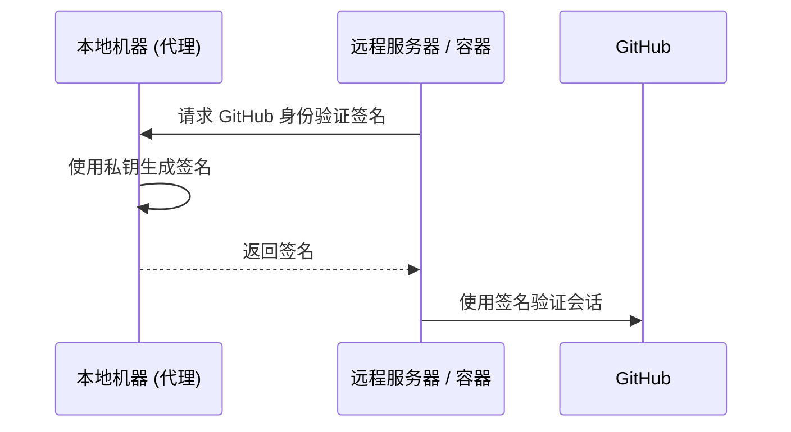

# SSH 访问安全

对远程服务器和 Git 仓库的安全访问从根本上建立在 **SSH (Secure Shell)** 协议之上。我们利用非对称加密技术，确保身份验证凭据永远不会在网络上传输，并仅存储在您的本地计算机上。

## SSH 加密基础

SSH 身份验证依赖于由两个数学相关文件组成的 **公私钥对**。

| 组件 | 默认路径 | 用途 |
| :--- | :--- | :--- |
| **私钥** | `~/.ssh/id_ed25519` | **受限访问。** 仅存储在您的本地计算机上。 |
| **公钥** | `~/.ssh/id_ed25519.pub` | **公开分发。** 分发到服务器和 GitHub。 |

:::tip[算法建议]
我们为所有新密钥对统一采用 **Ed25519** 算法。与旧的 RSA 标准相比，它具有更优越的性能和更高的安全性。
:::

---

## 基础设施设置指南

### 生成密钥对
执行以下命令生成新的密钥对：
```bash
ssh-keygen -t ed25519 -C "your_email@example.com"
```
:::note[密码处理]
接受默认存储路径并为本地加密提供强密码。
:::

### 使用 SSH 代理进行管理
使用 SSH 代理在内存中管理已解密的密钥，从而无需为每次连接重新输入密码。
```bash
# 初始化 SSH 代理
eval "$(ssh-agent -s)"

# 向代理注册私钥
ssh-add ~/.ssh/id_ed25519
```

### 与 GitHub 集成
获取您的公钥并将其添加到您的 **GitHub 设置 → SSH and GPG keys** 中。
```bash
# 复制到剪贴板或显示公钥
cat ~/.ssh/id_ed25519.pub
```

### 连接验证
```bash
ssh -T git@github.com
# 预期输出: "Hi <username>! You've successfully authenticated..."
```

---

## 高级工作流：代理转发 (Agent Forwarding)

**代理转发** 允许在远程会话（例如，在服务器或 Docker 容器内）中使用本地 SSH 密钥，而无需将私钥复制到这些环境中。

### 身份验证工作流



### Docker 实现
挂载主机的 SSH 代理套接字以在容器内启用转发：
```bash
docker run -it \
  -v $SSH_AUTH_SOCK:/run/host-services/ssh-auth.sock \
  -e SSH_AUTH_SOCK=/run/host-services/ssh-auth.sock \
  my-engineering-image bash
```

:::caution[安全协议]
仅在连接到 **受信任的** 基础设施时使用代理转发。受损的远程 root 用户可能会利用您的转发代理套接字以您的身份进行身份验证。
:::

---

## SSH 配置策略

通过在 `~/.ssh/config` 中定义主机别名来优化连接工作流：

```text title="~/.ssh/config"
Host production-server
    HostName 10.0.0.50
    User deploy-user
    ForwardAgent yes
    IdentityFile ~/.ssh/id_ed25519
```
*工作流效率：* 执行 `ssh production-server` 即可连接，无需手动指定参数。

---

## GitHub Deploy Key

**Deploy Key** 是绑定到 GitHub **单个仓库** 的 SSH 公钥。每把密钥只能访问它所绑定的那个仓库，权限只能选择 **只读** 或 **读写**。它不同于 **细粒度个人访问令牌 (Fine-grained PAT)**——后者可以按 `Issues`、`Contents` 等资源逐项授权。

适用于服务器、CI 或本机需要用一把独立 SSH 密钥访问**唯一指定仓库**的场景：

- **克隆 / fetch / pull** —— 使用只读 Deploy Key。
- **推送构建产物或部署配置** —— 使用带写权限的 Deploy Key。
- **不要** 将同一把 Deploy Key 复用于多个 GitHub 仓库；GitHub 要求每个仓库使用独立的 Deploy Key。

以下示例假设目标仓库是：

```text
github.com/acme/demo.git
```

并为它创建专用密钥：

```text
~/.ssh/id_ed25519_acme_demo
```

### 创建专用 Deploy Key

在需要访问仓库的机器、服务器或 CI 执行机上运行：

```bash
mkdir -p ~/.ssh
chmod 700 ~/.ssh

ssh-keygen -t ed25519 \
  -C "deploy-key-acme-demo" \
  -f ~/.ssh/id_ed25519_acme_demo
```

命令会询问是否设置 passphrase：

```text
Enter passphrase (empty for no passphrase):
```

- **个人使用的电脑** —— 建议设置一个强 passphrase。
- **无人值守的 CI / 部署机器** —— 通常留空，并把私钥放入该平台的加密 Secret 中，务必严格限制 Secret 的读取权限。

生成后会得到两个文件：

```text
~/.ssh/id_ed25519_acme_demo       # 私钥：绝不可上传或提交
~/.ssh/id_ed25519_acme_demo.pub   # 公钥：添加到 GitHub
```

查看并复制公钥：

```bash
cat ~/.ssh/id_ed25519_acme_demo.pub
```

私钥权限应为仅当前用户可读：

```bash
chmod 600 ~/.ssh/id_ed25519_acme_demo
```

### 将 Key 限定到仓库

在 GitHub 网页中打开目标仓库 **`acme/demo`**：

1. 点击 **Settings**。
2. 在左侧栏点击 **Deploy keys**。
3. 点击 **Add deploy key**。
4. 填写标题，例如 `prod-server-demo-readonly`。
5. 将 `id_ed25519_acme_demo.pub` 的完整内容粘贴到 **Key** 字段。
6. 按需选择权限：
   - **不勾选 `Allow write access`** —— 只读，可 clone、fetch、pull。
   - **勾选 `Allow write access`** —— 可读写，可 push。
7. 点击 **Add key** 保存。

:::caution[权限范围]
Deploy Key 是仓库级 SSH Key：一把 Key 只授予单个仓库访问权。开启写权限后，该 Key 可向该仓库推送代码，因此只在确有自动化写入需求时才开启。
:::

:::note[找不到设置入口]
如果在仓库中看不到 **Settings** 或 **Deploy keys**，说明你没有足够的仓库管理权限，需请仓库管理员添加公钥。
:::

### 配置 SSH 别名

编辑 SSH 客户端配置文件：

```bash
nano ~/.ssh/config
```

加入以下内容：

```text title="~/.ssh/config"
Host github-acme-demo
  HostName github.com
  User git
  IdentityFile ~/.ssh/id_ed25519_acme_demo
  IdentitiesOnly yes
```

保存后设置配置文件权限：

```bash
chmod 600 ~/.ssh/config
```

字段含义：

| 配置 | 用途 |
| :--- | :--- |
| `Host github-acme-demo` | 本机自定义别名，不是 GitHub 的真实域名。 |
| `HostName github.com` | GitHub 的实际 SSH 主机。 |
| `User git` | GitHub SSH 固定使用 `git` 用户。 |
| `IdentityFile ...` | 指定该仓库专用的私钥。 |
| `IdentitiesOnly yes` | 强制 SSH 只使用这条配置的 key，避免回退到 agent 中的其他 key。 |

### 用专用 Key 克隆

克隆 URL **必须** 使用 SSH 别名 `github-acme-demo`，**不能继续写 `github.com`**：

```bash
git clone git@github-acme-demo:acme/demo.git
```

克隆完成后，确认远程地址：

```bash
cd demo
git remote -v
```

预期输出：

```text
origin  git@github-acme-demo:acme/demo.git (fetch)
origin  git@github-acme-demo:acme/demo.git (push)
```

此后在 `demo` 目录执行：

```bash
git pull
git fetch
git push
```

都会匹配 `Host github-acme-demo`，因此使用 `~/.ssh/id_ed25519_acme_demo`。其他仍使用 `git@github.com:OWNER/REPO.git` 的仓库不受该别名影响。

#### 已存在的仓库

如果仓库已经克隆下来，进入该仓库并修改 `origin`：

```bash
cd /path/to/demo

git remote set-url origin git@github-acme-demo:acme/demo.git
git remote -v
```

这样只会修改当前仓库的 `.git/config` 中的远程 URL，不会影响其他本地仓库。

### 验证连接

测试 SSH 是否确实使用该 Key：

```bash
ssh -T git@github-acme-demo
```

查看详细调试信息：

```bash
ssh -vT git@github-acme-demo
```

输出中应能找到类似内容：

```text
Offering public key: /home/your-user/.ssh/id_ed25519_acme_demo
```

随后测试 Git 读取权限：

```bash
git ls-remote origin
```

若该 Key 是只读权限，则以下操作应成功：

```bash
git pull
```

而以下操作应被 GitHub 拒绝：

```bash
git push
```

若你在 GitHub 为该 Key 启用了 **Allow write access**，则 `git push` 可以成功。

### 常见问题

#### `Permission denied (publickey)`

检查私钥文件是否存在、权限是否为 `600`，以及 SSH 是否读取到了正确配置：

```bash
ssh -vT git@github-acme-demo
```

确认调试日志中包含专用私钥路径：

```text
id_ed25519_acme_demo
```

若没有，检查 `~/.ssh/config` 的 `Host` 名称是否与 Git remote URL 中的主机名完全一致。

#### 克隆时仍使用默认 Key

通常是 remote URL 仍然写成：

```text
git@github.com:acme/demo.git
```

应改为：

```bash
git remote set-url origin git@github-acme-demo:acme/demo.git
```

#### 无法 Push

先确认 GitHub 仓库的 **Settings → Deploy keys** 中，该 Key 是否已启用 **Allow write access**。未开启时 Deploy Key 设计上就是只读。

#### 组织使用 SSO

Deploy Key 与账号级 SSH Key 的管理方式相互独立。若改用账号 SSH Key 访问启用 SSO 的组织，则需在 **GitHub → SSH and GPG keys → Configure SSO → Authorize** 中对该 Key 进行针对该组织的授权。

---

:::tip[最佳实践]
定期审核远程服务器上的 `~/.ssh/authorized_keys` 文件，确保只有当前授权的密钥处于活动状态。
:::
