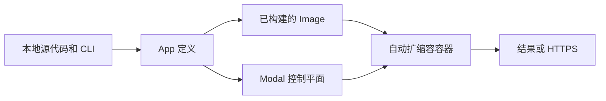

# Modal

Modal 在托管的自动扩缩容容器中运行 Python 函数。当运维集群带来的工作量大于价值时，可将其用于并行批处理、机器学习训练或推理、定时作业和 HTTP 服务。对于小型本地作业、需要主机级控制的工作负载，或已有基础设施能够良好支持的系统，Modal 不太适用。

## 执行模型

Modal 程序使用 Python 声明应用及其容器要求。CLI 将该定义发送到 Modal；Modal 构建 Image，并在 Function 收到任务时启动容器。各 Function 独立扩缩容，空闲时通常缩容至零。



大多数应用只需要以下四类对象：

- **App** 将 Function 和容器类组合成一次临时运行或一次原子部署。
- **Function** 是远程执行单元，拥有独立的资源和扩缩容行为。
- **Image** 定义容器中可用的 Python 版本、软件包、系统依赖项和文件。
- **容器类** 将共享容器初始化过程和状态的远程方法组合在一起。

Volume 提供持久化文件，Secret 则将敏感配置注入容器，而无需写入源代码。

:::caution[本地导入与远程导入]
Modal 可能在本地和远程容器内导入同一个模块。不要在模块作用域无条件读取仅存在于本地的文件；应将数据作为参数传入、把文件添加到 Image，或使用 [`modal.is_local()`](https://modal.com/docs/guide/global-variables)。
:::

## 运行并行 CPU 工作负载

创建 `modal_primes.py`。以下完整示例先进行一次阻塞式远程调用，再使用 `.map()` 分发相互独立的输入：

```python title="modal_primes.py"
from math import isqrt

import modal

app = modal.App("modal-primes")
image = modal.Image.debian_slim(python_version="3.12")


@app.function(image=image, cpu=1)
def count_primes(limit: int) -> int:
    def is_prime(number: int) -> bool:
        if number < 2:
            return False
        return all(number % divisor for divisor in range(2, isqrt(number) + 1))

    return sum(is_prime(number) for number in range(limit))


@app.local_entrypoint()
def main():
    print(count_primes.remote(100_000))

    limits = [100_000, 110_000, 120_000]
    print(list(count_primes.map(limits)))
```

安装客户端、完成身份验证并运行应用：

```bash
pip install modal
modal setup
modal run modal_primes.py
```

本地入口点在本地计算机上运行。`.remote()` 等待一个远程结果，`.map()` 则并行处理输入，并按输入顺序生成结果。

## 核心功能

### GPU

为 Function 或容器类请求受支持的 GPU。将支持 GPU 的库（例如启用 CUDA 的 PyTorch）添加到其 Image 中；请求 GPU 只会提供硬件，不会安装使用该硬件的软件。

```python
@app.function(image=image, gpu="L4")
def train():
    run_training()
```

`gpu="L4"` 会为服务此 Function 的每个活跃容器提供一块 L4 GPU。Modal 可能在多次调用之间复用热容器；如果 Function 横向扩容，每个新增容器都会获得独立的 GPU。应根据实测的内存和吞吐量要求选择 GPU，而不是只看标称规格。

### 容器类生命周期

当每个容器都需要仅初始化一次高开销状态，并在多次调用之间复用该状态时，使用容器类。

```python
@app.cls(gpu="L4")
class Model:
    @modal.enter()
    def load(self):
        self.model = load_model()

    @modal.method()
    def predict(self, prompt):
        return self.model.generate(prompt)
```

调用 `Model().predict.remote(prompt)` 会启动或复用由 L4 支持的容器。
每个新容器启动时，`load()` 运行一次；该容器处理的后续调用会复用已加载的模型。

### Web Function

使用 Web 装饰器通过 HTTPS 公开 Function。`modal serve` 创建开发 URL；`modal deploy` 创建持久部署。

```python
web_image = image.uv_pip_install("fastapi[standard]")


@app.function(image=web_image)
@modal.fastapi_endpoint(requires_proxy_auth=True)
def health():
    return {"status": "ok"}
```

`requires_proxy_auth=True` 使用 Modal 代理令牌保护端点。未配置代理身份验证或应用身份验证时，Web Function 可被公开访问。

### 定时任务

为 Function 绑定计划，并部署 App 以启用该计划。

```python
@app.function(schedule=modal.Cron("0 8 * * 1", timezone="Asia/Shanghai"))
def weekly_refresh():
    print("Refresh the index")
```

使用 `modal.Cron` 设置按墙上时钟执行的计划，使用 `modal.Period` 设置从部署时刻开始计算的时间间隔。

## 运维注意事项

- 远程参数、结果和异常会跨越序列化边界。传递存储引用，不要传递大型载荷。
- 冷启动时间取决于 Image 大小、初始化过程和硬件可用性。保持 Image 和启动工作精简。
- 容器本地文件是临时的，可变进程状态可能在多次调用之间保留。将必要状态持久化到外部存储。
- 为容易失败的工作设置超时和重试，并保护所有非有意公开的 Web Function。
- 计算和存储均按用量计费。在选择资源或热容器之前，查看 [Modal 定价](https://modal.com/pricing)。

## 延伸阅读

- [App、Function 和入口点](https://modal.com/docs/guide/apps)
- [Image](https://modal.com/docs/guide/images)
- [GPU 加速](https://modal.com/docs/guide/gpu)
- [Web Function](https://modal.com/docs/guide/webhooks)
- [Volume](https://modal.com/docs/guide/volumes)
