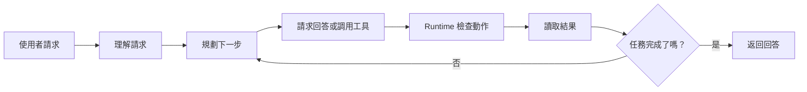
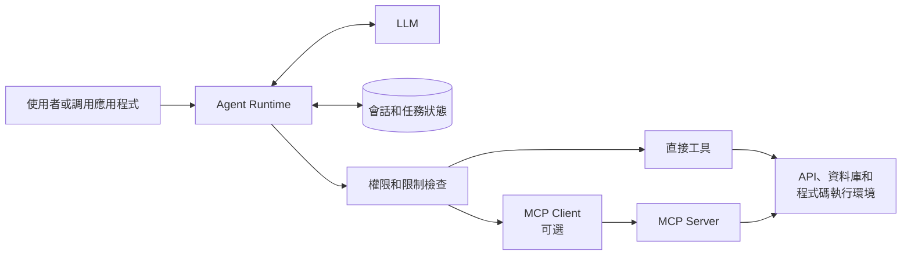
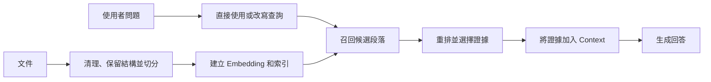

# Agent 系統概覽

LLM 可以根據 Prompt 中的資訊回答問題，但它不知道使用者正在查看應用程式裡的哪條記錄，也不能獨自修改那條記錄。Agent 系統是圍繞模型的應用程式，它以受控的方式讓模型使用資訊和外部能力。

:::info[本文範圍]
本文把 **Agent 系統** 定義為「LLM 加上管理 Context、State 和可選工具的應用程式」。這是實用的工程定義，不是 Agent 的唯一理論定義。
:::

## 從一個簡單請求開始

假設圖書館使用者說：

> 幫我續借這本書。

單獨的聊天模型無法完成這個請求。它不知道「這本書」指什麼，不知道使用者是否擁有這條借閱記錄，也不知道圖書館是否允許再次續借。它同樣無法修改圖書館記錄。

Agent 系統可以找到目前借閱記錄、檢查規則、調用圖書館服務，並告知使用者已經確認的結果。這項工作遵循一個循環。

**理解請求** 是識別使用者、任務和已經掌握的資訊。在這個例子中，系統利用會話和目前借閱資料，確定「這本書」的實際含義。

**規劃下一步** 不一定是制定很長的計劃。簡單請求可能只需要一次工具調用；複雜請求可能需要多個清晰且可驗證的步驟。關鍵在於每個步驟都有明確目的，並產生可供下一步使用的結果。

**行動和觀察** 是指模型可以請求一項動作，系統執行獲批准的動作，模型再收到結果。如果圖書館 API 返回續借次數已達上限，系統不會假稱續借成功；它可以說明結果，或選擇另一個允許的下一步。

有些問題不需要工具。例如「什麼是借書證？」可以直接回答。相同的循環仍然適用：模型只是選擇返回回答，而非請求動作。ReAct 是推理與工具使用模式的常見名稱，但不是每個 Agent 都必須採用的方式。

系統還需要明確的停止規則。任務完成、後續動作不被允許、達到預算，或需要人工審查時，系統應停止。沒有停止規則，失敗的任務可能變成不斷重複的工具調用和越來越沒有根據的回答。

## Runtime 把任務組織起來

**Runtime** 是運行這個循環的應用程式部分，它不是另一個 LLM。它準備模型輸入、保存任務資訊、執行規則、調用工具，並決定任務何時結束。

Runtime 可以遵循固定規則、工作流程，或兩者結合。它不需要像模型一樣「理解」請求。例如，固定規則可以讀取目前使用者的活躍借閱記錄，再由模型判斷使用者是想續借、取消，還是查看其中某一條記錄。

### Context：模型目前看到的資訊

**Context** 是一次模型調用中發送給模型的選定資訊。對於續借請求，它可以包含使用者訊息、選定借閱記錄、續借政策、最近的對話，以及續借工具的說明。

Runtime 應選擇對目前步驟有用的資訊。把所有資料庫記錄、所有歷史訊息和所有可用工具都發送給模型，會讓 Prompt 更難使用，也會消耗模型的 Context Window。Context Window 是模型單次調用可處理的輸入和輸出上限，不是 Memory 系統。

### Session 和 State：任務需要保存的資訊

**Session** 標識一條正在進行的對話或任務。它讓系統可以把「這本書」與同一互動中使用者先前選擇的圖書關聯起來。

**State** 是任務運行期間保存的結構化資訊。目前借閱記錄、使用者權限、已經調用的工具和返回的到期日都屬於 State。將這類資料保存在模型外部，Runtime 才能可靠地檢查和更新它。

系統常把最近對話歷史和暫時任務資料稱為「短期 Memory」或「工作 Memory」。名稱各不相同，但目的相同：保存繼續目前任務所需的資訊，避免使用者反覆說明相同內容。

### Memory：以後可能有用的資訊

**Memory** 是為了後續任務或對話而保存的資訊。它可以保存使用者的通知語言偏好、長對話的摘要，或資料庫中的領域知識。

Memory 不會自動變成 Context。Runtime 會檢索並選擇相關部分。對於很長的對話，系統可以保存使用者目標、限制條件和先前決定的摘要，而不是重複發送每一句話。摘要可以節省空間，但會遺漏細節；必要的重要事實和決定還應保存在可靠的結構化 State 中。

## 透過 Tool 執行動作

**Tool** 為 Agent 提供模型以外的具體能力：本地函式、SDK 調用、HTTP API、資料庫查詢、搜尋服務或程式碼執行環境。在圖書館例子中，`renew_loan` 就是一個 Tool。

模型請求 Tool 前，Runtime 會向模型提供它的說明。說明通常包括 Tool 名稱、用途和可接受的輸入。模型返回結構化請求，例如借閱記錄識別碼。隨後 Runtime 驗證請求、執行權限和業務檢查、調用 Tool，並驗證結果。

Tool 說明定義了目前任務中 Agent 的能力邊界。模型只能請求 Runtime 已暴露的 Tool；它不會因為能夠描述另一個動作就自動獲得權限。例如，銀行 Agent 不會因為知道如何點餐就能下食品訂單，除非 Runtime 有意接入並授權了這項能力。

### 直接 Tool 與 MCP

Runtime 可以直接調用 Tool。當一個應用程式擁有少量自身的 API 或函式時，這通常是最清晰的選擇。

[Model Context Protocol（MCP）](https://modelcontextprotocol.io/specification/2026-07-28/architecture) 是另一種選擇。作為 MCP Host 的應用程式建立 Client，並與 MCP Server 通訊。Server 可以暴露 Tool、資源和提示。MCP Server 可以封裝目錄 API、檔案系統或其他現有服務，讓多個相容應用程式使用它。

MCP 是應用程式與能力之間的連接協議，不取代業務邏輯、存取控制或 Runtime。從 MCP Server 讀取到 Tool 說明，不代表使用者已經獲得調用它的授權。

| 選擇 | 通常適合的場景 |
| :--- | :--- |
| 直接接入 Tool | 一個應用調用少量應用專屬的函式或 API。 |
| 接入 MCP | 多個相容 Host 需要透過一個標準 Server 介面共享能力。 |

兩種方式可以同時存在於同一個 Agent 中。應根據所有權、重用需求和運行成本選擇，而不是把 MCP 當成必經層。

## Skill 提供任務指導

有些任務不只需要 Tool 列表。處理支援請求可能有批准的流程、參考資料和僅適用於此類任務的腳本。每次請求都載入全部材料會浪費 Context，也會讓模型更難選擇。

**Skill** 將特定任務的指導打包，讓系統在需要時載入。例如，分析 Excel 的 Skill 可以只在使用者要求分析試算表時，提供推薦流程、參考檔案和可選腳本。

Skill 的格式取決於使用它的系統。[Agent Skills 規範](https://agentskills.io/specification) 定義的套件可以包含 `SKILL.md`、參考資料、資源和腳本。Skill 本身不是 Tool 調用：它告訴 Agent 應如何處理工作，以及哪些資源可能有幫助。Runtime 仍然控制載入什麼、執行什麼。

Skill 與 MCP 解決的問題不同。Skill 提供任務指導；MCP 提供連接外部能力的標準方式。一個 Agent 可以同時使用兩者，也可以只用其中一個，或兩者都不用。

## RAG 讓 Agent 使用文件

檢索增強生成（RAG）幫助 LLM 根據訓練資料以外的文件回答問題。例如，圖書館助手回答能否續借前，可以檢索目前的續借政策。RAG 為模型提供證據；它不會改變模型權重，也不會自行執行外部動作。

RAG 系統既有使用者提問前的準備工作，也有回答問題時的查詢工作。

### 為檢索準備文件

文件首先需要清理，並保留有用結構。標題、章節、日期、來源連結、存取規則和文件版本都可能幫助後續檢索和引用。

長文件會被切分為 **Chunk**，讓系統可以檢索相關部分，而不是整篇文件。Chunk 太小可能丟失解釋某個指代所需的句子；Chunk 太大可能混合無關主題，降低檢索準確性。沒有通用的最佳 Chunk 大小。應盡量按語義章節切分普通文字，保留程式碼、表格和列表的結構，再用真實問題評測結果。

### Embedding、召回與重排

**Embedding** 模型將 Chunk 和查詢表示為向量，使系統能夠搜尋語義相關材料。它提供了有用的索引，但向量相似度本身不能證明某段內容回答了問題。需要精確術語、日期或存取規則時，關鍵詞搜尋、Metadata 過濾和混合檢索可能改善結果。

查詢時，系統可以直接用使用者的問題搜尋，也可以先改寫、擴展或路由查詢。選擇取決於任務。召回通常嘗試收集較廣的一批候選內容；**Reranker** 再更仔細地評分這些候選，並選出應進入 Context 的較小集合。

模型應根據選定證據回答；當產品需要使用者驗證結果時，應保留引用。如果沒有找到足夠證據，系統應說明這一點，或執行預先定義的備援路徑。只有同時重視文件品質、檢索品質和答案評測時，RAG 才能減少沒有根據的回答。

## 讓系統保持受控

模型生成的 Tool 調用只是請求，不是授權。圖書館例子中，如果使用者不是借閱人、有逾期項目或已達到續借上限，Runtime 必須拒絕續借。

相同原則適用於每一項敏感動作。身分驗證、授權、輸入驗證、費用上限、重試上限和人工審批必須放在模型以外。Tool 結果也需要謹慎處理：它可能過期、格式錯誤，或含有與目前任務無關的文字。在將它們加入 Context 前，應把它們視為外部輸入。

記錄請求、選定 Context、Tool 調用、結果和最終回答。這樣才能調查失敗，並在具有代表性的工作負載下評估系統是否有用、安全、及時且成本可接受。

## 記住這幾點

- Agent 系統由 LLM、Runtime、State 和可選能力組成。
- 模型提出下一步；Runtime 負責執行、停止規則和安全檢查。
- Context 是一次模型調用的資訊；Session、State 和 Memory 幫助系統持續建構有用的 Context。
- Tool 負責執行動作；Skill 提供任務指導；MCP 是一種能力接入方式；RAG 從文件中檢索證據。

## 延伸閱讀

- [Model Context Protocol Architecture](https://modelcontextprotocol.io/specification/2026-07-28/architecture)
- [Agent Skills Specification](https://agentskills.io/specification)
- [Retrieval-Augmented Generation for Knowledge-Intensive NLP Tasks](https://arxiv.org/abs/2005.11401)
