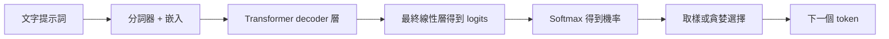

# LLM 推論原理

LLM 推論是將輸入提示詞轉化為輸出 token 的過程。在 decoder-only 語言模型中，要理解推論，最簡單的方式是先看模型計算了什麼，再將工作劃分為兩個階段：**prefill** 和 **decode**。

## 現代 LLM 架構

大多數現代文字生成 LLM 都是 **decoder-only transformer**。之所以稱為 decoder-only，是因為它們不斷根據已存在的 token 預測下一個 token，而不是先編碼一個輸入序列、再解碼出一個獨立的輸出序列。

宏觀來看，一次推論請求在模型中是這樣流動的：



Transformer decoder 堆疊是模型的主體。每一層重複著一小組運算，逐步將 token 表示變換為有利於預測下一個 token 的形式。

### 注意力

注意力是讓 token 為自身建構上下文感知表示的機制。在 LLM 中，一個 token 本身並沒有固定含義。例如「bank」一詞，在「river bank（河岸）」和「bank account（銀行帳戶）」中應當有不同的表示。注意力是模型利用周圍序列來更新 token 表示的主要方式之一。

在 decoder-only 模型中，注意力通常是**因果的（causal）**。這意味著一個 token 可以關注自身及更早的 token，但不能關注後面的 token。因果性透過**注意力遮罩（attention mask）**實作：在 softmax 之前，注意力分數矩陣中未來 token 的位置被賦予一個極大的負值。softmax 之後，這些被遮罩的位置獲得的注意力權重實際上為零。

這樣做最清晰的原因出現在訓練階段。模型拿到的是完整文字序列，但它必須學會在不看到後續答案 token 的情況下預測每一個下一個 token。因果遮罩正是為了防止這種未來 token 洩漏。

直觀上，注意力在問：對於當前 token，哪些更早的 token 是相關的，應當從每個中取走多少資訊？在短語「the capital of France is」中，最後一個 token 需要強烈依賴「capital」和「France」才能預測出合理的後續。注意力就是層中把這種相關性模式轉化為數值的部分。


*圖：針對提示詞「the capital of France is」的一種因果自注意力模式的示意視圖。權重為示意性，並非取自某次具體模型執行。*

標準的縮放點積注意力公式為：

$$
\operatorname{Attention}(Q,K,V)=\operatorname{softmax}\left(\frac{QK^\top}{\sqrt{d_k}} + M\right)V
$$

其中 $Q$ 是查詢矩陣，$K$ 是鍵矩陣，$V$ 是值矩陣，$d_k$ 是單一注意力頭的鍵／查詢維度，$M$ 是注意力遮罩。

矩陣乘法 $QK^\top$ 將查詢與鍵做比較以產生注意力分數。除以 $\sqrt{d_k}$ 是為了在鍵維度增大時防止分數過大。遮罩在 softmax 之前屏蔽非法位置。softmax 隨後將分數轉化為注意力權重，乘以 $V$ 則用這些權重對值向量做加權混合。

以上給出了注意力的直覺，但該公式引入了三個仍需單獨解釋的物件。下一步是理解 **query**、**key** 和 **value** 的含義。

### QKV 投影

注意力透過三個學習到的投影來計算：**query**、**key** 和 **value**。

在每一層，當前 token 向量 $X$ 會與訓練好的權重矩陣相乘：

$$
Q = XW_Q,\quad K = XW_K,\quad V = XW_V
$$

矩陣 $W_Q$、$W_K$ 和 $W_V$ 在訓練中學習。推論時它們是固定的模型權重。因此投影步驟僅僅是矩陣乘法，但學習到的矩陣讓每個投影承擔不同角色。

**query** 是「我在找什麼？」這一視角。對於「the capital of France is」中的最後一個 token，其查詢可能會尋找有助於補全該短語的資訊，例如某個地點、某個主語，或一個合理的事實續接。

**key** 是「我包含什麼？」這一視角。token「France」可能產生一個讓尋找地點的查詢容易與之匹配的鍵。token「capital」可能產生一個標記自身對「首都」關係很重要的鍵。

**value** 是「如果被關注，我應當傳遞什麼資訊？」這一視角。如果最後一個 token 強烈關注「France」，那麼來自「France」的值向量就是被混入最後一個 token 更新後表示的一部分。鍵幫助判斷一個 token 是否相關；值則提供實際被向前攜帶的資訊。

### KV Cache

**KV cache** 儲存已經計算過的鍵和值向量。其依據是計算複用：一旦模型為更早的 token 計算出了鍵和值，就不必在每次產生新輸出 token 時重新計算。

在注意力計算中，新 token 需要將其查詢與現有上下文的鍵做比較，再用得到的注意力權重從對應的值中讀取。KV 快取讓這些已有的鍵和值在後續 decode 步驟中保持可用。

### MQA 與 GQA

大型 LLM 推論的瓶頸常常不僅是算術運算，還包括資料在 GPU 顯存中搬運的速度。這在 decode 階段尤為明顯。每個新 token 都要讀取模型權重，並在現有 KV cache 上做注意力。隨著上下文增長，模型把更多時間花在把快取的鍵和值從 GPU 顯存搬運到注意力計算上。

標準的多頭注意力為每個查詢頭分配各自的鍵頭和值頭。這表達力強，但也意味著 KV cache 必須為每個注意力頭儲存獨立的鍵和值。KV 頭越多，cache 記憶體越大，decode 時要讀取的 KV 資料也越多。

**多查詢注意力（MQA）**透過保留多個查詢頭、但在它們之間共享單一的鍵頭和值頭來降低這一開銷。模型仍可透過不同的查詢頭提出多個不同問題，但這些查詢讀取的是同一組共享的鍵和值。這大幅降低了 KV-cache 的體積和 decode 時的 KV-cache 顯存頻寬，但由於所有頭被迫關注完全相同的 Key-Value 表示，模型會損失相當多的細微差異，往往導致推理準確度和品質下降。

**分組查詢注意力（GQA）**是標準多頭注意力與 MQA 之間的折中。不是所有查詢頭共享一對 key/value，而是將查詢頭分成若干組，每組共享一個鍵頭和一個值頭。相比 MQA 它保留了更多 key/value 容量，同時相比完整多頭注意力仍減少了 KV-cache 記憶體。

### 殘差連接與正規化

殘差連接在每個子層周圍攜帶資訊，正規化則保持激活的尺度穩定。這些細節在服務日誌中不太顯眼，但對於讓深層 transformer 堆疊可靠地訓練和執行至關重要。

最終的 token 向量被投影為一個詞表大小的向量，稱為 **logits**。每個 logit 是一個可能的下一個 token 的分數。隨後服務系統使用某種解碼規則選擇下一個 token，例如貪婪解碼、溫度取樣、top-k 或 top-p 取樣。

## Prefill 與 Decode

### 為何將推論分成兩個階段？

推論通常被描述為兩個階段，因為提示詞和輸出可用性的方式不同。提示詞在生成開始前就已知，所以推論引擎可以在一次大規前向傳播中一併處理所有提示 token。輸出則不同：每個生成的 token 都依賴於在它之前生成的 token，所以輸出生成必須一次一個 token 地進行。

這種劃分在工程上很重要，因為 prefill 和 decode 對 GPU 施加的壓力不同。Prefill 是在第一個輸出 token 出現之前發生的大規模提示詞處理步驟。Decode 是持續到模型達到停止條件的、反覆進行的 token 生成循環。

### Prefill

Prefill 是對提示詞的第一次前向傳播。如果提示詞有 $n$ 個 token，模型會一併處理這些提示 token，為每一層計算 Q、K、V，在提示詞上執行因果自注意力，並建立初始的 KV cache。

生成 K 和 V 向量主要是投影工作。在模型寬度視為固定的前提下，這部分隨提示詞長度大致線性增長。更重的上下文長度壓力來自提示詞自注意力：提示 token 的查詢與提示 token 的鍵做比較，產生的注意力分數模式中，其自注意力分量隨提示詞長度大致按 $O(n^2)$ 增長。

這就是為什麼 prefill 通常是推論中對長提示詞最敏感的部分。模型可以並行計算許多提示位置，但在傳回第一個輸出 token 之前仍必須完成提示詞層面的注意力工作。

### Decode

Decode 是 prefill 之後的反覆生成循環。
在每一步，模型生成一個新 token。
它為該新 token 計算 Q、K、V，用新的查詢在來自提示詞和先前輸出 token 的快取鍵值上做注意力，然後為下一個 token 的選擇產生 logits。
token 被選定後，其自身的鍵和值會被追加到 KV cache。

有了 KV cache，模型不必在每一步重新計算完整提示詞。對於當前上下文長度 $n$，一次 decode 步驟將新 token 與 $n$ 個快取位置做比較，因此注意力部分大致按 $O(n)$ 增長。這就是為什麼 decode 隨上下文長度的增長通常比 prefill 溫和得多，儘管長上下文仍會增加記憶體使用和記憶體頻寬壓力。

### 這為何影響 TTFT 與 TPOT

TTFT 受 prefill 強烈影響，因為模型必須處理提示詞並建構初始 KV cache 後才能傳回第一個輸出 token。因此更長的提示詞往往會增加 TTFT，尤其因為提示詞自注意力包含二次項的 token 比較。

TPOT 主要受 decode 影響。一旦生成開始，每個新輸出 token 由一次 decode 步驟產生。KV 快取避免了重新計算完整提示詞，所以 decode 隨上下文長度的增長通常比 prefill 溫和。然而，每次 decode 步驟仍要在現有快取上做注意力，因此更長的上下文仍會透過額外的注意力讀取和記憶體搬運來抬高 TPOT。


## 量化

模型權重通常以浮點格式訓練和儲存，如 FP32、FP16 或 BF16。這些格式能準確表示很多值，但佔用大量記憶體。**量化（Quantisation）**透過用更少的位元來儲存權重、激活或兩者，從而壓縮模型。

基本思路是用一個小整數加上尺度資訊來近似一個浮點數：

```text
浮點權重 ~= 尺度 * 整數權重
```

例如，不再把每個權重存為 16 位元浮點值，量化後的檢查點可能把一組權重存為 4 位元整數並附上縮放因子。推論時，專用 kernel 直接使用這些低位元權重，或在矩陣乘法中將其作為反量化的一部分。

### 僅權重量化

僅權重量化以更低精度儲存模型權重，而激活通常仍保持 FP16 或 BF16。這在 LLM 部署中很常見，因為模型權重佔用大量靜態 GPU 記憶體。減小其體積可以讓更大的模型塞進去，或為執行時和 KV cache 留出更多可用記憶體。

代價是矩陣乘法現在必須處理壓縮權重和縮放因子。這是否提升速度取決於量化方法、kernel 支援、GPU 架構和 batch 形狀。其可靠的主要收益是降低權重記憶體。

### 激活與 KV-Cache 量化

某些方法還會量化激活或 KV cache。激活量化可以減少計算中的記憶體搬運，但更難保持準確度，因為激活隨每次輸入而變化。KV-cache 量化針對 decode 時使用的已儲存鍵和值，因此若模型和服務引擎支援，它有助於長上下文或高並發服務。

### 激活感知權重量化

**激活感知權重量化（AWQ）**是一種面向 LLM 的訓練後、僅權重量化方法。「訓練後」指模型在訓練之後被量化，無需從頭重訓整個模型。「僅權重」指主要壓縮目標是模型權重，而非每一個中間激活。

AWQ 出發於一個觀察：一旦模型配合真實激活使用，並非所有權重同等重要。某些通道更重要，因為流經它們的激活更大或更具影響力。如果這些重要通道被量化得很差，模型品質會急劇下降。

AWQ 的流程大致如下：

1. 用一個小型校準資料集跑過模型，觀察激活模式。
2. 利用這些激活統計量識別重要的權重通道。
3. 搜尋逐通道的縮放因子，在量化前保護這些重要通道。
4. 以低位元權重格式儲存模型，常用 INT4，採用硬體友好的分組量化。

微妙之處在第 3 步。AWQ 在量化前重縮放通道，使重要通道承受更小的相對誤差，同時仍將最終儲存的權重保持在均勻的低位元格式中。

## 延遲與吞吐量概念

最常見的服務指標把首 token 延遲、每 token 延遲和聚合吞吐量分開來看。

| 指標 | 含義 |
| :--- | :--- |
| TTFT | 首 token 時間。受 prefill 和排隊強烈影響。 |
| TPOT | 生成開始後每個輸出 token 的時間。反映單請求的 decode 速度。 |
| 輸出 tokens/s | 跨所有請求每秒產出的輸出 token 總數。 |
| VRAM 用量 | 來自權重、執行時開銷、激活和 KV cache 的 GPU 記憶體壓力。 |
| 失敗計數 | 該服務形態是否可靠完成。 |

輸出 tokens/s 可能在 TTFT 或 TPOT 變差的同時提升。這發生在 batch 讓 GPU 跨多個請求產出更多總 token，而每個單獨請求卻等得更久或收 token 更慢的時候。

## 參考文獻

- [Attention Is All You Need](https://arxiv.org/abs/1706.03762)
- [AWQ: Activation-aware Weight Quantization for LLM Compression and Acceleration](https://arxiv.org/abs/2306.00978)
- [vLLM quantisation documentation](https://docs.vllm.ai/en/latest/features/quantization/)
