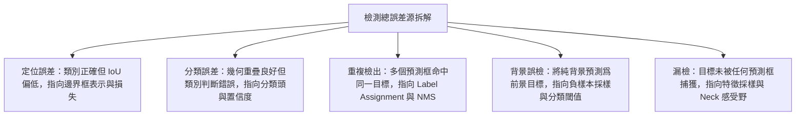

# 目標檢測附錄：評價指標

在閱讀目標檢測文獻時，許多讀者在理解了模型架構之後，依然會在各種指標數字面前產生困惑。例如，兩個模型的 mAP 相同，是否意味着兩者的定位能力相當？AP50 極高而 AP75 偏低，暴露了模型的哪項短板？模型在訓練時既然已經用到了 IoU 匹配，爲什麼評價時還要再運行一套基於置信度排序的匹配流程？

產生這些困惑的根源，在於混淆了模型架構的設計邏輯與評價協議的度量邏輯。評價協議是一條完全獨立於具體檢測器結構的度量鏈條。它從單框的幾何重疊規則出發，通過置信度排序構建精確率—召回率曲線，再通過多重重疊閾值平均與面積拆分，將複雜的空間檢測問題投射爲一系列具有明確物理指向的標量。

本文作爲《目標檢測解構》系列的獨立附錄，專門釐清這一套評價度量體系，建立指標數值與前面各篇核心部件之間的對應關係。系列導引請參考[第 0 篇：架構拆解與核心部件](./architecture-overview)。

## 1. 目標檢測任務需要度量什麼

圖像分類任務只需要判斷整張圖像的語義標籤，其預測結果與真實標籤是一對一的固定映射；而目標檢測任務要求網絡在未知數量、未知位置、未知尺寸的條件下，同時輸出物體的空間包圍盒與類別標籤。

因此，一個合格的檢測器評價體系不能只給出一個籠統的分數，它必須同時度量以下五個維度的表現，這五個維度直接對應了檢測系統各部件的技術選擇：

1. **位置準確性（Localization Accuracy）**：預測框與真實目標幾何邊界的貼合程度。該維度直接檢驗檢測頭對邊界框的參數化表示與迴歸損失函數的設計效果，對應[第 4 篇：邊界框表示與迴歸損失](./bbox-regression-loss)。
2. **類別正確性（Classification Correctness）**：模型在候選區域內識別語義類別的純度與分類置信度的校準質量。該維度對應[第 5 篇：分類置信度與 Detection Head](./classification-head)中的分類損失與置信度設計。
3. **重複檢出壓制（Duplicate Suppression）**：模型對同一個真實目標是否輸出了多個冗餘預測框。這一表現直接受制於訓練階段的樣本匹配策略以及推理階段的非極大值抑制（NMS），對應[第 3 篇：Label Assignment](./label-assignment)。
4. **多尺度與密集分佈下的完整性（Multi-scale Completeness）**：在極大、極小尺寸目標並存，或者小目標密集排列的場景下，模型能否無遺漏地檢出目標。該維度主要考驗多尺度特徵金字塔的語義調度能力，對應[第 6 篇：多尺度特徵與 Neck 架構](./neck-architecture)。
5. **部署與計算代價（Deployment Cost）**：模型在目標硬件上運行時的端到端延遲、參數量與計算複雜度。這決定了模型能否在實時場景中落地，直接受到骨幹網絡、Neck 拓撲以及是否包含 NMS 後處理的影響。

由於單一數值無法同時反映這五個維度的全部信息，檢測評價協議發展出了一套分層的拆解機制。

## 2. 命中規則、匹配協議與平均方式

要理解檢測指標，必須先釐清評價階段的基本判別單元：一個預測框究竟在什麼條件下才被算作“檢測成功”。

### 2.1 交併比（IoU）與單框命中判定

目標檢測使用交併比（Intersection over Union, IoU）作爲衡量兩個幾何邊界框重疊程度的基礎度量。設預測框爲 $B_p$，真實標註框（Ground Truth）爲 $B_{gt}$，兩者的 IoU 定義爲交集面積除以並集面積：

$$
\text{IoU}(B_p, B_{gt}) = \frac{\text{Area}(B_p \cap B_{gt})}{\text{Area}(B_p \cup B_{gt})}
$$

在評價過程中，評測系統預先設定一個閾值 $\theta_{\text{IoU}}$（例如 0.50）。當且僅當一個預測框與真實框的類別一致，且兩者的 $\text{IoU} \ge \theta_{\text{IoU}}$ 時，該預測框才具備被判定爲真正例（True Positive, TP）的資格。

### 2.2 評價匹配與訓練匹配的本質區別

許多初學者容易將評價階段的 IoU 匹配與訓練階段的[第 3 篇：Label Assignment](./label-assignment)混爲一談。這兩者雖然都使用 IoU 計算幾何重疊，但所處的運行階段、執行目的以及允許的操作完全不同：

- **訓練匹配（Label Assignment）**：發生在網絡反向傳播前，運行在單張圖像內。它的目的是爲每一個預測載體（網格、錨框、特徵點或 Query）指派監督信號（屬於正樣本還是負樣本），告訴網絡向哪個目標靠近。在密集預測網絡（如 FCOS 或 Faster R-CNN RPN）中，訓練匹配通常採用**一對多（One-to-Many）**分配協議，即一個真實目標可以同時指派給數十個空間位置重疊的預測單元進行學習。
- **評價匹配（Evaluation Matching）**：發生在網絡推理生成全部預測結果之後，運行在整個測試集上。它的目的是審計模型的最終檢出質量。評價協議嚴格執行**一對一（One-to-One）且按置信度貪心匹配**的規則：對於某一個真實目標，只允許全圖置信度最高且滿足 $\text{IoU} \ge \theta_{\text{IoU}}$ 的那一個預測框匹配爲真正例（TP）；其餘所有與該目標重疊的預測框，無論其預測概率多高，一律被判定爲假正例（False Positive, FP）。

```text
推理輸出的所有預測框
  │
  │（按類別分組，全數據集按置信度降序排序）
  ▼
[高置信度預測框] ──> 找到最大 IoU 的真實框
  │                    ├── IoU >= 閾值 且 真實框未被佔用 ──> 判定爲 TP（真實框標記爲已佔用）
  │                    ├── IoU >= 閾值 但 真實框已被佔用 ──> 判定爲 FP（重複檢出）
  │                    └── IoU < 閾值                 ──> 判定爲 FP（定位偏差或背景誤檢）
  ▼
未被任何預測框匹配的真實框 ──> 判定爲 FN（漏檢）
```

這一對比解釋了爲什麼採用一對多訓練匹配的檢測器在推理時必須依賴 NMS：如果推理端不通過 NMS 壓制掉同一目標周圍的多餘高分框，這些框在進入評價匹配流程時都會被判定爲重複檢出的 FP，從而直接拉低精確率數值。

### 2.3 精確率—召回率曲線（PR Curve）

在完成全數據集的預測框與真實框匹配後，評價系統將所有預測結果按分類置信度從高到低排列，截取不同的前 $k$ 個預測框，即可動態計算出不同置信度截斷下的精確率（Precision）與召回率（Recall）：

$$
\text{Precision} = \frac{\text{TP}}{\text{TP} + \text{FP}}, \quad \text{Recall} = \frac{\text{TP}}{\text{TP} + \text{FN}}
$$

其中 $\text{TP} + \text{FN}$ 是數據集中該類別真實目標的總數，爲一個固定常數。

當截取的預測框數量由少變多時，召回率單調遞增，而精確率通常呈震盪下降趨勢。以 Recall 爲橫軸、Precision 爲縱軸繪製出的軌跡，即爲精確率—召回率曲線（PR 曲線）。

### 2.4 平均精度（AP）與多閾值平均

平均精度（Average Precision, AP）本質上是 PR 曲線下的面積（Area Under Curve, AUC）。爲了消除曲線震盪帶來的數值不穩定性，標準做法會對 PR 曲線進行單調遞減插值：在每一個召回率點 $r$，其實際採用的精確率取該點右側所有精確率的最大值：

$$
p_{\text{interp}}(r) = \max_{\tilde{r} \ge r} p(\tilde{r})
$$

不同評測基準在計算 AP 時採用了不同的積分與閾值設定：

#### PASCAL VOC AP（單閾值評價）

- **定義**：在固定的單一重疊閾值（通常爲 $\theta_{\text{IoU}} = 0.50$）下計算得到的單類別 PR 曲線面積。
- **回答的問題**：在較寬鬆的幾何定位要求下，檢測器能否在檢出大部分目標的同時保持較低的誤報率。
- **敏感的變化**：對大幅度的語義誤檢和完全漏檢極爲敏感，對邊界框貼合像素精度的微小改進不敏感。
- **容易誤導的情形**：當兩個模型的 VOC AP 均爲 85% 時，讀者無法判斷其中一個模型輸出的框是僅僅輕微擦過目標（IoU=0.51），還是完美貼合物體輪廓（IoU=0.90）。只看該指標會高估粗糙定位模型的實際落地價值。

#### COCO AP / mAP（多閾值平均精度）

- **定義**：在 10 個均勻採樣的 IoU 閾值（$\theta_{\text{IoU}} \in [0.50, 0.55, 0.60, \dots, 0.95]$，步長 0.05）下分別計算全類別 AP，並取全部閾值和全部類別的總平均值。
- **回答的問題**：在從粗糙到苛刻的連續定位精度要求下，檢測器綜合兼顧分類正確性與幾何迴歸精度的整體能力。
- **敏感的變化**：對高質量邊界框迴歸、高 IoU 區間的優化（例如引入 GIoU/CIoU 損失或更細緻的特徵對齊）高度敏感。
- **容易誤導的情形**：多閾值平均抹平了極端區間的表現差異。一個在低閾值下召回率極高但在高閾值下表現疲軟的模型，可能與另一個只輸出少數高質量精準框的模型獲得相同的綜合 AP，但在實際業務中兩者的行爲模式完全不同。

#### AP50 與 AP75 的分工

- **AP50（$\text{AP}_{\text{IoU}=0.50}$）**：只考察粗粒度的語義檢出能力。它主要回答“模型是否找對了大致區域”的問題，對分類特徵判別力敏感，能夠快速暴露語義混淆與背景誤檢。
- **AP75（$\text{AP}_{\text{IoU}=0.75}$）**：專門考察嚴苛定位條件下的高質量輸出能力。它主要回答“模型迴歸的座標邊界是否嚴絲合縫”的問題，對邊界框迴歸損失、特徵採樣點對齊質量以及高置信度框的幾何質量極爲敏感。

## 3. 尺寸拆分、召回率、長尾與速度代價

在綜合 AP 之外，評測基準提供了一系列切片指標，用於精細化診斷模型在不同外部約束下的能力邊界。

### 3.1 目標尺寸拆分指標（$AP_S, AP_M, AP_L$）

COCO 數據集根據真實標註框在原始圖像中的絕對像素面積 $Area$，將所有目標嚴格劃分爲三個互不重疊的尺度區間：

- 小目標（Small）：$Area < 32^2 \text{ 像素}$
- 中目標（Medium）：$32^2 \le Area \le 96^2 \text{ 像素}$
- 大目標（Large）：$Area > 96^2 \text{ 像素}$

在評價時，評測系統僅在對應尺寸區間的子集上分別計算多閾值平均精度，得到 $AP_S$、$AP_M$ 與 $AP_L$。

#### 小目標平均精度（$AP_S$）

- **定義**：在像素面積小於 $32\times 32$ 的真實目標及其對應預測結果上計算的多閾值平均精度。
- **回答的問題**：檢測器在空間分辨率嚴重退化、語義信息極度微弱的極限條件下，能否有效捕捉並定位微小物體。
- **敏感的變化**：對淺層高分辨率特徵保留程度、特徵金字塔自底向上路徑的構建（如 PANet/BiFPN）、以及高步長下采樣帶來的空間信息損失極爲敏感。
- **容易誤導的情形**：只看 $AP_S$ 會掩蓋模型在大尺度連續結構上的上下文建模缺陷；此外，對於標註噪聲（人工標註重疊輕微漂移導致 IoU 劇烈下滑），小目標指標的波動幅度遠大於大目標。

#### 大目標平均精度（$AP_L$）

- **定義**：在像素面積大於 $96\times 96$ 的真實目標及其對應預測結果上計算的多閾值平均精度。
- **回答的問題**：檢測器在面對佔據畫面主體、感受野需求極大的目標時，能否完整覆蓋整體結構而不產生碎片化截斷。
- **敏感的變化**：對深層網絡的全局感受野、Transformer 全局注意力機制、以及多尺度融合中的長距離依賴建模敏感。
- **容易誤導的情形**：大目標通常在數據集中佔比有限或語義過於顯著，較高的 $AP_L$ 往往容易達成，容易掩蓋模型在密集遮擋與小物體場景下的嚴重漏檢。

### 3.2 平均召回率與最大檢出上限（$AR_{\text{max}}$）

平均召回率（Average Recall, AR）是在給定的每張圖像最大允許預測框數量上限（$\text{maxDets} \in \{1, 10, 100\}$）下，對所有類別和 $\text{IoU} \in [0.50, 0.95]$ 閾值求取的最大可能召回率平均值。

#### 最大檢出 100 框平均召回率（$AR_{100}$ / $AR_{\text{max}}$）

- **定義**：每張圖像最多保留 100 個最高置信度預測框時，在全 IoU 閾值區間內取得的平均召回率。
- **回答的問題**：檢測系統的候選生成機制（如 RPN 提案或 Transformer Query）對場景中所有潛在目標的理論捕獲上限是多少。
- **敏感的變化**：對預測載體的密集程度、前景負樣本採樣平衡策略、以及置信度閾值過濾的截斷點敏感。
- **容易誤導的情形**：$AR$ 完全不懲罰假正例（FP）的數量。一個毫無辨別能力、在背景區域密集散佈成千上萬個隨機預測框的模型，只要預測數量足夠多，就能獲得極高的 $AR$，但其 AP 會接近歸零。

:::caution[AR 不懲罰誤報]
$AR$ 只統計真實目標被覆蓋的比例，對假正例數量沒有任何懲罰。只看 $AR$ 會高估“廣撒網”式模型的價值，召回率必須和精確率（AP）一起讀。
:::

### 3.3 長尾類別與開放詞彙評價

在常規 COCO 數據集中，各個類別的樣本分佈相對均衡，直接求取算術平均即可反映整體表現。但在大規模現實世界中（如 LVIS 數據集），類別分佈呈現極端的長尾分佈，稀有類別的標註甚至存在缺失或非窮舉性。

爲了在這種場景下準確度量性能，評價協議做出了調整：LVIS 引入了聯邦評價（Federated AP）機制，僅在經過人工驗證包含該類別或明確標註負樣本的圖像子集上計算對應類的 AP，並拆分爲稀有類（$AP_r$）、常見類（$AP_c$）與高頻類（$AP_f$）。在開放詞彙檢測中，協議則進一步區分已知基類（Base Class）與未見新類（Novel Class）的檢測表現。

### 3.4 部署代價指標：延遲、參數量與 FLOPs

一個在精度指標上領先的檢測器，若脫離計算代價，其工程價值便無法客觀衡量。

#### 端到端推理延遲（Latency / FPS）

- **定義**：模型在特定硬件平臺（如特定 GPU 或邊緣計算芯片）和固定輸入分辨率下，完成單張圖像從輸入張量加載、前向傳播到 NMS 後處理輸出的完整耗時（以毫秒 ms 爲單位，或每秒幀數 Frames Per Second）。
- **回答的問題**：該模型是否滿足具體應用場景（如自動駕駛 30 FPS 實時要求）的時間預算。
- **敏感的變化**：對內存訪問帶寬（Memory Access Cost, MAC）、非連續算子（如動態控制流、高開銷重塑操作）、以及 NMS 後處理在 CPU/GPU 之間的數據搬運開銷敏感。
- **容易誤導的情形**：脫離硬件平臺、批大小（Batch Size）以及是否包含後處理（Pre/Post-processing）的延遲數字毫無可比性；僅報告網絡骨幹前向耗時而隱瞞 NMS 耗時，會嚴重低估一對多密集檢測器的實際運行瓶頸。

#### 參數量（Params）與浮點運算量（FLOPs）

- **定義**：參數量衡量模型所有可學習權重佔用的物理內存規模（通常以 Million, M 爲單位）；FLOPs 衡量模型單次前向傳播理論執行的乘加運算總次數（通常以 GFLOPs 爲單位）。
- **回答的問題**：模型在理論計算複雜度和靜態存儲佔用上的規模等級。
- **敏感的變化**：對卷積核通道寬度、層數深度、注意力機制序列長度敏感。
- **容易誤導的情形**：FLOPs 僅代表理論計算次數，並不等價於物理延遲。由於 GPU 具備高度並行的硬件特性，大量碎片化的小算子（如多分支特徵融合）即便 FLOPs 很低，也會因內存帶寬瓶頸和內核啓動開銷導致極高的實際耗時。

:::caution[FLOPs 不等於延遲]
FLOPs 只計數理論乘加次數，不反映內存帶寬、內核啓動開銷和算子碎片化。對部署選型真正有效的是端到端物理耗時，FLOPs 只能做量級參考。
:::

## 4. 誤差拆分與歸因診斷

當模型的 AP 數值不達預期時，單純觀察單一分數無法指導架構優化。基於 TIDE（A General Toolbox for Identifying Object Detection Errors）等誤差診斷方法，可以將檢測系統的假正例（FP）與假負例（FN）精確分解爲四類具有明確物理指向的誤差源。

這種拆分能夠直接指回前述核心部件的設計缺陷：



### 4.1 定位誤差（Localization Error, $E_{\text{loc}}$）

- **物理現象**：預測框正確識別了目標的語義類別，且與真實目標的 $\text{IoU} \ge 0.10$，但未能達到評測規定的主閾值（例如 $\text{IoU} < 0.50$）。
- **歸因診斷**：表明分類分支已經成功激活，但迴歸分支給出的幾何座標發生偏離。應優先檢查[第 4 篇：邊界框表示與迴歸損失](./bbox-regression-loss)中的座標迴歸損失形式（如 Smooth L1 是否在邊界處缺乏梯度敏感性，或是否需要引入 Distribution Focal Loss）、特徵採樣階段的感受野與幾何不對齊問題（如 RoI Pooling 粗糙量化改爲 RoIAlign）。

### 4.2 分類混淆誤差（Classification Error, $E_{\text{cls}}$）

- **物理現象**：預測框在幾何空間上與真實目標的重疊度良好（$\text{IoU} \ge 0.50$），但預測的類別標籤錯誤。
- **歸因診斷**：表明幾何定位有效，但高層語義判別失真。應優先檢查[第 5 篇：分類置信度與 Detection Head](./classification-head)中的分類損失設計（如類別不平衡導致的稀有類向常見類坍縮）、檢測頭是否缺乏解耦（分類特徵與迴歸特徵強行共享同一卷積核導致任務衝突）。

### 4.3 重複檢出誤差（Duplicate Error, $E_{\text{dup}}$）

- **物理現象**：同一個真實目標被多個高分預測框同時命中，其中僅有得分最高的一個被計入真正例，其餘全部被計入重複假正例。
- **歸因診斷**：表明檢測系統未能有效壓制冗餘響應。應優先檢查[第 3 篇：Label Assignment](./label-assignment)與推理後處理機制：對於一對多分配體系，應覈查 NMS 的 IoU 抑制閾值是否過寬，或者軟化 NMS（Soft-NMS）的衰減參數；若要從根本上消除該項誤差，可考慮轉向基於二分圖匹配的端到端一對一分配架構（如 DETR 或 YOLOv10）。

### 4.4 背景誤報與漏檢誤差（Background & Miss Error）

- **背景誤報（$E_{\text{bkg}}$）**：預測框落在了純背景區域（與任何真實目標的 $\text{IoU} < 0.10$）。指向分類分支的置信度校準失效，或訓練中負樣本挖掘（Hard Negative Mining）/ Focal Loss 對簡單背景的抑制力度不足。
- **目標漏檢（$E_{\text{miss}}$）**：畫面中的真實目標未被任何置信度達標的預測框覆蓋。指向預測載體的空間覆蓋密度不足、小目標特徵在深層網絡中徹底消亡，需要從[第 1 篇：預測載體](./prediction-carrier)與[第 6 篇：多尺度特徵與 Neck 架構](./neck-architecture)層面強化多尺度特徵融合機制。

## 5. 核心評價指標綜合對照

下表彙總了目標檢測體系中最核心的評價指標，並提煉了各指標在模型對比時的核心結論：

<div className="wide-table">

| 指標名稱 | 核心定義 | 敏感維度 | 潛在盲區與誤區 | 核心診斷結論 |
| :--- | :--- | :--- | :--- | :--- |
| **PASCAL VOC AP50** | 單一鬆散閾值（$\text{IoU}=0.50$）下的單類 PR 曲線積分面積 | 粗粒度語義分類與大範圍目標檢出 | 無法區分粗糙定位與亞像素級精確定位 | 僅能證明檢測器具備基礎的“粗略找對”能力，不能作爲精細定位任務的評價依據。 |
| **COCO mAP（AP50:95）** | 10 個 IoU 閾值（0.50 到 0.95）及全類別的總平均精度 | 綜合檢測能力與高質量邊界框迴歸 | 抹平了低閾值高召回與高閾值高精度的分佈差異 | 最通用的綜合排名指標；數值提升通常要求分類置信度與座標迴歸質量同步改善。 |
| **AP75** | 嚴苛重疊閾值（$\text{IoU}=0.75$）下的平均精度 | 緊湊邊界迴歸與特徵空間精細對齊 | 無法反映模型在極端微小目標上的召回水平 | 專門檢驗定位分支的上限能力；AP75 明顯偏低說明檢測頭存在嚴重的幾何迴歸漂移。 |
| **$AP_S$** | 像素面積小於 $32^2$ 的小目標子集平均精度 | 淺層空間高分辨率特徵與微小物體捕獲 | 對人工標註幾何抖動極度敏感，方差較大 | 直觀反映特徵金字塔（Neck）對淺層特徵的保留質量與降採樣過程中的信息丟失程度。 |
| **$AR_{\text{max}}$（$AR_{100}$）** | 限制每圖最多 100 個檢出框時的全閾值平均召回率 | 前景候選單元的理論捕獲上限 | 完全不懲罰冗餘誤報，高召回可能伴隨海量假正例 | 用於評估候選區域生成部件（如 RPN 或 Query）的漏檢下限，不能反映分類純度。 |
| **端到端 Latency** | 包含前處理、網絡前向傳播與 NMS 後處理的完整單幀耗時 | 內存帶寬瓶頸、非連續算子與後處理開銷 | 脫離特定硬件、Batch Size 與算子實現時不可比 | 一對多網絡必須計入 NMS 耗時；低 FLOPs 不等於低延遲，必須以實際端到端物理耗時爲準。 |
| **誤差拆分（TIDE）** | 將假正例與漏檢嚴格歸因於 Loc、Cls、Dup、Bkg 等具體來源 | 定位失真、分類混淆、重複檢出與純背景誤判 | 依賴離線後處理分析，計算開銷較大 | 架構迭代的核心指南；定位誤差主導應改損失與採樣，重複檢出主導應改分配與 NMS。 |

</div>

## 6. 總結與解構指引

在閱讀與評估目標檢測模型時，不能孤立地將單一 mAP 數字的高低視作架構優劣的唯一判據。評價指標本質上是一組面向不同約束條件投影出來的度量切片：

- 評價匹配採用**置信度降序排序與一對一貪心佔用**，與訓練階段的 Label Assignment 在運行邏輯上截然不同。
- AP50 衡量**語義分類是否找準**，AP75 衡量**幾何邊界是否貼緊**，兩者互爲補充。
- 尺寸指標（$AP_S, AP_M, AP_L$）直接映射到多尺度特徵融合的調度效率，誤差拆分（Loc, Cls, Dup）則直接爲五個核心部件的針對性改進提供定位依據。

掌握了評價鏈條的度量邏輯，便能透過論文中的消融實驗表格，準確推斷出各個模型部件在幾何迴歸、特徵融合與樣本分配上的真實行爲。這構成了完整理解整個《目標檢測解構》系列的技術閉環。
