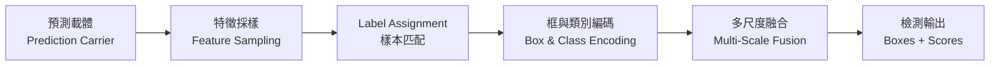

# 總覽

目標檢測要求網絡在圖像中同時完成定位（找出物體的邊界）與分類（識別物體的屬性）。網絡必須面對極端懸殊的尺度跨度、複雜的空間重疊遮擋，以及海量背景噪聲的干擾。

經過十數年的演進，目標檢測分化出兩階段、單階段、Anchor-based、Anchor-free 以及 Transformer Query 等多種看似迥異的架構流派。但退到底層機制，所有檢測體系本質上都是由五個可以獨立替換的核心部件裝配而成的系統：

| 部件 | 回答的問題 | 對應篇目 |
| :--- | :--- | :--- |
| **預測載體** | 網絡向外界交出候選預測的基本載體，每個猜測與圖像幾何空間如何綁定 | [第 1 篇](./prediction-carrier) |
| **特徵採樣** | 檢測頭從主幹特徵圖中提取特徵表示的操作方式 | [第 2 篇](./feature-sampling) |
| **Label Assignment** | 訓練階段將真實標註指派給特定預測載體的協議，決定正負樣本歸屬與是否需要 NMS | [第 3 篇](./label-assignment) |
| **框與類別編碼** | 預測頭輸出數值的物理意義，座標迴歸與分類判別的具體形式 | [第 4 篇](./bbox-regression-loss)、[第 5 篇](./classification-head) |
| **多尺度融合** | 骨幹與檢測頭之間的特徵金字塔管道，在不同分辨率與語義深度之間調度信息 | [第 6 篇](./neck-architecture) |

:::tip[閱讀順序]
建議按順序閱讀：[第 0 篇](./architecture-overview)建立座標圖，隨後依次讀預測載體、特徵採樣、樣本匹配、邊界框迴歸、分類檢測頭、多尺度 Neck。每篇末尾指明下一篇的入口。
:::

## 篇目

| 篇目 | 標題 | 核心結論 |
| :--- | :--- | :--- |
| 第 0 篇 | [架構拆解與核心部件](./architecture-overview) | 五個部件的裝配邏輯；錨框與 NMS 分屬不同部件，不存在綁定關係 |
| 第 1 篇 | [預測載體](./prediction-carrier) | 從樸素網格到 Anchor 模板，再到逐點測量與集合查詢的三次博弈 |
| 第 2 篇 | [特徵採樣](./feature-sampling) | 從密集網格採樣到稀疏實例採樣的演進；兩階段與 DETR 在底層機制上統一 |
| 第 3 篇 | [Label Assignment](./label-assignment) | 從靜態幾何規則到動態代價指派，再到一對一與雙分配 |
| 第 4 篇 | [邊界框表示與迴歸損失](./bbox-regression-loss) | 從獨立座標損失到 IoU 幾何損失，再到分佈建模 |
| 第 5 篇 | [分類置信度與 Detection Head](./classification-head) | Focal Loss、解耦頭、任務對齊解決分類與定位的錯位 |
| 第 6 篇 | [多尺度特徵與 Neck 架構](./neck-architecture) | 從 FPN 到 PANet、BiFPN 再到 RT-DETR 混合編碼器的信息流演進 |
| 附錄 | [評價指標](./evaluation-metrics) | 評價協議的度量邏輯：命中規則、PR 曲線、多閾值平均、尺寸拆分與誤差歸因。 |

## 參考文獻

- R. Girshick et al., Faster R-CNN: Towards Real-Time Object Detection with Region Proposal Networks, NeurIPS 2015.
- J. Redmon et al., You Only Look Once: Unified, Real-Time Object Detection, CVPR 2016.
- T.-Y. Lin et al., Feature Pyramid Networks for Object Detection, CVPR 2017.
- Z. Tian et al., FCOS: Fully Convolutional One-Stage Object Detection, ICCV 2019.
- N. Carion et al., End-to-End Object Detection with Transformers, ECCV 2020.
- Z. Ge et al., YOLOv10: Real-Time End-to-End Object Detection, NeurIPS 2024.
