# YOLO 演進（5）：注意力引入與部署簡化

:::note[學習筆記]
v12 / v26 暫無配套 PDF 筆記。背景可參考 [YOLOv8](/files/cv/YOLOv8_Note_v1.pdf) · [YOLOv9](/files/cv/YOLOv9_Note_v1.pdf)。
:::

在 [YOLO 演進（4）：anchor 去除與 NMS 可選化](./anchor-free-nms-optional) 中，單階段目標檢測器完成了現代範式的終極定型：通過解耦檢測頭、無錨框點式預測（Anchor-free）、動態任務對齊（TAL）、連續邊界分佈（DFL）以及一致性雙重分配（NMS-free），卷積檢測器在特徵表徵與端到端無冗餘推理上達到了前所未有的高度。

然而，在 2024 年至 2026 年的技術演進收官階段，單階段實時檢測器在應用落地上面臨着兩條截然相反、卻又相互呼應的終局訴求：
1. **表徵能力的上限突破（追求極致精度）**：純卷積神經網絡（CNN）依賴局部滑動窗口，其有效感受野隨深度呈亞線性擴展，在全局長程上下文建模、複雜大尺度背景判別以及微弱小目標關聯上逐漸顯露出理論天花板。學術界渴望將具備全局注意力的 Vision Transformer 引入實時檢測器，但自注意力機制的二次方計算複雜度與碎片化訪存構成了巨大的延遲鴻溝；
2. **邊緣部署的極簡落地（追求極致硬件友好）**：隨着 DFL 分佈焦點損失與解耦雙頭的引入，模型導出的算子圖（Computation Graph）變得日益複雜。在高性能服務器 GPU 上，多通道 Softmax 與期望積分運算的開銷微乎其微；但在算力與內存帶寬極度匱乏的邊緣 CPU、嵌入式微控制器（MCU）與低功耗 NPU 上，這些算子成為了拖慢全流程吞吐的新瓶頸。

**YOLOv12** 與 **YOLO-v26** 分別代表了單階段檢測器在這兩個方向上的終極探索。
- **YOLOv12**（2025 年）首次在嚴格的實時延遲約束下，通過區域注意力（Area Attention）與面向硬件的算子重構，成功將自注意力機制深度融入 YOLO 體系；
- **YOLO-v26**（2026 年）則由 Ultralytics 主導，確立了 " 邊緣優先（Edge-First）" 的工程準則，通過主動剝離 DFL 算子、固化 NMS 雙模開關並整合正交優化器與多任務底座，完成了向全場景輕量化落地的收官閉環。

本文深入剖析這兩款最新代際檢測器的底層物理機制，並在文末對 YOLO 從 2015 年初代至 2026 年的十年演進史進行終局復盤。

---

## YOLOv12：自注意力機制的實時化重構

### 注意力機制引入單階段檢測器的本質障礙

自 Transformer 在計算機視覺領域普及以來，單階段檢測器始終未能將自注意力作為基礎主幹構件，其根本瓶頸不在於網絡參數量，而在於**兩項嚴苛的硬件延遲代價**：

1. **計算量的二次方爆炸（Quadratic Complexity）**：
   對於分辨率為 $640 \times 640$ 的輸入圖像，淺層特徵圖的展平 Token 數量可達數萬。標準的全局多頭自注意力（Multi-Head Self-Attention, MHSA）計算複雜度為：

   $$\mathcal{O}(\text{Attn}) = 2 n^2 d + 4 n d^2$$

   其中 $n = H \times W$ 為 Token 數量，$d$ 為特徵維度。複雜度隨空間尺寸呈現二次方激增（$O(n^2)$），導致高分辨率特徵圖的全局注意力在前向傳播時瞬間擊穿實時算力預算。
2. **顯存讀寫與非規整算子瓶頸（Memory-bound Bottleneck）**：
   標準注意力必須顯式實例化尺寸為 $n \times n$ 的稠密注意力權重矩陣（Attention Map），引發海量的非連續顯存讀寫（MAC）；此外，原生 Transformer 依賴按 Token 獨立計算均值與方差的 LayerNorm 歸一化層，在底層硬件執行時無法與卷積或 GEMM 算子執行張量融合（Operator Fusion），頻繁中斷計算流水線。

雖然 Swin Transformer 等模型提出了基於固定窗口（Shifted Windows）的局部注意力，但其要求輸入特徵圖尺寸必須為窗口大小的整數倍。而 YOLO 在實際推理中廣泛採用**自適應動態矩形推理（Rectangular Inference，如 $672 \times 608$）**以減少圖像填充黑邊，固定窗口機制會強制引入圖像變形或破壞尺寸適配性。

### 區域自注意力（Area Attention, A2）

為了在任意長寬比輸入下化解注意力複雜度，YOLOv12 提出了**區域自注意力機制（Area Attention, A2）**。

> 圖來源：YOLOv12，Fig.2 Area attention，https://ar5iv.org/html/2502.12524

#### 機制與數學形式

對於尺寸為 $H \times W \times C$ 的特徵圖：
1. **一維序列切分**：首先將空間維度展平為長度為 $n = H \cdot W$ 的一維 Token 序列；
2. **均勻分段（Area Partitioning）**：將一維序列沿長度方向均分為 $l$ 個連續區域（默認 $l=4$），每個區域包含 $n/l$ 個 Token；
3. **段內自注意力運算**：自注意力計算被嚴格限制在各個獨立的區域段內部並行執行：

$$\mathcal{O}(\text{Area-Attn}) = l \times \left( 2 \left(\frac{n}{l}\right)^2 d + 4 \left(\frac{n}{l}\right) d^2 \right) = \frac{2 n^2 d}{l} + 4 n d^2$$

當分段數取 $l=4$ 時，原本昂貴的二次項計算量被精確壓縮為原先的 **$\frac{1}{4}$**，同時每個區域依然保留了覆蓋四分之一全圖的超大感受野。

更關鍵的是工程層面的極簡性：區域注意力僅涉及一次一維展平（Flatten）與重排（Reshape），完全不需要複雜的網格幾何切分。只要總 Token 數量 $H \cdot W$ 能被 $l$ 整除，任意尺寸的矩形輸入均能無縫執行前向推理。結合 **FlashAttention** 的分塊 Softmax 顯存優化，該模塊在 GPU 上徹底消除了大注意力矩陣的顯存駐留開銷。

### 訓練穩定性保障：R-ELAN 殘差高效層聚合

在引入注意力機制後，YOLOv12 團隊在訓練大模型（L/X 規格）時遇到了嚴重的**優化曲面震盪與梯度發散**問題，使用 AdamW 優化器也難以穩定收斂。

深入分析表明，傳統的 ELAN 拓撲在加深時缺乏足夠的恆等映射（Identity Mapping）來平滑深層自注意力的非線性畸變。YOLOv12 設計了 **R-ELAN（Residual ELAN）** 架構進行雙重改良：

1. **塊級殘差直連與層級縮放（LayerScale）**：
   在整個 R-ELAN 聚合塊的外圍引入跨階段殘差直流通路，並在殘差相加前引入一個極小的可學習縮放標量 $\alpha = 0.01$：

   $$Y = X + \alpha \cdot \mathcal{F}_{\text{R-ELAN}}(X)$$

   該機制在訓練初期強迫模塊退化為接近恆等映射的平坦曲面，保證深層梯度能夠穩定無損地穿透注意力棧，化解了大模型的訓練崩潰。
2. **瓶頸式通道聚合（Bottleneck Aggregation）**：
   調整特徵聚合順序，先通過 $1 \times 1$ 過渡卷積調整通道並形成特徵瓶頸，再分流進入各注意力計算塊，使顯存佔用與特徵維度隨深度上升保持平穩。

### 面向硬件流水線的 Transformer 原生算子改造

為了抹平 Transformer 與卷積在底層硬件執行上的延遲差距，YOLOv12 對原生自注意力算子進行了四項深度工程改造：

1. **移除絕對位置編碼，引入深度可分離卷積位置感知器**：
   傳統的可學習絕對位置編碼（Positional Encoding）在多尺度輸入變化時需要進行復雜的插值計算。YOLOv12 徹底移除了顯式位置編碼，而在 Value 分支中嵌入了一個 $7 \times 7$ 的深度可分離卷積（Depthwise Conv），利用卷積固有的局部平滑性天然注入空間幾何位置線索。
2. **$Q, K, V$ 投影解耦**：
   傳統實現傾向於通過一個大矩陣將輸入同時投影為拼接的 $[Q, K, V]$ 張量。但在引入 $7 \times 7$ 卷積後，拼接張量必須在顯存中反覆執行切片（Slice）以提取 $V$。YOLOv12 改用物理獨立的線性層分別投影 $Q, K$ 與 $V$，消除了中間顯存搬運與張量重排開銷。
3. **BatchNorm 替代 LayerNorm**：
   LayerNorm 要求在推理階段按 Token 動態計算均值與方差，屬於不可摺疊的顯存受限算子。YOLOv12 將所有歸一化層統一替換為 **BatchNorm**。在推理部署前，BatchNorm 能夠根據線性性質完全摺疊進前置卷積或線性層的權重之中（$W' = \gamma W / \sqrt{\sigma^2 + \epsilon}$），推理階段實現零計算量與零顯存開銷。
4. **前饋網絡（FFN/MLP）膨脹率壓縮**：
   原生 Transformer 將 MLP 的通道膨脹比固定為 4.0。實驗表明檢測精度的主要增益來自於注意力機制而非前饋升維。YOLOv12 將大模型的 MLP 膨脹率大幅縮減至 1.2~1.5，將寶貴的 FLOPs 預算最大限度傾斜給自注意力計算。

> 圖來源：YOLOv12，Fig.5 Heat map comparison，https://ar5iv.org/html/2502.12524

通過上述重構，YOLOv12 在同精度下相比基於 Transformer 的前沿實時檢測器（如 RT-DETR），不僅參數量與 FLOPs 縮減了超過 $60\%$，更在通用 GPU 上實現了超越純卷積架構的 FPS 表現，正式宣告自注意力機制全面攻克單階段實時檢測領域。

---

## YOLO-v26：邊緣優先導向的極簡主義重構

如果説 YOLOv12 展現了算法在表徵上限維度的極致擴張，那麼由 Ultralytics 於 2026 年初發布的 **YOLO-v26** 則代表了工程在落地部署維度的極致收斂。YOLO-v26 確立了**" 邊緣優先（Edge-First）"**的設計哲學，致力於解決現代化檢測算法在端側 CPU、嵌入式芯片與邊緣加速器上的部署痛點。

### 現代特性的部署間隙與 DFL 的主動剝離

在 YOLOv8 與 v11 中，**DFL（分佈焦點損失）** 將每個邊界框座標建模為 16 個離散 bin 上的概率分佈，以表達邊緣不確定性。然而在工業級嵌入式落地中，這一設計暴露出了明顯的**部署間隙（Deployment Gap）**：
- **顯存與算子開銷**：每個檢測網格的邊界框輸出通道數高達 $4 \times 16 = 64$ 維。在模型導出為 ONNX / TensorRT 計算圖時，圖解析器必須在末端插入一個 `Softmax` 節點與一個固定的卷積點積算子以還原座標期望；
- **邊緣 CPU 的吞吐拖累**：在算力充沛的高性能 GPU 上，這些算子耗時極低；但在指令集精簡、無專用張量加速核心的低功耗邊緣 CPU（如 ARM Cortex-A 系列）上，高維 Softmax 與離散點積構成了頻繁的中間顯存讀寫，嚴重拖慢了解碼吞吐。

#### 極簡座標迴歸的迴歸

YOLO-v26 採取了激進的工程化修剪：將分佈參數設為 $\text{reg\_max} = 1$。
- 此時 DFL 模塊在數學上退化為**恆等映射（Identity）**；
- 檢測頭的迴歸分支直接輸出 4 維確定性座標標量，單網格輸出張量由 $(nc + 64)$ 驟降為 $(nc + 4)$；
- 導出的計算圖中徹底移除了所有後置分佈 Softmax 算子。

儘管在複雜遮擋極端場景下模型微弱損失了約 0.3%~0.5% 的 AP 精度，但在 Intel Xeon 及各類嵌入式 CPU 上，ONNX 導出的全流程端到端推理速度**提升了 40% 以上**。這是算法精度向硬件極簡部署的一次經典妥協。

### NMS 的雙模開關化與確定性延遲

在 YOLOv10 首次實現一致性雙分配（NMS-free）後，工業界在實際使用中發現：**端到端無 NMS 與傳統有 NMS 並非絕對的非此即彼，而是對應不同的業務場景需求**。

YOLO-v26 延續了 " 一對多（o2m）輔助頭 + 一對一（o2o）主頭 " 的雙重訓練架構，並在導出部署階段構建了顯式的**雙模配置體系（NMS Switch）**：

1. **`nms=False`（端到端確定性無 NMS 模式）**：
   - 模型僅激活一對一主頭，輸出形狀固定為 $(N, 300, 6)$ 的張量（單圖最多保留 300 個目標）；
   - 完全脱離 NMS 後處理算子。在視頻流連續分析中，推理延遲保持絕對恆定，徹底規避了當圖像中突發密集目標時 NMS 耗時呈 $O(N^2)$ 劇烈波動的風險；
   - 徹底解決了各類嵌入式端側框架（如 OpenVINO、CoreML、LiteRT）由於缺少自定義 NMS 算子而無法一鍵導出的工程死鎖。
2. **`nms=True`（高召回一對多傳統模式）**：
   - 在對檢測精度極其嚴苛、且運行於高算力服務器 GPU 的離線批處理場景下，用户可自由切換回一對多分支並配合 GPU 版 NMS 運行，以壓榨出極限的基準精度。

### 訓練優化與多任務全棧統一

在底層優化與多任務生態方面，YOLO-v26 完成了現代工業標準的收官整合：
- **MuSGD 優化器**：引入了源自大規模模型訓練的 **Muon 正交更新** 思想，在 SGD 動量更新時對參數矩陣的二階梯度執行正交化約束，顯著改善了視覺骨幹深層非凸曲面的收斂穩定性；
- **小目標感知分配（STAL）與漸進損失（ProgLoss）**：動態調整樣本分配中的尺度敏感因子，在訓練初期向小目標分配更寬裕的正樣本探索容量，在訓練末期逐步收緊為嚴格對齊，有效補齊了剝離 DFL 後小目標召回率的微小下滑；
- **統一工業基座**：單代碼庫原生整合目標檢測、掩碼實例分割、基於殘差似然估計（RLE）的人體姿態估計、旋轉目標檢測（OBB）以及結合文本與視覺提示的開放詞彙檢測（YOLOE-26），支持一鍵跨平台編譯至 20 餘種主流硬件運行庫。

---

## 十年演進總結：檢測原理的終局匯流與 YOLO 的存續本質

從 2015 年約瑟夫·雷德蒙（Joseph Redmon）在《You Only Look Once: Unified, Real-Time Object Detection》中劃下第一筆網格迴歸，到 2026 年跨越十餘個代際的演變，單階段目標檢測走過了一條波瀾壯闊的工程與科學演進之路。

### 單階段檢測技術原理的歷史大匯流

站在當下的技術終局審視，我們會發現一個深刻的事實：**現代目標檢測中曾經對立的技術流派，其底層原理已經在數學與物理層面上徹底完成了大匯流**。

```mermaid
flowchart TB
  subgraph Carrier["預測載體演進"]
    direction LR
    C1["YOLOv1：空間粗網格"] --> C2["YOLOv2～v5：密集 Anchor 先驗"] --> C3["YOLOX～v12：Anchor-free 特徵點"] --> C4["DETR / RT-DETR：可學習 Object Query"]
  end
  subgraph Assign["標籤分配演進"]
    direction LR
    A1["YOLOv1：硬空間中心"] --> A2["YOLOv2～v5：靜態 IoU 閾值"] --> A3["YOLOX～v8：動態預測質量匹配（TAL / OTA）"] --> A4["YOLOv10～v26：一致性雙分配（o2m + o2o）"]
  end
  subgraph Fusion["特徵融合與採樣演進"]
    direction LR
    F1["v1：單尺度特徵"] --> F2["v3：自頂向下 FPN"] --> F3["v4/v5：雙向 PANet"] --> F4["v6/v7：結構重參數化與 E-ELAN"] --> F5["v12：局部區域自注意力"]
  end
```

無論是 Anchor-free、解耦檢測頭、任務對齊分配器，還是無 NMS 的雙重分配架構，這些現代組件不僅屬於 YOLO，也同樣存在於 FCOS、ATSS、VarifocalNet 與 RT-DETR 等各類學術成果之中。曾經界限分明的 " 雙階段 vs 單階段 "、" 卷積 vs Transformer" 在實時落地的嚴苛約束下，最終收斂於相同的最優數學結構。

### 歷經十年演進，YOLO 留下的真正內核是什麼？

既然各流派的底層檢測原理已經大體匯流，那麼，為什麼以 "YOLO" 命名的系列模型依然能夠歷經十年而始終佔據工業界最核心的應用生態？

YOLO 留給計算機視覺領域的最寶貴遺產，可以凝聚為三項不可動搖的**工程師內核**：

1. **對真實硬件端到端延遲（Latency）的絕對執着**：
   YOLO 的演化史絕非純粹堆砌複雜公式的學術遊戲，而是一部面向硬件底層指令集與內存帶寬的博弈史。從 CSP 消除梯度共線、RepVGG 算子等價摺疊，到 Focus 向大核卷積讓步、區域注意力壓縮矩陣訪存，再到最終剔除 DFL 與 NMS——**" 在真實設備上跑得快 " 永遠是壓倒一切的第一設計準則**。
2. **嚴密且自洽的複合模型分級縮放法則**：
   從 Nano/Small 到 Large/XLarge，YOLO 建立了高度規整的深度與寬度縮放模板。同一套代碼基座能夠無縫覆蓋從微瓦級嵌入式芯片（幾毫秒超輕量檢測）到多卡服務器集羣（高吞吐高精度分析）的全算力譜系，賦予了工業研發極大的遷移靈活性。
3. **閉環且成熟的全棧部署生態**：
   極簡的標註格式、原生包含數據增強的自動訓練流水線、自適應 Anchor/損失動態調度，以及無縫導出至 TensorRT、ONNX、OpenVINO、CoreML 等數十種運行時後端的全鏈路支持。這種開箱即用、堅固魯棒的工程基礎設施，使得目標檢測技術真正跨越了學術論文與產業落地之間的鴻溝，成為了現代數字智能世界不可或缺的基礎構件。

---

### 全系列導航

- 上一篇：[YOLO 演進（4）：anchor 去除與 NMS 可選化](./anchor-free-nms-optional)
- 系列總覽：[YOLO 演進（0）](./)
- 部件解構專欄：
  - [目標檢測解構（1）：預測載體](../deconstruction/prediction-carrier)
  - [目標檢測解構（2）：特徵採樣](../deconstruction/feature-sampling)
  - [目標檢測解構（3）：Label Assignment](../deconstruction/label-assignment)
  - [目標檢測解構（4）：邊界框表示與迴歸損失](../deconstruction/bbox-regression-loss)
  - [目標檢測解構（5）：分類置信度與 Detection Head](../deconstruction/classification-head)
  - [目標檢測解構（6）：多尺度特徵與 Neck 架構](../deconstruction/neck-architecture)
