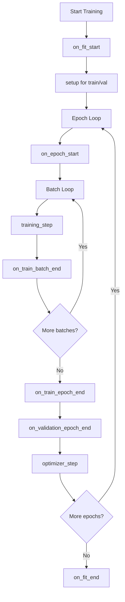
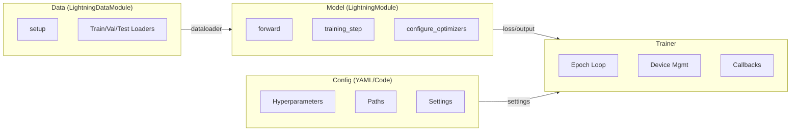

# 心智模型

## Lightning 如何組織程式碼

Lightning 將 PyTorch 專案劃分為四個明確的職責：

| 組件 | 職責 |
| :--- | :--- |
| **Model (模型)** | 前向傳播、損失計算、架構 |
| **Data (數據)** | 數據集、數據轉換、數據加載 |
| **Trainer (訓練器)** | 迴圈執行、設備管理、回調函數 |
| **Config (配置)** | 超參數、路徑、設定 |

這種分離意味著每個組件都是可測試、可重複使用且獨立的。

## 掛鉤系統 (The Hook System)

Lightning 用**掛鉤系統**取代了顯式的訓練迴圈。您只需實現特定的方法（`hooks`），Lightning 會在訓練的特定階段呼叫它們。

### 核心掛鉤



### 關鍵掛鉤參考

| 掛鉤 | 呼叫時機 | 用途 |
| :--- | :--- | :--- |
| `on_train_start` | 在第一個訓練 epoch 之前呼叫一次 | 初始化日誌，構建模型 |
| `training_step` | 每個訓練 batch | 計算一個 batch 的損失 |
| `validation_step` | 每個驗證 batch | 計算驗證指標 |
| `on_train_epoch_end` | 每個訓練 epoch 結束時 | 彙總 epoch 級別的指標 |
| `configure_optimizers` | 訓練前呼叫一次 | 配置優化器和排程器 |
| `on_train_end` | 訓練結束後呼叫一次 | 清理工作，最終日誌記錄 |

### 映射關係：原生 PyTorch 與 Lightning

下面是原生 PyTorch 訓練迴圈與 Lightning 掛鉤的對應關係：

```python
# 原生 PyTorch
for epoch in range(num_epochs):
    model.train()
    for batch in train_loader:
        optimizer.zero_grad()
        output = model(batch.x)
        loss = criterion(output, batch.y)
        loss.backward()
        optimizer.step()

# Lightning 等效掛鉤
class MyModel(LightningModule):
    def configure_optimizers(self):
        return optimizer

    def training_step(self, batch, batch_idx):
        output = self(batch.x)
        loss = criterion(output, batch.y)
        return loss
```

| 原生 PyTorch | Lightning 掛鉤 |
| :--- | :--- |
| `for epoch` 迴圈 | 由 Trainer 管理 |
| `for batch` 迴圈 | 由 Trainer 管理 |
| `optimizer.zero_grad()` | 自動完成 (如果使用手動優化，需手動設定 `optimizer.zero_grad()`) |
| `output = model(batch)` | `training_step(self, batch, batch_idx)` |
| `loss = criterion(output, target)` | 在 `training_step` 內 |
| `loss.backward()` | 自動完成 |
| `optimizer.step()` | 透過 `configure_optimizers` 自動完成 |

## 關注點分離 (Separation of Concerns)

### Model vs Data vs Trainer vs Config



### LightningModule

包含內容：

- 模型架構（在 `__init__` 中定義的 `nn.Module` 層）
- 前向傳播 (`forward()`)
- 訓練邏輯 (`training_step()`)
- 驗證邏輯 (`validation_step()`)
- 優化器配置 (`configure_optimizers()`)
- 日誌記錄 (`self.log()`)

不包含內容：

- 數據加載（由 DataModule 處理）
- Epoch 迴圈（由 Trainer 處理）
- 設備分配（由 Trainer 處理）

### LightningDataModule

包含內容：

- 數據集構建 (`setup()`)
- 數據加載器 (`train_dataloader()`, `val_dataloader()`, `test_dataloader()`)
- 數據轉換和預處理
- 數據拆分

不包含內容：

- 模型架構
- 訓練邏輯
- 優化器配置

### Trainer

負責管理：

- Epoch 和 batch 迭代
- 設備分配（CPU/GPU/TPU）
- 梯度清零、反向傳播、優化器步進
- AMP (自動混合精度)
- 檢查點和早停
- 日誌整合

:::tip[明確邊界]
將模型程式碼放在模型中，將數據程式碼放在數據模組中，將訓練配置放在設定文件中。這使每個組件都能進行獨立測試。
:::

## 執行流程

當呼叫 `trainer.fit(model, datamodule=datamodule)` 時：

1. **初始化**：Trainer 設定設備、混合精度、分散式訓練
2. **`on_fit_start`**：Model 和 DataModule 初始化
3. **`setup()`**：DataModule 準備數據集
4. **`configure_optimizers`**：建立優化器和排程器
5. **Epoch 迴圈**：
   - `on_epoch_start`
   - 對每個 batch：`training_step`
   - `on_train_epoch_end`
   - `on_validation_epoch_end` (運行驗證)
6. **清理**：運行 `on_fit_end`，觸發清理回調函數

這種結構化的流程是 Lightning 具有可預測性的原因——每次訓練運行都遵循相同的順序。
