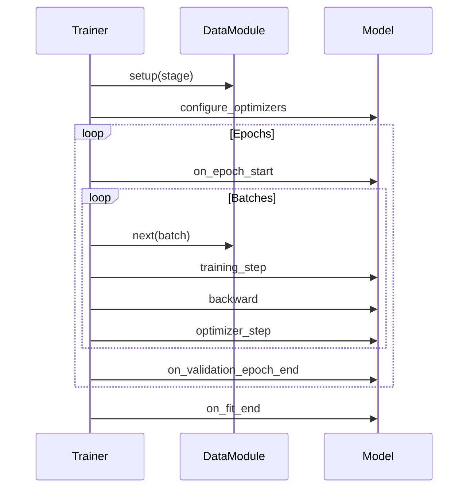

# Trainer

`Trainer` 是執行訓練的編排器。它管理訓練迴圈、設備放置、混合精度、檢查點（checkpointing）等等。當你呼叫 `trainer.fit(model)` 時，Lightning 會處理從資料迭代到模型保存的一切事務。

## 基本用法

```python
import lightning as L

trainer = L.Trainer(
    max_epochs=10,
    accelerator="gpu",
    devices=1
)

trainer.fit(model, datamodule=datamodule)
```

## Trainer 管理什麼

| 職責 | Lightning 處理的內容 |
| :--- | :--- |
| Epoch 迴圈 | 迭代所有的 epoch |
| 批次 (Batch) 迭代 | 從 DataLoader 載入批次 |
| 設備放置 | 將張量移動到正確的設備 |
| 梯度 | 清零梯度、反向傳播、優化器步進 |
| 混合精度 (AMP) | 自動 FP16/BF16 |
| 檢查點 | 保存模型權重 |
| 早停 (Early Stopping) | 監控指標 |
| 日誌記錄 (Logging) | 與日誌記錄器整合 |
| 偵錯標誌 | 快速開發執行 (fast dev runs)、分析 (profiling) |

## 關鍵標誌 (Flags)

### 訓練控制

```python
trainer = L.Trainer(
    max_epochs=10,           # 最大訓練 epoch 數
    min_epochs=1,            # 最小 epoch 數 (預設: 0)
    max_steps=-1,            # 最大步數 (-1 = 直到資料集耗盡)
    min_steps=1,             # 最小步數
    accumulate_grad_batches=1, # 梯度累加
)
```

### 設備管理

```python
trainer = L.Trainer(
    accelerator="auto",  # "cpu", "gpu", "tpu", "mps", "auto"
    devices="auto",       # 設備數量或 "auto"
    num_nodes=1,         # 分散式訓練的機器數量
)
```

| `accelerator` 值 | 描述 |
| :--- | :--- |
| `"cpu"` | 僅 CPU |
| `"gpu"` | NVIDIA GPU (CUDA) |
| `"mps"` | Apple Silicon (M1/M2) |
| `"tpu"` | Google TPU |
| `"auto"` | 自動選擇 (如果有 GPU 則使用，否則使用 CPU) |

### 混合精度

```python
trainer = L.Trainer(
    precision="32-true",    # 全精度 (預設)
    "16-mixed",            # FP16 混合精度
    "bf16-mixed",         # BF16 混合精度
    "bf16-facebook",      # Facebook 的 bfloat16
)
```

:::tip[效能提示]
在現代 GPU 上使用 `precision="16-mixed"` 可以獲得 2-3 倍的加速，且精度損失極小。使用 `"bf16-mixed"` 可獲得更好的數值穩定性。
:::

### 梯度管理

```python
trainer = L.Trainer(
    gradient_clip_val=1.0,     # 裁剪梯度範數
    gradient_clip_algorithm="norm",  # "norm" 或 "value"
    accumulate_grad_batches=4,  # 累加梯度
)
```

### 檢查點 (Checkpointing)

```python
trainer = L.Trainer(
    enable_checkpointing=True,
    checkpoint_dir="checkpoints/",
    save_top_k=3,                     # 保留最好的 k 個模型
    monitor="val_loss",
    mode="min",
    save_on_train_epoch_end=False,      # 在驗證結束時保存 (預設)
)
```

### 偵錯標誌

```python
trainer = L.Trainer(
    fast_dev_run=1,          # 執行 1 個 train/val 批次 (快速測試)
    limit_train_batches=0.1, # 使用 10% 的訓練資料
    limit_val_batches=0.1,   # 使用 10% 的驗證資料
    limit_test_batches=0.1,   # 使用 10% 的測試資料
    overfit_batches=0.05,    # 在 5% 的資料上過擬合 (檢查容量)
)
```

| 標誌 | 用例 |
| :--- | :--- |
| `fast_dev_run=4` | 快速完整性檢查 (總共 4 個批次) |
| `limit_train_batches=100` | 偵錯資料管道 |
| `overfit_batches=10` | 測試模型容量 |
| `detect_anomaly=True` | 偵錯 NaN/Inf 問題 |

## 訓練方法

| 方法 | 目的 |
| :--- | :--- |
| `trainer.fit(model, datamodule)` | 訓練模型 |
| `trainer.validate(model, datamodule)` | 僅執行驗證 |
| `trainer.test(model, datamodule)` | 僅執行測試 |
| `trainer.predict(model, datamodule)` | 執行推論 |

## 分散式訓練策略

Lightning 支援多種分散式策略，只需一行配置：

```python
# 資料平行 (單機多卡)
trainer = L.Trainer(
    accelerator="gpu",
    devices=4,
    strategy="dp"  # 或 "ddp"
)

# 分散式資料平行 (多機多卡)
trainer = L.Trainer(
    accelerator="gpu",
    devices=4,
    num_nodes=2,
    strategy="ddp"  # 或 "ddp_spawn"
)

# DeepSpeed (記憶體高效)
trainer = L.Trainer(
    accelerator="gpu",
    strategy="deepspeed",
    deepspeed_config="deepspeed_config.json"
)

# 完全分片資料平行 (Fully Sharded Data Parallel)
trainer = L.Trainer(
    accelerator="gpu",
    strategy="fsdp",
    fsdp_config={...}
)
```

| 策略 | 最適合 |
| :--- | :--- |
| `"dp"` | 單機，2-4 個 GPU |
| `"ddp"` | 多 GPU，多節點 |
| `"deepspeed"` | 大型模型，GPU 記憶體有限 |
| `"fsdp"` | 大型模型 (PyTorch 原生) |

### 策略選擇

```python
# 讓 Lightning 自動選擇
trainer = L.Trainer(accelerator="auto", devices="auto")

# 顯式策略
trainer = L.Trainer(
    accelerator="gpu",
    devices="auto",
    strategy="auto"  # 根據設定自動選擇
)
```

## 回呼函數 (Callbacks)

```python
from lightning import callbacks

trainer = L.Trainer(
    callbacks=[
        callbacks.ModelCheckpoint(monitor="val_loss", save_top_k=3),
        callbacks.EarlyStopping(monitor="val_loss", patience=5),
    ]
)
```

## 日誌記錄器 (Loggers)

```python
from lightning import loggers

trainer = L.Trainer(
    logger=loggers.TensorBoardLogger("logs/"),
    # 或多個日誌記錄器
    logger=[
        loggers.TensorBoardLogger("logs/"),
        loggers.CSVLogger("logs/csv/"),
    ]
)
```

## 訓練流程



## 範例：完整訓練

```python
import lightning as L

# 模型
model = MyLightningModule()

# 資料
datamodule = MyDataModule()

# Trainer
trainer = L.Trainer(
    max_epochs=10,
    accelerator="gpu",
    devices=1,
    precision="16-mixed",
    callbacks=[
        L.callbacks.ModelCheckpoint(
            monitor="val_loss",
            save_top_k=3,
            save_last=True
        ),
        L.callbacks.EarlyStopping(
            monitor="val_loss",
            patience=5,
            mode="min"
        ),
        L.callbacks.LearningRateMonitor()
    ],
    logger=L.loggers.TensorBoardLogger("logs/"),
    check_val_every_n_epoch=1,
    enable_progress_bar=True,
)

# 訓練
trainer.fit(model, datamodule=datamodule)

# 測試
trainer.test(model, datamodule=datamodule)
```

:::tip[迭代工作流]
從基本標誌開始 (`max_epochs`, `accelerator`)。僅在需要時添加複雜性：首先是混合精度，然後是分散式訓練。
:::