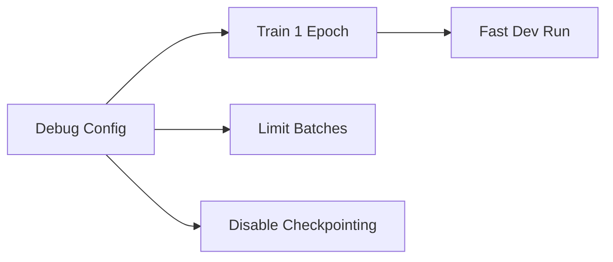

# 設定組合 (Config Composition)

本文件涵蓋了進階的 Hydra 組合模式：實驗設定、超參數搜尋、掃描 (sweeps) 以及除錯設定。這些模式使得系統化的機器學習實驗成為可能。

## 實驗設定

實驗設定將多個設定組合併成一個完整的實驗定義：

```yaml
# configs/experiment/my_experiment.yaml
defaults:
  - model: resnet50
  - datamodule: imagenet
  - optimizer: sgd
  - scheduler: cosine_annealing
  - trainer: gpu_8x
  - logger: wandb

# 覆寫特定參數
model:
  lr: 0.1
  weight_decay: 1e-4

trainer:
  max_epochs: 100
```

### 使用實驗設定

```bash
# 載入實驗設定
python scripts/train.py +experiment=my_experiment

# 如果需要，覆寫實驗中的值
python scripts/train.py +experiment=my_experiment model.lr=0.05
```

`+` 前綴會將實驗動態地新增到 `defaults` 列表中。

## 除錯設定

除錯設定為快速開發提供了便捷的覆寫：

```yaml
# configs/debug/default.yaml
defaults:
  - model: default
  - datamodule: default
  - _self_

# 用於快速迭代的快速設定
trainer:
  max_epochs: 1
  limit_train_batches: 10
  limit_val_batches: 5
  limit_test_batches: 5
  fast_dev_run: true

model:
  lr: 1e-3
```



### 使用除錯模式

```bash
# 快速的完整性檢查 (sanity check)
python scripts/train.py +debug=default

# 更快的方式：只跑單個批次
python scripts/train.py +debug=default trainer.fast_dev_run=true
```

## 超參數搜尋

超參數搜尋自動化了參數空間的探索。Hydra 提供了兩種模式：

### 多次執行掃描 / Multirun Sweeps (`-m`)

`-m` 標誌用於執行多個設定：

```bash
# 對學習率進行網格搜尋
python scripts/train.py -m model.lr=1e-3,1e-4,1e-5

# 對多個參數進行網格搜尋
python scripts/train.py -m model.lr=1e-3,1e-4 model.dropout=0.1,0.2,0.5
```

這將執行所有的組合（2 x 3 = 6 次執行）。

### 隨機掃描 (Random Sweeps)

使用 OmegaConf 進行隨機（均勻）採樣：

```yaml
# configs/sweep.yaml
defaults:
  - override hydra/launcher: basic_sweeper

hydra:
  launcher:
    _target_: hydra._internal.launcher.BasicLauncher
  
  sweeper:
    _target_: hydra._internal.sweeper.RandomSampler
    params:
      model.lr: uniform(1e-5, 1e-1)
      model.dropout: uniform(0.0, 0.5)
```

```bash
# 隨機搜尋（5 次執行）
python scripts/train.py -m --config-name=sweep model.lr=0.001 model.dropout=0.1
```

## 帶有搜尋的多次執行

### 命令列介面

```bash
# 簡單的掃描
python scripts/train.py -m model.lr=1e-3,1e-4,1e-5

# 指定輸出目錄
python scripts/train.py -m model.lr=1e-3,1e-4,1e-5 hydra.sweeper.dir=logs/sweep_${now:%Y-%m-%d_%H-%M-%S}
```

### 掃描器設定 (Sweeper Configuration)

更複雜的掃描需要掃描器設定：

```yaml
# configs/sweeper/basic.yaml
defaults:
  - override hydra/launcher: basic_sweeper

hydra:
  mode: MULTIRUN
  sweeper:
    _target_: hydra._internal.grid_sweeper.GridSweeper
    params:
      model.lr: range(1e-5, 1e-2, 5)
      model.dropout: [0.0, 0.1, 0.2, 0.3, 0.4, 0.5]
    max_batch_count: 10
```

```bash
# 使用掃描器設定執行
python scripts/train.py --config-name=sweeper
```

## 組合器設定 (Composer for Configs)

Hydra 組合器允許組合多個設定：

```yaml
# configs/experiment/advanced.yaml
defaults:
  - model: resnet
  - /datamodule@datamodule: imagenet
  - /optimizer@optimizer: sgd
  - /scheduler@scheduler: cosine
  - /trainer@trainer: gpu
  - /logger@logger: tensorboard
  - _self_
```

這使用了 `@` 符號進行明確賦值的群組。

## 設定組最佳實務

### 組織策略

```text
configs/
├── base/              # 基礎設定 (gpu, cpu 等)
├── model/             # 模型架構
├── datamodule/        # 資料設定
├── optimizer/         # 最佳化器設定
├── scheduler/         # 學習率排程器設定
├── experiment/        # 完整的實驗
└── debug/            # 除錯覆寫
```

### 基礎設定

建立可以被覆寫的合理預設值：

```yaml
# configs/trainer/base.yaml
# 適用於任何加速器的最簡訓練器設定
accelerator: auto
devices: 1
max_epochs: 10
```

```yaml
# configs/trainer/gpu.yaml
defaults:
  - base
extends: configs/trainer/base.yaml
accelerator: gpu
precision: 32
```

## 帶有覆寫的實驗組合

### 完整範例：搜尋實驗

```yaml
# configs/experiment/search.yaml
defaults:
  - model: resnet50
  - datamodule: imagenet
  - optimizer: sgd
  - scheduler: cosine_annealing
  - trainer: gpu
  - logger: wandb
  - _self_

# 覆寫用於搜尋的模型參數
model:
  lr: 0.1
  weight_decay: 1e-4
  label_smoothing: 0.1

trainer:
  max_epochs: 90

# 掃描特定的值
scheduler:
  T_max: ${trainer.max_epochs}
  eta_min: 1e-6
```

## 搜尋視覺化

透過日誌設定追蹤掃描結果：

```yaml
# configs/logger/wandb.yaml
_target_: lightning.pytorch.loggers.WandbLogger
project: my-project
entity: my-team
tags: ["experiment", "sweep"]
log_model: true
```

```bash
# 執行掃描並記錄到 W&B
python scripts/train.py -m model.lr=1e-3,1e-4,1e-5 +experiment=search logger=wandb
```

## 設定中的環境變數

引用環境變數：

```yaml
# configs/datamodule/imagenet.yaml
_target_: src.data.ImageNetDataModule
data_dir: ${env:DATA_DIR:-./data}
num_workers: ${env:NUM_WORKERS:-4}
```

```bash
export DATA_DIR=/mnt/data
export NUM_WORKERS=8
python scripts/train.py datamodule=imagenet
```

## 進階：結構化設定

使用 OmegaConf 結構化設定進行類型驗證：

```python
# src/utils/configs.py
from dataclasses import dataclass
from omegaconf import MISSING

@dataclass
class TrainerConfig:
    accelerator: str = "auto"
    devices: int = 1
    max_epochs: int = 10
    precision: int = 32

@dataclass  
class ModelConfig:
    lr: float = MISSING
    hidden_dims: list = MISSING
    dropout: float = 0.0
```

```yaml
# configs/default.yaml
defaults:
  - trainer: default

trainer:
  $target_: src.utils.configs.TrainerConfig
  
model:
  $target_: src.utils.configs.ModelConfig
```

## 掃描結果

### 目錄結構

掃描會建立結構化的輸出：

```text
logs/
├── sweep_2024-01-15_10-30-00/
│   ├── multirun.yaml
│   ├── 1/
│   │   └── train.log
│   ├── 2/
│   │   └── train.log
│   └── ...
```

### 載入結果

```python
# 在掃描完成後，分析結果
import pandas as pd
import yaml

with open("logs/sweep/multirun.yaml") as f:
    results = yaml.safe_load(f)
```

## 快速參考

| 命令 | 描述 |
| :--- | :--- |
| `+experiment=name` | 載入實驗設定 |
| `+debug=name` | 載入除錯設定 |
| `-m param=value1,value2` | 執行多次掃描 (multirun sweep) |
| `--config-name=sweep` | 使用掃描設定 |
| `param=value` | 覆寫單個值 |

```bash
# 完整範例
python scripts/train.py \
    +experiment=resnet50_search \
    model.lr=0.1 \
    trainer.max_epochs=90 \
    logger=wandb
```

## 下一步

- [實例化 (Instantiation)](./instantiation): 從設定中實例化元件
- [自訂模組 (Custom Module)](../custom-implementation/custom-module): 建構自訂的 Lightning 模組
