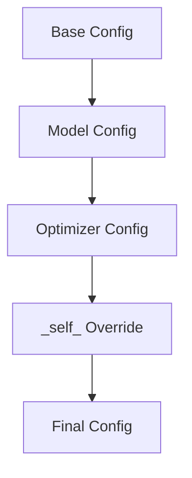

# 實例化 (Instantiation)

本文件介紹了如何從 Hydra 設定中實例化 Lightning 元件。`hydra.utils.instantiate()` 模式是從設定檔建立 DataModule、模型、回呼函數、日誌記錄器、最佳化器和排程器的標準方法。

## Instantiate 模式

Hydra 的 `instantiate()` 函數可以從設定字典中建立物件：

```python
from hydra.utils import instantiate

# 從設定字典實例化
model = instantiate(cfg.model)
```

設定中必須包含一個 `_target_` 鍵，用於指定要實例化的類別：

```yaml
# configs/model/my_model.yaml
_target_: src.models.MyModel
lr: 1e-3
hidden_dim: 256
```

## DataModule 實例化

### 設定

```yaml
# configs/datamodule/mnist.yaml
_target_: src.data.MNISTDataModule
data_dir: ./data
batch_size: 64
num_workers: 4
```

### 程式碼

```python
datamodule = instantiate(cfg.datamodule)
```

`instantiate` 呼叫會將所有設定鍵（除 `_target_` 外）作為關鍵字參數傳遞給類別的建構子。

### 多資料集場景

```yaml
# configs/datamodule/paired.yaml
_target_: src.data.PairedDataModule
source:
  _target_: src.data.MNISTDataModule
  data_dir: ./data
target:
  _target_: src.data.CIFAR10DataModule
  data_dir: ./data
```

```python
datamodule = instantiate(cfg.datamodule)
# 返回帶有已實例化的 source 和 target 的 PairedDataModule
```

## 模型/LightningModule 實例化

### 設定

```yaml
# configs/module/my_module.yaml
_target_: src.models.MyLightningModule
lr: 1e-3
hidden_dim: 256
dropout: 0.1
```

### 程式碼

```python
model = instantiate(cfg.module)
```

實例化後的模型是一個完全初始化的 LightningModule，已準備好進行訓練。

### 帶有超參數

使用 `save_hyperparameters()` 將設定持久化到檢查點 (checkpoint) 中：

```python
class MyLightningModule(L.LightningModule):
    def __init__(self, lr: float, hidden_dim: int, dropout: float = 0.0):
        super().__init__()
        self.save_hyperparameters()
        self.model = nn.Linear(hidden_dim, 10)
    
    def forward(self, x):
        return self.model(x)
```

從檢查點載入時，超參數會自動恢復。

## 最佳化器和排程器實例化

### 最佳化器設定

```yaml
# configs/optimizer/adam.yaml
_target_: torch.optim.Adam
lr: 1e-3
betas: [0.9, 0.999]
eps: 1e-8
weight_decay: 0.0
```

### 排程器設定

```yaml
# configs/scheduler/cosine.yaml
_target_: torch.optim.lr_scheduler.CosineAnnealingLR
T_max: 10
eta_min: 1e-6
```

### 組合設定

```yaml
# configs/optimizer/scheduler.yaml
optimizer:
  _target_: torch.optim.Adam
  lr: 1e-3
  
scheduler:
  _target_: torch.optim.lr_scheduler.CosineAnnealingLR
  T_max: 100
  eta_min: 1e-6
```

### 程式碼

```python
# 實例化最佳化器
optimizer = instantiate(cfg.optimizer, model.parameters())

# 實例化排程器
scheduler = instantiate(cfg.scheduler, optimizer)
```

### 在 LightningModule 中

```python
def configure_optimizers(self):
    optimizer = instantiate(self.cfg.optimizer, self.parameters())
    
    scheduler = instantiate(
        self.cfg.scheduler,
        optimizer,
        T_max=self.cfg.trainer.max_epochs
    )
    
    return {
        "optimizer": optimizer,
        "lr_scheduler": {
            "scheduler": scheduler,
            "monitor": "val_loss",
        }
    }
```

## 回呼函數 (Callback) 實例化

回呼函數用於監控訓練並能對事件做出反應。它們需要實例化工具：

### instantiate_callbacks 工具

```python
# src/utils/callbacks.py
def instantiate_callbacks(cfg):
    """從設定實例化回呼函數。"""
    callbacks = []
    
    if cfg is None:
        return callbacks
    
    callbacks_cfg = OmegaConf.to_container(cfg, resolve=True)
    
    for callback_name, callback_conf in callbacks_cfg.items():
        if isinstance(callback_conf, dict) and "_target_" in callback_conf:
            callback = instantiate(callback_conf)
            callback.name = callback_name
            callbacks.append(callback)
    
    return callbacks
```

### 回呼函數設定

```yaml
# configs/callbacks/default.yaml
model_checkpoint:
  _target_: lightning.pytorch.callbacks.ModelCheckpoint
  save_top_k: 1
  monitor: val_loss
  mode: min
  dirpath: ./models
  filename: best

early_stopping:
  _target_: lightning.pytorch.callbacks.EarlyStopping
  monitor: val_loss
  patience: 5
  mode: min

lr_monitor:
  _target_: lightning.pytorch.callbacks.LearningRateMonitor
  log_momentum: true
```

### 用法

```python
callbacks = instantiate_callbacks(cfg.callbacks)
trainer = Trainer(callbacks=callbacks)
```

## 日誌記錄器 (Logger) 實例化

日誌記錄器用於記錄指標和製品 (artifacts)：

### instantiate_loggers 工具

```python
# src/utils/loggers.py
def instantiate_loggers(cfg):
    """從設定實例化日誌記錄器。"""
    loggers = []
    
    if cfg is None:
        return loggers
    
    logger_cfg = OmegaConf.to_container(cfg, resolve=True)
    
    for logger_name, logger_conf in logger_cfg.items():
        if isinstance(logger_conf, dict) and "_target_" in logger_conf:
            logger = instantiate(logger_conf)
            logger.name = logger_name
            loggers.append(logger)
    
    return loggers
```

### 日志記錄器設定

```yaml
# configs/logger/default.yaml
tensorboard:
  _target_: lightning.pytorch.loggers.TensorBoardLogger
  save_dir: ./logs
  name: lightning

wandb:
  _target_: lightning.pytorch.loggers.WandbLogger
  project: my-project
  entity: my-team
  tags: ["experiment"]
```

### 用法

```python
loggers = instantiate_loggers(cfg.logger)
trainer = Trainer(logger=loggers)
```

## `_self_` 關鍵字

`_self_` 關鍵字允許本機設定覆寫組合後的值：

```yaml
# configs/experiment/my_exp.yaml
defaults:
  - model: resnet50
  - optimizer: adam
  - _self_

# 覆寫最佳化器的學習率
optimizer:
  lr: 0.05  # 覆寫來自 optimizer/adam.yaml 的預設值
```

當 `_self_` 出現在 `defaults` 中時，當前設定將最後被應用，從而允許它覆寫來自 `defaults` 的值。

## 設定合併規則

Hydra 按順序合併設定。後面的設定會覆寫前面的設定：

```yaml
# defaults 順序很重要
defaults:
  - model: base
  - datamodule: default
  - optimizer: adam  # 最後載入，可以覆寫先前的
  - _self_  # 本機值覆寫一切
```



## 完整的訓練腳本

```python
# scripts/train.py
import hydra
from omegaconf import DictConfig, OmegaConf
import lightning as L
from hydra.utils import instantiate

from src.utils.callbacks import instantiate_callbacks
from src.utils.loggers import instantiate_loggers

@hydra.main(version_base=None, config_path="../configs", config_name="default")
def main(cfg: DictConfig):
    # 實例化元件
    datamodule = instantiate(cfg.datamodule)
    model = instantiate(cfg.module)
    
    # 設定回呼函數和日誌記錄器
    callbacks = instantiate_callbacks(cfg.get("callbacks"))
    loggers = instantiate_loggers(cfg.get("logger", {}))
    
    # 建立訓練器
    trainer = L.Trainer(
        **cfg.trainer,
        callbacks=callbacks,
        logger=loggers,
    )
    
    # 訓練
    trainer.fit(model, datamodule=datamodule)
    
    # 測試 (可選)
    if cfg.get("test"):
        trainer.test(model, datamodule=datamodule)

if __name__ == "__main__":
    main()
```

## 預設設定彙總

```yaml
# configs/default.yaml
defaults:
  - trainer: default
  - module: default
  - datamodule: default
  - optimizer: adam
  - scheduler: cosine
  - callbacks: default
  - logger: tensorboard
  - _self_

# 訓練器設定
trainer:
  accelerator: gpu
  devices: 1
  max_epochs: 10
  precision: 32

# 模型設定
module:
  lr: 1e-3
  hidden_dim: 256
```

## 使用實例化元件執行

```bash
# 預設執行
python scripts/train.py

# 自訂設定
python scripts/train.py model.lr=1e-4 +experiment=resnet50

# 使用自訂回呼函數
python scripts/train.py callbacks+=my_callback

# 覆寫參數
python scripts/train.py callbacks.model_checkpoint.save_top_k=3
```

:::tip[除錯實例化]
新增日誌以查看正在實例化的內容：
```python
print(OmegaConf.to_yaml(cfg))
model = instantiate(cfg.model)
print(f"Created: {type(model)}")
```
:::

## 下一步

- [自訂模組 (Custom Module)](../custom-implementation/custom-module): 建構自訂的 Lightning 模組
- [自訂資料模組 (Custom DataModule)](../custom-implementation/custom-datamodule): 建構自訂資料模組
- [自訂回呼函數 (Custom Callbacks)](../custom-implementation/custom-callbacks): 撰寫自訂回呼函數
