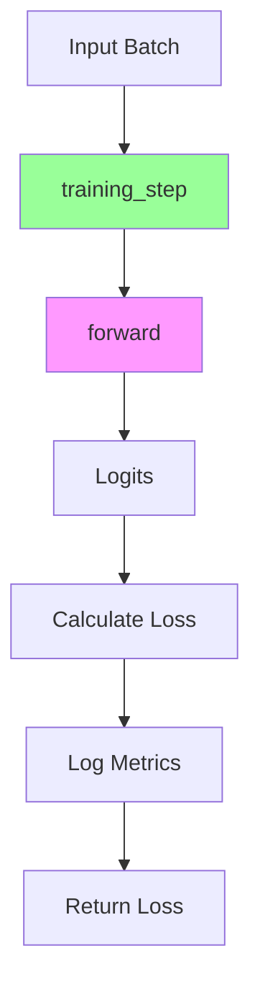

# 自訂 Module (Custom Module)

本文檔介紹了建構自訂 `LightningModule` 的方法——這是在 Lightning 中封裝神經網路的標準方式。內容包括完整的類別模板、`forward` 與 `step` 方法的分別、損失計算模式以及日誌記錄的最佳實踐。

## 完整類別模板

一個標準的 `LightningModule` 應該包含模型架構、前向傳播（forward pass）以及訓練/驗證邏輯：

```python
import lightning as L
import torch
import torch.nn as nn
import torch.nn.functional as F


class MyLightningModule(L.LightningModule):
    """自訂 LightningModule 模板。
    
    Args:
        hidden_dim: 隱藏層維度大小。
        lr: 優化器的學習率。
    """
    
    def __init__(self, hidden_dim: int = 256, lr: float = 1e-3):
        super().__init__()
        # 將參數保存到檢查點 (checkpoint)
        self.save_hyperparameters()
        
        # 定義模型架構
        self.layer_1 = nn.Linear(28 * 28, hidden_dim)
        self.layer_2 = nn.Linear(hidden_dim, 10)
        
        self.lr = lr
    
    def forward(self, x):
        """前向傳播，主要用於推論 (inference)。"""
        batch_size = x.size(0)
        x = x.view(batch_size, -1)
        
        x = self.layer_1(x)
        x = F.relu(x)
        x = self.layer_2(x)
        
        return x
    
    def training_step(self, batch, batch_idx):
        """單個訓練步。"""
        x, y = batch
        logits = self(x)
        
        loss = F.cross_entropy(logits, y)
        
        # 記錄訓練指標
        self.log("train_loss", loss, on_step=True, on_epoch=True, prog_bar=True)
        
        return loss
    
    def validation_step(self, batch, batch_idx):
        """單個驗證步。"""
        x, y = batch
        logits = self(x)
        
        loss = F.cross_entropy(logits, y)
        preds = torch.argmax(logits, dim=1)
        acc = (preds == y).float().mean()
        
        # 記錄驗證指標
        self.log("val_loss", loss, on_step=False, on_epoch=True, prog_bar=True)
        self.log("val_acc", acc, on_step=False, on_epoch=True, prog_bar=True)
        
    def test_step(self, batch, batch_idx):
        """單個測試步。"""
        x, y = batch
        logits = self(x)
        
        loss = F.cross_entropy(logits, y)
        preds = torch.argmax(logits, dim=1)
        acc = (preds == y).float().mean()
        
        # 記錄測試指標
        self.log("test_loss", loss, on_step=False, on_epoch=True)
        self.log("test_acc", acc, on_step=False, on_epoch=True)
    
    def configure_optimizers(self):
        """配置優化器和學習率排程器。"""
        optimizer = torch.optim.Adam(self.parameters(), lr=self.lr)
        return optimizer
```

## Forward 與 Step 詳解

在 Lightning 中，通常將推論邏輯（`forward`）與訓練邏輯（`*_step`）分開。



### forward

`forward` 方法定義了模型如何將輸入轉換為預測輸出。應該僅用於推論。

```python
def forward(self, x):
    # 僅包含推論邏輯
    embeddings = self.encoder(x)
    predictions = self.decoder(embeddings)
    return predictions
```

### step 方法

`step` 方法（如 `training_step`, `validation_step`）負責處理單個批次（batch）的數據，通常會呼叫 `self(x)`（即 `forward`）來獲取預測結果，並計算損失。

| 鉤子 (Hook) | 階段 | 描述 |
| :--- | :--- | :--- |
| `training_step` | 訓練 | 處理一個訓練批次 |
| `on_train_batch_end` | 訓練 | 聚合批次級別的結果（可選） |
| `on_train_epoch_end` | 訓練 | 聚合 epoch 級別的結果（可選） |
| `validation_step` | 驗證 | 處理一個驗證批次 |
| `on_validation_batch_end` | 驗證 | 聚合批次級別的結果（可選） |
| `on_validation_epoch_end` | 驗證 | 聚合 epoch 級別的結果（可選） |
| `test_step` | 測試 | 處理一個測試批次 |
| `predict_step` | 推論 | 處理一個批次用於預測 |

### training_step

```python
def training_step(self, batch, batch_idx):
    x, y = batch
    logits = self(x)
    
    loss = F.cross_entropy(logits, y)
    
    self.log("train_loss", loss, on_step=True, on_epoch=True)
    
    return loss
```

### validation_step

```python
def validation_step(self, batch, batch_idx):
    x, y = batch
    logits = self(x)
    
    loss = F.cross_entropy(logits, y)
    
    self.log("val_loss", loss, on_step=False, on_epoch=True)
    
    return loss
```

### 返回多個值

Step 方法可以返回一個字典，以包含額外的輸出內容：

```python
def training_step(self, batch, batch_idx):
    x, y = batch
    logits = self(x)
    
    loss = F.cross_entropy(logits, y)
    preds = torch.argmax(logits, dim=1)
    
    return {
        "loss": loss,
        "preds": preds,
        "targets": y,
    }
```

## 損失計算模式

### 交叉熵損失 (Cross-Entropy Loss)

```python
def training_step(self, batch, batch_idx):
    x, y = batch
    logits = self(x)
    
    loss = F.cross_entropy(logits, y)
    return loss
```

### 自訂損失函數

```python
def __init__(self, ...):
    super().__init__()
    self.save_hyperparameters()
    self.criterion = nn.MSELoss()

def training_step(self, batch, batch_idx):
    x, y = batch
    logits = self(x)
    
    loss = self.criterion(logits, y)
    return loss
```

### 多任務損失 (Multi-Task Loss)

```python
def training_step(self, batch, batch_idx):
    x, y_cls, y_reg = batch
    pred_cls, pred_reg = self(x)
    
    loss_cls = F.cross_entropy(pred_cls, y_cls)
    loss_reg = F.mse_loss(pred_reg, y_reg)
    
    # 組合加權
    loss = loss_cls + 0.1 * loss_reg
    
    self.log("train_loss", loss)
    self.log("train_loss_cls", loss_cls)
    self.log("train_loss_reg", loss_reg)
    
    return loss
```

## 日誌記錄模式

使用 `self.log()` 方法來記錄指標：

```python
self.log(
    "metric_name",  # 指標名稱 (用於 logger)
    value,         # 指標值
    on_step=True,  # 在每個 step 記錄
    on_epoch=True, # 在 epoch 結束時聚合和記錄
    prog_bar=True,  # 在進度條中顯示
    logger=True,   # 發送到 logger
)
```

### 日誌選項

| 參數 | 記錄時機 | 使用場景 |
| :--- | :--- | :--- |
| `on_step=True` | 每個批次 | 損失 (可能會有波動) |
| `on_epoch=True` | Epoch 結束 | 總結的指標 |
| `prog_bar=True` | 進度展示 | 需要實時關注的關鍵指標 |
| `logger=True` | 外部 logger | W&B, TensorBoard 等 |

### 最佳實踐

```python
# Loss - 靈活地以兩種方式記錄
self.log("train_loss", loss, on_step=True, on_epoch=True, prog_bar=True)

# Accuracy - 僅在 epoch 級別記錄
self.log("train_acc", acc, on_step=False, on_epoch=True, prog_bar=True)
```

## 保存和載入超參數

`save_hyperparameters()` 方法可將 `__init__` 中的參數保存到檢查點 (checkpoint) 中：

```python
def __init__(self, lr: float = 1e-3, hidden_dim: int = 256):
    super().__init__()
    self.save_hyperparameters()
    
    self.layer = nn.Linear(hidden_dim, 10)
```

### 載入

```python
# 自動恢復超參數
model = MyLightningModule.load_from_checkpoint("path/to/ckpt.ckpt")

# 存取載入的超參數
print(model.hparams.lr)
print(model.hparams.hidden_dim)
```

### 顯式保存

指定僅保存特定的參數：

```python
def __init__(self, lr: float = 1e-3, hidden_dim: int = 256):
    super().__init__()
    self.save_hyperparameters("lr", "hidden_dim")
```

:::caution[參數記錄警告]
不要在 `__init__` 方法中進行日誌記錄 (`self.log`)。請使用 step 的相關鉤子記錄日誌——因為在 `__init__` 階段 Trainer 還沒有就緒。
:::

## 範例：完整的 MNIST 分類器

```python
import lightning as L
import torch
import torch.nn as nn
import torch.nn.functional as F


class MNISTClassifier(L.LightningModule):
    def __init__(self, lr: float = 1e-3):
        super().__init__()
        self.save_hyperparameters()
        
        self.conv1 = nn.Conv2d(1, 32, 3, padding=1)
        self.conv2 = nn.Conv2d(32, 64, 3, padding=1)
        self.fc1 = nn.Linear(64 * 7 * 7, 128)
        self.fc2 = nn.Linear(128, 10)
        
        self.dropout = nn.Dropout(0.25)
        self.lr = lr
    
    def forward(self, x):
        x = F.relu(F.max_pool2d(self.conv1(x), 2))
        x = F.relu(F.max_pool2d(self.conv2(x), 2))
        x = x.view(x.size(0), -1)
        x = self.dropout(x)
        x = F.relu(self.fc1(x))
        x = self.dropout(x)
        x = self.fc2(x)
        return x
    
    def training_step(self, batch, batch_idx):
        x, y = batch
        logits = self(x)
        loss = F.cross_entropy(logits, y)
        
        self.log("train_loss", loss, on_step=True, on_epoch=True, prog_bar=True)
        return loss
    
    def validation_step(self, batch, batch_idx):
        x, y = batch
        logits = self(x)
        loss = F.cross_entropy(logits, y)
        
        preds = torch.argmax(logits, dim=1)
        acc = (preds == y).float().mean()
        
        self.log("val_loss", loss, on_step=False, on_epoch=True, prog_bar=True)
        self.log("val_acc", acc, on_step=False, on_epoch=True, prog_bar=True)
    
    def configure_optimizers(self):
        return torch.optim.Adam(self.parameters(), lr=self.lr)
```

## 配合 Hydra 使用

```yaml
# configs/module/mnist.yaml
_target_: src.models.MNISTClassifier
lr: 1e-3
```

```python
# 實例化
model = instantiate(cfg.module)
```

## 下一步

- [Custom DataModule](./custom-datamodule): 建構自訂數據模組
- [Custom Callbacks](./custom-callbacks): 撰寫自訂回調
- [Optimizer & Scheduler](./optimizer-scheduler): 配置優化器和排程器