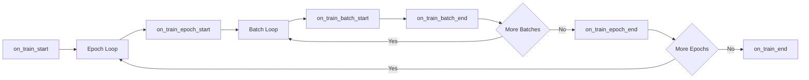

# 自訂 Callbacks (Custom Callbacks)

Callbacks（回調）是在訓練過程中的特定時刻執行自訂邏輯的鉤子 (hooks)。它們是在不修改核心訓練程式碼的情況下，擴展 Lightning 行為的標準方式。

## Callback 概覽

Callbacks 監聽訓練事件並可以對這些事件做出回應：



## 可用的 Hooks

### 訓練生命週期

| Hook | 呼叫時機 |
| :--- | :--- |
| `on_fit_start` | 在任何訓練開始之前 |
| `on_train_start` | 在訓練開始時 |
| `on_train_epoch_start` | 在每個 epoch 開始時 |
| `on_train_batch_start` | 在處理每個 batch 之前 |
| `on_train_batch_end` | 在處理每個 batch 之後 |
| `on_train_epoch_end` | 在每個 epoch 結束時 |
| `on_train_end` | 在訓練結束時 |

### 驗證生命週期

| Hook | 呼叫時機 |
| :--- | :--- |
| `on_validation_start` | 在驗證開始之前 |
| `on_validation_epoch_start` | 在驗證 epoch 開始時 |
| `on_validation_batch_start` | 在每個驗證 batch 之前 |
| `on_validation_batch_end` | 在每個驗證 batch 之後 |
| `on_validation_epoch_end` | 在驗證結束時 |
| `on_validation_end` | 在驗證之後 |

### 測試和預測

| Hook | 呼叫時機 |
| :--- | :--- |
| `on_test_start` | 在測試開始之前 |
| `on_test_epoch_start` | 在測試 epoch 開始時 |
| `on_test_batch_start` | 在每個測試 batch 之前 |
| `on_test_batch_end` | 在每個測試 batch 之後 |
| `on_test_epoch_end` | 在測試結束時 |
| `on_test_end` | 在測試之後 |

### 異常處理

| Hook | 呼叫時機 |
| :--- | :--- |
| `on_exception` | 當發生異常時 |
| `on_save_checkpoint` | 當儲存 checkpoint 時 |
| `on_load_checkpoint` | 當載入 checkpoint 時 |

## 完整 Callback 模板

```python
import lightning as L
from lightning import Callback


class MyCallback(Callback):
    """用於訓練的自訂 callback。
    
    Args:
        save_dir: 儲存製品的目錄。
        upload_freq: 上傳製品的頻率（以 epoch 為單位）。
    """
    
    def __init__(self, save_dir: str = "./logs", upload_freq: int = 1):
        self.save_dir = save_dir
        self.upload_freq = upload_freq
    
    def on_fit_start(self, trainer: L.Trainer, pl_module: L.LightningModule):
        """在訓練開始前呼叫。
        
        Args:
            trainer: Trainer 實例。
            pl_module: 正在訓練的 LightningModule。
        """
        print(f"Training starting with {trainer.num_devices} devices")
    
    def on_train_epoch_start(
        self,
        trainer: L.Trainer,
        pl_module: L.LightningModule,
    ):
        """在每個訓練 epoch 開始時呼叫。
        
        Args:
            trainer: Trainer 實例。
            pl_module: 正在訓練的 LightningModule。
        """
        self.current_epoch = trainer.current_epoch
    
    def on_train_batch_end(
        self,
        trainer: L.Trainer,
        pl_module: L.LightningModule,
        outputs,
        batch,
        batch_idx,
    ):
        """在每個訓練 batch 之後呼叫。
        
        Args:
            trainer: Trainer 實例。
            pl_module: 正在訓練的 LightningModule。
            outputs: training_step 的輸出。
            batch: 被處理的 batch。
            batch_idx: batch 的索引。
        """
        pass
    
    def on_train_epoch_end(
        self,
        trainer: L.Trainer,
        pl_module: L.LightningModule,
    ):
        """在每個訓練 epoch 結束時呼叫。
        
        Args:
            trainer: Trainer 實例。
            pl_module: 正在訓練的 LightningModule。
        """
        # 從 trainer 獲取指標
        metrics = trainer.callback_metrics
        
        # 記錄到自訂 logger
        val_loss = metrics.get("val_loss")
        if val_loss is not None:
            print(f"Epoch {trainer.current_epoch}: val_loss={val_loss:.4f}")
    
    def on_exception(
        self,
        trainer: L.Trainer,
        pl_module: L.LightningModule,
        exception: BaseException,
    ):
        """當發生異常時呼叫。
        
        Args:
            trainer: Trainer 實例。
            pl_module: 正在訓練的 LightningModule。
            exception: 拋出的異常。
        """
        print(f"Exception occurred: {exception}")
        
        # 儲存緊急 checkpoint
        trainer.save_checkpoint("emergency_ckpt.ckpt")
    
    def on_train_end(self, trainer: L.Trainer, pl_module: L.LightningModule):
        """在訓練結束時呼叫。
        
        Args:
            trainer: Trainer 實例。
            pl_module: 正在訓練的 LightningModule。
        """
        print("Training complete!")
```

## 存取 Trainer 狀態

Callbacks 能夠存取 trainer 和 module 的內部狀態：

### Trainer 屬性

```python
def on_train_epoch_end(self, trainer, pl_module):
    # 當前狀態
    current_epoch = trainer.current_epoch
    global_step = trainer.global_step
    max_epochs = trainer.max_epochs
    
    # 指標
    callback_metrics = trainer.callback_metrics
    logged_metrics = trainer.logged_metrics
    
    # 模型
    model = pl_module
    
    # 設備
    device = pl_module.device
    
    # Checkpoints
    ckpt_path = trainer.checkpoint_callback.best_model_path
    
    # 學習率
    lr = trainer.optimizers[0].param_groups[0]["lr"]
```

### LightningModule 屬性

```python
def on_train_epoch_end(self, trainer, pl_module):
    # 超參數
    lr = pl_module.hparams.lr
    
    # 狀態
    state = pl_module.state
    
    # 設備
    device = next(pl_module.parameters()).device
```

## 實際用例：上傳製品 (Upload Artifacts)

這個 callback 在每個 epoch 結束時將模型 checkpoints 上傳到雲端儲存：

```python
import os
import shutil
import lightning as L
from lightning import Callback


class UploadArtifactsCallback(Callback):
    """在 epoch 結束時上傳製品到雲端儲存。
    
    Args:
        save_dir: checkpoints 的本機目錄。
        remote_path: 遠端儲存路徑 (例如 S3 bucket)。
        upload_freq: 上傳的頻率 (以 epoch 為單位)。
    """
    
    def __init__(
        self,
        save_dir: str = "./models",
        remote_path: str = "s3://bucket/checkpoints",
        upload_freq: int = 1,
    ):
        self.save_dir = save_dir
        self.remote_path = remote_path
        self.upload_freq = upload_freq
    
    def on_train_epoch_end(
        self,
        trainer: L.Trainer,
        pl_module: L.LightningModule,
    ):
        """每個 epoch 後上傳 checkpoint。"""
        # 僅每 upload_freq 個 epoch 上傳一次
        if trainer.current_epoch % self.upload_freq != 0:
            return
        
        # 獲取最佳 checkpoint
        ckpt_path = trainer.checkpoint_callback.best_model_path
        
        if ckpt_path and os.path.exists(ckpt_path):
            self.upload_to_remote(ckpt_path)
    
    def upload_to_remote(self, local_path: str):
        """上傳檔案到遠端儲存。
        
        Args:
            local_path: 本機檔案路徑。
        """
        filename = os.path.basename(local_path)
        remote_url = f"{self.remote_path}/{filename}"
        
        print(f"Uploading {filename} to {self.remote_path}...")
        
        # 範例: 上傳到 S3 (根據你的上傳邏輯進行替換)
        # import boto3
        # s3 = boto3.client("s3")
        # s3.upload_file(local_path, "bucket", filename)
        
        print(f"Uploaded: {remote_url}")
```

## 實際用例：學習率自動調節器 (Learning Rate Tuner)

一個可以動態調整學習率的 callback：

```python
import lightning as L
from lightning import Callback


class LearningRateFinderCallback(Callback):
    """透過運行學習率範圍測試來微調學習率。
    
    在訓練開始時運行此程式以找到最佳的 lr。
    """
    
    def __init__(self, min_lr: float = 1e-6, max_lr: float = 1.0, num_steps: int = 100):
        self.min_lr = min_lr
        self.max_lr = max_lr
        self.num_steps = num_steps
        self.found_lr = None
    
    def on_fit_start(self, trainer: L.Trainer, pl_module: L.LightningModule):
        """運行學習率範圍測試。"""
        # 使用 Lightning 內建的學習率查找器
        tuner = trainer.tuner.lr_find(
            pl_module,
            min_lr=self.min_lr,
            max_lr=self.max_lr,
            num_training=self.num_steps,
        )
        
        # 獲取建議的學習率
        self.found_lr = tuner.suggested_lr
        
        print(f"Suggested learning rate: {self.found_lr}")
        
        # 更新優化器
        for optimizer in trainer.optimizers:
            for param_group in optimizer.param_groups:
                param_group["lr"] = self.found_lr
```

## 實際用例：梯度裁剪器 (Gradient Clipper)

一個手動進行梯度裁剪的 callback：

```python
import torch
import lightning as L
from lightning import Callback


class GradientClipperCallback(Callback):
    """在每個 batch 結束時裁剪梯度。
    
    Args:
        max_norm: 梯度的最大範數。
    """
    
    def __init__(self, max_norm: float = 1.0):
        self.max_norm = max_norm
    
    def on_train_batch_end(
        self,
        trainer: L.Trainer,
        pl_module: L.LightningModule,
        outputs,
        batch,
        batch_idx,
    ):
        """在每個 batch 後裁剪梯度。"""
        torch.nn.utils.clip_grad_norm_(
            pl_module.parameters(),
            max_norm=self.max_norm,
        )
```

## 實際用例：指標追蹤器 (Metric Tracker)

在訓練過程中追蹤各項指標：

```python
import json
import os
import lightning as L
from lightning import Callback


class MetricsTrackerCallback(Callback):
    """追蹤並將指標儲存到檔案。
    
    Args:
        save_path: 儲存指標 JSON 的路徑。
    """
    
    def __init__(self, save_path: str = "./logs/metrics.json"):
        self.save_path = save_path
        self.history = {
            "train_loss": [],
            "val_loss": [],
            "val_acc": [],
        }
    
    def on_train_epoch_end(
        self,
        trainer: L.Trainer,
        pl_module: L.LightningModule,
    ):
        """記錄指標。"""
        metrics = trainer.callback_metrics
        
        for key in self.history.keys():
            if key in metrics:
                value = metrics[key]
                if hasattr(value, "item"):
                    value = value.item()
                self.history[key].append(value)
        
        # 儲存到檔案
        os.makedirs(os.path.dirname(self.save_path), exist_ok=True)
        
        with open(self.save_path, "w") as f:
            json.dump(self.history, f, indent=2)
```

## 配合 Hydra 使用

### 配置定義

```yaml
# configs/callbacks/model_checkpoint.yaml
_target_: lightning.pytorch.callbacks.ModelCheckpoint
save_top_k: 1
monitor: val_loss
mode: min
dirpath: ./models
filename: best
save_last: true

# configs/callbacks/early_stopping.yaml
_target_: lightning.pytorch.callbacks.EarlyStopping
monitor: val_loss
patience: 5
mode: min
```

### 自訂 Callback 配置

```yaml
# configs/callbacks/upload_artifacts.yaml
_target_: src.callbacks.UploadArtifactsCallback
save_dir: ./models
remote_path: s3://bucket/checkpoints
upload_freq: 1
```

### 實例化

```python
def instantiate_callbacks(cfg):
    callbacks = []
    
    for name, conf in cfg.items():
        if isinstance(conf, dict) and "_target_" in conf:
            callbacks.append(instantiate(conf))
    
    return callbacks
```

## 最佳實踐

### 在 `__init__` 中初始化

```python
def __init__(self, param: str = "default"):
    # 在 __init__ 中初始化 - 只呼叫一次
    self.param = param
    super().__init__()
```

### 在 Hooks 中存取狀態

```python
def on_train_epoch_start(self, trainer, pl_module):
    # 在此處存取 trainer 的狀態 - 每個 epoch 呼叫一次
    self.current_epoch = trainer.current_epoch
```

### 處理異常

```python
def on_exception(self, trainer, pl_module, exception):
    # 發生異常時總是儲存狀態
    trainer.save_checkpoint("emergency.ckpt")
```

:::caution[避免昂貴操作]
避免在頻繁運行的 callback (例如 `on_train_batch_end`) 中執行開銷昂貴的操作。如果需要，可以透過 `batch_idx % N == 0` 來使其每 N 個 batch 僅運行一次。
:::

## 建立複合 Callback (Multi-Callback)

```python
class CompositeCallback(Callback):
    """組合多個 callbacks。"""
    
    def __init__(self, callbacks: list):
        self.callbacks = callbacks
    
    def on_train_start(self, trainer, pl_module):
        for cb in self.callbacks:
            cb.on_train_start(trainer, pl_module)
```

## 下一步

- [Optimizer & Scheduler](./optimizer-scheduler): 配置優化器和排程器
- [Logging Metrics](../core-components/logging-metrics): 日誌和指標記錄
- [Project Structure](../hydra-integration/project-structure): 整體專案組織結構