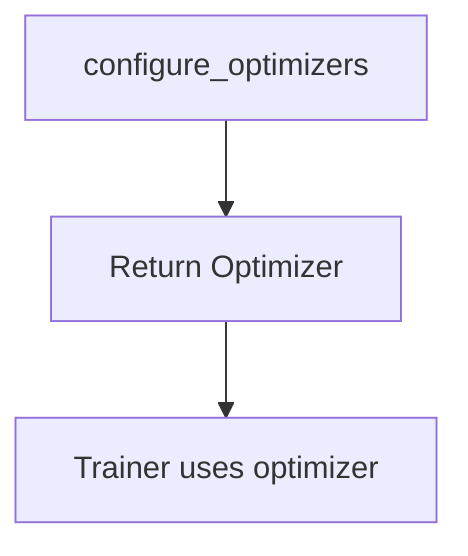
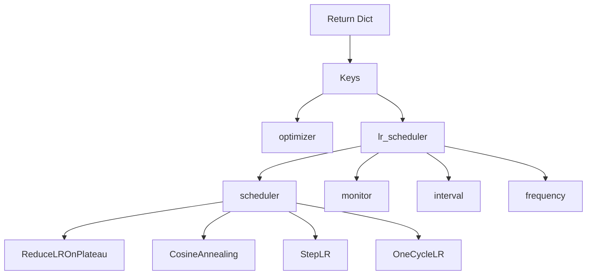

# 優化器與排程器 (Optimizer & Scheduler)

配置優化器 (optimizers) 和學習率排程器 (learning rate schedulers) 是 Lightning 訓練的核心部分。本文檔介紹了 `configure_optimizers` 模式、排程器配置，以及進階用例中的手動優化 (manual optimization)。

## configure_optimizers 模式

`configure_optimizers` 方法負責返回優化器和排程器的配置：

```python
import lightning as L
import torch


class MyModule(L.LightningModule):
    def __init__(self, lr: float = 1e-3):
        super().__init__()
        self.save_hyperparameters()
        # ...
    
    def configure_optimizers(self):
        # 配置並返回優化器/排程器
        ...
```

## 單個優化器

最簡單的情況 —— 返回單個優化器：

```python
def configure_optimizers(self):
    optimizer = torch.optim.Adam(self.parameters(), lr=self.hparams.lr)
    return optimizer
```



### 帶有權重衰減 (Weight Decay)

```python
def configure_optimizers(self):
    optimizer = torch.optim.AdamW(
        self.parameters(),
        lr=self.hparams.lr,
        weight_decay=1e-4,
    )
    return optimizer
```

## 帶有排程器的優化器

返回一個包含優化器和排程器的字典：

```python
def configure_optimizers(self):
    optimizer = torch.optim.Adam(self.parameters(), lr=self.hparams.lr)
    
    scheduler = torch.optim.lr_scheduler.CosineAnnealingLR(
        optimizer,
        T_max=10,
        eta_min=1e-6,
    )
    
    return {
        "optimizer": optimizer,
        "lr_scheduler": {
            "scheduler": scheduler,
            "monitor": "val_loss",
            "interval": "epoch",
            "frequency": 1,
        },
    }
```

### 排程器字典鍵說明

| 鍵名 | 描述 |
| :--- | :--- |
| `scheduler` | 排程器實例 |
| `monitor` | 要監控的指標（用於 ReduceLROnPlateau） |
| `interval` | `"epoch"` 或 `"step"` |
| `frequency` | 每 N 個 epoch 或 step 運行一次 |

```python
def configure_optimizers(self):
    optimizer = torch.optim.Adam(self.parameters(), lr=self.hparams.lr)
    
    # ReduceLROnPlateau 監控一個指標
    scheduler = torch.optim.lr_scheduler.ReduceLROnPlateau(
        optimizer,
        mode="min",
        factor=0.5,
        patience=3,
    )
    
    return {
        "optimizer": optimizer,
        "lr_scheduler": {
            "scheduler": scheduler,
            "monitor": "val_loss",  # 監控的指標
            "interval": "epoch",
            "frequency": 1,
        },
    }
```

### 間隔與頻率 (Interval and Frequency)

```python
# 基於 step 的排程 (每 100 步更新)
return {
    "optimizer": optimizer,
    "lr_scheduler": {
        "scheduler": scheduler,
        "interval": "step",  # "step" 或 "epoch"
        "frequency": 100,    # 每 N 步
    },
}
```

## 多個優化器

對於多個優化器（例如 GANs），返回一個列表：

```python
def configure_optimizers(self):
    # 生成器優化器
    opt_G = torch.optim.Adam(
        self.generator.parameters(),
        lr=1e-3,
    )
    
    # 判別器優化器
    opt_D = torch.optim.Adam(
        self.discriminator.parameters(),
        lr=1e-4,
    )
    
    return [opt_G, opt_D]
```

### 帶有獨立排程器

為每個優化器返回一個字典列表：

```python
def configure_optimizers(self):
    opt_G = torch.optim.Adam(self.generator.parameters(), lr=1e-3)
    opt_D = torch.optim.Adam(self.discriminator.parameters(), lr=1e-4)
    
    scheduler_G = torch.optim.lr_scheduler.CosineAnnealingLR(opt_G, T_max=10)
    scheduler_D = torch.optim.lr_scheduler.CosineAnnealingLR(opt_D, T_max=10)
    
    return [
        {
            "optimizer": opt_G,
            "lr_scheduler": {
                "scheduler": scheduler_G,
                "interval": "epoch",
                "frequency": 1,
            },
        },
        {
            "optimizer": opt_D,
            "lr_scheduler": {
                "scheduler": scheduler_D,
                "interval": "epoch",
                "frequency": 1,
            },
        },
    ]
```

## 替代方案：在 `__init__` 中配置並保存

對於簡單情況，可以在 `__init__` 中配置：

```python
def __init__(self, lr: float = 1e-3):
    super().__init__()
    self.save_hyperparameters()
    self.lr = lr
    # ...

def configure_optimizers(self):
    return torch.optim.Adam(self.parameters(), lr=self.lr)
```

或使用工廠模式 (factory pattern)：

```python
def configure_optimizers(self):
    from hydra.utils import instantiate
    
    optimizer_conf = self.hparams.get("optimizer", {})
    optimizer = instantiate(optimizer_conf, self.parameters())
    
    scheduler_conf = self.hparams.get("scheduler", {})
    if scheduler_conf:
        scheduler = instantiate(scheduler_conf, optimizer)
        return {"optimizer": optimizer, "lr_scheduler": scheduler}
    
    return optimizer
```

## 透過 Hydra 配置進行實例化

### 優化器配置

```yaml
# configs/optimizer/adam.yaml
_target_: torch.optim.Adam
lr: 1e-3
betas: [0.9, 0.999]
eps: 1e-8
weight_decay: 0.0
```

### 排程器配置

```yaml
# configs/scheduler/cosine.yaml
_target_: torch.optim.lr_scheduler.CosineAnnealingLR
T_max: 100
eta_min: 1e-6
```

### 使用配置的 Module

```python
def configure_optimizers(self):
    # 實例化優化器
    optimizer = instantiate(
        self.cfg.optimizer,
        self.parameters(),
    )
    
    # 實例化排程器
    scheduler = instantiate(
        self.cfg.scheduler,
        optimizer,
        T_max=self.cfg.trainer.max_epochs,
    )
    
    return {
        "optimizer": optimizer,
        "lr_scheduler": {
            "scheduler": scheduler,
            "monitor": "val_loss",
            "interval": "epoch",
            "frequency": 1,
        },
    }
```

### 完整配置範例

```yaml
# configs/optimizer.yaml
optimizer:
  _target_: torch.optim.Adam
  lr: 1e-3
  betas: [0.9, 0.999]
  weight_decay: 0.0

scheduler:
  _target_: torch.optim.lr_scheduler.CosineAnnealingLR
  T_max: 100
  eta_min: 1e-6
```

## 常見排程器模式

### ReduceLROnPlateau

```python
def configure_optimizers(self):
    optimizer = torch.optim.Adam(self.parameters(), lr=self.hparams.lr)
    
    scheduler = torch.optim.lr_scheduler.ReduceLROnPlateau(
        optimizer,
        mode="min",
        factor=0.5,
        patience=3,
        verbose=True,
    )
    
    return {
        "optimizer": optimizer,
        "lr_scheduler": {
            "scheduler": scheduler,
            "monitor": "val_loss",
            "interval": "epoch",
            "frequency": 1,
        },
    }
```

### Cosine Annealing

```python
def configure_optimizers(self):
    optimizer = torch.optim.Adam(self.parameters(), lr=self.hparams.lr)
    
    scheduler = torch.optim.lr_scheduler.CosineAnnealingLR(
        optimizer,
        T_max=10,
        eta_min=1e-6,
    )
    
    return {
        "optimizer": optimizer,
        "lr_scheduler": {
            "scheduler": scheduler,
            "interval": "epoch",
            "frequency": 1,
        },
    }
```

### OneCycleLR

```python
def configure_optimizers(self):
    optimizer = torch.optim.Adam(self.parameters(), lr=self.hparams.lr)
    
    # OneCycleLR 在內部使用排程器步進
    scheduler = torch.optim.lr_scheduler.OneCycleLR(
        optimizer,
        max_lr=self.hparams.lr,
        epochs=10,
        steps_per_epoch=100,
    )
    
    return {
        "optimizer": optimizer,
        "lr_scheduler": {
            "scheduler": scheduler,
            "interval": "step",
            "frequency": 1,
        },
    }
```

### StepLR

```python
def configure_optimizers(self):
    optimizer = torch.optim.Adam(self.parameters(), lr=self.hparams.lr)
    
    scheduler = torch.optim.lr_scheduler.StepLR(
        optimizer,
        step_size=10,
        gamma=0.1,
    )
    
    return {
        "optimizer": optimizer,
        "lr_scheduler": {
            "scheduler": scheduler,
            "interval": "epoch",
            "frequency": 1,
        },
    }
```

### Warmup + Cosine

```python
def configure_optimizers(self):
    optimizer = torch.optim.Adam(self.parameters(), lr=self.hparams.lr)
    
    # 先預熱 (Warmup)，再做餘弦退火
    scheduler = torch.optim.lr_scheduler.SequentialLR(
        optimizer,
        schedulers=[
            torch.optim.lr_scheduler.LinearLR(
                optimizer,
                start_factor=0.1,
                end_factor=1.0,
                total_iters=5,
            ),
            torch.optim.lr_scheduler.CosineAnnealingLR(
                optimizer,
                T_max=95,
                eta_min=1e-6,
            ),
        ],
        milestones=[5],
    )
    
    return {
        "optimizer": optimizer,
        "lr_scheduler": {
            "scheduler": scheduler,
            "interval": "epoch",
            "frequency": 1,
        },
    }
```

## 手動優化 (Manual Optimization)

手動優化讓你可以完全控制訓練循環。通常用於：

- 梯度累積
- 多個優化器步驟
- 自訂梯度裁剪
- GAN 訓練

### 啟用手動優化

```python
def training_step(self, batch, batch_idx):
    # 直接返回 loss 而不自動推進優化器
    return loss

# Lightning 將不會自動呼叫 optimizer.step()
```

### 存取優化器

```python
def on_train_batch_end(self, outputs):
    optimizer = self.optimizers()
    optimizer.step()
    optimizer.zero_grad()
    return outputs
```

### 使用梯度累積

```python
def __init__(self):
    super().__init__()
    self.automatic_optimization = False

def training_step(self, batch, batch_idx):
    # 反向傳播
    loss = self.compute_loss(batch)
    self.manual_backward(loss)
    
    # 累積梯度
    if (batch_idx + 1) % self.accumulate_grad_batches == 0:
        # 梯度裁剪
        torch.nn.utils.clip_grad_norm_(self.parameters(), max_norm=1.0)
        
        # 優化器步進
        opt = self.optimizers()
        opt.step()
        opt.zero_grad()
    
    return loss
```

### 自訂排程

```python
def __init__(self):
    super().__init__()
    self.automatic_optimization = False

def training_step(self, batch, batch_idx):
    opt = self.optimizers()
    
    # 自訂優化器邏輯
    loss = self.compute_loss(batch)
    self.manual_backward(loss)
    
    # 自訂梯度裁剪
    torch.nn.utils.clip_grad_norm_(self.parameters(), max_norm=1.0)
    
    # 自訂排程：每 N 個 batch 更新學習率
    if self.global_step % 100 == 0:
        for param_group in opt.param_groups:
            param_group["lr"] *= 0.99
    
    opt.step()
    opt.zero_grad()
    
    return loss
```

### 進階範例：GAN

```python
def __init__(self, lr_g: float = 1e-3, lr_d: float = 1e-4):
    super().__init__()
    self.save_hyperparameters()
    self.automatic_optimization = False
    self.generator = Generator()
    self.discriminator = Discriminator()

def training_step(self, batch, batch_idx):
    real, _ = batch
    
    # 訓練判別器
    opt_d = self.optimizers()[0]
    opt_d.zero_grad()
    
    fake = self.generator(self.get_noise(real.size(0)))
    fake_detached = fake.detach()
    
    loss_d_real = self.adversarial_loss(self.discriminator(real), True)
    loss_d_fake = self.adversarial_loss(self.discriminator(fake_detached), False)
    loss_d = (loss_d_real + loss_d_fake) / 2
    
    self.manual_backward(loss_d)
    opt_d.step()
    
    # 訓練生成器
    opt_g = self.optimizers()[1]
    opt_g.zero_grad()
    
    fake = self.generator(self.get_noise(real.size(0)))
    loss_g = self.adversarial_loss(self.discriminator(fake), True)
    
    self.manual_backward(loss_g)
    opt_g.step()
    
    return {"loss_d": loss_d, "loss_g": loss_g}

def configure_optimizers(self):
    opt_g = torch.optim.Adam(self.generator.parameters(), lr=self.hparams.lr_g)
    opt_d = torch.optim.Adam(self.discriminator.parameters(), lr=self.hparams.lr_d)
    return [opt_g, opt_d]
```

## 排程器字典參考 (Scheduler Dict Reference)



### 必需項與可選項

| 鍵名 | 是否必需 | 描述 |
| :--- | :--- | :--- |
| `optimizer` | 是 | 優化器實例 |
| `lr_scheduler` | 否 | 排程器字典 |

### 排程器字典欄位 (如果提供)

| 鍵名 | 是否必需 | 描述 |
| :--- | :--- | :--- |
| `scheduler` | 是 | 排程器實例 |
| `monitor` | 用於 ReduceLROnPlateau 時 | 要監控的指標 |
| `interval` | 否 | `"epoch"` 或 `"step"` |
| `frequency` | 否 | 運行頻率 |

## 完整範例

```python
import lightning as L
import torch
import torch.nn as nn
import torch.nn.functional as F


class ClassificationModule(L.LightningModule):
    def __init__(self, lr: float = 1e-3):
        super().__init__()
        self.save_hyperparameters()
        
        self.layer = nn.Linear(784, 10)
        self.lr = lr
    
    def forward(self, x):
        x = x.view(x.size(0), -1)
        return self.layer(x)
    
    def training_step(self, batch, batch_idx):
        x, y = batch
        logits = self(x)
        
        loss = F.cross_entropy(logits, y)
        self.log("train_loss", loss, on_step=True, on_epoch=True, prog_bar=True)
        
        return loss
    
    def validation_step(self, batch, batch_idx):
        x, y = batch
        logits = self(x)
        
        loss = F.cross_entropy(logits, y)
        preds = torch.argmax(logits, dim=1)
        acc = (preds == y).float().mean()
        
        self.log("val_loss", loss, on_step=False, on_epoch=True, prog_bar=True)
        self.log("val_acc", acc, on_step=False, on_epoch=True, prog_bar=True)
    
    def configure_optimizers(self):
        optimizer = torch.optim.AdamW(
            self.parameters(),
            lr=self.lr,
            weight_decay=1e-4,
        )
        
        scheduler = torch.optim.lr_scheduler.CosineAnnealingLR(
            optimizer,
            T_max=10,
            eta_min=1e-6,
        )
        
        return {
            "optimizer": optimizer,
            "lr_scheduler": {
                "scheduler": scheduler,
                "monitor": "val_loss",
                "interval": "epoch",
                "frequency": 1,
            },
        }
```

## 最佳實踐

### 從簡單開始

```python
# 預設情況：單個優化器
def configure_optimizers(self):
    return torch.optim.Adam(self.parameters(), lr=1e-3)
```

### 在需要時添加排程器

```python
# 在驗證基礎訓練可以工作後再添加排程器
def configure_optimizers(self):
    optimizer = torch.optim.Adam(self.parameters(), lr=1e-3)
    
    scheduler = torch.optim.lr_scheduler.CosineAnnealingLR(
        optimizer,
        T_max=10,
    )
    
    return {
        "optimizer": optimizer,
        "lr_scheduler": {
            "scheduler": scheduler,
            "interval": "epoch",
        },
    }
```

### 謹慎使用手動優化

:::caution[手動優化]
僅在絕對必要時 (如 GANs，複雜的梯度操作) 使用手動優化。它繞過了 Lightning 的自動化處理機制，並可能導致在分散式訓練中出現問題。
:::

## 下一步

- [Logging Metrics](../core-components/logging-metrics): 日誌和指標記錄
- [Custom Callbacks](./custom-callbacks): 撰寫自訂回調
- [Instantiation](../hydra-integration/instantiation): 從配置實例化組件