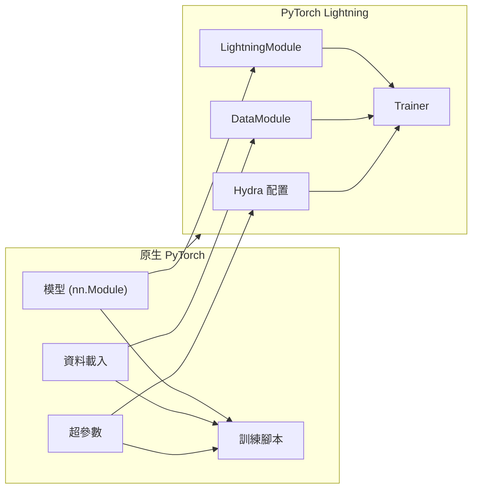

# 從原生 PyTorch 遷移到 Lightning

本指南將帶您了解將原生 PyTorch 程式碼遷移到 PyTorch Lightning 的系統化過程。遷移遵循一個清晰的模式：將模型邏輯提取到 `LightningModule`，將資料處理提取到 `DataModule`，將訓練迴圈提取到 Trainer 鉤子（Hooks）中，以及將配置項提取到 Hydra。

:::info[前置知識]
本指南假定您熟悉原生 PyTorch：`nn.Module`、`DataLoader`、`optimizer.step()` 以及 `loss.backward()`。若要複習原生 PyTorch 的基礎知識，請參閱 [PyTorch 基礎](/docs/deep-learning/pytorch-tutorial/fundamentals/tensor-operations) 章節。
:::

## 為什麼要遷移到 Lightning？

使用原生 PyTorch 要求在每個專案中編寫重複的訓練樣板程式碼：

```python
# 原生 PyTorch：每個腳本中重複相同的樣板程式碼
for epoch in range(num_epochs):
    model.train()
    for batch in dataloader:
        optimizer.zero_grad()
        outputs = model(batch)
        loss = criterion(outputs, targets)
        loss.backward()
        optimizer.step()
    # 驗證、檢查點、日誌記錄... 更多的樣板程式碼
```

Lightning 會自動處理這些樣板程式碼，讓您可以將精力集中在模型架構和研究邏輯上。

## 貫穿範例：MNIST 分類器

本指南使用一個簡單的 MNIST 分類器作為貫穿全文的範例。遷移過程分為四個步驟：

1. 提取模型邏輯 → `LightningModule`
2. 提取資料處理 → `DataModule`
3. 移動迴圈邏輯 → hooks
4. 移動配置項 → Hydra

---

## 步驟 1：將模型提取到 LightningModule

### 原生 PyTorch 程式碼

```python
import torch.nn as nn
import torch.optim as optim

class MNISTClassifier(nn.Module):
    def __init__(self):
        super().__init__()
        self.conv1 = nn.Conv2d(1, 32, kernel_size=3)
        self.conv2 = nn.Conv2d(32, 64, kernel_size=3)
        self.pool = nn.MaxPool2d(2)
        self.fc1 = nn.Linear(64 * 12 * 12, 128)
        self.fc2 = nn.Linear(128, 10)
        self.relu = nn.ReLU()

    def forward(self, x):
        x = self.relu(self.conv1(x))
        x = self.relu(self.conv2(x))
        x = self.pool(x)
        x = x.view(x.size(0), -1)
        x = self.relu(self.fc1(x))
        x = self.fc2(x)
        return x
```

### 遷移後的 Lightning 程式碼

```python
import lightning as L
import torch
import torch.nn as nn


class MNISTClassifier(L.LightningModule):
    def __init__(self, learning_rate: float = 1e-3):
        super().__init__()
        self.save_hyperparameters()
        self.model = nn.Sequential(
            nn.Conv2d(1, 32, kernel_size=3),
            nn.ReLU(),
            nn.Conv2d(32, 64, kernel_size=3),
            nn.ReLU(),
            nn.MaxPool2d(2),
            nn.Flatten(),
            nn.Linear(64 * 12 * 12, 128),
            nn.ReLU(),
            nn.Linear(128, 10),
        )

    def forward(self, x):
        return self.model(x)

    def configure_optimizers(self):
        return torch.optim.Adam(self.parameters(), lr=self.hparams.learning_rate)
```

:::tip[關鍵變化]
- 繼承 `L.LightningModule` 而不是 `nn.Module`
- 呼叫 `self.save_hyperparameters()` 自動記錄超參數
- 定義 `configure_optimizers()`，而不是在訓練腳本中建立優化器
- 使用 `nn.Sequential` 更加整潔地定義架構
:::

---

## 步驟 2：將資料提取到 DataModule

### 原生 PyTorch 程式碼

```python
from torch.utils.data import DataLoader, random_split
from torchvision.datasets import MNIST
from torchvision.transforms import ToTensor

# 訓練資料
train_dataset = MNIST(root="./data", train=True, transform=ToTensor())
train_size = int(0.8 * len(train_dataset))
val_size = len(train_dataset) - train_size
train_subset, val_subset = random_split(train_dataset, [train_size, val_size])

train_loader = DataLoader(train_subset, batch_size=32, shuffle=True)
val_loader = DataLoader(val_subset, batch_size=32)

# 測試資料
test_dataset = MNIST(root="./data", train=False, transform=ToTensor())
test_loader = DataLoader(test_dataset, batch_size=32)
```

### 遷移後的 Lightning 程式碼

```python
import lightning as L
from torch.utils.data import DataLoader, random_split
from torchvision.datasets import MNIST
from torchvision.transforms import ToTensor


class MNISTDataModule(L.LightningDataModule):
    def __init__(self, data_dir: str = "./data", batch_size: int = 32):
        super().__init__()
        self.save_hyperparameters()

    def setup(self, stage: str):
        full_dataset = MNIST(
            root=self.hparams.data_dir,
            train=True,
            transform=ToTensor(),
            download=True,
        )
        train_size = int(0.8 * len(full_dataset))
        val_size = len(full_dataset) - train_size
        self.train_subset, self.val_subset = random_split(
            full_dataset, [train_size, val_size]
        )

    def train_dataloader(self):
        return DataLoader(self.train_subset, batch_size=self.hparams.batch_size, shuffle=True)

    def val_dataloader(self):
        return DataLoader(self.val_subset, batch_size=self.hparams.batch_size)

    def test_dataloader(self):
        return DataLoader(
            MNIST(root=self.hparams.data_dir, train=False, transform=ToTensor()),
            batch_size=self.hparams.batch_size,
        )
```

:::tip[關鍵變化]
- 繼承 `L.LightningDataModule` 以實現可重用的資料處理
- 實作 `setup(stage)` 以進行資料集初始化
- 實作 `train_dataloader()`、`val_dataloader()`、`test_dataloader()`
- DataModule 可以在不同的模型之間重用
:::

---

## 步驟 3：將迴圈邏輯移動到 Hooks 中

### 原生 PyTorch 完整訓練腳本

```python
import torch
import torch.nn as nn
import torch.optim as optim
from torch.utils.data import DataLoader, random_split
from torchvision.datasets import MNIST
from torchvision.transforms import ToTensor


def train_mnist():
    # 模型
    model = MNISTClassifier()
    criterion = nn.CrossEntropyLoss()
    optimizer = optim.Adam(model.parameters(), lr=1e-3)

    # 資料
    train_dataset = MNIST(root="./data", train=True, transform=ToTensor())
    train_size = int(0.8 * len(train_dataset))
    val_size = len(train_dataset) - train_size
    train_subset, val_subset = random_split(train_dataset, [train_size, val_size])
    train_loader = DataLoader(train_subset, batch_size=32, shuffle=True)
    val_loader = DataLoader(val_subset, batch_size=32)

    # 訓練迴圈
    for epoch in range(10):
        model.train()
        train_loss = 0
        for batch_idx, (images, labels) in enumerate(train_loader):
            optimizer.zero_grad()
            outputs = model(images)
            loss = criterion(outputs, labels)
            loss.backward()
            optimizer.step()
            train_loss += loss.item()

        # 驗證
        model.eval()
        val_loss = 0
        correct = 0
        total = 0
        with torch.no_grad():
            for images, labels in val_loader:
                outputs = model(images)
                loss = criterion(outputs, labels)
                val_loss += loss.item()
                _, predicted = torch.max(outputs.data, 1)
                total += labels.size(0)
                correct += (predicted == labels).sum()

        print(f"Epoch {epoch+1}: Train Loss={train_loss/len(train_loader):.4f}, "
              f"Val Loss={val_loss/len(val_loader):.4f}, "
              f"Accuracy={100*correct/total:.2f}%")

if __name__ == "__main__":
    train_mnist()
```

### 遷移後的 Lightning 完整實作

```python
import lightning as L
import torch
import torch.nn as nn
import torchmetrics


class MNISTClassifier(L.LightningModule):
    def __init__(self, learning_rate: float = 1e-3):
        super().__init__()
        self.save_hyperparameters()
        self.model = nn.Sequential(
            nn.Conv2d(1, 32, kernel_size=3),
            nn.ReLU(),
            nn.Conv2d(32, 64, kernel_size=3),
            nn.ReLU(),
            nn.MaxPool2d(2),
            nn.Flatten(),
            nn.Linear(64 * 12 * 12, 128),
            nn.ReLU(),
            nn.Linear(128, 10),
        )
        self.criterion = nn.CrossEntropyLoss()
        self.accuracy = torchmetrics.Accuracy(task="multiclass", num_classes=10)

    def forward(self, x):
        return self.model(x)

    def training_step(self, batch, batch_idx):
        images, labels = batch
        outputs = self(images)
        loss = self.criterion(outputs, labels)
        self.log("train_loss", loss, prog_bar=True)
        return loss

    def validation_step(self, batch, batch_idx):
        images, labels = batch
        outputs = self(images)
        loss = self.criterion(outputs, labels)
        self.log("val_loss", loss, prog_bar=True, on_epoch=True)
        acc = self.accuracy(torch.argmax(outputs, dim=1), labels)
        self.log("val_acc", acc, prog_bar=True, on_epoch=True)

    def configure_optimizers(self):
        return torch.optim.Adam(self.parameters(), lr=self.hparams.learning_rate)
```

```python
# trainer.py
import lightning as L
from mnist_module import MNISTClassifier
from mnist_data import MNISTDataModule

dm = MNISTDataModule()
model = MNISTClassifier()

trainer = L.Trainer(max_epochs=10)
trainer.fit(model, dm)
```

:::tip[關鍵變化]
- 定義 `training_step()` 來編寫核心訓練邏輯
- 定義 `validation_step()` 用於驗證迴圈
- 使用 `self.log()` 來自動記錄指標
- 移除了明確的資料載入、優化器管理和迴圈結構 —— Trainer 處理了它們
:::

---

## 步驟 4：將配置移動到 Hydra

### 使用硬編碼配置的原生 PyTorch

```python
# native_train.py
import torch
# ... 各種導入

# 硬編碼配置
LEARNING_RATE = 1e-3
BATCH_SIZE = 32
EPOCHS = 10
DATA_DIR = "./data"

def main():
    model = MNISTClassifier(lr=LEARNING_RATE)
    # ... 其餘的訓練程式碼
```

### Hydra 配置結構

```yaml
# config/train.yaml
defaults:
  - _self_
  - model: simple_cnn

model:
  learning_rate: 1e-3

data:
  data_dir: ./data
  batch_size: 32

trainer:
  max_epochs: 10
  accelerator: auto

# config/model/simple_cnn.yaml
learning_rate: 1e-3
```

### 結合 Hydra 後的訓練腳本

```python
# train.py
import lightning as L
import hydra
from omegaconf import DictConfig
import torch


@hydra.main(version_base=None, config_path="config", config_name="train")
def main(cfg: DictConfig):
    dm = L.LightningDataModule(**cfg.data)
    model = MNISTClassifier(**cfg.model)

    trainer = L.Trainer(**cfg.trainer)
    trainer.fit(model, dm)


if __name__ == "__main__":
    main()
```

### 結合 Hydra 後的 DataModule

```python
# mnist_data.py
import hydra
import lightning as L
from torch.utils.data import DataLoader, random_split
from torchvision.datasets import MNIST
from torchvision.transforms import ToTensor


@hydra.main(version_base=None, config_path="../config", config_name="data")
class MNISTDataModule(L.LightningDataModule):
    def __init__(self, data_dir: str = "./data", batch_size: int = 32):
        super().__init__()
        self.save_hyperparameters()

    def setup(self, stage: str):
        # 之前的實作邏輯
        pass
```

:::info[Hydra 的優勢]
- 無需在程式碼中搜尋硬編碼的超參數
- 所有配置都在一處，且受版本控制
- 命令列覆蓋功能：`train.py model.learning_rate=3e-4`
- 透過配置版本化進行可重複的實驗
:::

---

## 視覺化遷移概覽



---

## 常見遷移錯誤陷阱

### 忘記呼叫 `super().__init__()`

```python
# ❌ 錯誤：缺少 super().__init__()
class MyModel(L.LightningModule):
    def __init__(self):
        self.layer = nn.Linear(10, 10)

# ✅ 正確：呼叫 super().__init__()
class MyModel(L.LightningModule):
    def __init__(self):
        super().__init__()
        self.layer = nn.Linear(10, 10)
```

### 未定義 `configure_optimizers()`

```python
# ❌ 錯誤：沒有優化器配置
class MyModel(L.LightningModule):
    def forward(self, x):
        return self.layer(x)

# ✅ 正確：定義優化器
class MyModel(L.LightningModule):
    def forward(self, x):
        return self.layer(x)

    def configure_optimizers(self):
        return torch.optim.Adam(self.parameters(), lr=1e-3)
```

### 在 DataModule 中錯誤回傳 DataLoader

```python
# ❌ 錯誤：在 __init__ 中回傳 DataLoader
class MyDataModule(L.LightningDataModule):
    def __init__(self):
        self.train_loader = DataLoader(train_dataset)

# ✅ 正確：實作 dataloader 方法
class MyDataModule(L.LightningDataModule):
    def train_dataloader(self):
        return DataLoader(train_dataset)
```

### 在指標中混合使用 Tensors 和 NumPy

```python
# ❌ 錯誤：在比較前轉換為 numpy
class MyModel(L.LightningModule):
    def validation_step(self, batch, batch_idx):
        preds = self(batch)
        # 與 NumPy 陣列比較會導致錯誤
        return {"preds": preds.numpy(), "targets": batch[1].numpy()}

# ✅ 正確：保持為 tensors
class MyModel(L.LightningModule):
    def validation_step(self, batch, batch_idx):
        preds = self(batch)
        # 直接使用 tensors 進行指標計算
        acc = (preds.argmax(dim=1) == batch[1]).float().mean()
        self.log("val_acc", acc)
```

---

## 支援但不建議的模式

### 手動優化

Lightning 支援 `manual_optimization` 以應對需要自訂梯度行為的情況：

```python
class ManualOptModel(L.LightningModule):
    def __init__(self):
        super().__init__()
        self.layer = nn.Linear(10, 10)

    def training_step(self, batch, batch_idx, optimizer_idx):
        x, y = batch
        pred = self(x)
        loss = nn.functional.cross_entropy(pred, y)
        self.manual_backward(loss)
        return loss

    def optimizer_step(self, epoch, batch_idx, optimizer, optimizer_idx):
        optimizer.step()
        optimizer.zero_grad()
```

:::caution[何時使用手動優化]
僅在以下情況使用手動優化：
- 自訂梯度操作（例如，梯度累積、每層梯度裁剪）
- 帶有複雜排程的多個優化器
- 特定於研究的梯度修改

對於標準訓練，讓 Lightning 自動處理優化即可。
:::

---

## 考慮使用 Lightning Fabric

如果你發現 `LightningModule` 和 `Trainer` 的結構對於一個極其自訂的訓練迴圈來說過於受限，請考慮使用 **Lightning Fabric**（在 v2.0 中引入）。Fabric 提供了完全相同的裝置和精度管理，但不會強迫你使用 `training_step` 等鉤子。您可以編寫自己的訓練迴圈，只需在 `fabric.setup()` 中包裝您的優化器和模型。本指南主要關注完整的 `Trainer` 體驗，但對於複雜的研究程式碼，Fabric 是一個很不錯的折衷選擇。

## 快速參考：遷移清單

| 原生 PyTorch | Lightning 等效項 |
|--------------|---------------------|
| `nn.Module` | `L.LightningModule` |
| `optimizer.step()` | `configure_optimizers()` + Trainer |
| `loss.backward()` | `training_step()` 回傳 loss |
| 腳本中的 `DataLoader` | `L.LightningDataModule` |
| 硬編碼 `lr=1e-3` | `self.save_hyperparameters()` |
| 手動的 epoch 迴圈 | `Trainer` 自動處理 |
| `print()` 記錄日誌 | 使用 `self.log()` 自動記錄日誌 |

---

## 下一步

- [推薦模式](../best-practices/recommended-patterns) — Lightning 開發的最佳實踐
- [反模式](../best-practices/anti-patterns) — 應該避免的模式
- 參考 [範本儲存庫](https://github.com/SAILTECHTEAM/pytorch-lightning-hydra-template) 以取得完整的可用範例