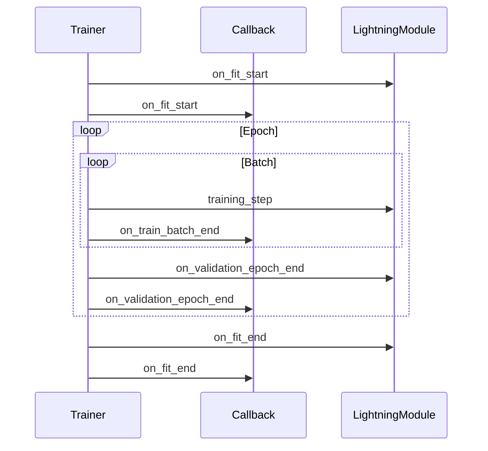

# 推薦模式 (Recommended Patterns)

本指南涵蓋了使用 PyTorch Lightning 開發時的推薦模式。遵循這些模式可確保程式碼易於維護、可重現，並能夠專注於研究本身。

## 保持 LightningModule 專注於研究

`LightningModule` 應僅包含特定於研究的邏輯。請將所有工程維度的考量委託給 Trainer、回調函數或外部工具。

### 屬於 LightningModule 的內容

```python
class MyModel(L.LightningModule):
    def __init__(self, learning_rate: float):
        super().__init__()
        self.save_hyperparameters()
        self.encoder = Encoder()
        self.decoder = Decoder()

    def forward(self, x):
        return self.encoder(x)

    def training_step(self, batch, batch_idx):
        # 特定於研究的損失計算
        x, y = batch
        pred = self(x)
        loss = self.compute_research_loss(pred, y)
        self.log("train_loss", loss)
        return loss

    def configure_optimizers(self):
        return torch.optim.Adam(self.parameters(), lr=self.hparams.learning_rate)
```

### 屬於 LightningModule 之外的內容

| 關注點 | 位置 |
|---------|----------|
| 檢查點保存 (Checkpointing) | `ModelCheckpoint` 回調函數 |
| 早停 (Early stopping) | `EarlyStopping` 回調函數 |
| 學習率排程 | `LearningRateMonitor` + Trainer |
| 梯度裁剪 | Trainer 標誌位 |
| 資料預處理 | `DataModule` |
| 實驗追蹤 | `MLflowLogger` / `TensorBoardLogger` |

:::tip[單一職責]
如果您的 LightningModule 超過 200 行程式碼，那麼它很可能包含了非研究邏輯。請將資料處理、日誌記錄或回調函數萃取出去。
:::

---

## 使用回調函數處理橫切關注點 (Cross-Cutting Concerns)

回調函數用於處理適用於多個訓練輪次的功能。永遠不要在 LightningModule 中硬編碼這類邏輯。

### 常見的內建回調函數

```python
from lightning.pytorch.callbacks import (
    ModelCheckpoint,
    EarlyStopping,
    LearningRateMonitor,
    DeviceStatsMonitor,
)

callbacks = [
    # 根據驗證損失保存最佳模型
    ModelCheckpoint(
        dirpath="./checkpoints",
        filename="best-{epoch:02d}-{val_loss:.2f}",
        monitor="val_loss",
        mode="min",
        save_top_k=3,
    ),
    # 如果驗證損失連續3個 epoch 沒有改善則停止訓練
    EarlyStopping(
        monitor="val_loss",
        patience=3,
        mode="min",
    ),
    # 記錄學習率排程情況
    LearningRateMonitor(log_interval="step"),
    # 記錄 GPU 記憶體使用情況
    DeviceStatsMonitor(),
]

trainer = L.Trainer(
    callbacks=callbacks,
    # ...
)
```

### 自訂回調函數

```python
class CustomMetricLogger(L.Callback):
    def __init__(self, log_every_n_steps: int = 100):
        self.log_every_n_steps = log_every_n_steps

    def on_train_batch_end(self, trainer, pl_module, outputs, batch, batch_idx):
        if batch_idx % self.log_every_n_steps == 0:
            # 自訂日誌記錄邏輯
            pass
```

### 回調函數執行順序



:::info[回調函數的返回值]
回調函數不能直接改變訓練行為。應使用掛鉤 (hooks) 來觸發副作用 (如日誌記錄、檢查點保存)。訓練迴圈由 `training_step` 的返回值來控制。
:::

---

## 使用 Hydra 進行實驗管理

Hydra 管理配置和實驗運行。與 Lightning 結合使用可實現可重現的研究。

### 推薦的配置結構

```text
config/
├── train.yaml              # 主設定檔
├── model/
│   ├── transformer.yaml
│   └── resnet.yaml
├── data/
│   ├── cifar10.yaml
│   └── imagenet.yaml
└── trainer/
    ├── default.yaml
    └── debug.yaml
```

### 帶有預設值的主設定檔

```yaml
# config/train.yaml
defaults:
  - _self_
  - model: transformer
  - data: cifar10
  - trainer: default

model:
  learning_rate: 1e-3
  dropout: 0.1

data:
  batch_size: 32
  num_workers: 4

trainer:
  max_epochs: 100
  accelerator: auto
```

### 訓練進入點

```python
# train.py
import hydra
from omegaconf import DictConfig
import lightning as L


@hydra.main(version_base=None, config_path="config", config_name="train")
def main(cfg: DictConfig):
    dm = create_datamodule(cfg.data)
    model = create_model(cfg.model)

    trainer = L.Trainer(**cfg.trainer)
    trainer.fit(model, dm)


if __name__ == "__main__":
    main()
```

### 命令列覆蓋配置

```bash
# 覆蓋學習率
python train.py model.learning_rate=3e-4

# 覆蓋模型架構
python train.py model=resnet data=imagenet

# 覆蓋多個參數
python train.py model.learning_rate=1e-4 trainer.max_epochs=50
```

:::tip[Hydra + Lightning]
在訓練函數上使用 `@hydra.main()` 裝飾器。透過 `**cfg.group` 將 `cfg` 參數直接傳遞給 Lightning 元件。
:::

---

## 使用 TorchMetrics

TorchMetrics 提供了標準化的指標計算方式，並在分散式訓練中保證了正確的同步。

### 推薦的指標使用方法

```python
import torchmetrics
import lightning as L


class MyModel(L.LightningModule):
    def __init__(self):
        super().__init__()
        self.accuracy = torchmetrics.Accuracy(task="multiclass", num_classes=10)
        self.f1 = torchmetrics.F1Score(task="multiclass", num_classes=10)
        self.confusion = torchmetrics.ConfusionMatrix(task="multiclass", num_classes=10) # 修正: 增加了 task="multiclass"

    def validation_step(self, batch, batch_idx):
        x, y = batch
        pred = self(x)

        # 更新指標狀態
        self.accuracy(pred, y)
        self.f1(pred, y)
        self.confusion(pred, y)

        # 記錄計算出的值
        self.log("val_acc", self.accuracy, prog_bar=True)
        self.log("val_f1", self.f1, prog_bar=True)

    def on_validation_epoch_end(self):
        # 在 epoch 結束時記錄混淆矩陣
        self.log("confusion_matrix", self.confusion.compute())
```

### 指標同步

在分散式訓練 (DDP) 中，必須同步指標：

```python
# ❌ 錯誤：未跨設備同步
def validation_step(self, batch, batch_idx):
    pred = self(batch)
    acc = (pred.argmax() == batch[1]).mean()  # 僅在單個設備上計算

# ✅ 正確：使用 sync_dist 進行分散式同步
def validation_step(self, batch, batch_idx):
    pred = self(batch)
    acc = (pred.argmax() == batch[1]).float()
    self.log("val_acc", acc, sync_dist=True)
```

### 常見指標

| 指標 | 用例 | 分散式支援 |
|--------|----------|---------------------|
| `Accuracy` | 分類準確率 | ✓ |
| `F1Score` | F1 分數 | ✓ |
| `AUROC` | ROC AUC | ✓ |
| `MeanAbsoluteError` | 迴歸 MAE | ✓ |
| `ConfusionMatrix` | 混淆矩陣 | ✓ |

:::caution[指標狀態重設]
請始終在 `on_validation_epoch_end()` 中或驗證開始時重設指標狀態：
```python
def on_validation_epoch_end(self):
    self.accuracy.reset()
```
:::

---

## 除錯策略

Lightning 提供了內建的除錯標誌位，以實現快速迭代。

### Fast Dev Run

使用單個 batch 測試整個 pipeline：

```python
trainer = L.Trainer(fast_dev_run=True)
# 執行：1個訓練步 + 1個驗證步
```

### Overfit Batches (過擬合批次)

驗證模型是否能夠在小資料集上過擬合：

```python
trainer = L.Trainer(
    overfit_batches=5,  # 使用5個 batch 進行過擬合
)
# 如果損失沒有降到接近於零，說明模型容量不足
```

### Limit Batches (限制批次)

限制批次數量以進行快速迭代：

```python
trainer = L.Trainer(
    limit_train_batches=100,  # 使用前 100 個 batch
    limit_val_batches=50,     # 使用前 50 個驗證 batch
)
```

### 異常檢測 (Detect Anomalies)

開啟梯度異常檢測：

```python
trainer = L.Trainer(
    gradient_clip_val=1.0,
    detect_anomaly=True,  # 遇到 NaN/Inf 梯度時引發 RuntimeError
)
```

### 除錯標誌位總結

| 標誌位 | 目的 | 速度 |
|------|---------|-------|
| `fast_dev_run` | 測試完整的 pipeline | 最快 |
| `overfit_batches` | 驗證模型容量 | 快 |
| `limit_train_batches` | 限制訓練迭代次數 | 快 |
| `detect_anomaly` | 尋找梯度問題 | 正常 |

:::tip[推薦工作流]
1. 首先使用 `fast_dev_run=True` 驗證無錯誤
2. 使用 `overfit_batches=5` 確認模型能夠學習
3. 移除標誌位進行全量訓練
:::

---

## 測試 DataModule

DataModule 應獨立於模型進行測試。

### 測試資料載入

```python
def test_mnist_data_module():
    dm = MNISTDataModule(data_dir="./test_data", batch_size=32)
    dm.setup("fit")

    train_loader = dm.train_dataloader()
    batch = next(iter(train_loader))

    # 驗證 batch 結構
    assert len(batch) == 2
    images, labels = batch
    assert images.shape[0] == 32  # batch size
    assert images.shape[1:] == (1, 28, 28)  # MNIST shape
    assert labels.shape[0] == 32
```

### 測試資料擴增 (Data Augmentation)

```python
def test_data_augmentation():
    import torchvision.transforms as T

    transform = T.Compose([
        T.RandomHorizontalFlip(),
        T.ToTensor(),
    ])

    dataset = MNIST(root="./test_data", transform=transform, download=True)
    sample = dataset[0]

    # 驗證是否應用了擴增
    assert isinstance(sample[0], torch.Tensor)
```

### 測試可重現性

```python
def test_deterministic_split():
    import torch

    # 設定隨機種子以保證可重現性
    torch.manual_seed(42)
    dm = MNISTDataModule()
    dm.setup("fit")

    # 保存第一個驗證樣本
    val_loader = dm.val_dataloader()
    first_sample = next(iter(val_loader))

    # 使用相同的種子重設
    torch.manual_seed(42)
    dm2 = MNISTDataModule()
    dm2.setup("fit")

    val_loader2 = dm2.val_dataloader()
    first_sample2 = next(iter(val_loader2))

    # 驗證劃分是否相同
    assert torch.equal(first_sample[1], first_sample2[1])
```

---

## 日誌記錄最佳實踐

### 一致的命名

```python
def training_step(self, batch, batch_idx):
    # ✅ 一致：所有指標均以 stage 為前綴
    self.log("train/loss", loss)
    self.log("train/accuracy", acc)

def validation_step(self, batch, batch_idx):
    # ✅ 一致：區分 train/val 命名空間
    self.log("val/loss", loss)
    self.log("val/accuracy", acc)
```

### 在適當的頻率下記錄

```python
def training_step(self, batch, batch_idx):
    loss = self.compute_loss(batch)

    # 訓練損失：每一步都記錄
    self.log("train/loss", loss, on_step=True, on_epoch=False, prog_bar=True)

    return loss


def validation_step(self, batch, batch_idx):
    # 驗證：在 epoch 結束時記錄
    self.log("val/loss", loss, on_step=False, on_epoch=True)
```

### 日誌記錄總結

| 場景 | `on_step` | `on_epoch` | `prog_bar` |
|----------|-----------|------------|------------|
| 訓練損失 | ✓ | | |
| 驗證損失 | | ✓ | ✓ |
| 學習率 | ✓ | | ✓ |
| 指標 (epoch級別) | | ✓ | ✓ |

---

## 快速參考：模式總結

| 模式 | 推薦方案 | 位置 |
|---------|--------------|----------|
| 模型邏輯 | 僅限於研究邏輯 | LightningModule |
| 檢查點保存 | 回調函數 | `ModelCheckpoint` |
| 早停機制 | 回調函數 | `EarlyStopping` |
| LR排程 | 內建 | Trainer |
| 配置管理 | Hydra | Config 檔案 |
| 指標評估 | TorchMetrics | LightningModule |
| 除錯排錯 | 標誌位 | Trainer |
| 資料處理 | DataModule | DataModule |

---

## 下一步驟

- [反模式 (Anti-Patterns)](./02-anti-patterns.mdx) — 需要避免的模式
- [模板倉庫 (Template Repository)](https://github.com/SAILTECHTEAM/pytorch-lightning-hydra-template) — 完整的可執行範例
