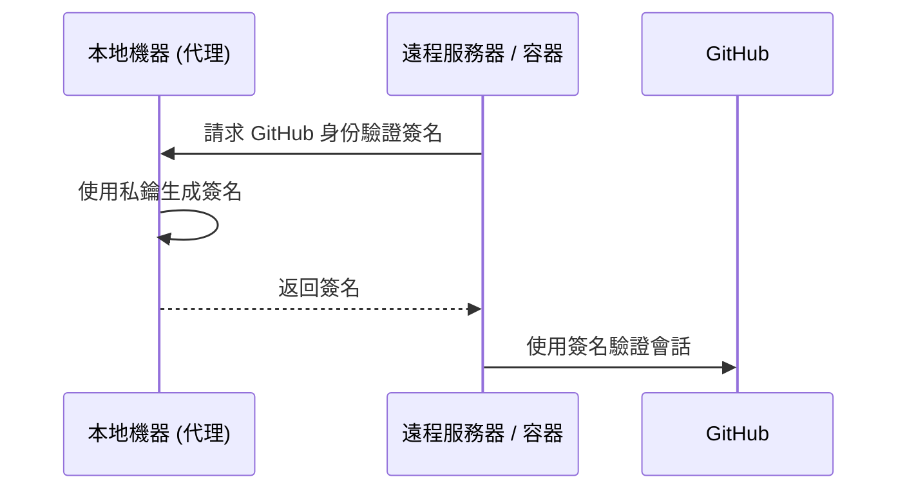

# SSH 存取安全

對遠程服務器和 Git 倉庫的安全訪問從根本上建立在 **SSH (Secure Shell)** 協議之上。我們利用非對稱加密技術，確保身份驗證憑據永遠不會在網絡上傳輸，並僅存儲在您的本地計算機上。

## SSH 加密基礎

SSH 身份驗證依賴於由兩個數學相關文件組成的 **公私鑰對**。

| 組件 | 默認路徑 | 用途 |
| :--- | :--- | :--- |
| **私鑰** | `~/.ssh/id_ed25519` | **受限訪問。** 僅存儲在您的本地計算機上。 |
| **公鑰** | `~/.ssh/id_ed25519.pub` | **公開分發。** 分發到服務器和 GitHub。 |

:::tip[算法建議]
我們為所有新密鑰對統一採用 **Ed25519** 算法。與舊的 RSA 標準相比，它具有更優越的性能和更高的安全性。
:::

---

## 基礎設施設置指南

### 生成密鑰對
執行以下命令生成新的密鑰對：
```bash
ssh-keygen -t ed25519 -C "your_email@example.com"
```
:::note[密碼處理]
接受默認存儲路徑並為本地加密提供強密碼。
:::

### 使用 SSH 代理進行管理
使用 SSH 代理在內存中管理已解密的密鑰，從而無需為每次連接重新輸入密碼。
```bash
# 初始化 SSH 代理
eval "$(ssh-agent -s)"

# 向代理註冊私鑰
ssh-add ~/.ssh/id_ed25519
```

### 與 GitHub 集成
獲取您的公鑰並將其添加到您的 **GitHub 設置 → SSH and GPG keys** 中。
```bash
# 複製到剪貼板或顯示公鑰
cat ~/.ssh/id_ed25519.pub
```

### 連通性驗證
```bash
ssh -T git@github.com
# 預期輸出: "Hi <username>! You've successfully authenticated..."
```

---

## 高級工作流：代理轉發 (Agent Forwarding)

**代理轉發** 允許在遠程會話（例如，在服務器或 Docker 容器內）中使用本地 SSH 密鑰，而無需將私鑰複製到這些環境中。

### 身份驗證工作流



### Docker 實現
掛載主機的 SSH 代理套接字以在容器內啟用轉發：
```bash
docker run -it \
  -v $SSH_AUTH_SOCK:/run/host-services/ssh-auth.sock \
  -e SSH_AUTH_SOCK=/run/host-services/ssh-auth.sock \
  my-engineering-image bash
```

:::caution[安全協議]
僅在連接到 **受信任的** 基礎設施時使用代理轉發。受損的遠程 root 用戶可能會利用您的轉發代理套接字以您的身份進行身份驗證。
:::

---

## SSH 配置策略

通過在 `~/.ssh/config` 中定義主機別名來優化連接工作流：

```text title="~/.ssh/config"
Host production-server
    HostName 10.0.0.50
    User deploy-user
    ForwardAgent yes
    IdentityFile ~/.ssh/id_ed25519
```
*工作流效率：* 執行 `ssh production-server` 即可連接，無需手動指定參數。

---

## GitHub Deploy Key

**Deploy Key** 是綁定到 GitHub **單個倉庫** 的 SSH 公鑰。每把密鑰只能存取它所綁定的倉庫，權限只能選擇 **唯讀** 或 **讀寫**。它不同於 **細粒度個人存取令牌 (Fine-grained PAT)**——後者可按 `Issues`、`Contents` 等資源逐項授權。

適用於伺服器、CI 或本機需要用一把獨立 SSH 密鑰存取**唯一指定倉庫**的場景：

- **clone / fetch / pull** —— 使用唯讀 Deploy Key。
- **推送構建產物或部署配置** —— 使用帶寫入權限的 Deploy Key。
- **不要** 將同一把 Deploy Key 複用於多個 GitHub 倉庫；GitHub 要求每個倉庫使用獨立的 Deploy Key。

以下示例假設目標倉庫是：

```text
github.com/acme/demo.git
```

並為它建立專用密鑰：

```text
~/.ssh/id_ed25519_acme_demo
```

### 建立專用 Deploy Key

在需要存取倉庫的機器、伺服器或 CI 執行機上執行：

```bash
mkdir -p ~/.ssh
chmod 700 ~/.ssh

ssh-keygen -t ed25519 \
  -C "deploy-key-acme-demo" \
  -f ~/.ssh/id_ed25519_acme_demo
```

指令會詢問是否設定 passphrase：

```text
Enter passphrase (empty for no passphrase):
```

- **個人使用的電腦** —— 建議設定一個強 passphrase。
- **無人值守的 CI / 部署機器** —— 通常留空，並把私鑰放入該平台的加密 Secret 中，務必嚴格限制 Secret 的讀取權限。

建立後會得到兩個檔案：

```text
~/.ssh/id_ed25519_acme_demo       # 私鑰：絕不可上傳或提交
~/.ssh/id_ed25519_acme_demo.pub   # 公鑰：添加到 GitHub
```

查看並複製公鑰：

```bash
cat ~/.ssh/id_ed25519_acme_demo.pub
```

私鑰權限應為僅當前使用者可讀：

```bash
chmod 600 ~/.ssh/id_ed25519_acme_demo
```

### 將 Key 限定到倉庫

在 GitHub 網頁中打開目標倉庫 **`acme/demo`**：

1. 點擊 **Settings**。
2. 在左側欄點擊 **Deploy keys**。
3. 點擊 **Add deploy key**。
4. 填寫標題，例如 `prod-server-demo-readonly`。
5. 將 `id_ed25519_acme_demo.pub` 的完整內容貼到 **Key** 欄位。
6. 按需選擇權限：
   - **不勾選 `Allow write access`** —— 唯讀，可 clone、fetch、pull。
   - **勾選 `Allow write access`** —— 可讀寫，可 push。
7. 點擊 **Add key** 儲存。

:::caution[權限範圍]
Deploy Key 是倉庫級 SSH Key：一把 Key 只授予單個倉庫存取權。開啟寫入權限後，該 Key 可向該倉庫推送代碼，因此只在確有自動化寫入需求時才開啟。
:::

:::note[找不到設定入口]
如果在倉庫中看不到 **Settings** 或 **Deploy keys**，說明你沒有足夠的倉庫管理權限，需請倉庫管理員添加公鑰。
:::

### 設定 SSH 別名

編輯 SSH 用戶端配置檔案：

```bash
nano ~/.ssh/config
```

加入以下內容：

```text title="~/.ssh/config"
Host github-acme-demo
  HostName github.com
  User git
  IdentityFile ~/.ssh/id_ed25519_acme_demo
  IdentitiesOnly yes
```

儲存後設定配置檔案權限：

```bash
chmod 600 ~/.ssh/config
```

欄位含義：

| 配置 | 用途 |
| :--- | :--- |
| `Host github-acme-demo` | 本機自訂別名，不是 GitHub 的真實域名。 |
| `HostName github.com` | GitHub 的實際 SSH 主機。 |
| `User git` | GitHub SSH 固定使用 `git` 使用者。 |
| `IdentityFile ...` | 指定該倉庫專用的私鑰。 |
| `IdentitiesOnly yes` | 強制 SSH 只使用這條配置的 key，避免回退到 agent 中的其他 key。 |

### 用專用 Key Clone

Clone URL **必須** 使用 SSH 別名 `github-acme-demo`，**不能繼續寫 `github.com`**：

```bash
git clone git@github-acme-demo:acme/demo.git
```

Clone 完成後，確認遠端地址：

```bash
cd demo
git remote -v
```

預期輸出：

```text
origin  git@github-acme-demo:acme/demo.git (fetch)
origin  git@github-acme-demo:acme/demo.git (push)
```

此後在 `demo` 目錄執行：

```bash
git pull
git fetch
git push
```

都會匹配 `Host github-acme-demo`，因此使用 `~/.ssh/id_ed25519_acme_demo`。其他仍使用 `git@github.com:OWNER/REPO.git` 的倉庫不受該別名影響。

#### 已存在的倉庫

如果倉庫已經 clone 下來，進入該倉庫並修改 `origin`：

```bash
cd /path/to/demo

git remote set-url origin git@github-acme-demo:acme/demo.git
git remote -v
```

這樣只會修改當前倉庫的 `.git/config` 中的遠端 URL，不會影響其他本地倉庫。

### 驗證連接

測試 SSH 是否確實使用該 Key：

```bash
ssh -T git@github-acme-demo
```

查看詳細調試資訊：

```bash
ssh -vT git@github-acme-demo
```

輸出中應能找到類似內容：

```text
Offering public key: /home/your-user/.ssh/id_ed25519_acme_demo
```

隨後測試 Git 讀取權限：

```bash
git ls-remote origin
```

若該 Key 是唯讀權限，則以下操作應成功：

```bash
git pull
```

而以下操作應被 GitHub 拒絕：

```bash
git push
```

若你在 GitHub 為該 Key 啟用了 **Allow write access**，則 `git push` 可以成功。

### 常見問題

#### `Permission denied (publickey)`

檢查私鑰檔案是否存在、權限是否為 `600`，以及 SSH 是否讀取到了正確配置：

```bash
ssh -vT git@github-acme-demo
```

確認調試日誌中包含專用私鑰路徑：

```text
id_ed25519_acme_demo
```

若沒有，檢查 `~/.ssh/config` 的 `Host` 名稱是否與 Git remote URL 中的主機名完全一致。

#### Clone 時仍使用預設 Key

通常是 remote URL 仍然寫成：

```text
git@github.com:acme/demo.git
```

應改為：

```bash
git remote set-url origin git@github-acme-demo:acme/demo.git
```

#### 無法 Push

先確認 GitHub 倉庫的 **Settings → Deploy keys** 中，該 Key 是否已啟用 **Allow write access**。未啟用時 Deploy Key 設計上就是唯讀。

#### 組織使用 SSO

Deploy Key 與帳號級 SSH Key 的管理方式相互獨立。若改用帳號 SSH Key 存取啟用 SSO 的組織，則需在 **GitHub → SSH and GPG keys → Configure SSO → Authorize** 中對該 Key 進行針對該組織的授權。

---

:::tip[最佳實踐]
定期審核遠程服務器上的 `~/.ssh/authorized_keys` 內容，確保只有當前授權的密鑰處於活動狀態。
:::
